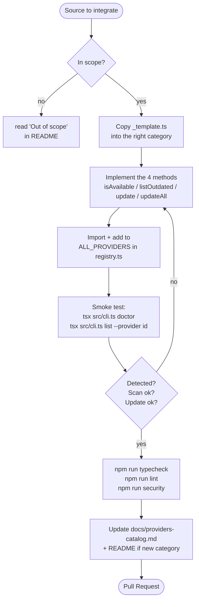
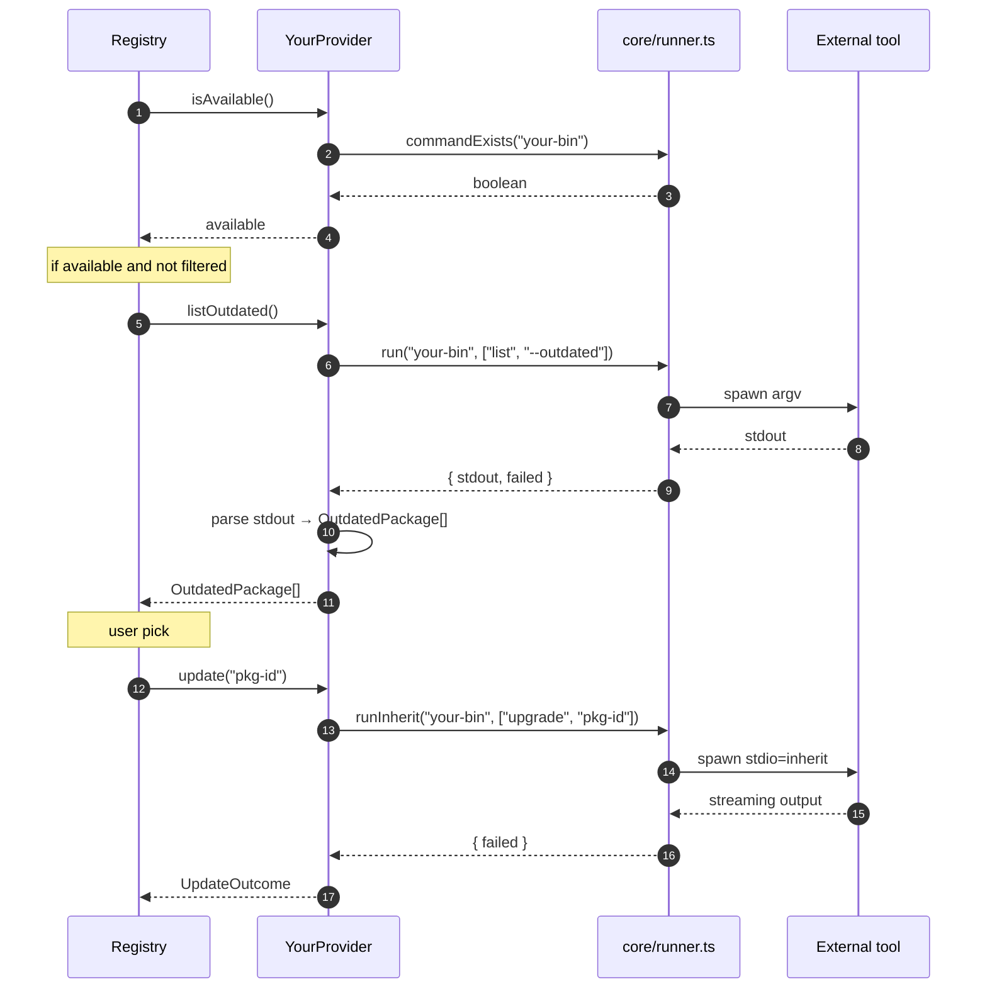
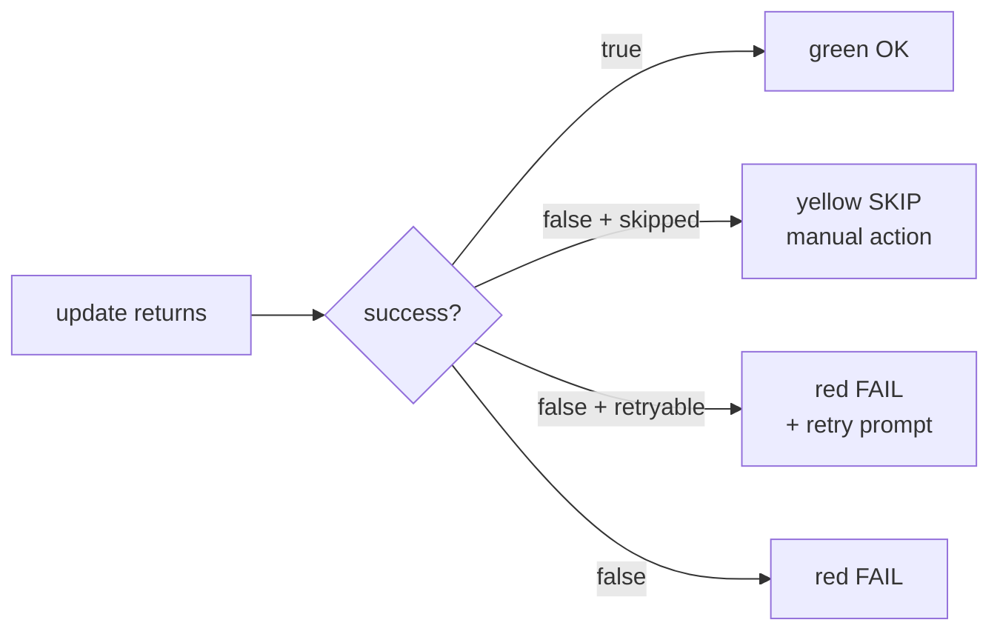

# Contributing

Thanks for contributing. The typical contribution is **adding a provider** — an isolated module that knows how to scan and update one package source.

> Before diving in: read [`docs/architecture.md`](docs/architecture.md) for context (lifecycle, runner, parallel scan, data model).

---

## Table of contents

- [1. Local setup](#1-local-setup)
- [2. Provider-addition workflow](#2-provider-addition-workflow)
- [3. Provider anatomy](#3-provider-anatomy)
- [4. Mandatory conventions](#4-mandatory-conventions)
- [5. Edge cases](#5-edge-cases)
- [6. Tests & quality before PR](#6-tests--quality-before-pr)
- [7. Code style](#7-code-style)
- [8. Reporting a provider bug](#8-reporting-a-provider-bug)

---

## 1. Local setup

```powershell
git clone https://github.com/LINDECKER-Charles/gup.git
cd gup
npm install
npm run build
npm link            # exposes gup globally (optional)
```

Requirements: **Node ≥ 22**, any shell. To iterate without rebuilding: `npm run dev -- <args>` (uses `tsx`).

### Two deliberate version pins

Both show up in `npm outdated`; neither is an oversight, so please don't "fix" them without checking these reasons still hold.

| Package | Pinned to | Why |
|---|---|---|
| `typescript` | `^6` | typescript-eslint does not support the TypeScript 7 API yet — `npm run lint` and `npm run lint:security` both fail outright on TS 7 ([typescript-eslint#10940](https://github.com/typescript-eslint/typescript-eslint/issues/10940)). `tsc --noEmit` and the build are fine on 7; the linters are the blocker. |
| `@types/node` | `^22` | Matched to the `engines.node` floor on purpose. Typing against the *minimum* supported runtime is what makes `tsc` reject an API that only exists on Node 24/26 — bumping these types to the latest silently removes that guard. Raise it only together with `engines`. |

---

## 2. Provider-addition workflow



### 2.1 Pick the category

The file goes into `src/providers/<category>/`. Existing categories: `os/`, `wsl/`, `node/`, `python/`, `rust/`, `dotnet-php/`, `jvm/`, `lang-other/`, `toolchain/`, `cloud/`, `iac/`, `kubernetes/`, `containers/`, `security/`, `dev-cli/`, `ide/`, `editor-plugins/`, `embedded-mobile/`, `shell/`. See [`docs/architecture.md`](docs/architecture.md#11-tree-layout) for the full map.

Only create a new category if **3+ providers** would logically fall into it — otherwise drop the file into `lang-other/` or `dev-cli/`.

### 2.2 Copy the template

```powershell
Copy-Item src/providers/_template.ts src/providers/<category>/<your-provider>.ts
```

The template (`src/providers/_template.ts`) ships with the correct imports and the minimal signature.

### 2.3 Register it

In `src/core/registry.ts`:

```ts
import { YourProvider } from "../providers/<category>/<your-provider>.js";

export const ALL_PROVIDERS: Provider[] = [
  // ...
  new YourProvider(),
];
```

The order in the array drives the display order in `gup doctor` — group conceptually related providers together.

### 2.4 Smoke test

```powershell
npm run typecheck
npx tsx src/cli.ts doctor                       # provider detected?
npx tsx src/cli.ts list --provider <your-id>    # scan correct?
npx tsx src/cli.ts update <your-id>:<pkg>       # update works?
```

---

## 3. Provider anatomy



### Signature

```ts
import { commandExists, run, runInherit } from "../../core/runner.js";
import type { OutdatedPackage, Provider, UpdateOutcome } from "../../core/types.js";

export class YourProvider implements Provider {
  readonly id = "your-tool";              // unique, kebab-case, stable
  readonly displayName = "Your Tool";
  readonly installHint = "winget install YourTool";
  readonly slow = false;                   // true if scan = HTTP per package

  async isAvailable(): Promise<boolean> {
    return commandExists("your-bin");
  }

  async listOutdated(): Promise<OutdatedPackage[]> {
    const { stdout, failed } = await run("your-bin", ["list", "--outdated"]);
    if (failed) return [];
    // parse stdout → OutdatedPackage[]
    return [];
  }

  async update(packageId: string): Promise<UpdateOutcome> {
    const res = await runInherit("your-bin", ["upgrade", packageId]);
    return { id: packageId, success: !res.failed };
  }

  async updateAll(packages: OutdatedPackage[]): Promise<UpdateOutcome[]> {
    if (packages.length === 0) return [];
    const res = await runInherit("your-bin", ["upgrade", "--all"]);
    return packages.map((p) => ({ id: p.id, success: !res.failed }));
  }
}
```

### Return semantics



- `success: true` → success.
- `success: false, skipped: true` → action requires the user (manual download, GUI). Neither failure nor success.
- `success: false, retryable: true` → the failure can be worked around with `--force`/`uninstallPrevious`/`reinstall`. Surfaced as `FAIL` but proposes a retry.
- `success: false` → real failure, message in `message`.

---

## 4. Mandatory conventions

| Rule | Why |
|---|---|
| **One file = one provider** | No coupling. Removal is trivial. |
| **No `throw` inside `listOutdated` / `update`** | A broken provider must not break the global scan. Return `[]` or `success: false`. |
| **`run` / `runInherit` only** — never `child_process` | Windows-safe encoding, `shell: true` forbidden (security allowlist aside). |
| **`fetch` with `AbortSignal.timeout(5_000)`** | No scan hanging on a slow upstream. |
| **HTTPS only** in `fetch` | Pinned by `tests/security/http-targets.test.ts`. |
| **`slow: true`** if scan does HTTP-per-package or FS walk | Lets `--fast` skip it. |
| **`skipped: true`** when the provider knows no automation is possible | Avoids a false `FAIL`. |
| **`manual: true`** in `OutdatedPackage` if the entire provider is purely manual | `scanAll` filters it — the item never shows up in lists. |
| **No new npm dependency without discussion** | Footprint is intentionally minimal. |

---

## 5. Edge cases

### 5.1 HTTP-heavy providers (gh releases, etc.)

Use `core/gh-releases.ts` or `core/hashicorp-releases.ts` when the tool publishes via GitHub/HashiCorp. These helpers handle timeout, parsing, and basic rate-limiting.

### 5.2 WSL providers

Inherit the pattern in `src/providers/wsl/` — the helper `core/wsl.ts` bridges `wsl -d <distro> -- <cmd>` and exposes the list of detected distros.

### 5.3 "Manual-only" providers

If **every** update requires a GUI action (e.g. JetBrains Toolbox, Eclipse Marketplace), the file exists to document the case but is **not** added to `ALL_PROVIDERS`. See the `Manual-only providers` comment in `registry.ts` lines 151-161.

### 5.4 Providers sharing a binary with another

Use `core/install-source.ts` to decide who owns the binary (`whichFirst` → path → PM mapping). Security-critical: any change is pinned by `tests/security/install-source.test.ts`.

### 5.5 winget-like providers with retry

Mark outcomes `retryable: true` when the upstream error message suggests `--force` would help (hash mismatch, app running). Branch on `options.force` / `options.uninstallPrevious` / `options.reinstall` inside `update` — see `src/providers/os/winget.ts` for the reference.

---

## 6. Tests & quality before PR

```powershell
npm run typecheck             # tsc strict + noUncheckedIndexedAccess + exactOptionalPropertyTypes
npm run lint                  # eslint
npm run test:run              # vitest one-shot
npm run test:security         # security suite (shell-usage, http-targets, install-source)
npm run security              # audit-ci + lint:security + test:security
```

Cross-platform CI: **Windows** + **macOS** + **Ubuntu**, Node **22** & **24**. Every PR that adds a provider must pass all six combinations.

Because the matrix now runs on three OSes, a provider must never build a path with the platform-dependent `path.join` inside a platform-specific branch: use `path.win32.join` for a Windows path and `path.posix.join` for a POSIX one. Otherwise the unit tests — which mock `process.platform` — only pass on a matching runner.

### Coverage

If parsing is non-trivial, add a unit test in `tests/providers/<your-provider>.test.ts` — not mandatory for a trivial wrapper, recommended as soon as there's a regex or a field merge.

---

## 7. Code style

- **Strict TypeScript** + `noUncheckedIndexedAccess` + `exactOptionalPropertyTypes`. No casts unless necessary.
- **No comments describing the WHAT** — only the WHY when non-obvious. A well-named identifier beats a comment.
- **English for docs, code, and identifiers.** User-facing CLI strings remain **French** (primary user is FR).
- **`.js` extensions** in import paths (ES-module extension, even for `.ts` sources).
- **No `any`**, no unnecessary `as`.

---

## 8. Reporting a provider bug

Include in the issue:

- Output of `gup doctor` (detected providers vs missing).
- Output of `gup list --provider <id> --json` (or a redacted snippet if data is sensitive).
- OS + tool versions (`<bin> --version`).
- Verbose output when relevant: `gup update <id>:<pkg> 2>&1 | tee gup.log`.

That's usually enough to reproduce.

---

## Reporting a vulnerability

See [`SECURITY.md`](SECURITY.md). **Do not** open a public issue with a reproducer — file a [private GitHub security advisory](https://github.com/LINDECKER-Charles/gup/security/advisories/new) instead.
