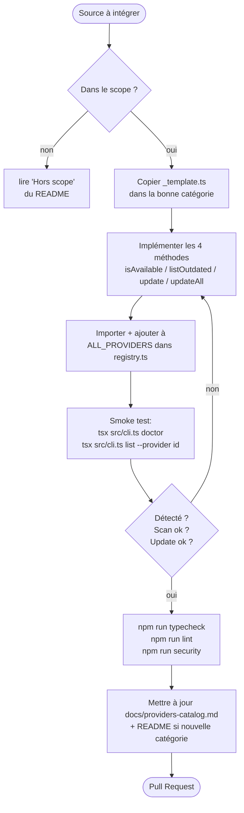
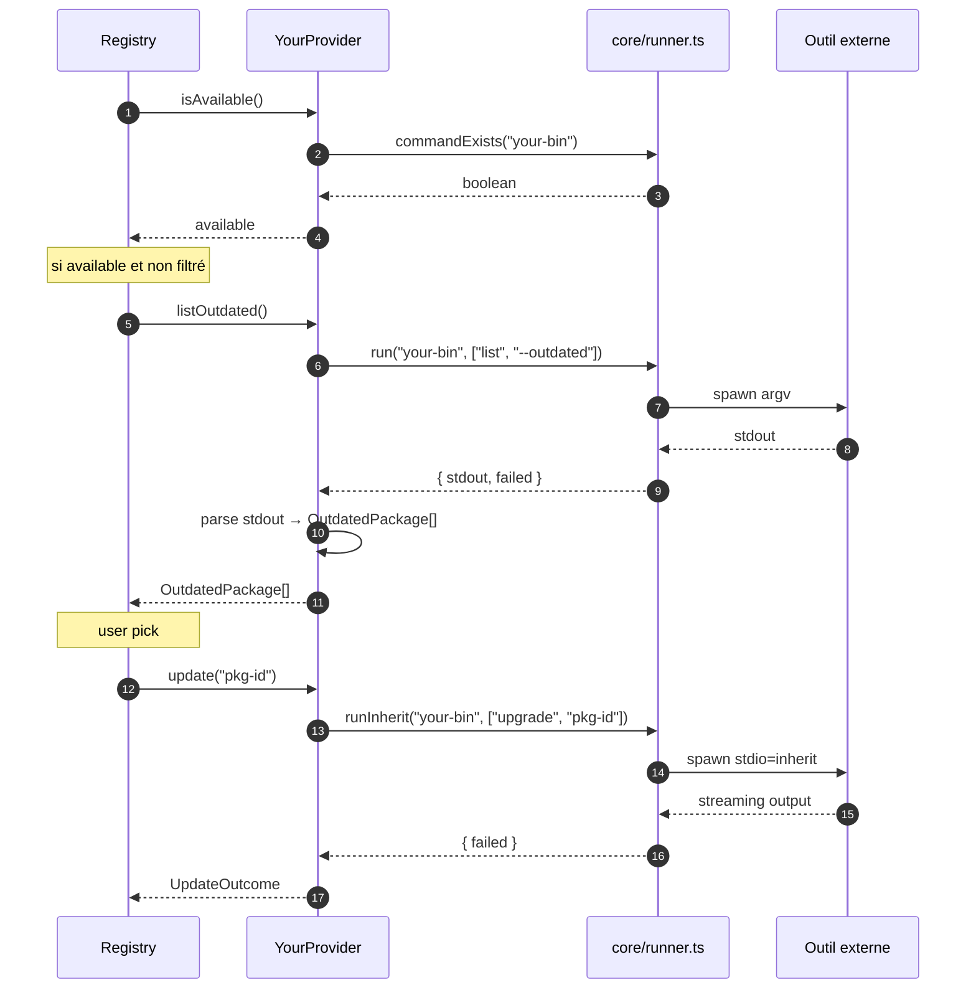
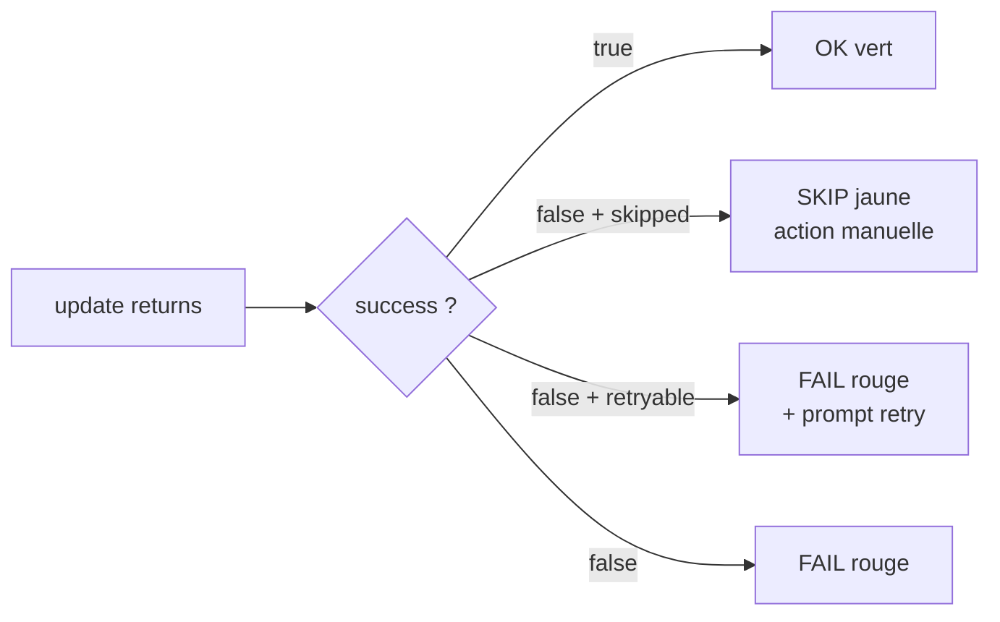

# Contributing

Merci de contribuer. La contribution type est l'**ajout d'un provider** — un module isolé qui sait scanner et mettre à jour une source de paquets.

> Avant de plonger : lire [`docs/architecture.md`](docs/architecture.md) pour le contexte (cycle de vie, runner, scan parallèle, modèle de données).

---

## Sommaire

- [1. Setup local](#1-setup-local)
- [2. Workflow d'ajout d'un provider](#2-workflow-dajout-dun-provider)
- [3. Anatomie d'un provider](#3-anatomie-dun-provider)
- [4. Conventions obligatoires](#4-conventions-obligatoires)
- [5. Cas particuliers](#5-cas-particuliers)
- [6. Tests & qualité avant PR](#6-tests--qualité-avant-pr)
- [7. Style de code](#7-style-de-code)
- [8. Reporter un bug provider](#8-reporter-un-bug-provider)

---

## 1. Setup local

```powershell
git clone https://github.com/LINDECKER-Charles/GlobalUpdater.git
cd GlobalUpdater
npm install
npm run build
npm link            # expose gup globalement (optionnel)
```

Prérequis : **Node ≥ 20**, PowerShell ou Bash. Pour itérer sans rebuild : `npm run dev -- <args>` (utilise `tsx`).

---

## 2. Workflow d'ajout d'un provider



### 2.1 Choisir la catégorie

Le fichier va dans `src/providers/<catégorie>/`. Catégories existantes : `os/`, `wsl/`, `node/`, `python/`, `rust/`, `dotnet-php/`, `jvm/`, `lang-other/`, `toolchain/`, `cloud/`, `iac/`, `kubernetes/`, `containers/`, `security/`, `dev-cli/`, `ide/`, `editor-plugins/`, `embedded-mobile/`, `shell/`. Voir [`docs/architecture.md`](docs/architecture.md#11-arborescence) pour la cartographie complète.

Une nouvelle catégorie n'est créée que si **3+ providers** y tomberaient logiquement — sinon, placer dans `lang-other/` ou `dev-cli/`.

### 2.2 Copier le template

```powershell
Copy-Item src/providers/_template.ts src/providers/<catégorie>/<your-provider>.ts
```

Le template (`src/providers/_template.ts`) contient les imports corrects et la signature minimale.

### 2.3 Registrer

Dans `src/core/registry.ts` :

```ts
import { YourProvider } from "../providers/<catégorie>/<your-provider>.js";

export const ALL_PROVIDERS: Provider[] = [
  // ...
  new YourProvider(),
];
```

L'ordre dans le tableau dicte l'ordre d'affichage dans `gup doctor` — grouper les providers conceptuellement liés.

### 2.4 Smoke test

```powershell
npm run typecheck
npx tsx src/cli.ts doctor                       # provider détecté ?
npx tsx src/cli.ts list --provider <your-id>    # scan correct ?
npx tsx src/cli.ts update <your-id>:<pkg>       # update fonctionnel ?
```

---

## 3. Anatomie d'un provider



### Signature

```ts
import { commandExists, run, runInherit } from "../../core/runner.js";
import type { OutdatedPackage, Provider, UpdateOutcome } from "../../core/types.js";

export class YourProvider implements Provider {
  readonly id = "your-tool";              // unique, kebab-case, stable
  readonly displayName = "Your Tool";
  readonly installHint = "winget install YourTool";
  readonly slow = false;                   // true si scan = HTTP par paquet

  async isAvailable(): Promise<boolean> {
    return commandExists("your-bin");
  }

  async listOutdated(): Promise<OutdatedPackage[]> {
    const { stdout, failed } = await run("your-bin", ["list", "--outdated"]);
    if (failed) return [];
    // parse stdout → OutdatedPackage[]
    return [];
  }

  async update(packageId: string): Promise<UpdateOutcome> {
    const res = await runInherit("your-bin", ["upgrade", packageId]);
    return { id: packageId, success: !res.failed };
  }

  async updateAll(packages: OutdatedPackage[]): Promise<UpdateOutcome[]> {
    if (packages.length === 0) return [];
    const res = await runInherit("your-bin", ["upgrade", "--all"]);
    return packages.map((p) => ({ id: p.id, success: !res.failed }));
  }
}
```

### Sémantique du retour



- `success: true` → succès.
- `success: false, skipped: true` → l'action exige l'utilisateur (download manuel, GUI). Pas un échec, pas un succès.
- `success: false, retryable: true` → l'échec peut être contourné avec `--force`/`uninstallPrevious`/`reinstall`. Surfacé en `FAIL` mais propose un retry.
- `success: false` → vrai échec, message dans `message`.

---

## 4. Conventions obligatoires

| Règle | Pourquoi |
|---|---|
| **Un fichier = un provider** | Pas de couplage. Suppression triviale. |
| **Aucun `throw` dans `listOutdated` / `update`** | Un provider qui casse ne casse pas le scan global. Retourne `[]` ou `success: false`. |
| **`run` / `runInherit` uniquement** — jamais `child_process` | Encoding Windows safe, `shell: true` interdit (sauf allowlist sécu). |
| **`fetch` avec `AbortSignal.timeout(5_000)`** | Pas de scan qui hang sur un upstream lent. |
| **HTTPS uniquement** dans `fetch` | Vérifié par `tests/security/http-targets.test.ts`. |
| **`slow: true`** si scan HTTP par paquet ou walk FS | Permet à `--fast` de skipper. |
| **`skipped: true`** quand le provider sait qu'aucune automation n'est possible | Évite un faux `FAIL`. |
| **`manual: true`** dans `OutdatedPackage` si tout le provider est purely-manual | `scanAll` filtre — l'item n'apparaît jamais dans les listes. |
| **Pas de nouvelle dépendance npm sans discussion** | Footprint volontairement minimal. |

---

## 5. Cas particuliers

### 5.1 Provider HTTP-heavy (gh releases, etc.)

Utiliser `core/gh-releases.ts` ou `core/hashicorp-releases.ts` quand l'outil publie via GitHub/HashiCorp. Ces helpers gèrent la timeout, le parsing, et le rate-limit basique.

### 5.2 Provider WSL

Hériter du pattern dans `src/providers/wsl/` — le helper `core/wsl.ts` bridge `wsl -d <distro> -- <cmd>` et expose la liste des distros détectées.

### 5.3 Provider "manuel uniquement"

Si **chaque** mise à jour exige une action GUI (ex. JetBrains Toolbox, Eclipse Marketplace), le fichier existe pour documenter le cas mais n'est **pas** ajouté à `ALL_PROVIDERS`. Voir le commentaire `Manual-only providers` dans `registry.ts` lignes 151-161.

### 5.4 Provider qui partage un binaire avec un autre

Utiliser `core/install-source.ts` pour décider qui possède le binaire (`whichFirst` → path → mapping PM). Critique sécurité : tout changement est pinned par `tests/security/install-source.test.ts`.

### 5.5 Provider winget-like avec retry

Marquer les outcomes `retryable: true` quand le message d'erreur upstream suggère qu'un `--force` aiderait (hash mismatch, app running). Implémenter le branchement sur `options.force` / `options.uninstallPrevious` / `options.reinstall` dans `update` — voir `src/providers/os/winget.ts` pour la référence.

---

## 6. Tests & qualité avant PR

```powershell
npm run typecheck             # tsc strict + noUncheckedIndexedAccess + exactOptionalPropertyTypes
npm run lint                  # eslint
npm run test:run              # vitest one-shot
npm run test:security         # suite sécu (shell-usage, http-targets, install-source)
npm run security              # audit-ci + lint:security + test:security
```

CI cross-platform : **Ubuntu** + **Windows**, Node **20** & **22**. Toute PR qui ajoute un provider doit passer ces 4 combinaisons.

### Coverage

Si le parsing est non-trivial, ajouter un test unitaire dans `tests/providers/<your-provider>.test.ts` — pas obligatoire pour un wrapper trivial, recommandé dès qu'il y a une regex ou une fusion de champs.

---

## 7. Style de code

- **TypeScript strict** + `noUncheckedIndexedAccess` + `exactOptionalPropertyTypes`. Pas de cast sauf nécessité.
- **Pas de commentaires qui décrivent le quoi** — seulement le pourquoi quand non-trivial. Un identifier bien nommé bat un commentaire.
- **Français pour les strings user-facing** (le user principal est FR), **anglais** pour le code, les identifiers, et la doc technique (cette page).
- **Imports `.js`** dans les paths (extension ES modules, même pour les sources `.ts`).
- **Pas de `any`**, pas de `as` non nécessaire.

---

## 8. Reporter un bug provider

Inclure dans l'issue :

- Sortie de `gup doctor` (providers détectés vs manquants).
- Sortie de `gup list --provider <id> --json` (ou snippet rédacté si données sensibles).
- Versions OS + outil concerné (`<bin> --version`).
- Sortie verbeuse si pertinente : `gup update <id>:<pkg> 2>&1 | tee gup.log`.

Ça suffit en général pour reproduire.

---

## Reporter une vulnérabilité

Voir [`SECURITY.md`](SECURITY.md). **Ne pas** ouvrir une issue publique avec un reproducer — passer par une [private security advisory GitHub](https://github.com/LINDECKER-Charles/GlobalUpdater/security/advisories/new).
