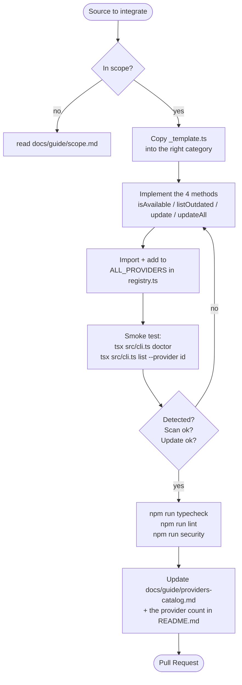
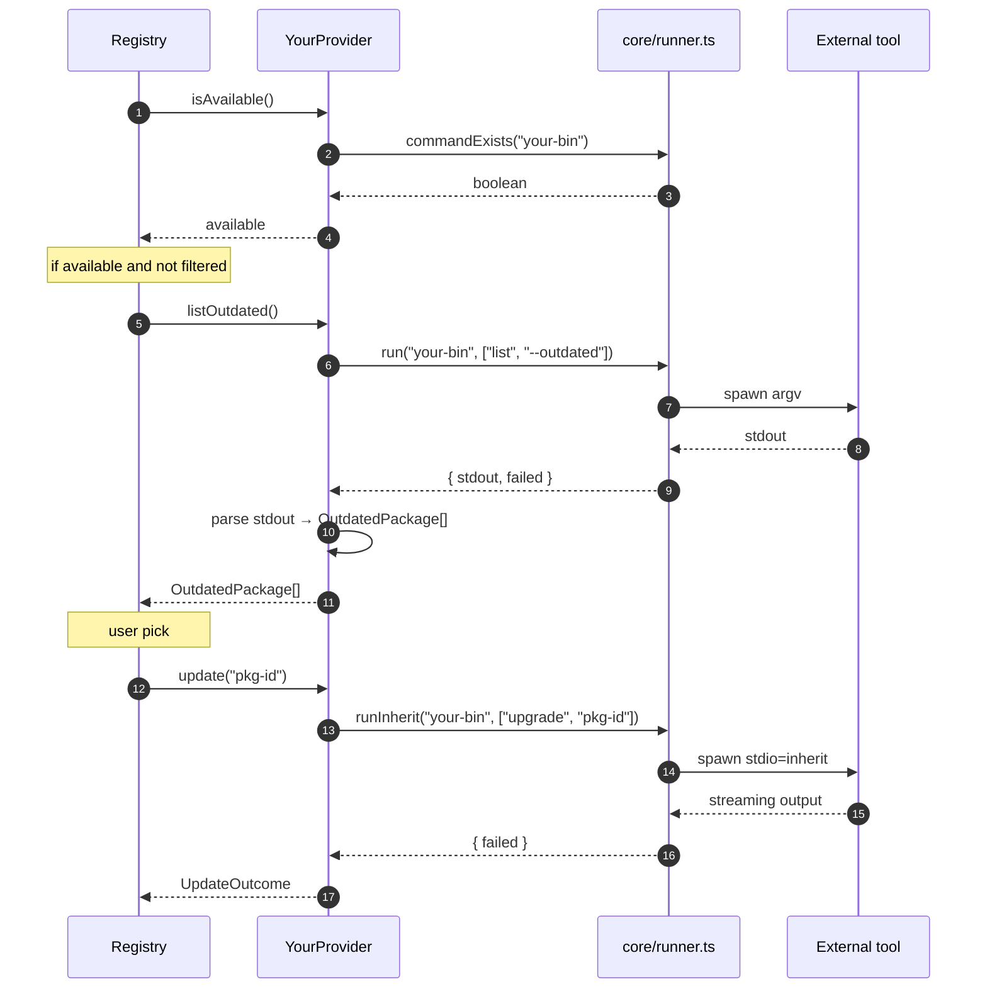
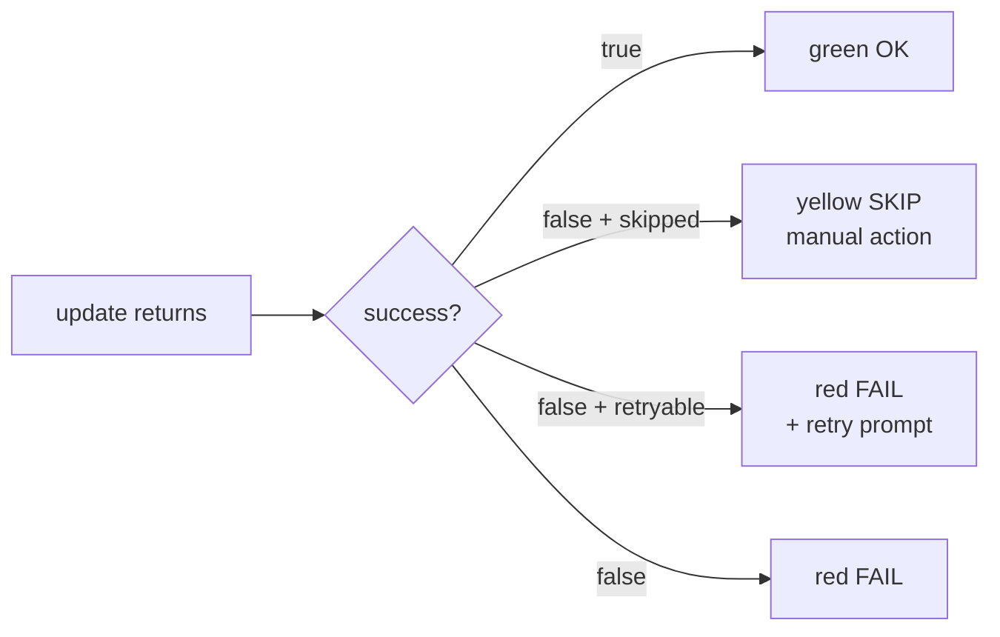
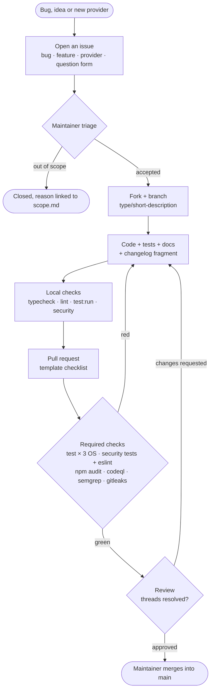

# Contributing

[](https://github.com/LINDECKER-Charles/gup/actions/workflows/ci.yml)
[](https://lindecker-charles.github.io/gup/)
[](https://www.typescriptlang.org/)
[](https://vitest.dev/)

Thanks for contributing. The typical contribution is **adding a provider** — an isolated module that knows how to scan and update one package source.

By participating in this project — issues, pull requests, reviews — you agree to abide by its [Code of Conduct](CODE_OF_CONDUCT.md).

> Before diving in: read [`docs/development/architecture.md`](docs/development/architecture.md) for context (lifecycle, runner, parallel scan, data model).
>
> Looking for help rather than contributing code? See [SUPPORT.md](SUPPORT.md). How the project is run and who decides what: [GOVERNANCE.md](GOVERNANCE.md).

---

## Table of contents

- [0. Ways to contribute](#0-ways-to-contribute)
- [1. Local setup](#1-local-setup)
- [2. Provider-addition workflow](#2-provider-addition-workflow)
- [3. Provider anatomy](#3-provider-anatomy)
- [4. Mandatory conventions](#4-mandatory-conventions)
- [5. Edge cases](#5-edge-cases)
- [6. Tests & quality before PR](#6-tests--quality-before-pr)
- [7. Code style](#7-code-style)
- [8. Branches, commits and scopes](#8-branches-commits-and-scopes)
- [9. Pull request flow](#9-pull-request-flow)
- [10. Documentation](#10-documentation)
- [11. Reporting a bug](#11-reporting-a-bug)

---

## 0. Ways to contribute

| Contribution | Where to start |
|---|---|
| Report a bug | The [*Bug report*](https://github.com/LINDECKER-Charles/gup/issues/new?template=bug_report.yml) form — see [§ 11](#11-reporting-a-bug) for what helps most |
| Request a provider | The [*New provider*](https://github.com/LINDECKER-Charles/gup/issues/new?template=provider_request.yml) form: the commands to list and update the packages of that source |
| Add a provider | [§ 2](#2-provider-addition-workflow): usually one file, one registry line and its tests |
| Improve the documentation | [`docs/`](docs/README.md), in English — see [§ 10](#10-documentation) |
| Improve the landing page or its translations | [`index/`](index/), a static Vite + React site (`cd index && npm ci && npm run build`, then `npm run verify`, which drives Playwright's Chromium); commit scope `landing` |
| Triage | Reproduce open bugs on your platform, ask for missing details, point duplicates to the original issue |

A change of behaviour starts as a [*Feature request*](https://github.com/LINDECKER-Charles/gup/issues/new?template=feature_request.yml) — why is in [GOVERNANCE.md § How decisions are made](GOVERNANCE.md#how-decisions-are-made).

---

## 1. Local setup

```powershell
git clone https://github.com/LINDECKER-Charles/gup.git
cd gup
npm install
npm run build
npm link            # exposes gup globally (optional)
```

Requirements: **Node ≥ 26.9**, any shell — the interactive UI is OpenTUI, whose native renderer loads through `node:ffi`, on by default from 26.9. To iterate without rebuilding: `npm run dev -- <args>` (uses `tsx`).

Install Node through a version manager rather than over your system Node, so this floor does not fight your other projects: [nvm-windows](https://github.com/coreybutler/nvm-windows), [fnm](https://github.com/Schniz/fnm) or [Volta](https://volta.sh/) on Windows; fnm, Volta or [nvm](https://github.com/nvm-sh/nvm) on macOS and Linux. On an older Node, npm only warns (`EBADENGINE`), then the UI tests and the interactive app fail to load.

### Two deliberate version pins

Both show up in `npm outdated`; neither is an oversight, so please don't "fix" them without checking these reasons still hold.

| Package | Pinned to | Why |
|---|---|---|
| `typescript` | `^6` | typescript-eslint does not support the TypeScript 7 API yet — `npm run lint` and `npm run lint:security` both fail outright on TS 7 ([typescript-eslint#10940](https://github.com/typescript-eslint/typescript-eslint/issues/10940)). `tsc --noEmit` and the build are fine on 7; the linters are the blocker. |
| `@types/node` | `^26` | Matched to the `engines.node` floor on purpose. Typing against the *minimum* supported runtime is what makes `tsc` reject an API that only exists on a newer Node line — bumping these types to the latest silently removes that guard. Raise it only together with `engines`. |

---

## 2. Provider-addition workflow


```mermaid
flowchart TD
    Start([Source to integrate]) --> Scope{In scope?}
    Scope -->|no| OutOfScope[read docs/guide/scope.md]
    Scope -->|yes| Copy[Copy _template.ts<br/>into the right category]
    Copy --> Impl[Implement the 4 methods<br/>isAvailable / listOutdated / update / updateAll]
    Impl --> Register[Import + add to<br/>ALL_PROVIDERS in registry.ts]
    Register --> Smoke[Smoke test:<br/>tsx src/cli.ts doctor<br/>tsx src/cli.ts list --provider id]
    Smoke --> Pass{Detected?<br/>Scan ok?<br/>Update ok?}
    Pass -->|no| Impl
    Pass -->|yes| Tests[npm run typecheck<br/>npm run lint<br/>npm run security]
    Tests --> Doc[Update docs/guide/providers-catalog.md<br/>+ the provider count in README.md]
    Doc --> PR([Pull Request])
```

### 2.1 Pick the category

The file goes into `src/providers/<category>/`. Existing categories: `os/`, `wsl/`, `node/`, `python/`, `rust/`, `dotnet-php/`, `jvm/`, `lang-other/`, `toolchain/`, `cloud/`, `iac/`, `kubernetes/`, `containers/`, `security/`, `dev-cli/`, `ide/`, `editor-plugins/`, `embedded-mobile/`, `shell/`. See [`docs/development/architecture.md`](docs/development/architecture.md#11-tree-layout) for the full map.

Only create a new category if **3+ providers** would logically fall into it — otherwise drop the file into `lang-other/` or `dev-cli/`.

### 2.2 Copy the template

```powershell
Copy-Item src/providers/_template.ts src/providers/<category>/<your-provider>.ts
```

The template (`src/providers/_template.ts`) ships with the correct imports and the minimal signature.

### 2.3 Register it

In `src/core/registry.ts`:

```ts
import { YourProvider } from "../providers/<category>/<your-provider>.js";

export const ALL_PROVIDERS: Provider[] = [
  // ...
  new YourProvider(),
];
```

The order in the array drives the display order in `gup doctor` — group conceptually related providers together.

### 2.4 Smoke test

```powershell
npm run typecheck
npx tsx src/cli.ts doctor                       # provider detected?
npx tsx src/cli.ts list --provider <your-id>    # scan correct?
npx tsx src/cli.ts update <your-id>:<pkg>       # update works?
```

---

## 3. Provider anatomy


```mermaid
sequenceDiagram
    autonumber
    participant Registry
    participant P as YourProvider
    participant Runner as core/runner.ts
    participant Tool as External tool

    Registry->>P: isAvailable()
    P->>Runner: commandExists("your-bin")
    Runner-->>P: boolean
    P-->>Registry: available

    Note over Registry: if available and not filtered

    Registry->>P: listOutdated()
    P->>Runner: run("your-bin", ["list", "--outdated"])
    Runner->>Tool: spawn argv
    Tool-->>Runner: stdout
    Runner-->>P: { stdout, failed }
    P->>P: parse stdout → OutdatedPackage[]
    P-->>Registry: OutdatedPackage[]

    Note over Registry: user pick

    Registry->>P: update("pkg-id")
    P->>Runner: runInherit("your-bin", ["upgrade", "pkg-id"])
    Runner->>Tool: spawn stdio=inherit
    Tool-->>Runner: streaming output
    Runner-->>P: { failed }
    P-->>Registry: UpdateOutcome
```

### Signature

```ts
import { commandExists, run, runInherit } from "../../core/runner.js";
import type { OutdatedPackage, Provider, UpdateOutcome } from "../../core/types.js";

export class YourProvider implements Provider {
  readonly id = "your-tool";              // unique, kebab-case, stable
  readonly displayName = "Your Tool";
  readonly installHint = "winget install YourTool";
  readonly slow = false;                   // true if scan = HTTP per package

  async isAvailable(): Promise<boolean> {
    return commandExists("your-bin");
  }

  async listOutdated(): Promise<OutdatedPackage[]> {
    const { stdout, failed } = await run("your-bin", ["list", "--outdated"]);
    if (failed) return [];
    // parse stdout → OutdatedPackage[]
    return [];
  }

  async update(packageId: string): Promise<UpdateOutcome> {
    const res = await runInherit("your-bin", ["upgrade", packageId]);
    return { id: packageId, success: !res.failed };
  }

  async updateAll(packages: OutdatedPackage[]): Promise<UpdateOutcome[]> {
    if (packages.length === 0) return [];
    const res = await runInherit("your-bin", ["upgrade", "--all"]);
    return packages.map((p) => ({ id: p.id, success: !res.failed }));
  }
}
```

### Return semantics


```mermaid
flowchart LR
    Update[update returns] --> Success{success?}
    Success -->|true| OK[green OK]
    Success -->|false + skipped| SKIP[yellow SKIP<br/>manual action]
    Success -->|false + retryable| RETRY[red FAIL<br/>+ retry prompt]
    Success -->|false| FAIL[red FAIL]
```

- `success: true` → success.
- `success: false, skipped: true` → action requires the user (manual download, GUI). Neither failure nor success.
- `success: false, retryable: true` → the failure can be worked around with `--force`/`uninstallPrevious`/`reinstall`. Surfaced as `FAIL` but proposes a retry.
- `success: false` → real failure, message in `message`.

---

## 4. Mandatory conventions

| Rule | Why |
|---|---|
| **One file = one provider** | No coupling. Removal is trivial. |
| **No `throw` inside `listOutdated` / `update`** | A broken provider must not break the global scan. Return `[]` or `success: false`. |
| **`run` / `runInherit` only** — never `child_process` | Windows-safe encoding, `shell: true` forbidden (security allowlist aside). |
| **`fetch` with `AbortSignal.timeout(5_000)`** | No scan hanging on a slow upstream. |
| **HTTPS only** in `fetch` | Pinned by `tests/security/http-targets.test.ts`. |
| **`slow: true`** if scan does HTTP-per-package or FS walk | Lets `--fast` skip it. |
| **`skipped: true`** when the provider knows no automation is possible | Avoids a false `FAIL`. |
| **`manual: true`** in `OutdatedPackage` if the entire provider is purely manual | `scanAll` filters it — the item never shows up in lists. |
| **No new npm dependency without discussion** | Footprint is intentionally minimal. |

---

## 5. Edge cases

### 5.1 HTTP-heavy providers (gh releases, etc.)

Use `core/gh-releases.ts` or `core/hashicorp-releases.ts` when the tool publishes via GitHub/HashiCorp. These helpers handle timeout, parsing, and basic rate-limiting.

### 5.2 WSL providers

Inherit the pattern in `src/providers/wsl/` — the helper `core/wsl.ts` bridges `wsl -d <distro> -- <cmd>` and exposes the list of detected distros.

### 5.3 "Manual-only" providers

If **every** update requires a GUI action (e.g. JetBrains plugins, Eclipse Marketplace features), the file exists to document the case but is **not** added to `ALL_PROVIDERS`. See the *Manual-only providers* comment among the IDE imports of `src/core/registry.ts`.

### 5.4 Providers sharing a binary with another

Use `core/install-source.ts` to decide who owns the binary (`whichFirst` → path → PM mapping). Security-critical: any change is pinned by `tests/security/install-source.test.ts`.

### 5.5 winget-like providers with retry

Mark outcomes `retryable: true` when the upstream error message suggests `--force` would help (hash mismatch, app running). Branch on `options.force` / `options.uninstallPrevious` / `options.reinstall` inside `update` — see `src/providers/os/winget.ts` for the reference.

---

## 6. Tests & quality before PR

```powershell
npm run typecheck             # tsc strict + noUncheckedIndexedAccess + exactOptionalPropertyTypes
npm run lint                  # eslint
npm run test:run              # vitest one-shot
npm run test:security         # security suite (shell-usage, http-targets, install-source)
npm run security              # audit-ci + lint:security + test:security
```

Cross-platform CI: **Windows** + **macOS** + **Ubuntu**, Node **26**. Every PR that adds a provider must pass all three.

Because the matrix now runs on three OSes, a provider must never build a path with the platform-dependent `path.join` inside a platform-specific branch: use `path.win32.join` for a Windows path and `path.posix.join` for a POSIX one. Otherwise the unit tests — which mock `process.platform` — only pass on a matching runner.

### Coverage

If parsing is non-trivial, add a unit test in `tests/providers/<your-provider>.test.ts` — not mandatory for a trivial wrapper, recommended as soon as there's a regex or a field merge.

---

## 7. Code style

- **Strict TypeScript** + `noUncheckedIndexedAccess` + `exactOptionalPropertyTypes`. No casts unless necessary.
- **No comments describing the WHAT** — only the WHY when non-obvious. A well-named identifier beats a comment.
- **`.js` extensions** in import paths (ES-module extension, even for `.ts` sources).
- **No `any`**, no unnecessary `as`.

### Language

**English** for code, identifiers, comments, JSDoc, configuration comments, documentation (including release notes) and commit messages: contributors and bug reports arrive in English, and a half-French code base forces every reader to switch languages mid-file.

**French** for every string the user sees at runtime: CLI output, install hints, menu labels, dialogs. That is the language of the interface, not an oversight — see the note in the [CLI reference](docs/guide/cli-reference.md).

### Size and complexity limits

These apply to `src/**` and are **gates, not review preferences**: `npm run lint` fails on the ones marked *lint*, in CI as locally.

| Rule | Limit | Enforced by |
|---|---|---|
| File length | ≤ 300 lines (alert), 400 maximum | lint (`max-lines`, 400) |
| Function / method length | ≤ 30 lines | lint (`max-lines-per-function`) |
| Parameters | ≤ 3 — group the rest in an object | lint (`max-params`) |
| Nesting depth | ≤ 3 levels | lint (`max-depth`) |
| Cyclomatic complexity | ≤ 10 per function | lint (`complexity`) |
| Unused imports, variables, parameters | none | lint (`no-unused-vars`) and `npm run typecheck` (`noUnusedLocals`, `noUnusedParameters`) |
| Line length | ≤ 100 characters | review |
| Files per folder | ≤ 10 — split into sub-folders by domain | review |

Comment and blank lines do not count (`skipComments`, `skipBlankLines`): the limits cap how much a reader must hold in their head, and counting comments would push people to delete explanations to get green.

`tests/**` and `scripts/**` are exempt from the size limits but keep `max-params`, `complexity` and the unused-code rule: a long test file measures coverage, a complex test function usually checks too many things at once.

Two **named exceptions**, where the rule is miscalibrated rather than the code:

- `src/core/registry.ts` (file length), disabled in `eslint.config.js` with the reason next to it: the flat catalogue of providers, one import and one instantiation each. Splitting it would add files without reducing what a reader must understand.
- `src/providers/<domain>/` (files per folder, a review rule): the domain folder already is the unit of splitting the rule asks for; a sub-level such as `kubernetes/cluster/` would add navigation without adding meaning.

A one-off exception elsewhere needs an inline `eslint-disable` with a comment that justifies it.

### Structure

- **One public element per file** (a class, a component or a module), named like the file.
- **No magic numbers or strings**: extract them into named constants that say what they mean.
- **No dead code**: no unused import, variable, function, class or type. A refactor that moves code takes its imports with it. A parameter a signature imposes but the body does not use is prefixed with `_`. An export that only exists for tests says so in a comment.
- **One function, one job**: guard clauses over nested `if`/`else`, no boolean flag parameters that switch behaviour, and a function either changes state or returns a value, not both.

---

## 8. Branches, commits and scopes

### Branches

```
type/short-description
```

- The **type** is one of the commit types below, always in its short form: `feat/`, never `feature/`.
- The **description** is 2 to 5 words in kebab-case, ASCII only, saying what the branch is about: `fix/winget-pinned-packages`, `docs/release-guide`.
- **One branch, one subject.** It starts from `main` and comes back through a pull request.

### Commits

[Conventional Commits](https://www.conventionalcommits.org/):

```
type(scope): description
```

- **English, imperative mood**, lowercase after the colon, no trailing period: `fix(core/runner): close the child's stdin before waiting`.
- **Subject ≤ 72 characters.** The body is optional and explains *why*; the diff already shows *what*.
- **Breaking changes** carry a `BREAKING CHANGE:` footer, and the release notes say how to upgrade.
- **One commit, one coherent change.** Never mix two subjects in a commit.
- **Tests travel with the code they test**, in the same commit, never in a separate one. Release notes (`docs/releases/**`) and changelog entries travel with the commit they document.

| Type | Use |
|---|---|
| `feat` | a new capability (provider, command, flag, view) |
| `fix` | a bug fix |
| `docs` | documentation only |
| `refactor` | restructuring without a behaviour change |
| `perf` | a performance improvement |
| `test` | adding or fixing tests on their own (rare: tests usually travel with code) |
| `style` | formatting, no change in meaning |
| `build` | dependencies, build and lint tooling |
| `ci` | GitHub Actions workflows and Dependabot configuration |
| `chore` | maintenance that fits no other type, release bumps |
| `revert` | reverting an earlier commit |

### Scope map

The scope says where the change lives. It is **required** whenever the changed files are covered by a row below.

| Files changed | Prefix | Example |
|---|---|---|
| `src/core/**` | `type(core)`, or `type(core/<module>)` when the change stays in one module | `fix(core/runner): …` |
| `src/providers/<domain>/**` | `type(providers/<domain>)`; `type(providers)` when several domains change | `feat(providers/cloud): …` |
| `src/cli.ts`, `src/commands/**` | `type(cli)` | `feat(cli): …` |
| `src/ui/**` | `type(ui)` | `fix(ui): …` |
| `tests/**` | the scope of the code under test, in the same commit | — |
| `.github/workflows/<name>.yml` | `ci(<name>)` | `ci(security): …` |
| `.github/dependabot.yml` | `ci(dependabot)` | `ci(dependabot): …` |
| `index/**` (landing page) | `type(landing)` | `feat(landing): …` |
| `SUPPORT.md`, `GOVERNANCE.md`, `.github/ISSUE_TEMPLATE/**`, `.github/PULL_REQUEST_TEMPLATE.md`, `.github/CODEOWNERS` | `docs(community)` | `docs(community): …` |
| `docs/**`, `README.md`, `CONTRIBUTING.md`, `SECURITY.md`, `CHANGELOG.md`, `CITATION.cff` | `docs`, optionally with the topic as scope | `docs(changelog): …` |
| `package.json`, `package-lock.json`, `tsconfig*.json`, `tsup.config.ts` | `build(deps)`; Dependabot bumps use `chore(deps)` / `chore(deps-dev)` | `build(deps): …` |
| `eslint.config*.js`, `vitest.config.ts`, `audit-ci.json`, `.semgrep.yml`, `.gitleaks.toml` | `build(lint)` | `build(lint): …` |
| `scripts/**`, `check.cmd`, `.gitignore`, `.gitattributes` | `chore`, no scope | `chore: …` |
| The version bump of a release | `chore(release): x.y.z` | `chore(release): 0.4.0` |

---

## 9. Pull request flow

How a contribution reaches `main`:


```mermaid
flowchart TD
    Idea(["Bug, idea or new provider"]) --> Issue["Open an issue<br/>bug · feature · provider · question form"]
    Issue --> Triage{Maintainer triage}
    Triage -->|out of scope| Close(["Closed, reason linked to scope.md"])
    Triage -->|accepted| Branch["Fork + branch<br/>type/short-description"]
    Branch --> Code["Code + tests + docs<br/>+ changelog fragment"]
    Code --> Local["Local checks<br/>typecheck · lint · test:run · security"]
    Local --> PR["Pull request<br/>template checklist"]
    PR --> CI{"Required checks<br/>test × 3 OS · security tests + eslint<br/>npm audit · codeql · semgrep · gitleaks"}
    CI -->|red| Code
    CI -->|green| Review{"Review<br/>threads resolved?"}
    Review -->|changes requested| Code
    Review -->|approved| Merge(["Maintainer merges into main"])
```

1. **Keep a pull request to one subject.** Two unrelated fixes are two pull requests.
2. **Fill in the template**: what and why, the linked issue (`Closes #123`), the checklist, what you tested by hand.
3. **Add a changelog fragment** as `docs/changelog/unreleased/<branch-slug>.md`, where `<branch-slug>` is your branch name without its type (`fix/winget-pinned-packages` → `winget-pinned-packages.md`). Use the headings and the bullet shape described in the [changelog guide](docs/changelog/README.md#how-to-read-an-entry); fragments are folded into `unreleased.md` before a release, so parallel pull requests never edit the same file.
4. **Required checks.** The `main` ruleset blocks the merge until these eight checks pass:

   | Check | Workflow | What it runs |
   |---|---|---|
   | `test (node 26 / windows-latest)` | `ci.yml` | typecheck, build, unit tests on Windows |
   | `test (node 26 / macos-latest)` | `ci.yml` | typecheck, build, unit tests on macOS |
   | `test (node 26 / ubuntu-latest)` | `ci.yml` | typecheck, lint, security lint, build, unit tests on Linux |
   | `security tests + eslint` | `security.yml` | the `eslint-plugin-security` ruleset and the security test suite |
   | `npm audit (audit-ci)` | `security.yml` | known advisories in the dependency tree (`audit-ci.json`) |
   | `codeql` | `security.yml` | CodeQL `security-extended` and `security-and-quality` queries |
   | `semgrep` | `security.yml` | the rules in `.semgrep.yml` plus the `p/typescript` and `p/nodejs` packs |
   | `gitleaks` | `security.yml` | secret scan of the whole history (`.gitleaks.toml`) |

   The `docs` workflow (`docs.yml`) also checks Markdown links and anchors when documentation changes. It is not required — a path-filtered workflow cannot be — but a red run is fixed before merging.
5. **Review.** Every review conversation must be resolved before the merge.
6. **Merge.** The maintainer merges, with a merge commit that keeps your commits as they are — which is why their messages matter. The repository admin can bypass the ruleset; contributions are merged with all eight checks green.

---

## 10. Documentation

- Documentation is **English**. French UI labels are quoted verbatim, in **bold**, with an English gloss on first use: "**Paquets** (packages)".
- Users' pages go to `docs/guide/`, contributors' pages to `docs/development/`; the [documentation index](docs/README.md) lists every page and must list a new one.
- **Mermaid** diagrams are welcome in `docs/` and in this file when they explain a mechanism: stable diagram types only (`flowchart`, `sequenceDiagram`, `stateDiagram-v2`, `classDiagram`, `gitGraph`), about 20 nodes at most, no custom colours. Check that they render in the pull request's rich diff.
- **`README.md` is also the npm page**, and npm renders neither Mermaid nor relative image paths: no diagrams there, and images by absolute `raw.githubusercontent.com` URL.
- A behaviour change updates the page that documents it in the same pull request; a new provider updates the [providers catalog](docs/guide/providers-catalog.md) and the provider count in the README.

---

## 11. Reporting a bug

Use the [*Bug report*](https://github.com/LINDECKER-Charles/gup/issues/new?template=bug_report.yml) form; [SUPPORT.md](SUPPORT.md#what-to-include) lists what to include. A provider bug also needs:

- the output of `gup list --provider <id> --json`, or a redacted snippet if the data is sensitive;
- the version of the tool behind the provider (`<bin> --version`).

---

## Reporting a vulnerability

See [`SECURITY.md`](SECURITY.md). **Do not** open a public issue with a reproducer — file a [private GitHub security advisory](https://github.com/LINDECKER-Charles/gup/security/advisories/new) instead.
