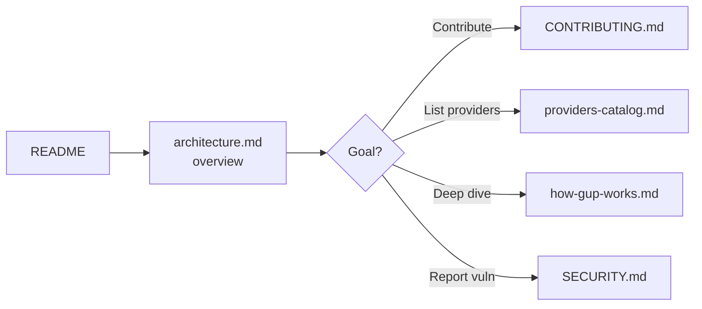

# Documentation

Index of the detailed `gup` documentation. The root [`README.md`](../README.md) stays light; technical content lives here.

| Document | Audience | Content |
|---|---|---|
| [`architecture.md`](architecture.md) | Contributors, maintainers, security review | Layers & responsibilities, data model, provider lifecycle, parallel scan, update pipeline + retry, security — **mermaid diagrams**. |
| [`how-gup-works.md`](how-gup-works.md) | Intermediate/advanced developers | End-to-end technical walkthrough: motivation, model, internal contracts, resilience patterns, build. Source document for an explanatory site. |
| [`providers-catalog.md`](providers-catalog.md) | Users, maintainers | Exhaustive catalog of the 130+ providers, implementation status (✅ 🚧 ⬜ ➡️ ❌), out-of-scope items. |
| [`releases/`](releases/) | Users, maintainers | Per-version release notes — what shipped, what broke, how it was verified. Source text for the GitHub Release body. |
| [`../CONTRIBUTING.md`](../CONTRIBUTING.md) | Contributors | Provider-addition workflow, mandatory conventions, edge cases, PR checklist — **mermaid diagrams**. |
| [`../SECURITY.md`](../SECURITY.md) | Security review, reporters | Threat model, CI/local mitigations, vulnerability reporting. |

## Mermaid diagrams

Mermaid diagrams render natively on GitHub. Locally:

- VS Code → *Markdown Preview Mermaid Support* extension.
- PNG/SVG export → [mermaid.live](https://mermaid.live) (copy-paste the block).

## Suggested reading order

