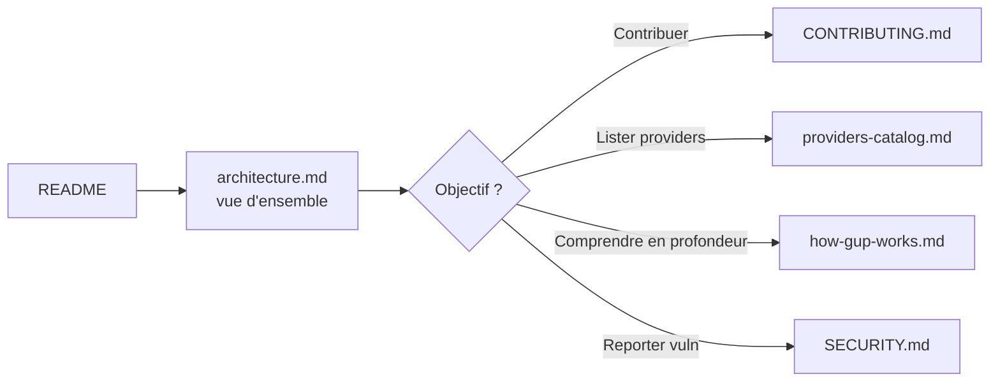

# Documentation

Index de la documentation détaillée de `gup`. Le [`README.md`](../README.md) racine reste léger ; le contenu technique vit ici.

| Document | Pour qui | Contenu |
|---|---|---|
| [`architecture.md`](architecture.md) | Contributeurs, mainteneurs, revue sécu | Couches & responsabilités, modèle de données, cycle de vie d'un provider, scan parallèle, pipeline d'update + retry, sécurité — **diagrammes mermaid**. |
| [`how-gup-works.md`](how-gup-works.md) | Public dev intermédiaire/confirmé | Walkthrough technique end-to-end : motivation, modèle, contrats internes, patterns de résilience, build. Document source pour un site explicatif. |
| [`providers-catalog.md`](providers-catalog.md) | Utilisateurs, mainteneurs | Catalogue exhaustif des 130+ providers, statut d'implémentation (✅ 🚧 ⬜ ➡️ ❌), hors scope. |
| [`../CONTRIBUTING.md`](../CONTRIBUTING.md) | Contributeurs | Workflow d'ajout d'un provider, conventions obligatoires, cas particuliers, checklist PR — **diagrammes mermaid**. |
| [`../SECURITY.md`](../SECURITY.md) | Revue sécu, reporters | Threat model, mitigations CI/local, reporting d'une vulnérabilité. |

## Schémas mermaid

Les diagrammes mermaid sont rendus nativement par GitHub. En local :

- VS Code → extension *Markdown Preview Mermaid Support*.
- Export PNG/SVG → [mermaid.live](https://mermaid.live) (copier-coller le bloc).

## Ordre de lecture suggéré

