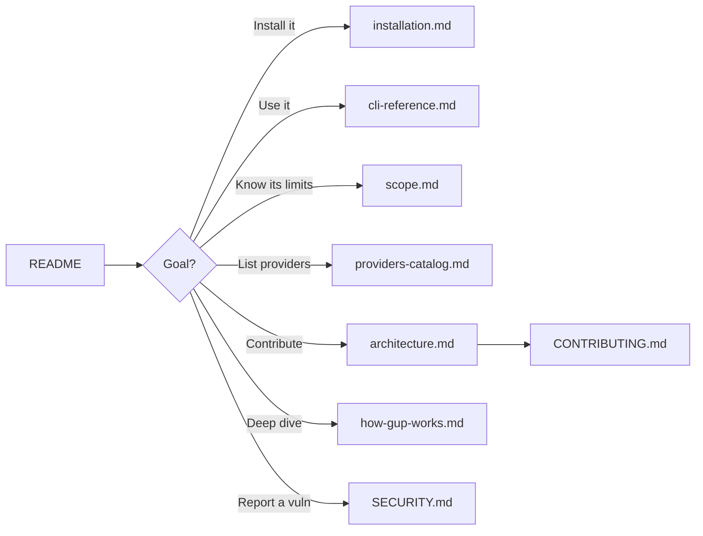

# Documentation

Index of the detailed `gup` documentation. The root [`README.md`](../README.md)
stays light; everything dense lives here.

## For users

| Document | Content |
|---|---|
| [`installation.md`](installation.md) | Install methods (npm, from source), requirements, per-platform support, updating and removing `gup`. |
| [`cli-reference.md`](cli-reference.md) | Every command and flag, the interactive menu, targeting syntax, stuck-install timeouts, retry strategies, JSON output, environment variables, exit codes, activity history. |
| [`scope.md`](scope.md) | Why `gup` exists, what belongs in it, and what is deliberately excluded — with the reasoning. |
| [`providers-catalog.md`](providers-catalog.md) | Exhaustive catalog of the 134 providers, implementation status (✅ 🚧 ⬜ ➡️ ❌), and evaluated candidates. |

## For contributors

| Document | Content |
|---|---|
| [`architecture.md`](architecture.md) | Layers & responsibilities, data model, provider lifecycle, parallel scan, update pipeline + retry, security — **mermaid diagrams**. |
| [`how-gup-works.md`](how-gup-works.md) | End-to-end technical walkthrough: motivation, model, internal contracts, resilience patterns, build. |
| [`../CONTRIBUTING.md`](../CONTRIBUTING.md) | Provider-addition workflow, mandatory conventions, edge cases, PR checklist — **mermaid diagrams**. |
| [`../SECURITY.md`](../SECURITY.md) | Threat model, CI/local mitigations, vulnerability reporting. |
| [`releases/`](releases/) | Per-version release notes — what shipped, what broke, how it was verified. Source text for the GitHub Release body. |

## Mermaid diagrams

Mermaid diagrams render natively on GitHub. Locally:

- VS Code → *Markdown Preview Mermaid Support* extension.
- PNG/SVG export → [mermaid.live](https://mermaid.live) (copy-paste the block).

## Suggested reading order

