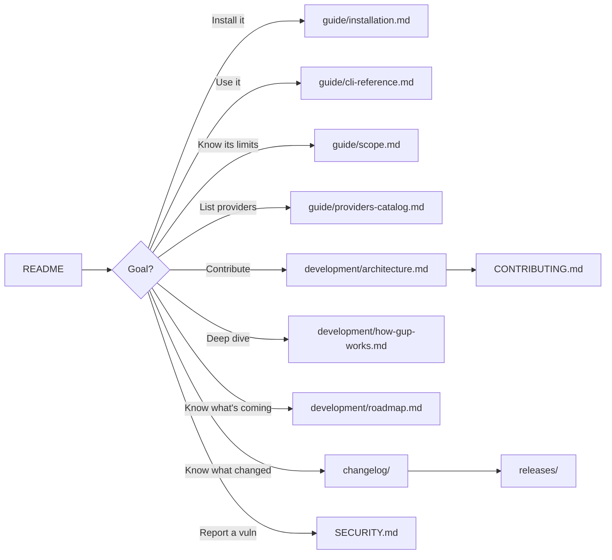

# Documentation

Index of the detailed `gup` documentation. The root [`README.md`](../README.md)
stays light; everything dense lives here.

## Layout

| Folder | Content |
|---|---|
| [`guide/`](guide/) | User-facing: install, run, what is in and out of scope, the provider catalog. |
| [`development/`](development/) | Contributor-facing: architecture, end-to-end internals, roadmap. |
| [`releases/`](releases/) | Per-version release notes — the source text of each GitHub Release. |
| [`changelog/`](changelog/) | Commit-level history of every version, from the first commit to `main`. |
| [`assets/`](assets/) | Images embedded by the docs (the terminal demo). |
| `archived/` | Local working documents — audit reports, snapshots. **Gitignored**, only its [`README.md`](archived/README.md) is tracked. |

## For users

| Document | Content |
|---|---|
| [`guide/installation.md`](guide/installation.md) | Install methods (npm, from source), requirements, per-platform support, updating and removing `gup`. |
| [`guide/cli-reference.md`](guide/cli-reference.md) | Every command and flag, the interactive menu, targeting syntax, stuck-install timeouts, retry strategies, JSON output, environment variables, exit codes, activity history. |
| [`guide/scope.md`](guide/scope.md) | Why `gup` exists, what belongs in it, and what is deliberately excluded — with the reasoning. |
| [`guide/providers-catalog.md`](guide/providers-catalog.md) | Exhaustive catalog of the 153 providers, implementation status (✅ 🚧 ⬜ ➡️ ❌), and evaluated candidates. |

## For contributors

| Document | Content |
|---|---|
| [`development/architecture.md`](development/architecture.md) | Layers & responsibilities, data model, provider lifecycle, parallel scan, update pipeline + retry, security — **mermaid diagrams**. |
| [`development/how-gup-works.md`](development/how-gup-works.md) | End-to-end technical walkthrough: motivation, model, internal contracts, resilience patterns, build. |
| [`development/roadmap.md`](development/roadmap.md) | Changes already decided but waiting on an external trigger — a date or an upstream release. Each entry carries its trigger, the exact edits, and what must not change. |
| [`../CONTRIBUTING.md`](../CONTRIBUTING.md) | Provider-addition workflow, mandatory conventions, edge cases, PR checklist — **mermaid diagrams**. |
| [`../SECURITY.md`](../SECURITY.md) | Threat model, CI/local mitigations, vulnerability reporting. |

## Project history

| Document | Content |
|---|---|
| [`changelog/`](changelog/README.md) | Every change since the first commit, one file per version plus the unreleased work on `main`, grouped by kind (Added / Changed / Fixed / Security / Dependencies / …) with commit and PR links. |
| [`releases/`](releases/README.md) | Per-version release notes — what shipped, what broke, how it was verified. Narrative, written before tagging; the GitHub Release body is this text plus GitHub's auto-generated "What's Changed". |

The two are complementary: the changelog is exhaustive and mechanical, the
release notes explain *why* a version matters. To find out whether a given
commit shipped, use the changelog; to decide whether to upgrade, read the notes.

## Mermaid diagrams

Mermaid diagrams render natively on GitHub. Locally:

- VS Code → *Markdown Preview Mermaid Support* extension.
- PNG/SVG export → [mermaid.live](https://mermaid.live) (copy-paste the block).

## Suggested reading order

