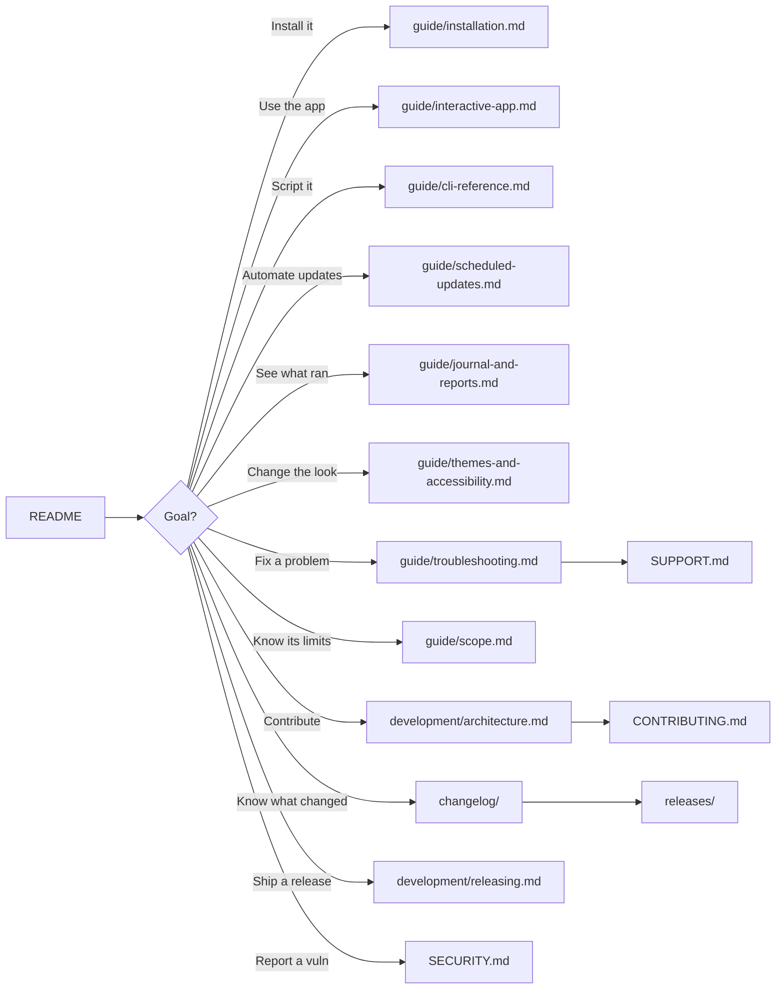

# Documentation

Index of the detailed `gup` documentation. The root [`README.md`](../README.md)
stays light; everything dense lives here.

## Layout

| Folder | Content |
|---|---|
| [`guide/`](guide/) | User-facing: install, the interactive app, every command, schedules, the journal and reports, settings and themes, troubleshooting, scope, the provider catalog. |
| [`development/`](development/) | Contributor-facing: architecture, end-to-end internals, testing, releasing, the website, the documentation conventions; [`design/`](development/design/README.md) holds the design records. |
| [`releases/`](releases/) | Per-version release notes — the source text of each GitHub Release. |
| [`changelog/`](changelog/) | Commit-level history of every version, from the first commit to `main`. |
| [`assets/`](assets/) | Images: the terminal demo, and [`screens/`](assets/screens/README.md), the screenshots generated from the real app. |
| `archived/` | Local working documents — audit reports, snapshots. **Gitignored**, only its [`README.md`](archived/README.md) is tracked. |

## For users

| Document | Content |
|---|---|
| [`guide/installation.md`](guide/installation.md) | Install methods (npm, from source), npm 11 and install scripts, requirements, per-platform support, updating and removing `gup`. |
| [`guide/interactive-app.md`](guide/interactive-app.md) | The full-screen app, view by view: Scan, Paquets and its multi-select, updating inside the app (run view, typing into an installer, administrator rights, retries, results), Planification, Providers, Journal, Options; every key — **screenshots, mermaid diagrams**. |
| [`guide/cli-reference.md`](guide/cli-reference.md) | Every command and flag (`list`, `update`, `doctor`, `log`, `report`, `schedule`), targeting syntax, stuck-install timeouts, retry strategies, elevation, JSON output, environment variables, exit codes. |
| [`guide/scheduled-updates.md`](guide/scheduled-updates.md) | Per-package scheduled updates: how a run works, recurrences, what an unattended run never does, the commands, the Planification view, the OS trigger, troubleshooting — **screenshots, mermaid diagram**. |
| [`guide/journal-and-reports.md`](guide/journal-and-reports.md) | The activity history, the Journal view, the HTML report, `gup report`, the debug log and `gup log`, privacy — **screenshots, mermaid diagram**. |
| [`guide/configuration.md`](guide/configuration.md) | The Options view, which value wins, the settings file and its sections, environment variables — **mermaid diagram**. |
| [`guide/themes-and-accessibility.md`](guide/themes-and-accessibility.md) | The ten themes, the theme picker, custom colours, how the default theme follows the terminal, the contrast guarantee, accessibility — **screenshots**. |
| [`guide/troubleshooting.md`](guide/troubleshooting.md) | Each message, its cause and the fix: install scripts, Node, conhost, the embedded terminal, providers, schedules, the report; where gup keeps its files; collecting a diagnostic. |
| [`guide/scope.md`](guide/scope.md) | Why `gup` exists, what belongs in it, and what is deliberately excluded — with the reasoning. |
| [`guide/providers-catalog.md`](guide/providers-catalog.md) | Exhaustive catalog of the 153 providers, implementation status (✅ ⬜ ➡️ ❌), the OSes each runs on, and evaluated candidates. |
| [`assets/screens/`](assets/screens/README.md) | The screenshot gallery: every view of the app, eight themes, the HTML report. |

## For contributors

| Document | Content |
|---|---|
| [`development/architecture.md`](development/architecture.md) | Layers, data model, the platform gate, scan, the update pipeline, the interactive app, the runner and its process seams, local state, scheduling, settings and contrast, composition — **mermaid diagrams**. |
| [`development/how-gup-works.md`](development/how-gup-works.md) | End-to-end technical walkthrough: motivation, model, every command's lifecycle, the provider contract in detail, resilience patterns, build. |
| [`development/testing.md`](development/testing.md) | Test strategy: the pyramid, what each layer fakes, how to run it in each shell, where a new test goes, the end-to-end suites, CI and coverage — **mermaid diagrams**. |
| [`development/testing-windows-checklist.md`](development/testing-windows-checklist.md), [`development/testing-macos-checklist.md`](development/testing-macos-checklist.md) | The manual test campaigns run before a release: what no automated layer can see on a real Windows or Mac machine. |
| [`development/documentation.md`](development/documentation.md) | Documentation conventions: where a page goes, the README's npm constraints, the Mermaid rules, the screenshot pipeline (commands, adding a scene, fixtures, determinism), link checking — **mermaid diagram**. |
| [`development/design/`](development/design/README.md) | The design records of the 0.5.0 cycle, one per area: the decisions and deviations behind each feature. The reference pages above win over them. |
| [`development/releasing.md`](development/releasing.md) | How a version goes from `main` to npm, the GitHub Release and the landing page: pre-flight, changelog and notes, checks, tag, publish, hotfixes — **mermaid diagram**. |
| [`development/website.md`](development/website.md) | The landing site in `index/`: how a page is built, the eight languages and the translation workflow, the terminal demo, quality gates, deployment — **mermaid diagram**. |
| [`development/roadmap.md`](development/roadmap.md) | Changes already decided but waiting on an external trigger — a date or an upstream release. Each entry carries its trigger, the exact edits, and what must not change. |

## Community

The community health files GitHub surfaces — in the *Community* tab and
beside the README — live in `.github/`. `CHANGELOG.md` and `CITATION.cff` stay
at the root: *Cite this repository* only reads the citation file there.

| Document | Content |
|---|---|
| [`../.github/CONTRIBUTING.md`](../.github/CONTRIBUTING.md) | Ways to contribute, local setup and node-pty, provider-addition workflow, conventions and enforced code limits, branches, commits and the scope map, the pull request flow and its required checks — **mermaid diagrams**. |
| [`../.github/CODE_OF_CONDUCT.md`](../.github/CODE_OF_CONDUCT.md) | The Contributor Covenant 2.1: expected behaviour, the private contact for reports, the enforcement guidelines. |
| [`../.github/SUPPORT.md`](../.github/SUPPORT.md) | Where to ask for help, what to include, what to expect from a single-maintainer project. |
| [`../.github/SECURITY.md`](../.github/SECURITY.md) | Supported versions, private vulnerability reporting and response aims, scope, the threat model (process spawning, the embedded terminal, elevation, schedules, local data, the HTML report), CI/local mitigations. |
| [`../.github/GOVERNANCE.md`](../.github/GOVERNANCE.md) | Maintainer-led model, roles, how decisions are made, dependency and release policies, continuity. |
| [`../CHANGELOG.md`](../CHANGELOG.md) | Pointer to the changelog and the release notes below. |
| [`../CITATION.cff`](../CITATION.cff) | Citation metadata behind GitHub's *Cite this repository* button. |
| [`../.github/ISSUE_TEMPLATE/`](../.github/ISSUE_TEMPLATE/) | Issue forms (bug report, feature request, new provider, question) and the chooser links. |
| [`../.github/PULL_REQUEST_TEMPLATE.md`](../.github/PULL_REQUEST_TEMPLATE.md) | The checklist every pull request starts from. |

## Project history

| Document | Content |
|---|---|
| [`changelog/`](changelog/README.md) | Every change since the first commit, one file per version plus the unreleased work on `main`, grouped by kind (Added / Changed / Fixed / Security / Dependencies / …) with commit and PR links. |
| [`releases/`](releases/README.md) | Per-version release notes — what shipped, what broke, how it was verified. Narrative, written before tagging; the GitHub Release body is this text plus GitHub's auto-generated "What's Changed". |

The two are complementary: the changelog is exhaustive and mechanical, the
release notes explain *why* a version matters. To find out whether a given
commit shipped, use the changelog; to decide whether to upgrade, read the notes.

## Diagrams

Mermaid diagrams render natively on GitHub. Locally: VS Code with the
*Markdown Preview Mermaid Support* extension, or [mermaid.live](https://mermaid.live)
to export one (copy-paste the block). The rules for writing one are in
[`development/documentation.md` § Mermaid diagrams](development/documentation.md#mermaid-diagrams).

| Question | Diagram |
|---|---|
| Which document do I read? | [Below](#suggested-reading-order) |
| What are the layers, and who depends on whom? | [architecture.md § Layers](development/architecture.md#2-layers-and-responsibilities) |
| Why is a provider detected, missing or greyed out? | [architecture.md § Providers](development/architecture.md#4-providers-and-the-platform-gate) |
| What happens during a scan? | [architecture.md § Scan](development/architecture.md#5-scan) |
| How does an update run — embedded terminal, UAC, `sudo` batch, retries? | [architecture.md § Update pipeline](development/architecture.md#6-update-pipeline); the user's view in [interactive-app.md § Updating](guide/interactive-app.md#updating) |
| How do I move through the app, and what can the run view do when? | [architecture.md § Interactive app](development/architecture.md#7-interactive-app) |
| Where do installs run — terminal, pseudo-terminal, pipe? | [architecture.md § Runner](development/architecture.md#8-runner-and-process-seams) |
| Where do the history and the debug log come from and go? | [architecture.md § Local state](development/architecture.md#9-local-state-history-debug-log-reports); [journal-and-reports.md](guide/journal-and-reports.md) |
| What happens when a scheduled update fires? | [architecture.md § Scheduling](development/architecture.md#10-scheduling); [scheduled-updates.md § How it runs](guide/scheduled-updates.md#how-it-runs) |
| Which value wins: flag, variable or settings file? | [configuration.md § Which value wins](guide/configuration.md#which-value-wins) |
| How does a contribution reach `main`? | [CONTRIBUTING.md § Pull request flow](../.github/CONTRIBUTING.md#9-pull-request-flow) |
| How is a version released? | [releasing.md](development/releasing.md#release-flow) |
| Which tests prove what? | [testing.md § The test pyramid](development/testing.md#2-the-test-pyramid) |
| How is the landing site built? | [website.md § How a page is built](development/website.md#how-a-page-is-built) |
| How is a screenshot produced? | [documentation.md § Screenshots](development/documentation.md#screenshots) |

## Suggested reading order

Which document to open first, depending on what you came for:

```mermaid
flowchart LR
    A[README] --> B{Goal?}
    B -->|Install it| I[guide/installation.md]
    B -->|Use the app| T[guide/interactive-app.md]
    B -->|Script it| C[guide/cli-reference.md]
    B -->|Automate updates| S[guide/scheduled-updates.md]
    B -->|See what ran| J[guide/journal-and-reports.md]
    B -->|Change the look| TH[guide/themes-and-accessibility.md]
    B -->|Fix a problem| TR[guide/troubleshooting.md] --> SUP[SUPPORT.md]
    B -->|Know its limits| SC[guide/scope.md]
    B -->|Contribute| D[development/architecture.md] --> F[CONTRIBUTING.md]
    B -->|Know what changed| L[changelog/] --> N[releases/]
    B -->|Ship a release| R[development/releasing.md]
    B -->|Report a vuln| H[SECURITY.md]
```
