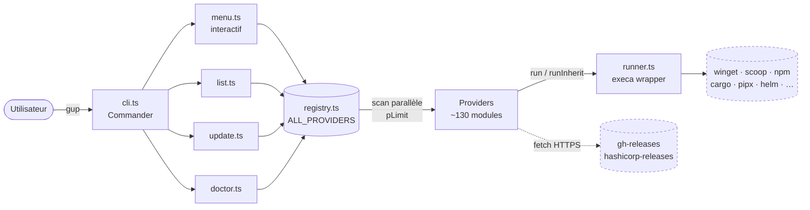
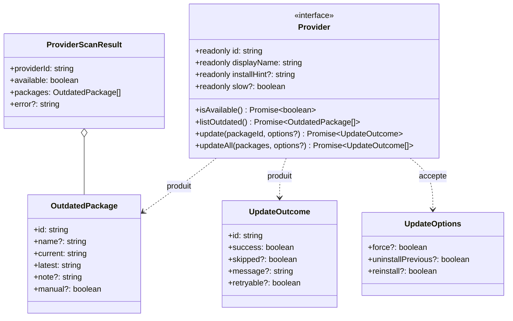
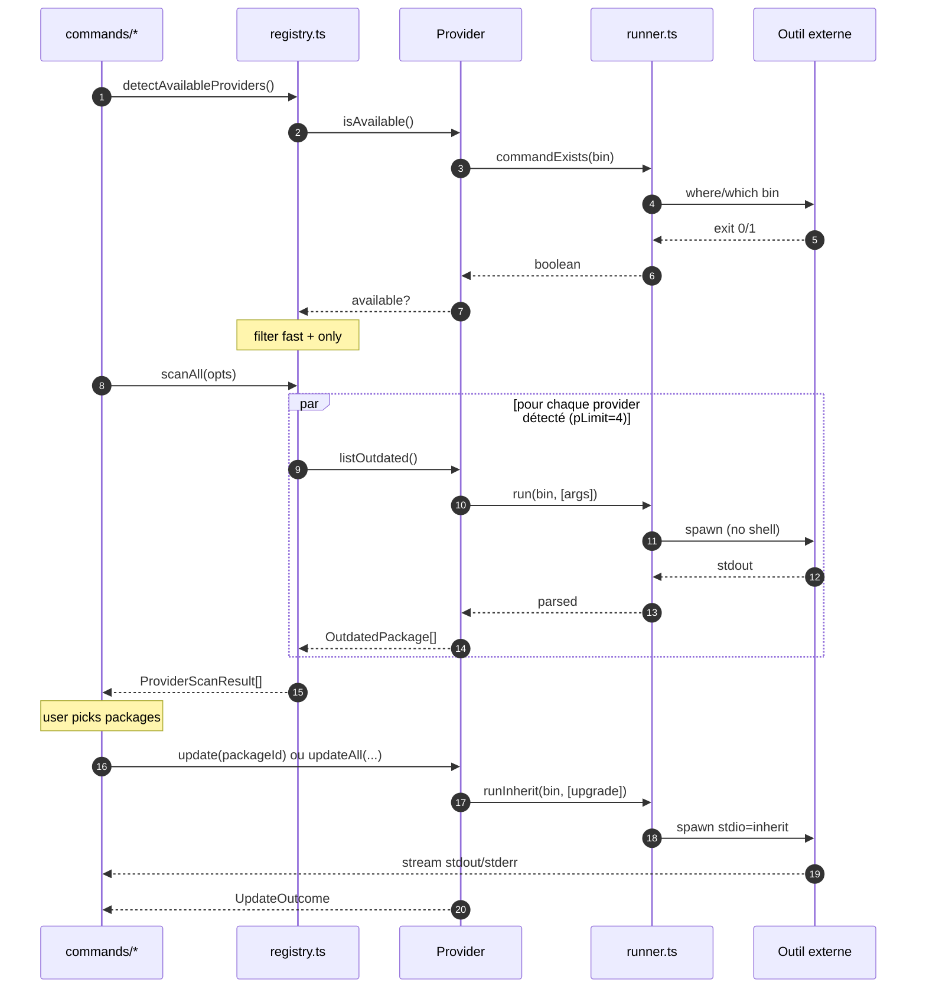
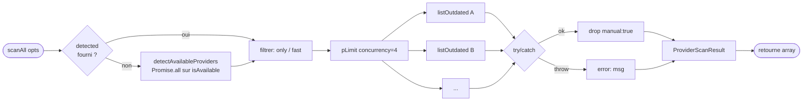
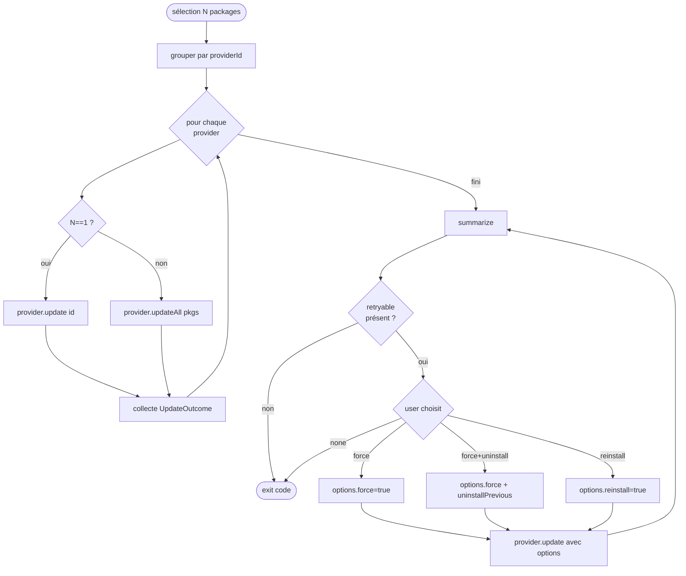
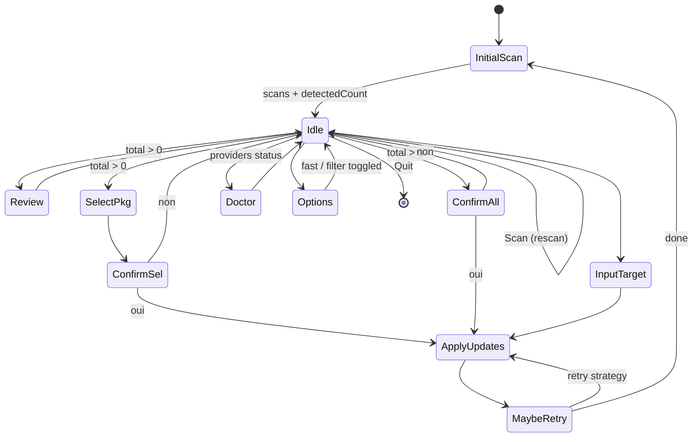
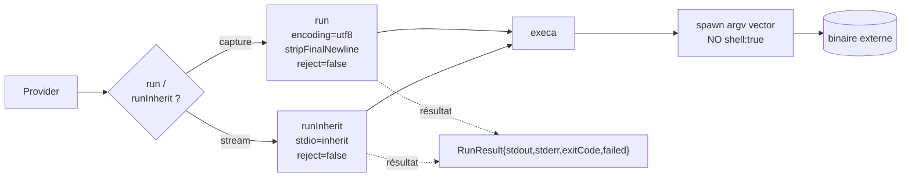
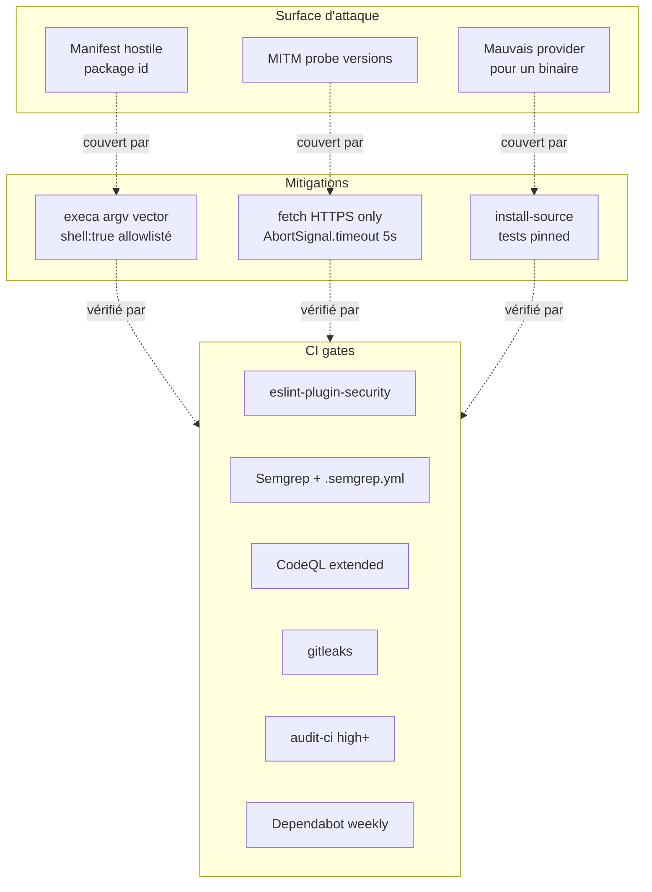

# Architecture

Vue technique de `gup`. Cible : contributeurs, mainteneurs, revue de sécurité.

> Pour la liste complète des providers et leur statut d'implémentation : [`providers-catalog.md`](providers-catalog.md).
> Pour ajouter un provider : [`../CONTRIBUTING.md`](../CONTRIBUTING.md).

---

## Sommaire

- [1. Vue d'ensemble](#1-vue-densemble)
- [2. Couches & responsabilités](#2-couches--responsabilités)
- [3. Modèle de données](#3-modèle-de-données)
- [4. Cycle de vie d'un provider](#4-cycle-de-vie-dun-provider)
- [5. Scan parallèle](#5-scan-parallèle)
- [6. Pipeline d'update + retry](#6-pipeline-dupdate--retry)
- [7. Mode interactif (menu)](#7-mode-interactif-menu)
- [8. Runner & isolation des effets de bord](#8-runner--isolation-des-effets-de-bord)
- [9. Helpers transverses](#9-helpers-transverses)
- [10. Sécurité](#10-sécurité)
- [11. Arborescence](#11-arborescence)

---

## 1. Vue d'ensemble

`gup` est un orchestrateur stateless : il découvre les gestionnaires de paquets installés sur la machine, leur demande **ce qui est obsolète**, puis leur délègue **les mises à jour**. Aucune base de données, aucun cache persistant.



**Principes :**

- **Un fichier = un provider.** Pas de couplage horizontal entre providers.
- **Aucun `throw` dans `listOutdated` / `update`.** Un provider qui casse ne casse pas les autres.
- **Pas de `child_process` direct.** Tout passe par `core/runner.ts` (encoding Windows, no-shell).
- **Pas de cache.** Chaque invocation rescanne — comportement déterministe, pas de drift.

---

## 2. Couches & responsabilités


| Couche | Rôle | Règle |
|---|---|---|
| `cli.ts` | Parsing argv + dispatch | Pas de logique métier. |
| `commands/` | Orchestration d'un cas d'usage (list / update / doctor / menu) | Compose registry + UI. |
| `core/` | Domaine + primitives (runner, types, registry, helpers) | Aucune dépendance vers `ui/` ou `providers/`. |
| `ui/` | Rendu terminal (tables, prompts, spinners) | Aucune logique métier — uniquement de la présentation. |
| `providers/` | Adaptateurs vers un gestionnaire de paquets externe | Implémente `Provider`. Pas d'import croisé. |

---

## 3. Modèle de données

Trois interfaces drivent l'ensemble du système.



**Sémantique fine :**

- `manual: true` → l'item est filtré par `scanAll` avant d'arriver à l'UI (jamais affiché, jamais inclus dans `update --all`). Sert aux items qui exigent une action GUI (JetBrains Toolbox, Eclipse Marketplace…).
- `slow: true` sur le provider → exclu en `--fast`. Réservé aux scans qui font du HTTP par paquet ou du walk filesystem.
- `skipped: true` dans l'outcome → différent de `success: false`. Surfacé en **jaune `SKIP`** vs **rouge `FAIL`**.
- `retryable: true` → autorise la boucle de retry à proposer `--force` / `--uninstall-previous` / `reinstall` (typique winget hash mismatch).

---

## 4. Cycle de vie d'un provider



**Garanties :**

- `isAvailable` ne fait **jamais d'I/O réseau** — uniquement `where/which` ou check de fichier.
- `listOutdated` peut faire du HTTP (release latest) mais doit borner via `AbortSignal.timeout(5_000)`.
- `update` utilise `runInherit` pour que l'utilisateur voie le progress bar du gestionnaire en temps réel.

---

## 5. Scan parallèle

`registry.ts:scanAll` est le seul endroit où la concurrence est gérée.



**Points clés :**

- `pLimit=4` par défaut → évite de saturer la machine quand winget + scoop + choco + cargo + pipx scannent en même temps.
- Chaque erreur est isolée dans un `try/catch` au sein du callback `pLimit` → **aucune erreur ne propage**. Le résultat porte `error: string` au lieu d'exception.
- `manual: true` est filtré dans `scanAll` (registry.ts:426) → les couches au-dessus ne voient jamais ces items.
- Hooks UI : `onProviderStart` / `onProviderEnd` permettent à `ui/scan-progress.ts` d'afficher un compteur live sans coupler le scan au rendu.

---

## 6. Pipeline d'update + retry

Le flow d'update partage la même structure entre `update` CLI et `runSelect`/`runAll` du menu.



**Stratégies de retry** (ui/retry-failed.ts) — ordre du moins au plus destructif :

| Stratégie | Flags | Usage typique |
|---|---|---|
| `--force` | `force=true` | winget hash mismatch (manifest locale-specific). |
| `--force --uninstall-previous` | `force=true`, `uninstallPrevious=true` | Techno d'installer changée. **Destructif** : config hors `%APPDATA%` perdue. |
| `uninstall + install` | `force=true`, `reinstall=true` | Dernier recours : `--uninstall-previous` ne se déclenche pas (version installée "Unknown"). |

Le user doit explicitement choisir : aucune escalade automatique → la destruction de config n'arrive jamais sans consentement.

---

## 7. Mode interactif (menu)

Le menu est une state-machine au-dessus du même registry.



L'état (`MenuState`) tient quatre choses : `scans`, `fast`, `filter`, `detectedCount`. Pas d'autre persistance. Re-scanner = recharger l'état.

---

## 8. Runner & isolation des effets de bord

`core/runner.ts` est le **seul** point où `gup` spawn un sous-processus. Tous les providers passent par lui.



**Invariants vérifiés par tests sécu** :

- `shell: true` interdit hors d'une **allowlist** (Scoop PowerShell shim) — `tests/security/shell-usage.test.ts`.
- `fetch()` doit cibler `https://` uniquement — `tests/security/http-targets.test.ts`.
- `inferSourceFromPath` pinned — `tests/security/install-source.test.ts`.
- Aucun `child_process` importé hors `runner.ts`.

**Helpers utilitaires** :

- `commandExists(cmd)` → wrapper `where`/`which`.
- `whichFirst(cmd)` → chemin absolu de la 1ʳᵉ résolution PATH (utile pour `inferSourceFromPath`).
- `isElevated()` → sonde admin Windows via `net session` (utilisé par choco).

---

## 9. Helpers transverses

Modules dans `core/` partagés entre providers — toujours sans état.

| Helper | Rôle |
|---|---|
| `gh-releases.ts` | Latest tag GitHub Releases (helm-plugins, lazygit, jj, …). Fetch + parse + cache de la requête en cours uniquement. |
| `hashicorp-releases.ts` | Index HashiCorp (`releases.hashicorp.com`) pour terraform/vault/consul/nomad/packer/boundary. |
| `wsl.ts` | Bridge `wsl -d <distro> -- <cmd>` mutualisé pour tous les providers `wsl-*`. |
| `install-source.ts` | Décide quel PM possède un binaire (`%LocalAppData%\Microsoft\WinGet` → winget, `~\scoop\shims` → scoop, …). Critique sécurité → pinned. |
| `corepack-ownership.ts` | Détecte si pnpm/yarn sont managés par corepack pour router l'update au bon endroit. |
| `nvim-paths.ts` | Résout les chemins de config Neovim cross-platform (lazy/packer/mason). |

---

## 10. Sécurité

Schéma synthétique — détails opérationnels dans [`../SECURITY.md`](../SECURITY.md).



---

## 11. Arborescence

```
src/
├── cli.ts                          # commander entry
├── commands/
│   ├── list.ts                     # gup list
│   ├── update.ts                   # gup update
│   ├── doctor.ts                   # gup doctor
│   └── menu.ts                     # gup (interactif)
├── core/
│   ├── types.ts                    # Provider, OutdatedPackage, UpdateOutcome, UpdateOptions
│   ├── runner.ts                   # execa wrapper Windows-safe
│   ├── registry.ts                 # ALL_PROVIDERS, scanAll (pLimit)
│   ├── gh-releases.ts              # GitHub releases helper
│   ├── hashicorp-releases.ts       # HashiCorp releases helper
│   ├── wsl.ts                      # WSL bridge
│   ├── install-source.ts           # PM ownership detection (security-critical)
│   ├── corepack-ownership.ts       # corepack vs standalone routing
│   └── nvim-paths.ts               # Neovim config paths
├── providers/                      # 1 fichier = 1 source
│   ├── _template.ts                # à copier pour démarrer
│   ├── os/                         # winget, scoop, choco
│   ├── wsl/                        # wsl, wsl-apt, wsl-dnf, …
│   ├── node/                       # npm-g, pnpm-g, yarn-g, bun-g, deno, corepack, fnm, volta, nvm-windows
│   ├── python/                     # pip, pipx, uv-tools, poetry, pdm, rye, pyenv-win, conda
│   ├── rust/                       # rustup, cargo
│   ├── dotnet-php/                 # dotnet-tools, composer-*, symfony-cli, phive
│   ├── jvm/                        # jbang, coursier-cs
│   ├── lang-other/                 # gem, opam, hex, mix, luarocks, cabal, stack, nimble, julia, r, flutter, pub-global
│   ├── toolchain/                  # mise, asdf, proto, sdkman, goenv
│   ├── cloud/                      # az, gcloud, aws, oci, scw, hcloud, linode, doctl, supabase, heroku, railway, flyctl
│   ├── iac/                        # terraform, opentofu, terragrunt, vault, consul, nomad, packer, boundary, tflint, pulumi
│   ├── kubernetes/                 # helm*, kubectl, krew, kustomize, flux, argocd, k3d, kind, minikube, skaffold, tilt
│   ├── containers/                 # nerdctl, oras, dive, docker-*, podman-desktop, rancher-desktop
│   ├── security/                   # trivy, grype, syft, cosign, rekor, gitsign, nuclei, pdtm, semgrep
│   ├── dev-cli/                    # lazygit, lazydocker, jj, delta, glab, tea, gh-extensions
│   ├── ide/                        # vscode-ext, cursor-ext, windsurf-ext, vscodium-ext, jetbrains (+ manuels non-câblés)
│   ├── editor-plugins/             # nvim-lazy, nvim-packer, nvim-mason, vim-plug
│   ├── embedded-mobile/            # arduino-cli, platformio, android-sdk, expo, fastlane
│   ├── shell/                      # oh-my-posh, starship, nerd-fonts, pwsh-modules
│   └── self.ts                     # auto-MAJ des PM eux-mêmes
└── ui/
    ├── table.ts                    # cli-table3 + chalk rendering
    ├── select.ts                   # checkbox multi-package
    ├── scan-progress.ts            # spinner + live counter (ora)
    └── retry-failed.ts             # retry strategy prompt
```

---

## Décisions notables

- **Pas de cache disque.** Le coût d'un scan est dominé par les outils externes (winget peut prendre 10s). Cacher introduirait du drift sans gain proportionnel. `--fast` suffit pour les workflows itératifs.
- **Pas de plugin system.** Ajouter un provider = écrire un fichier + une ligne dans `registry.ts`. Plus simple qu'un mécanisme de discovery dynamique, et garde la surface de sécurité bornée.
- **CLI français pour les messages utilisateur, anglais pour le code.** Le projet a un user FR-first, mais la base de code reste accessible internationalement.
- **`updateAll` peut être un bulk ou une boucle.** Le contrat n'impose pas l'efficience : si l'outil propose un `upgrade --all` natif, le provider l'utilise ; sinon il itère sur `update(id)`. Le caller ne voit pas la différence.
