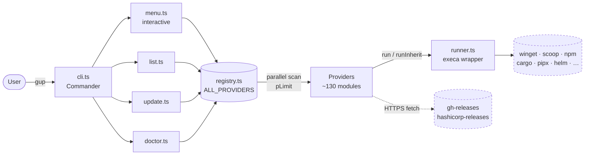
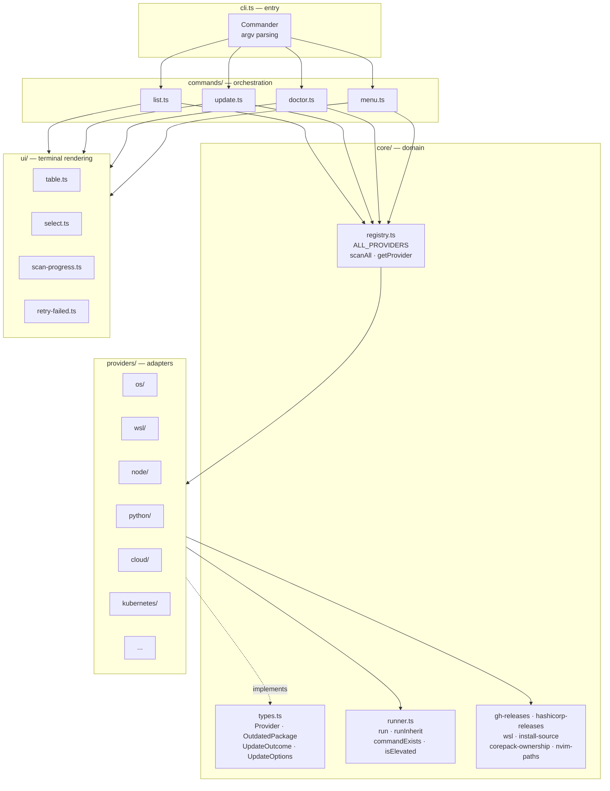
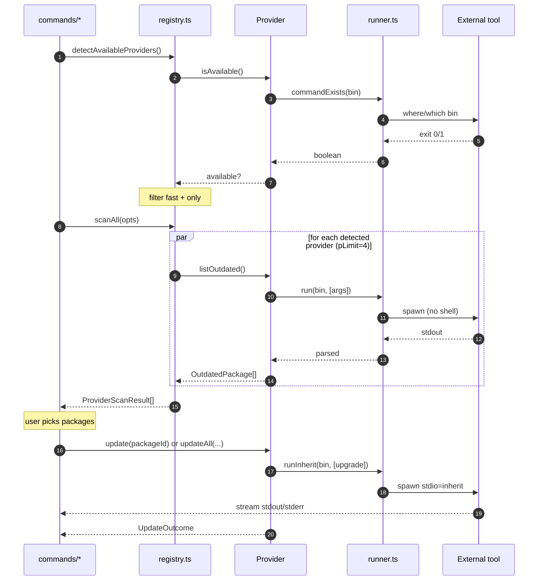
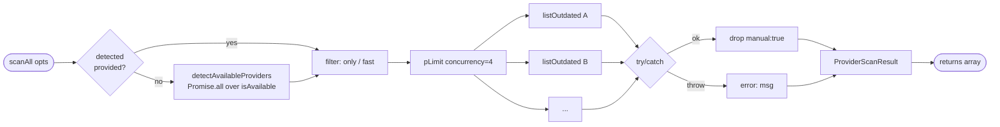
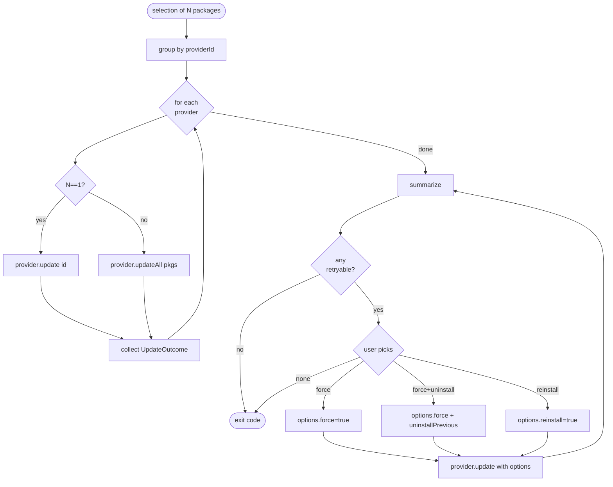
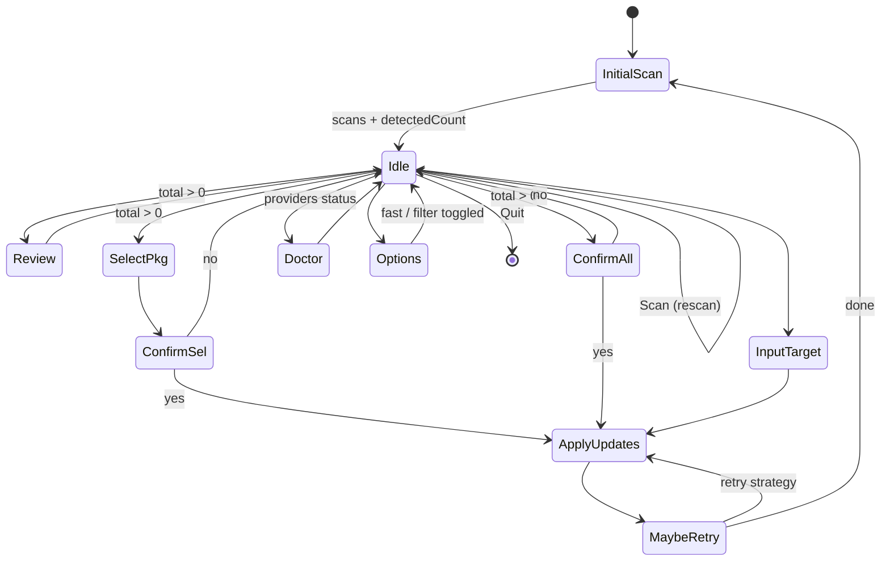
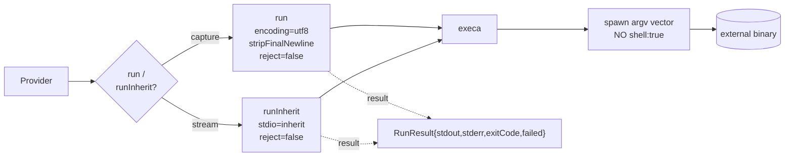
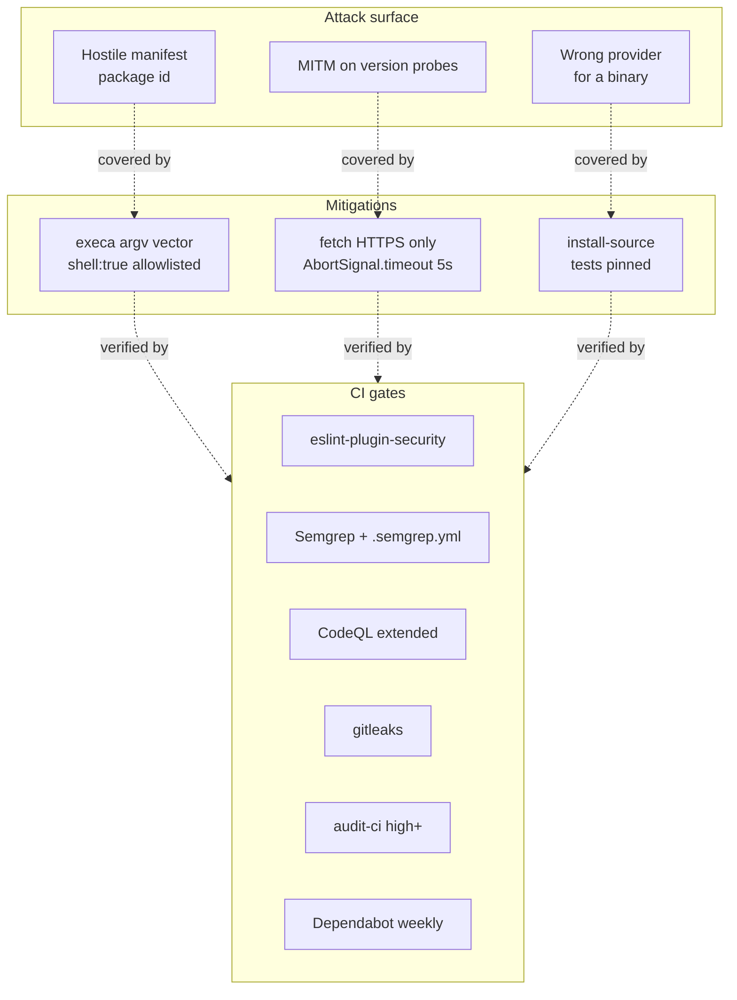

# Architecture

Technical view of `gup`. Audience: contributors, maintainers, security review.

> For the full provider list and implementation status: [`providers-catalog.md`](providers-catalog.md).
> To add a provider: [`../CONTRIBUTING.md`](../CONTRIBUTING.md).

---

## Table of contents

- [1. Overview](#1-overview)
- [2. Layers & responsibilities](#2-layers--responsibilities)
- [3. Data model](#3-data-model)
- [4. Provider lifecycle](#4-provider-lifecycle)
- [5. Parallel scan](#5-parallel-scan)
- [6. Update pipeline + retry](#6-update-pipeline--retry)
- [7. Interactive mode (menu)](#7-interactive-mode-menu)
- [8. Runner & side-effect isolation](#8-runner--side-effect-isolation)
- [9. Cross-cutting helpers](#9-cross-cutting-helpers)
- [10. Security](#10-security)
- [11. Tree layout](#11-tree-layout)

---

## 1. Overview

`gup` is a stateless orchestrator: it discovers the package managers installed on the machine, asks them **what is outdated**, then delegates **the updates** to them. No database, no persistent cache.



**Principles:**

- **One file = one provider.** No horizontal coupling between providers.
- **No `throw` inside `listOutdated` / `update`.** A broken provider does not break the others.
- **No direct `child_process`.** Everything goes through `core/runner.ts` (Windows encoding, no-shell).
- **No cache.** Every invocation rescans — deterministic behavior, no drift.

---

## 2. Layers & responsibilities



| Layer | Role | Rule |
|---|---|---|
| `cli.ts` | argv parsing + dispatch | No business logic. |
| `commands/` | Orchestration of one use case (list / update / doctor / menu) | Composes registry + UI. |
| `core/` | Domain + primitives (runner, types, registry, helpers) | No dependency on `ui/` or `providers/`. |
| `ui/` | Terminal rendering (tables, prompts, spinners) | No business logic — presentation only. |
| `providers/` | Adapters to an external package manager | Implements `Provider`. No cross-import. |

---

## 3. Data model

Three interfaces drive the entire system.


**Fine-grained semantics:**

- `manual: true` → the item is filtered by `scanAll` before reaching the UI (never displayed, never included in `update --all`). Used for items that require a GUI action (JetBrains Toolbox, Eclipse Marketplace…).
- `slow: true` on a provider → excluded under `--fast`. Reserved for scans that do HTTP per package or a filesystem walk.
- `skipped: true` on an outcome → different from `success: false`. Surfaced as **yellow `SKIP`** vs **red `FAIL`**.
- `retryable: true` → allows the retry loop to offer `--force` / `--uninstall-previous` / `reinstall` (typical winget hash mismatch).

---

## 4. Provider lifecycle



**Guarantees:**

- `isAvailable` never does **network I/O** — only `where/which` or a file check.
- `listOutdated` may do HTTP (latest release) but must bound it with `AbortSignal.timeout(5_000)`.
- `update` uses `runInherit` so the user sees the manager's progress bar in real time.

---

## 5. Parallel scan

`registry.ts:scanAll` is the only place where concurrency is managed.



**Key points:**

- `pLimit=4` by default → avoids saturating the machine when winget + scoop + choco + cargo + pipx scan at the same time.
- Each error is isolated in a `try/catch` inside the `pLimit` callback → **no error propagates**. The result carries `error: string` instead of throwing.
- `manual: true` is filtered inside `scanAll` (registry.ts:426) → layers above never see these items.
- UI hooks: `onProviderStart` / `onProviderEnd` let `ui/scan-progress.ts` display a live counter without coupling scan to rendering.

---

## 6. Update pipeline + retry

The update flow shares the same structure between the `update` CLI and the menu's `runSelect`/`runAll`.



**Retry strategies** (ui/retry-failed.ts) — ordered from least to most destructive:

| Strategy | Flags | Typical use |
|---|---|---|
| `--force` | `force=true` | winget hash mismatch (locale-specific manifest). |
| `--force --uninstall-previous` | `force=true`, `uninstallPrevious=true` | Installer technology changed. **Destructive**: app config outside `%APPDATA%` is lost. |
| `uninstall + install` | `force=true`, `reinstall=true` | Last resort: `--uninstall-previous` does not trigger (installed version "Unknown"). |

The user must explicitly choose: no automatic escalation → config destruction never happens without consent.

---

## 7. Interactive mode (menu)

The menu is a state machine on top of the same registry.



The state (`MenuState`) holds four things: `scans`, `fast`, `filter`, `detectedCount`. No other persistence. Rescanning = reloading state.

---

## 8. Runner & side-effect isolation

`core/runner.ts` is the **only** place where `gup` spawns a subprocess. All providers go through it.



**Invariants pinned by security tests**:

- `shell: true` forbidden outside an **allowlist** (Scoop PowerShell shim) — `tests/security/shell-usage.test.ts`.
- `fetch()` must target `https://` only — `tests/security/http-targets.test.ts`.
- `inferSourceFromPath` pinned — `tests/security/install-source.test.ts`.
- No `child_process` imported outside `runner.ts`.

**Utility helpers**:

- `commandExists(cmd)` → `where`/`which` wrapper.
- `whichFirst(cmd)` → absolute path of the 1st PATH resolution (useful for `inferSourceFromPath`).
- `isElevated()` → Windows admin probe via `net session` (used by choco).

---

## 9. Cross-cutting helpers

Modules in `core/` shared between providers — always stateless.

| Helper | Role |
|---|---|
| `gh-releases.ts` | Latest GitHub Releases tag (helm-plugins, lazygit, jj, …). Fetch + parse + caching of the in-flight request only. |
| `hashicorp-releases.ts` | HashiCorp index (`releases.hashicorp.com`) for terraform/vault/consul/nomad/packer/boundary. |
| `wsl.ts` | Shared `wsl -d <distro> -- <cmd>` bridge for every `wsl-*` provider. |
| `install-source.ts` | Decides which PM owns a binary (`%LocalAppData%\Microsoft\WinGet` → winget, `~\scoop\shims` → scoop, …). Security-critical → pinned. |
| `corepack-ownership.ts` | Detects whether pnpm/yarn are managed by corepack so the update is routed to the right place. |
| `nvim-paths.ts` | Resolves cross-platform Neovim config paths (lazy/packer/mason). |

---

## 10. Security

Summary diagram — operational details in [`../SECURITY.md`](../SECURITY.md).



---

## 11. Tree layout

```
src/
├── cli.ts                          # commander entry
├── commands/
│   ├── list.ts                     # gup list
│   ├── update.ts                   # gup update
│   ├── doctor.ts                   # gup doctor
│   └── menu.ts                     # gup (interactive)
├── core/
│   ├── types.ts                    # Provider, OutdatedPackage, UpdateOutcome, UpdateOptions
│   ├── runner.ts                   # Windows-safe execa wrapper
│   ├── registry.ts                 # ALL_PROVIDERS, scanAll (pLimit)
│   ├── gh-releases.ts              # GitHub releases helper
│   ├── hashicorp-releases.ts       # HashiCorp releases helper
│   ├── wsl.ts                      # WSL bridge
│   ├── install-source.ts           # PM ownership detection (security-critical)
│   ├── corepack-ownership.ts       # corepack vs standalone routing
│   └── nvim-paths.ts               # Neovim config paths
├── providers/                      # 1 file = 1 source
│   ├── _template.ts                # copy this to start
│   ├── os/                         # winget, scoop, choco
│   ├── wsl/                        # wsl, wsl-apt, wsl-dnf, …
│   ├── node/                       # npm-g, pnpm-g, yarn-g, bun-g, deno, corepack, fnm, volta, nvm-windows
│   ├── python/                     # pip, pipx, uv-tools, poetry, pdm, rye, pyenv-win, conda
│   ├── rust/                       # rustup, cargo
│   ├── dotnet-php/                 # dotnet-tools, composer-*, symfony-cli, phive
│   ├── jvm/                        # jbang, coursier-cs
│   ├── lang-other/                 # gem, opam, hex, mix, luarocks, cabal, stack, nimble, julia, r, flutter, pub-global
│   ├── toolchain/                  # mise, asdf, proto, sdkman, goenv
│   ├── cloud/                      # az, gcloud, aws, oci, scw, hcloud, linode, doctl, supabase, heroku, railway, flyctl
│   ├── iac/                        # terraform, opentofu, terragrunt, vault, consul, nomad, packer, boundary, tflint, pulumi
│   ├── kubernetes/                 # helm*, kubectl, krew, kustomize, flux, argocd, k3d, kind, minikube, skaffold, tilt
│   ├── containers/                 # nerdctl, oras, dive, docker-*, podman-desktop, rancher-desktop
│   ├── security/                   # trivy, grype, syft, cosign, rekor, gitsign, nuclei, pdtm, semgrep
│   ├── dev-cli/                    # lazygit, lazydocker, jj, delta, glab, tea, gh-extensions
│   ├── ide/                        # vscode-ext, cursor-ext, windsurf-ext, vscodium-ext, jetbrains (+ unwired manuals)
│   ├── editor-plugins/             # nvim-lazy, nvim-packer, nvim-mason, vim-plug
│   ├── embedded-mobile/            # arduino-cli, platformio, android-sdk, expo, fastlane
│   ├── shell/                      # oh-my-posh, starship, nerd-fonts, pwsh-modules
│   └── self.ts                     # auto-update of the PMs themselves
└── ui/
    ├── table.ts                    # cli-table3 + chalk rendering
    ├── select.ts                   # multi-package checkbox
    ├── scan-progress.ts            # spinner + live counter (ora)
    └── retry-failed.ts             # retry strategy prompt
```

---

## Notable decisions

- **No disk cache.** Scan cost is dominated by external tools (winget can take 10s). Caching would introduce drift without proportional gain. `--fast` is enough for iterative workflows.
- **No plugin system.** Adding a provider = write one file + one line in `registry.ts`. Simpler than a dynamic-discovery mechanism, and it keeps the security surface bounded.
- **French CLI strings for end-user messages, English for code.** The project has a FR-first user, but the codebase stays internationally accessible.
- **`updateAll` can be a bulk or a loop.** The contract does not mandate efficiency: if the tool exposes a native `upgrade --all`, the provider uses it; otherwise it loops over `update(id)`. The caller sees no difference.
