<!-- Generated by `npm run screenshots` from scripts/screenshots. Do not edit by hand. -->

# Screenshots

Every image below is the real interactive app, rendered headless on fixture data with a
frozen clock: no real machine, package or path appears in them. The app runs its default
theme (`terminal`) in a truecolor terminal using GitHub Dark Default, unless a section
says otherwise; its text is French, the language of gup's interface.
`npm run screenshots` regenerates them; `npm run screenshots:check` fails when one is out
of date. See [Documentation conventions](../../development/documentation.md#screenshots)
to add one.

- [Menu](#menu)
- [Updates](#updates)
- [Scheduled updates](#scheduled-updates)
- [Journal](#journal)
- [Options](#options)
- [Themes](#themes)
- [HTML report](#html-report)

## Menu

### scan-progress

**gup — Scan** · 100 × 28

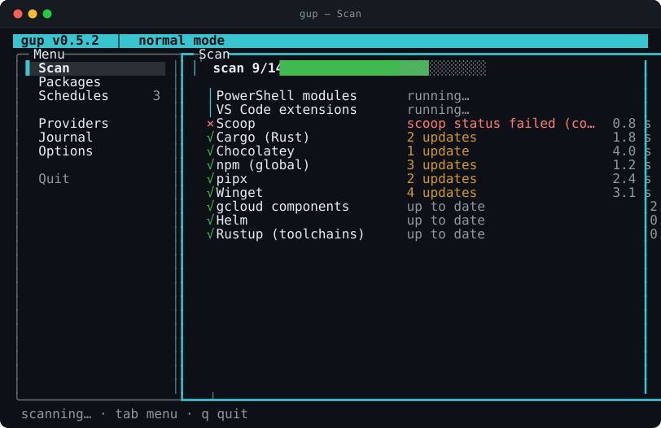

### packages-select

**gup — Paquets** · 100 × 28

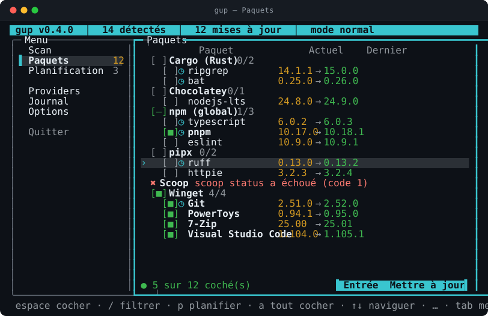

### confirm-update

**gup — Mettre à jour** · 100 × 28

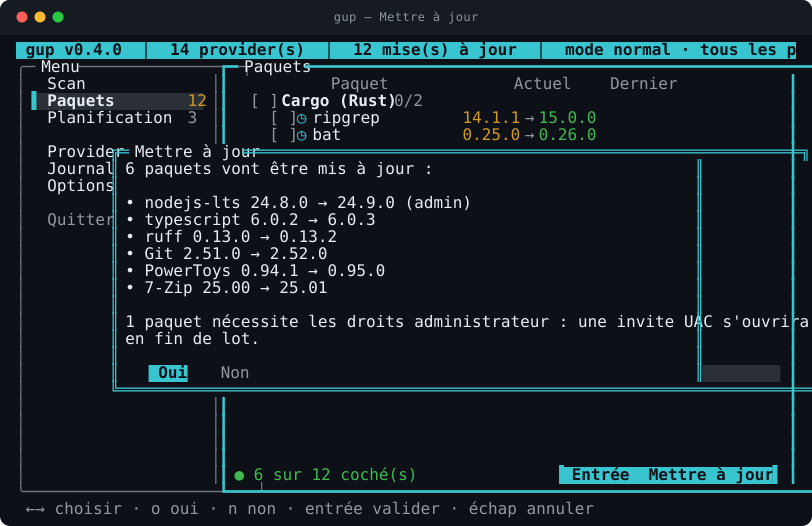

### providers-os

**gup — Providers** · 100 × 28

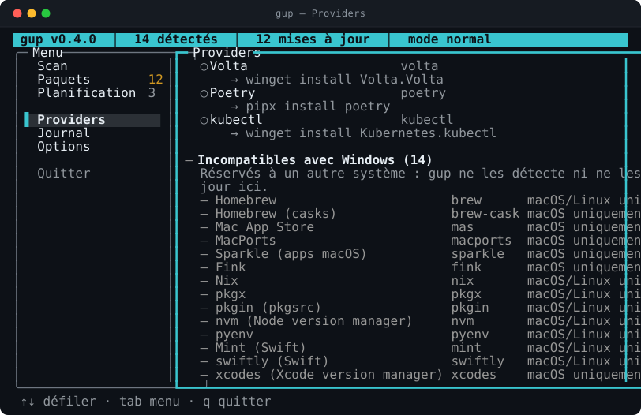

## Updates

### update-running

**gup — Mise à jour** · 120 × 32

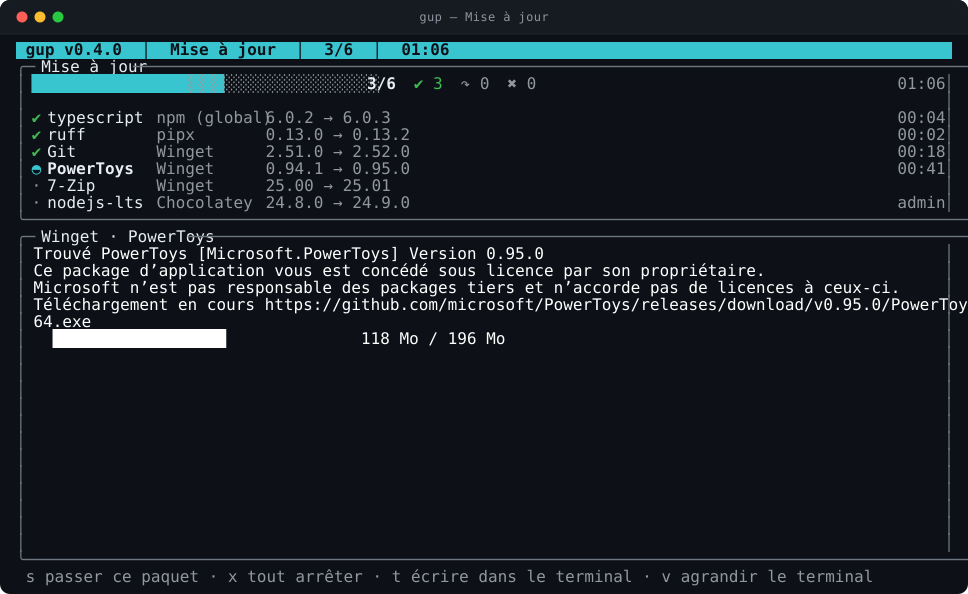

### update-retry

**gup — Mise à jour** · 120 × 32

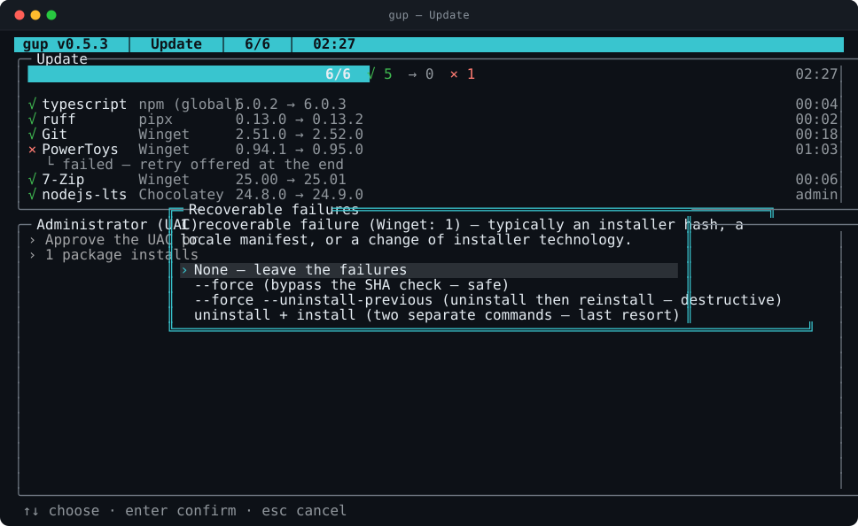

### update-summary

**gup — Mise à jour** · 120 × 32

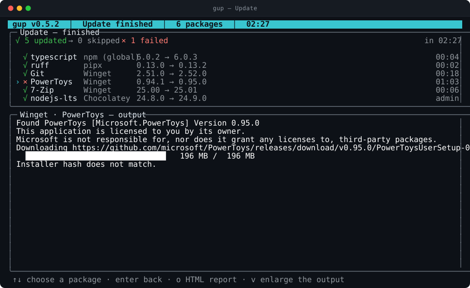

## Scheduled updates

### schedules

**gup — Planification** · 120 × 32

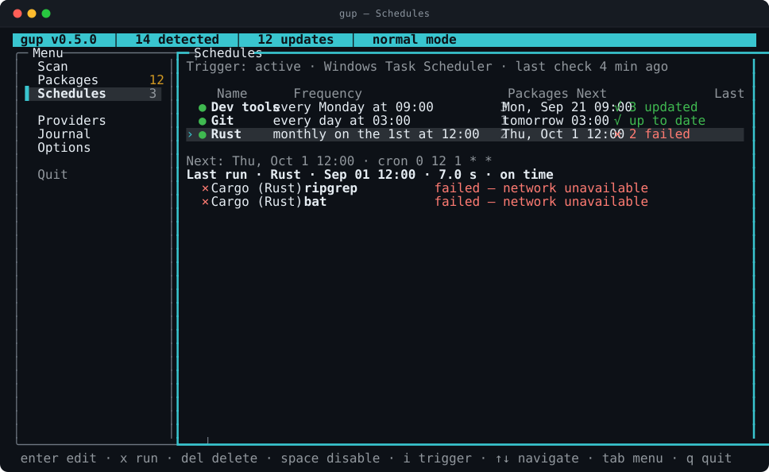

### schedule-edit

**gup — Planification** · 120 × 32

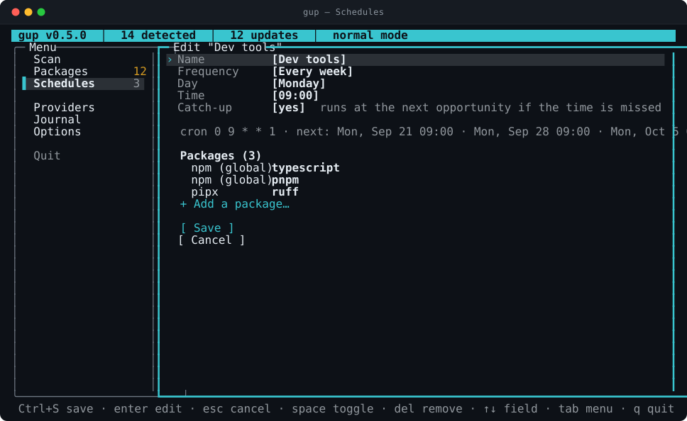

## Journal

### journal-activity

**gup — Journal** · 120 × 32

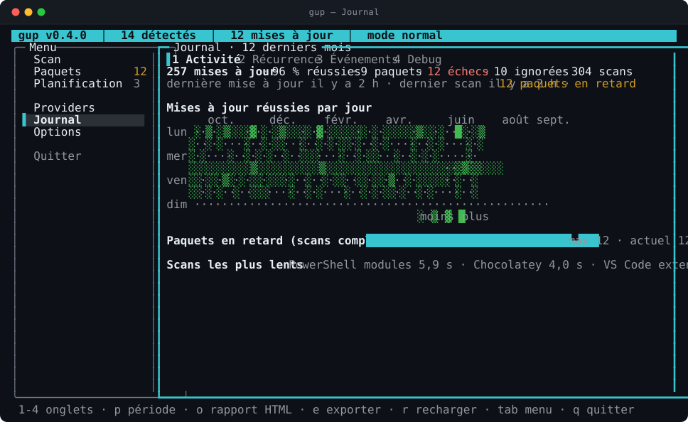

### journal-recurrence

**gup — Journal** · 120 × 32

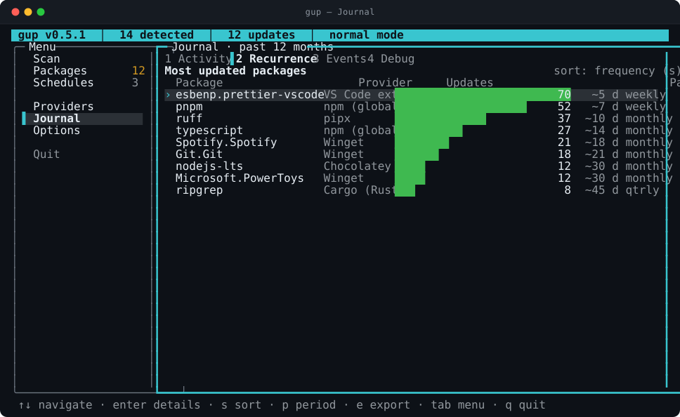

### journal-events

**gup — Journal** · 120 × 32

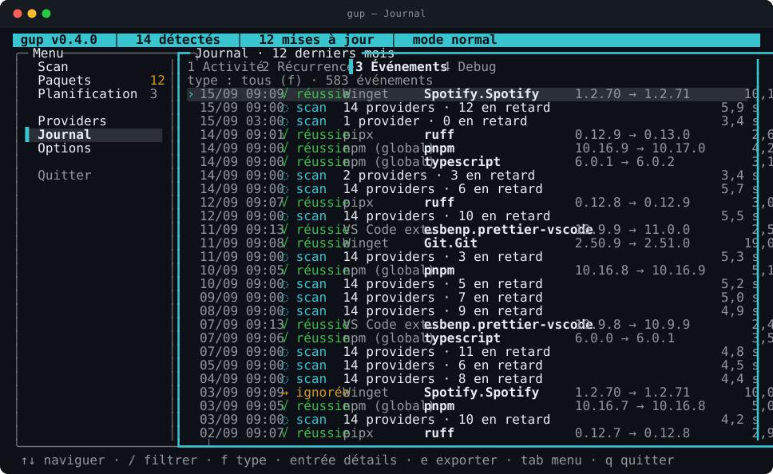

### journal-debug

**gup — Journal** · 120 × 32

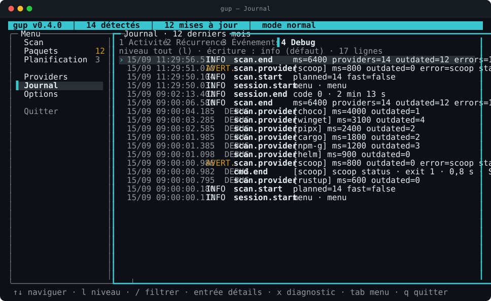

## Options

### options-themes

**gup — Options** · 100 × 28

### options-colors

**gup — Options** · 100 × 28

### options-journal

**gup — Options** · 100 × 28

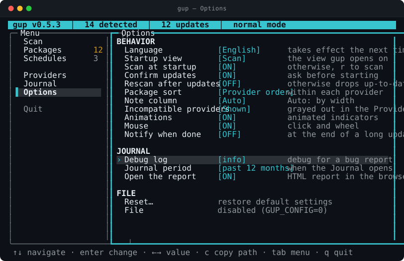

## Themes

### theme-dark

**gup — Paquets · Sombre (gup)** · 100 × 28

### theme-light

**gup — Paquets · Clair (gup)** · 100 × 28

### theme-high-contrast

**gup — Paquets · Contraste élevé** · 100 × 28

### theme-colorblind

**gup — Paquets · Daltonisme (Okabe-Ito)** · 100 × 28

### theme-dracula

**gup — Paquets · Dracula** · 100 × 28

### theme-catppuccin-mocha

**gup — Paquets · Catppuccin Mocha** · 100 × 28

### theme-github-light

**gup — Paquets · GitHub (clair)** · 100 × 28

### theme-monochrome

**gup — Paquets · Monochrome** · 100 × 28

## HTML report

The report `gup report` writes, captured in headless Chromium from the same fixture
history by `npm run screenshots:report`. A browser's rendering differs from one machine
to the next, so this image is regenerated by hand and never checked by CI.

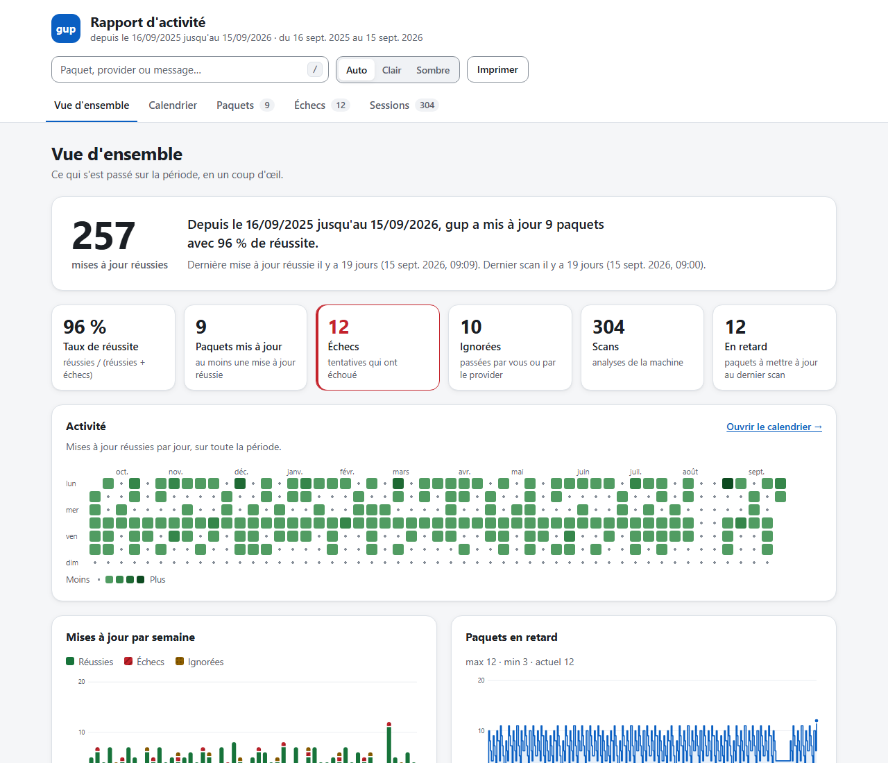
