# Architecture

Technical view of `gup`. Audience: contributors, maintainers, security review.

> The provider list and status: [`providers-catalog.md`](../guide/providers-catalog.md).
> The end-to-end walkthrough, command by command: [`how-gup-works.md`](how-gup-works.md).
> Adding a provider: [`CONTRIBUTING.md`](../../CONTRIBUTING.md). How each layer is tested:
> [`testing.md`](testing.md). Why things are the way they are, area by area: the
> [design records](design/README.md).

---

## Table of contents

- [1. Overview](#1-overview)
- [2. Layers and responsibilities](#2-layers-and-responsibilities)
- [3. Data model](#3-data-model)
- [4. Providers and the platform gate](#4-providers-and-the-platform-gate)
- [5. Scan](#5-scan)
- [6. Update pipeline](#6-update-pipeline)
- [7. Interactive app](#7-interactive-app)
- [8. Runner and process seams](#8-runner-and-process-seams)
- [9. Local state: history, debug log, reports](#9-local-state-history-debug-log-reports)
- [10. Scheduling](#10-scheduling)
- [11. Settings, themes and contrast](#11-settings-themes-and-contrast)
- [12. Composition: CLI modules and slots](#12-composition-cli-modules-and-slots)
- [13. Security](#13-security)
- [14. Tree layout](#14-tree-layout)
- [Notable decisions](#notable-decisions)

---

## 1. Overview

`gup` is an orchestrator: it discovers the package managers installed on the machine, asks them
**what is outdated**, then has them **perform the updates**. It keeps no cache — every scan asks
the tools again — and no shared state. What it writes is its own record of what it did, and what
the user asked of it:

| Written by gup | Read back for | Never used to |
|---|---|---|
| Activity history (scans, update attempts) | the Journal view, `gup report`, the HTML report | decide whether or what to update |
| Debug log | `gup log`, the Journal's Debug tab, `gup log export` | change a run's behaviour |
| Settings (`config.json`) | the menu, the screens' look, the install timeout | steer the elevated child |
| Schedules and their run state | `gup schedule`, the Planification view, the scheduled tick | act on a whole provider |

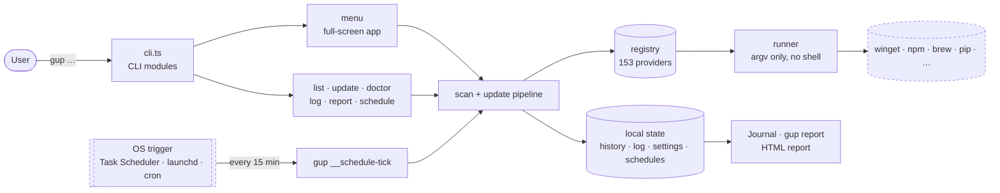

**Principles:**

- **One file = one provider.** No coupling between providers; removing one is deleting a file
  and a registry line.
- **Fail soft.** A provider that throws, hangs or prints garbage costs its own row, never the
  scan or the batch.
- **One spawn chokepoint.** Every process starts in `core/runner.ts` (argv vector, no shell);
  installs reach a terminal, a pseudo-terminal or a pipe through one *install sink* (§8).
- **One update path.** `gup update`, the menu and scheduled runs share the same pipeline (§6).
- **Recorded, never consulted.** History and log are read back only to be shown or exported; a
  test pins the import graph that keeps it so (§9).
- **French interface, English code.** Every user-facing string is French and lives in a labels
  module; identifiers, comments, log events and export fields are English.

---

## 2. Layers and responsibilities

Who depends on whom:

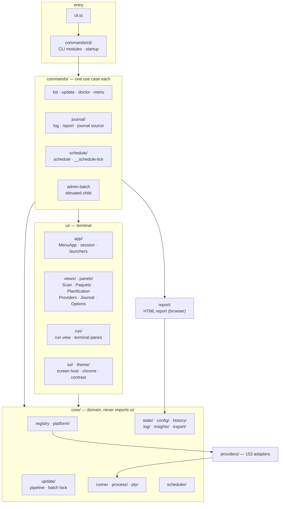

| Layer | Role | Rule |
|---|---|---|
| `cli.ts` | Builds the Commander program from the CLI modules | No logic: commands, global options and startup hooks come from `commands/cli/cli-modules.ts` (§12). |
| `commands/` | One use case per module: `list`, `update`, `doctor`, the menu's controller, `log` and `report` (`journal/`), `schedule` and the tick (`schedule/`), the elevated child (`admin-batch.ts`) | Composes core and UI; owns the composition roots (`menu-views.ts`, `cli-modules.ts`). |
| `ui/app/` | The interactive app: `MenuApp` (a loop of sessions), `MenuSession` (layout, key routing, view registry), the update launchers, menu preferences | Knows views only through `ViewDefinition`; imports nothing from `commands/` but the menu's state type (`menu-state.ts`). |
| `ui/views/`, `ui/panels/` | One view per sidebar entry: a factory (`views/<id>-view.ts`) and plain-object panels that render lines and take keys | Ports as parameters; no process, no file access of their own. |
| `ui/run/` | The run view of an in-app update and its terminal panes | Implements the pipeline's ports; never sees the journal or the scheduler. |
| `ui/tui/`, `ui/theme/` | Screen host (OpenTUI renderer lifecycle, teardown, signals), chrome, dialogs; the theme engine and contrast enforcement | Nothing outside `ui/theme/` builds a colour; panels speak in tones. |
| `ui/` root, `ui/prompts/`, `ui/charts/` | The one-shot commands' console output and screens, the charts shared by the Journal and `gup report --format text` | — |
| `report/` | The self-contained HTML report: markup, stylesheet, browser script | Not terminal code (outside the glyph guard); reads only the report model. |
| `core/` | Domain and primitives: registry, platform gate, runner and process seams, update pipeline, settings store, state directories, history, debug log, insights, exports, scheduler, elevation | Never imports `ui/` or `commands/`. |
| `providers/` | Adapters to one package source each | Implement `Provider`; no cross-import; spawn only through the runner. |

---

## 3. Data model

The provider contract, and what a scan produces:

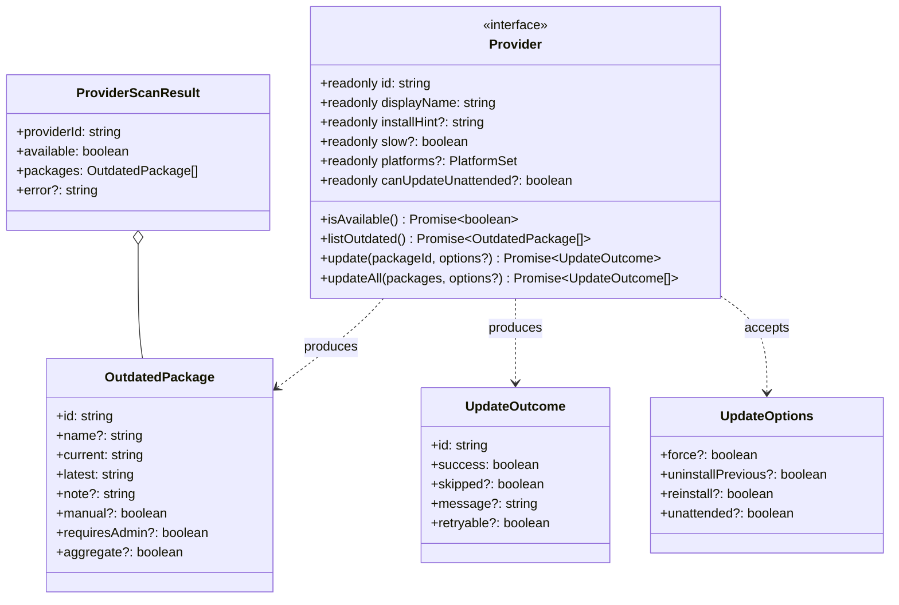

**Fine-grained semantics:**

- `platforms` — the OSes gup supports the provider on (a named `PLATFORMS` set; omitted =
  everywhere). Enforced by the registry alone (§4).
- `canUpdateUnattended: false` — every update needs an administrator (Chocolatey, Cygwin,
  Npackd, MacPorts, Fink, pkgin, Visual Studio): never scheduled.
- `manual: true` — no command can update the row; `scanAll` drops it, so no list or picker
  ever shows it.
- `requiresAdmin: true` — the update needs UAC or `sudo`; the pipeline moves the row to the
  single elevated batch (§6).
- `aggregate: true` — updating the row acts on the whole provider ("all plugins", a refresh
  marker): never a scheduling target.
- `slow: true` — the scan does HTTP per package or a filesystem walk; `--fast` skips it.
- `skipped: true` on an outcome is not a failure: shown `↷`, counted apart, never retried.
- `retryable: true` lets the retry pass offer `force` / `uninstallPrevious` / `reinstall`;
  `unattended` is set by scheduled runs (winget then runs with `--disable-interactivity`).
- `updateAll` stays in the contract (the contract harness checks its shape), but gup's own
  paths update one package per `update()` call: that is what lets a skip or a timeout drop a
  single wedged install while the batch goes on.

---

## 4. Providers and the platform gate

Why a provider is scanned, missing or greyed out on the machine in front of you:

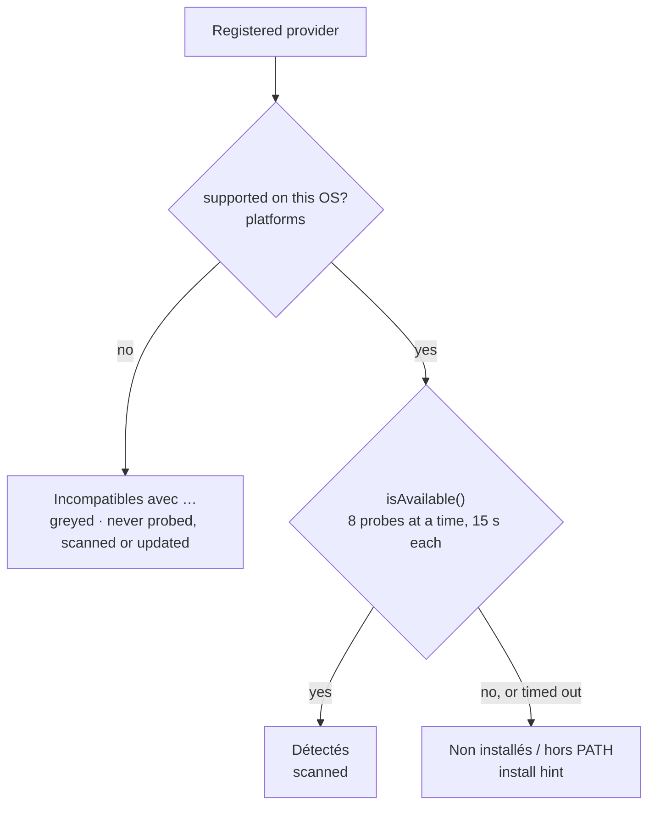

- `isSupportedOn()` is the single predicate, applied by the registry before any probe:
  detection, `getProvidersToScan`, `lookupProvider` (the targets of `gup update`, schedules, the
  elevated child). `gup update brew-cask:x` on Windows exits `2` with
  `Provider brew-cask indisponible sur Windows (macOS uniquement)`.
- `readProviderStatus()` sorts every provider into the three groups for `gup doctor` and the
  Providers view. A source-level test (`tests/core/platform/platform-gate-source.test.ts`)
  fails when a provider reads `process.platform` in `isAvailable()`, when anything but the
  registry calls `isAvailable()`, or when an install hint names an OS the provider does not run
  on.
- `isAvailable()` never does network I/O: a PATH lookup (resolved in-process, never by spawning
  `where` or `which`), a file check, or a bounded probe.
- The anatomy of a provider, with the sequence of a scan and an update:
  [`CONTRIBUTING.md` § Provider anatomy](../../CONTRIBUTING.md#3-provider-anatomy).

---

## 5. Scan

What happens between pressing `r` (or running `gup list`) and the package table:

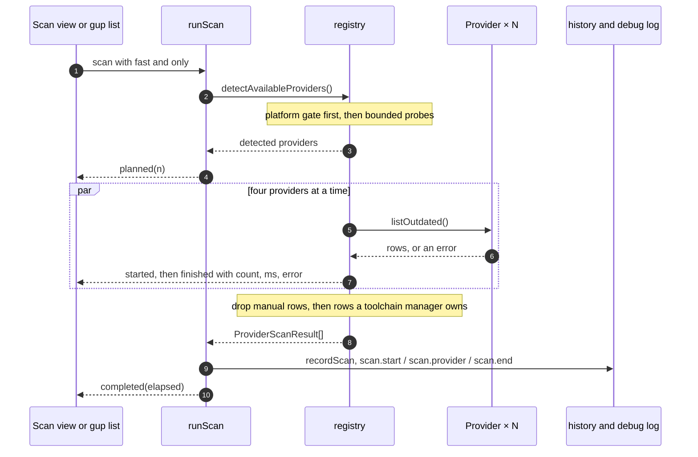

- Concurrency lives in one place: `scanAll` runs four providers at a time (`p-limit`), each under
  its own operation context, so whatever a concurrent scan spawns or logs names its provider.
- Each provider's `listOutdated()` is wrapped: a throw becomes `error` on that provider's row.
- Rows a provider flags `manual` are dropped; then `filterByOwnership` drops OS-level rows for a
  binary a toolchain manager owns (`choco:nodejs` while nvm-windows owns `node`), logged at
  `debug` as `scan.ownership-excluded`.
- `runScan` (`ui/scan-progress.ts`) records the scan in the history with each provider's own
  duration. The menu feeds its events to the Scan view; the one-shot commands show the same panel
  on their own screen, or one summary line when output is piped.

---

## 6. Update pipeline

One path for `gup update`, the menu and scheduled runs — `runUpdates(requests, ports)` in
`core/update/`:

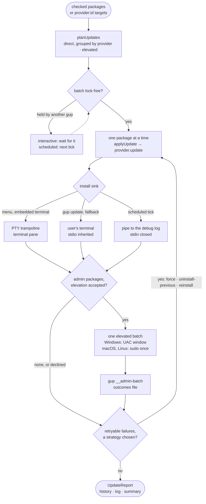

**Plan.** `planUpdates` (pure) puts every row flagged `requiresAdmin` in one elevated batch after
the others, and groups the others by provider, in the order of the request.
`updateKeyOf(providerId, packageId)` identifies a package across the run, its retries and the UI.

**Batch lock.** One update batch at a time per user, across processes (`batch-lock.ts`): the
holder keeps a listening endpoint open — a named pipe on Windows, a unix socket on POSIX — that
the OS releases however the holder exits; a JSON file beside it only carries display information
(who, since when). An interactive run waits with a message (the run view names the holder; `x`
gives up); a scheduled tick never waits.

**Direct installs.** `applyUpdate` calls `provider.update()` inside an operation context,
finalises the outcome (a skip or a timeout reads `ignorée par l'utilisateur`), records it in the
history, and turns a rejection into a failed outcome — `refusé par la barrière de sécurité : …`
when the runner's argv barrier refused, `erreur inattendue : …` otherwise — so one refused package
never stops the batch. Ctrl+C (or `s` in the run view) and the per-install timeout kill the
install's process tree and move on.

**Elevated batch.** The packages flagged `requiresAdmin` run behind one prompt:

| | Windows | macOS and Linux |
|---|---|---|
| Prompt | one UAC window: `Start-Process -Verb RunAs -Wait` starts `node <cli> __admin-batch <file>` | one `sudo` password: `sudo <node> <cli> __admin-batch <file>`, through `runInherit` |
| Where it runs | its own administrator window, outside gup's process tree | the active sink: the terminal pane in the menu, the terminal otherwise |
| Providers that call `sudo` themselves | — | do not prompt again: they already run as root (MacPorts, Fink, pkgin, the apt/dnf delegations) |

The child is a pure executor: it reads its targets from a private input file, runs only the CLI
modules that opt in (never the settings), calls `provider.update()` for each target and writes
the outcomes — and its debug-log lines — back to a file. The parent validates them and records
them in the invoking user's history and log. Declining the prompt marks the batch skipped.

**Retry.** When failures are `retryable`, the decisions port offers the strategies, least
destructive first, each at most once. `-y` and scheduled runs never retry: every strategy
bypasses an installer integrity check.

**Ports.** The pipeline knows no UI. Its callers plug in an `UpdateObserver` (planned, started,
finished, elevationStarted, cancelled, waiting), `UpdateDecisions` (elevation and retry
questions; `AUTO_DECISIONS` for `-y`, `HEADLESS_DECISIONS` for scheduled runs) and an `AbortGate`
(skip, stop). The console (`ui/update-console.ts`), the run view (`ui/run/`) and the scheduled run
are three implementations of the same ports. Extra observers — the debug log's, the scheduler's
run tracker — are added process-wide through `observeUpdates()`.

---

## 7. Interactive app

`gup` with no subcommand runs `MenuApp`: a loop of **sessions**, each one OpenTUI renderer on the
terminal's alternate screen. A session shows the sidebar, the view in front and dialogs on top;
during an in-app update the run view *takes over* the whole body.

How the user moves through it (Providers, Journal and Options are reachable from the sidebar at
any time):

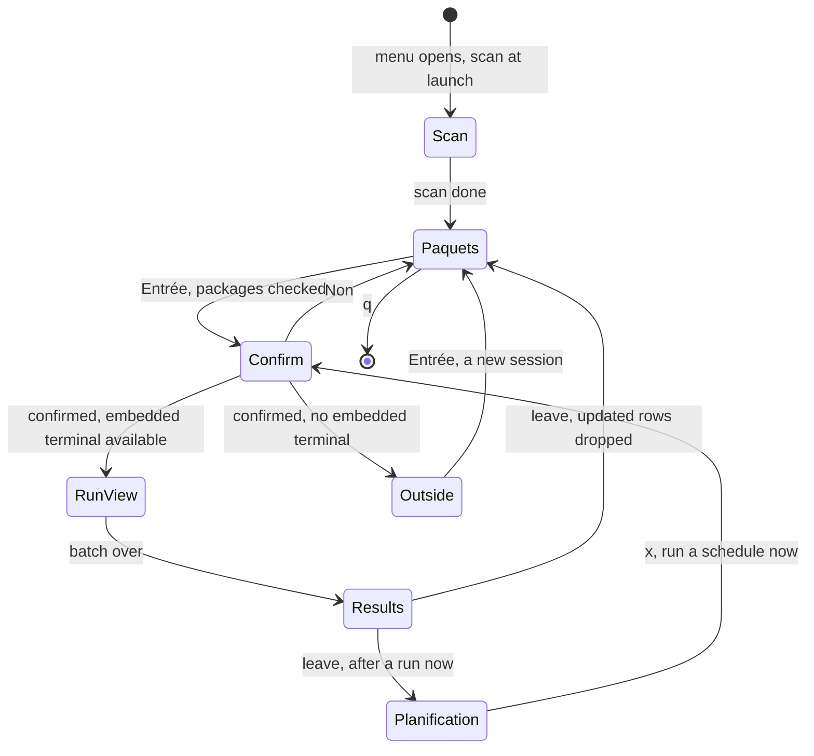

- **Views** are `ViewDefinition`s registered in `commands/menu-views.ts`: Scan, Paquets,
  Planification (group 0), Providers, Journal, Options (group 1). A view contributes package
  actions (`p planifier`), package marks (`◷`), title-bar facts, sidebar badges and actions on the
  run results (`o rapport HTML`) without touching the session.
- **Key routing** (`ui/app/session/menu-keys.ts`): Ctrl+C (the screen's) → the open dialog → the
  takeover → the focused panel when it captures text or claims the key → global keys (`q`, Tab,
  `←`) → panel or sidebar. While a dialog is open the hint bar shows its keys.
- **Launchers.** `UpdateLauncher.launch(packages, { scheduleId, returnTo })` is a slot. The
  in-screen launcher warms up the embedded terminal when the menu opens, confirms, then takes over
  the body with the run view; when the embedded terminal is unavailable it delegates to the
  *outside* launcher, which ends the session: `MenuApp` tears the screen down, runs the update on
  the plain terminal, waits for Entrée, then opens a new session. Both refuse to start while a
  scan of the session runs.
- **After an update** the updated packages are dropped from Paquets without a rescan (a full scan
  takes seconds); the `rescanAfterUpdate` preference brings the rescan back.

The run view's own states — who has the keyboard, and when:

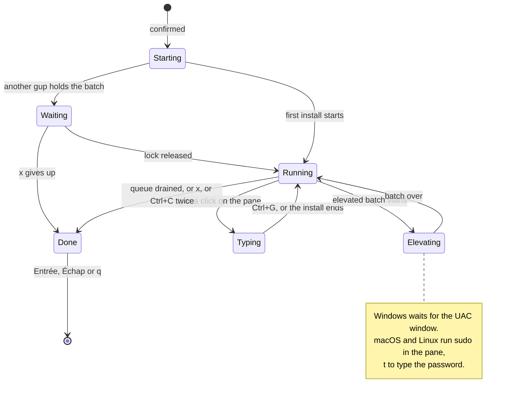

- `s` skips the install in flight, `x` stops everything after a confirmation, Ctrl+C skips and
  twice within 1.5 s stops; `q` is refused while a batch runs. A retry offer is a dialog over
  `Running`; while any dialog is open the panes are locked (blurred, unfocusable, user input
  dropped), so a key meant for the dialog never reaches an installer.
- One pane per package (OpenTUI's `EmbeddedTerminalRenderable`, 1 MB of scrollback), bound at
  spawn so late output lands in the right pane; failures and skips keep their output for the
  results.
- Panes are drawn on the terminal's own default background, never the theme's: installers pick
  colours for the user's palette, which gup's contrast enforcement cannot see.
- **Teardown** (`ui/tui/screen-host.ts`, `teardown.ts`): the appearance is disposed, then the
  renderer is destroyed **while raw mode is still held** — conhost 10.0.26100 (Windows 11 24H2)
  crashes when the alternate screen is left after stdin went back to line mode. While a screen is
  up, SIGBREAK, SIGTERM, SIGHUP (and SIGINT on POSIX) stop the install in flight, release the
  screen in that order and exit with 128 + the signal number; the in-screen launcher closes its
  gate on the same signals, so no package starts during the teardown. Nothing is written to the
  terminal while a screen is mounted: gup's own lines are deferred to the exit (output router).

---

## 8. Runner and process seams

`core/runner.ts` is the **only** module that imports `execa`. Probes and installs take two paths:

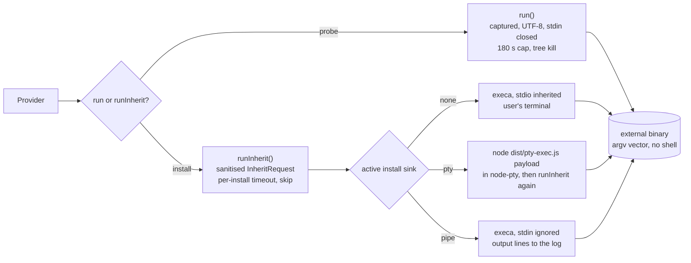

- **Sanitisers.** `sanitizeCommand` and `sanitizeArgs` refuse what could be read as an option or a
  shell construct before anything spawns; a refusal rejects, which `applyUpdate` turns into a
  failed outcome.
- **Install sinks** (`core/process/inherit-sink.ts`). `routeInheritTo(sink)` installs one around a
  batch and restores the previous one after: the run view routes installs to its terminal panes, a
  scheduled run to a pipe. Providers do not change: they keep calling `runInherit`.
- **The PTY trampoline** (`src/pty-exec.ts`, built as `dist/pty-exec.js`). node-pty never starts an
  installer itself — its Windows spawn ignores `PATHEXT` and has no `cmd.exe` escaping. It starts
  the trampoline with a constant command line and one base64url payload; the trampoline calls
  `runInherit` with no sink, so PATH resolution, `.cmd` escaping and the argv barrier work as
  without a PTY. node-pty's own `kill()` is never called: a skip kills the trampoline's tree
  (`taskkill /T /F`, or the process group on POSIX), and each session releases its pseudo-console
  once the installer exits (`releaseConpty`).
- **Embedded terminal detection** (`core/pty/pty-loader.ts`) never throws: `GUP_PTY` turned off, a
  missing trampoline, node-pty not installed, a macOS `spawn-helper` gup cannot make executable, or
  a failed probe each give a French reason, shown by the update confirmation and `gup doctor`, and
  the menu falls back to updating outside the screen.
- **Other seams.** `commandExists` / `whichFirst` resolve PATH in-process; `launchDetached` opens a
  file with the OS opener (no shell); `isElevated()` is `net session` on Windows and
  `getuid() === 0` on POSIX; the command tracer slot sees every spawn once (the debug log uses it);
  the output router keeps gup's own lines off a mounted screen.
- **Drift tests** keep these chokepoints: no `child_process` or `execa` outside the runner,
  node-pty named only by its loader and spawned only by `PtySession`, no `.kill()` on a node-pty
  handle anywhere, no `shell: true` literal outside the Scoop allowlist
  (`tests/security/process-chokepoints.test.ts`, `shell-usage.test.ts`).

---

## 9. Local state: history, debug log, reports

Where the data comes from, and every place it goes:

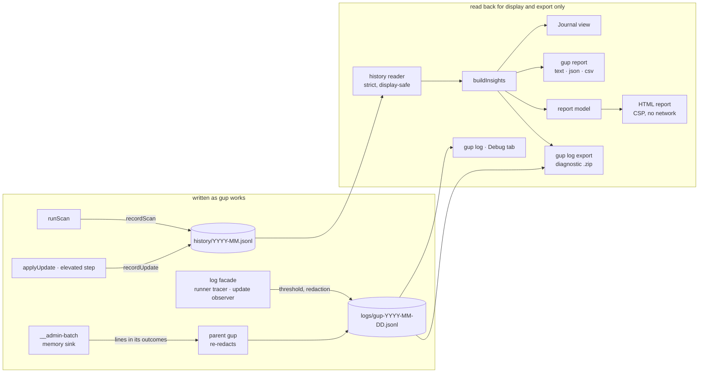

**Activity history** (`core/history/`): one self-describing JSON object per line, one file per
UTC month, appended synchronously (every command ends on `process.exit`, which would drop a
pending asynchronous write) and best-effort (a failed write costs one dimmed warning on stderr,
never an update). Records carry what started the run (`trigger`: `menu`, `cli` or `schedule`),
each provider's scan duration and, for scheduled updates, the schedule id; known secret shapes in
messages are masked at write time. The schema version stays 1: fields are only ever added.

**Read side.** `core/history/reader.ts` parses each line into a fresh object of known fields
(torn, foreign, newer or impossibly dated lines are counted and skipped) and strips escape
sequences; `core/insights/` aggregates in one pass (100 000 events in about 0.3 s).
`tests/security/history-read-only.test.ts` pins the import graph: only the Journal, the report
and the export front-ends may import the reader or the insights, so the history never feeds a
decision.

**Debug log** (`core/log/`): `log.info("domain.action", data)` anywhere in gup; with no backend
installed it is a no-op behind one null check. The journal module installs the file backend at
startup: the threshold (`--log-level` > `GUP_LOG_LEVEL` > the `log.level` setting > `info`),
redaction of every string, keys included (§13), one file per UTC day, split past 10 MB, kept 14
days. The elevated child never writes into the user's log directory: its lines travel back with
its outcomes.

**Exports** (`core/export/`): JSON and CSV serialisers (English snake_case, formula-safe CSV), the
diagnostic archive, the report model and `writeOutputFile` (dated names, `wx`, mode 0600, the 20
newest of each kind kept). The HTML page itself lives in `src/report/` (§13).

---

## 10. Scheduling

A schedule is an explicit list of `provider:packageId` targets plus a recurrence; it never
designates a whole provider. Nothing is resident: while at least one schedule is enabled, one
per-user OS trigger starts a short-lived `gup __schedule-tick` every 15 minutes.

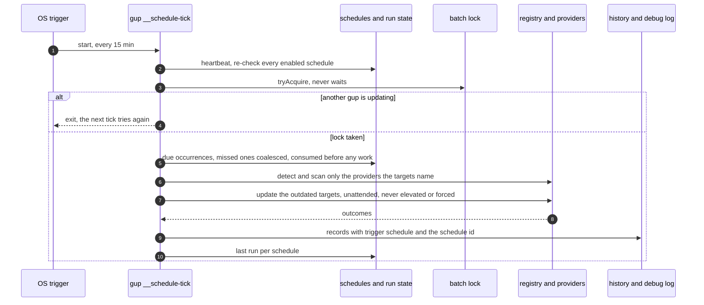

| | Windows | macOS | Linux |
|---|---|---|---|
| Trigger | Task Scheduler task `gup-scheduler-<SID>`, started through `conhost.exe --headless` | launchd user agent `io.github.lindecker-charles.gup.scheduler` | a managed block in the user's crontab |
| Privileges | the user's logon session (`InteractiveToken`), `LeastPrivilege`, no stored password | `gui/<uid>` | the user's crontab |
| Limits | one instance at a time, ended after 3 hours | — | — |

- **Model** (`core/scheduler/model/`, pure): target parsing (no bare provider, no wildcard, no
  leading `-`), recurrences evaluated as 5-field cron in local time (croner), validation (at most
  hourly, within a year, 50 schedules of 50 targets), due evaluation with catch-up.
- **Artefacts** (`core/scheduler/artifacts/`, pure builders): the task XML, the plist, the crontab
  block — argv only, escaped, characters each format would re-interpret refused.
- **Trigger sync**: registered when the first schedule is enabled, removed with the last one,
  repaired at start when it points at a node or gup path that no longer exists; a registration
  owned by another installation of gup is reported, never taken over silently.
- **Time budget**: no install starts after 120 minutes; each install gets the user's timeout
  clamped to 60–1800 s (no limit becomes the 1200 s default); a watchdog ends the tick at
  170 minutes, under Task Scheduler's 180-minute limit.
- **Run now** (command line and menu) uses the same resolver and records the result as the
  schedule's last run; in the menu it goes through the menu's launcher (the run view, or the
  plain terminal).

User guide: [`scheduled-updates.md`](../guide/scheduled-updates.md).

---

## 11. Settings, themes and contrast

**Settings store** (`core/config/`). `ConfigStore` reads and writes one JSON file per store:
`config.json` under the user's config directory (`%APPDATA%\gup` on Windows, roaming) for
preferences, `schedules.json` under the machine-local scheduler directory. A feature declares a
section (`defineSection`) with a lenient parser: a bad field falls back to its default and records
an issue; a corrupt file is moved aside, never deleted; writes are atomic (temporary file, rename)
inside a short cross-process file lock; sections a newer gup wrote are kept as they are.

Which value wins, for the settings that also have a flag or a variable:

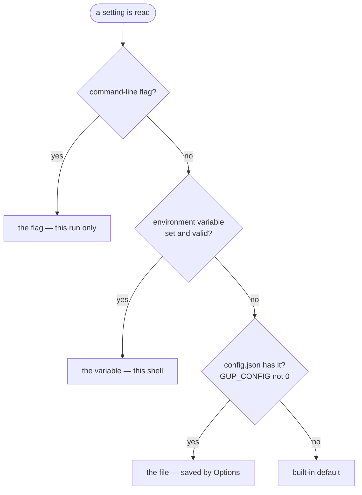

| Setting | Flag | Variable | File | Default |
|---|---|---|---|---|
| Install timeout | `--timeout` (`gup update`) | `GUP_INSTALL_TIMEOUT` | `install.timeoutSeconds` | 1200 s |
| Debug log level | `--log-level` | `GUP_LOG_LEVEL` | `log.level` | `info` |
| Opening the HTML report | `--open`, `--no-open` | — | `journal.openReport` | open, in a terminal outside CI |
| Symbols | — | `GUP_ASCII=1` (when `auto`) | `interface.glyphs` | `auto` |
| Colours | — | `NO_COLOR` (always wins) | `theme.id` | `terminal` |

Exceptions: the scan settings (`scan.fast`, `scan.providerFilter`) apply to the menu only —
`gup list` and `gup update` keep their explicit flags; a scheduled tick logs at least `info` and
clamps the timeout; the elevated child reads no setting at all — its timeout and log threshold
come from its parent's payload.

**Theme engine** (`ui/theme/`). Panels speak in tones (`plain`, `strong`, `muted`, `disabled`,
`accent`, `success`, `warning`, `danger`, `onAccent`) and fills; the screen's `Appearance` paints
them. `ThemedAppearance` resolves the chosen theme against the terminal: its colour depth, the
palette it reports (OSC 4/10/11, asked once per run, bounded) and `NO_COLOR`. Every painted pair
is then held to WCAG: text ≥ 4.5:1 (7:1 at AAA) on the background and the selected row; borders
and the accent fill ≥ 3:1. A colour that fails — a built-in, a custom one, the terminal's own — is
moved along its OKLCH lightness, hue kept, to the closest colour that passes; on 256-colour
terminals the colours are quantised to xterm slots and checked again. An audit walks every view
under every theme and measures every painted cell. User guide:
[`themes-and-accessibility.md`](../guide/themes-and-accessibility.md).

---

## 12. Composition: CLI modules and slots

A feature plugs into the command line with a `CliModule` — `register` (its commands and global
options), `triggerFor`, `beforeAction`, `diagnostics` (its `gup doctor` "Système" line),
`onCrash`, `runsInElevatedChild` — and one line in `CLI_MODULES`. Before every command,
`installStartup` records what started the run, then runs every `beforeAction` in order: logging,
settings, scheduler, then the commands' own. The elevated `__admin-batch` child runs only the
modules that opt in (the debug log's), so nothing it runs as an administrator reads the user's
settings.

`beforeAction` installs the process-wide **slots**; nothing else does, except the install sink,
which is routed around a batch. Library code reads them; tests reset them.

| Slot | Default | Installed by |
|---|---|---|
| Screen defaults (`configureScreens`) | the legacy look, mouse on | the settings module: the theme engine |
| Menu preferences (`setUiPreferencesSource`) | `DEFAULT_UI_PREFERENCES` | the settings module |
| Menu launcher (`setLauncherFactory`) | `outsideLauncher` | the embedded-terminal module: the in-screen launcher |
| Log backend, command tracer, update observer | none | the journal module |
| Run trigger (`setRunTrigger`) | `menu` / `cli` | startup; the schedule module answers `schedule` for the tick |
| Batch guard (`setBatchGuard`) | pass-through | the schedule module: the OS-released batch lock |
| Install timeout | `GUP_INSTALL_TIMEOUT`, else 1200 s | the settings module, then `--timeout` |
| Install sink (`routeInheritTo`) | the user's terminal | the run view and the scheduled run, around a batch |

The menu has its own composition root, `commands/menu-views.ts`: every view, one line each, and
the ports between features (the Journal's schedule names, its Options rows).

---

## 13. Security

The threat model, the mitigations and the tests that pin them are in
[`SECURITY.md`](../../SECURITY.md#threat-model). The architectural chokepoints it relies on:

| Chokepoint | Where | Pinned by |
|---|---|---|
| Every spawn | `core/runner.ts` (argv vector, sanitisers, no shell) | `tests/security/process-chokepoints.test.ts`, `shell-usage.test.ts`, `command-injection.test.ts` |
| Every install in a pseudo-terminal | the trampoline, through `runInherit` again | `process-chokepoints.test.ts`, `command-injection.test.ts` |
| Every file opened in a browser | `core/export/open-external.ts` → `launchDetached` | `tests/core/export/open-external.test.ts` |
| Every OS trigger | `core/scheduler/trigger/` (pure artefact builders, absolute system binaries) | `tests/security/scheduler-injection.test.ts` |
| Every byte of history read back | `core/history/reader.ts`, imported by display and export only | `tests/security/history-read-only.test.ts` |
| Every log line | `core/log/redact.ts`, `sanitize-data.ts` | `tests/core/log/redact.test.ts`, `sanitize-data.test.ts` |
| Every HTML report | `src/report/` (CSP by hash, JSON data blocks, no URL) | `tests/ui/report/*.test.ts` |

---

## 14. Tree layout

```
src/
├── cli.ts                  # Commander program, built from the CLI modules
├── pty-exec.ts             # the PTY trampoline (second bundle, dist/pty-exec.js)
├── commands/
│   ├── cli/                # CliModule contract, CLI_MODULES, startup, settings and embedded-terminal modules
│   ├── journal/            # gup log, gup report, the Journal's data source, the debug-log session
│   ├── schedule/           # gup schedule, the tick, the Planification controller
│   ├── list.ts · update.ts · doctor.ts · menu.ts · admin-batch.ts · warn-ignored-providers.ts
│   └── menu-state.ts · menu-views.ts    # the menu's state and composition root
├── core/
│   ├── registry.ts         # ALL_PROVIDERS, detection, scanAll
│   ├── runner.ts           # the spawn chokepoint
│   ├── elevation.ts        # the elevated batch (UAC / sudo)
│   ├── types.ts            # the provider contract
│   ├── install-source.ts · ownership.ts · corepack-ownership.ts   # who owns a binary
│   ├── gh-releases.ts · hashicorp-releases.ts · wsl.ts · nvim-paths.ts · install-hint.ts · version.ts
│   ├── platform/           # platform sets, the gate, provider status
│   ├── process/            # install sinks, output router, command tracer, PATH lookup
│   ├── pty/                # embedded terminal: loader, session, trampoline, exit file, spawn-helper
│   ├── update/             # the update pipeline, its ports, the batch lock
│   ├── config/             # settings store and its sections
│   ├── state/              # state directories, run context, file lock, system snapshot
│   ├── history/            # activity history: writer, strict reader
│   ├── log/                # debug log: facade, backend, sinks, redaction, reader
│   ├── insights/           # aggregation of the history
│   ├── export/             # JSON, CSV, diagnostic archive, report model, output files, opener
│   ├── time/               # report periods, local calendar days
│   └── scheduler/          # model/, persistence/, artifacts/, trigger/, the tick and run now
├── providers/              # 1 file = 1 source, by domain (os, wsl, node, python, rust, dotnet-php,
│                           # jvm, lang-other, toolchain, cloud, iac, kubernetes, containers, security,
│                           # dev-cli, ide, editor-plugins, embedded-mobile, shell) + self.ts, _template.ts
├── report/                 # the HTML report: shell, CSP, JSON embedding, client/, styles/
└── ui/
    ├── app/                # MenuApp, launchers, preferences, view contract; session/ (MenuSession, keys, nav)
    ├── views/              # one factory per sidebar entry
    ├── panels/             # Scan, Paquets, Providers; journal/, options/, schedules/
    ├── run/                # the run view; terminal/ (panes over OpenTUI's embedded terminal)
    ├── tui/                # OpenTUI loader, screen host, teardown, chrome, dialogs, text panel
    ├── theme/              # appearance seam, glyphs, built-in themes, contrast; color/, runtime/
    ├── settings/           # settings service and sections the UI owns, Options rows of other features
    ├── charts/             # heatmap, bars, sparklines, the text report
    ├── text/               # French labels by domain, fr-format.ts
    ├── prompts/            # one-shot screens: scan, package picker, confirm, select
    └── scan-progress.ts · update-console.ts · select.ts · table.ts · skip-controller.ts · retry-choices.ts · log-line.ts
```

A folder holds at most 10 files ([`CONTRIBUTING.md` § Code style](../../CONTRIBUTING.md#7-code-style)):
a full folder grows a sub-folder by domain. `src/core/registry.ts` (length) and
`src/providers/<domain>/` (file count) are the two named exceptions.

---

## Notable decisions

- **No disk cache.** Scan cost is dominated by the tools themselves; a cache would add drift for
  little gain. `--fast` covers iterative use, and the menu drops updated packages instead of
  rescanning.
- **No plugin system.** A provider is one file and one registry line: simpler than dynamic
  discovery, and it keeps the security surface bounded.
- **One package per `update()` call.** A skip or a timeout then drops one install, never a whole
  provider's batch; the cost is a few more process starts.
- **Updates inside the screen, through a trampoline.** Installs run in a real pseudo-terminal so
  progress bars and prompts work, while every installer is still started by the same runner with
  the same argv barrier; without node-pty the menu falls back to 0.4's outside updates.
- **Non-resident scheduling.** The OS starts gup when something is due to be checked; no daemon,
  no tray icon, nothing registered while no schedule is enabled.
- **History is read back, never trusted.** Display and export only, pinned by an import-graph
  test: a tampered history can mislead a chart, never an update.
- **French interface, English code.** The interface's audience is French; the code base stays
  readable by anyone.
