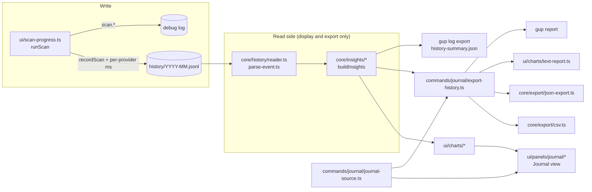

# Design note — the activity journal (`feat/activity-journal`)

Status: shipped on `feat/activity-journal` (wave 2, second branch of the observability lane,
stacked on `feat/debug-log`). It reads the activity history back and shows it: a **Journal** view
in the menu (activity heatmap, per-package recurrence, events, debug log) and `gup report
--format text|json|csv`. The HTML report (`feat/html-report`) builds on the same reader, insights
and export orchestration.

User ask (translated): "a graphical visualisation in the terminal of the activity and the
recurrence of updates".

Sources: observability spec steps 10–16, integrated plan §6.6, §8, §9.2 (DoD), §10.2,
amendments F-10, F-16, W2-2, W2-3, W2-9, and the debug-log hand-off (`debug-log.md` §8). The
foundation's contracts are used as shipped; extensions are additive (§10).

---

## 1. What the user gets

| | |
|---|---|
| **Journal** view | Sidebar entry between Providers and Options (`order 50`, group 1). Four tabs over one load of a period: **Activité** (headline numbers, GitHub-style calendar heatmap of successful updates, outdated-count sparkline, slowest scans), **Récurrence** (a bar per package with its typical interval and cadence; detail with counts, first/last attempt and latest versions), **Événements** (every scan and attempt; type filter, text filter, detail), **Debug** (newest log records; level filter, text filter, detail with context and data, `x` diagnostic archive). |
| Keys | `1`–`4`, `[` `]` tabs · `p` period (30 d → 90 d → 12 mois → tout) · `r` reload · `e` export (JSON, CSV, diagnostic archive) · `/` filter · `f` type · `s` sort · `l` level · `x` diagnostic · `entrée` detail · `échap` back. |
| `gup report` | `--format text` (default) / `json` / `csv`, `--since`, `--until`, `-o/--out` (`-` = stdout), `--force`, `--delimiter , ; tab`. Data on stdout, notices on stderr; exit 2 on bad options, 1 on read/write failure. |
| `gup log export` | Gains `history-summary.json` (the period's insights, no raw event) and `--no-history`. |
| Debug log | `scan.start`, `scan.provider` (debug; warn on a failed provider), `scan.end`, `report.export`. |
| History | Each provider's own scan time is recorded (`ScanProviderRecord.durationMs`, already in the v1 schema). |

## 2. Architecture

| Folder | Files | Role |
|---|---|---|
| `core/time/` | `period.ts`, `calendar.ts` | Periods (`7d 12w 6m 1y all YYYY-MM-DD`, presets `30d 90d 12m all`, `--until`) with a `scope` the interface words and `hasFixedEnd` (an explicit `--until`); local `YYYY-MM-DD` day keys, Monday weeks, DST-safe arithmetic (UTC noon). |
| `core/history/` | `reader.ts`, `parse-event.ts` (+ `store.ts` exports `isHistoryEnabled`) | Strict reader of the monthly shards. |
| `core/insights/` | `types`, `stats`, `activity`, `recurrence`, `providers`, `trend`, `failures`, `runs`, `totals`, `build-insights` | Pure aggregation, one pass per builder. |
| `core/export/` | `csv.ts`, `json-export.ts` (+ `diagnostic-bundle.ts`, `output-file.ts` extended) | Serialisers. |
| `ui/charts/` | `chart-glyphs`, `scale`, `bar-chart`, `sparkline`, `heatmap`, `activity-sections`, `recurrence-table`, `text-report`, `ansi-lines` | Pure `Line[]` producers shared by the TUI and the text report. |
| `ui/panels/journal/` | `journal-source` (port), `journal-panel`, `journal-tab`, `activity-tab`, `recurrence-tab`, `events-tab`, `debug-tab`, `browsable-list`, `detail-lines`, `event-line` | The view. |
| `ui/views/` | `journal-view.ts` | The `ViewDefinition`; one line in `commands/menu-views.ts`. |
| `ui/text/` | `activity-labels.ts`, `journal-labels.ts`, `report-labels.ts` | Every French string (F-10). |
| `commands/journal/` | `export-history.ts`, `report-command.ts`, `journal-source.ts` | Composition: `exportHistory` (read → insights → serialise → stdout or file → `report.export`), `gup report`, the view's source. |

### Reader (`core/history/reader.ts`, `parse-event.ts`)

- Shards named `^\d{4}-\d{2}\.jsonl$` (regular files only) whose UTC month meets
  `[since, until]`, read async, oldest first; a missing directory is an empty history; only I/O
  errors propagate.
- Each line (BOM stripped, `\r\n` accepted, > 64 KiB refused) is parsed into a **fresh** v1
  record: known fields only, types checked, never a spread of the parsed object, strings cut to
  4 KiB, `ts` normalised to ISO UTC. Unknown fields (additive v1 fields of a newer gup) are
  dropped; an unknown `trigger` is dropped, the record kept.
- `ts` must fall between the Unix epoch and 9999-01-01: outside, no gup wrote the line, and a
  local day with a three- or five-digit year would break every day key downstream (a single
  such line used to make the whole journal unreadable).
- Verdicts: `malformed` (not JSON, a known field of the wrong type, an instant out of range, a
  torn last line),
  `unsupported` (`v > 1`, an unknown record `kind` or `status` — a newer gup's well-formed record).
  Both are counted (`HistoryReadStats`) and never stop the read.
- Strings come back display-safe: escape sequences dropped, other controls removed (a `message`
  or a scan `error` keeps its line breaks and tabs, every other field is one line).
- Records are sorted by instant: the elevated child and its parent may interleave appends.

### Insights (`core/insights/`)

`buildInsights(events, { period, dayKey? })` times every event once (instant + local day,
`dayKey` injectable for TZ-independent tests), sorts (stable, cheap on sorted input), splits
updates and scans once, then runs each builder:

| Builder | Rule |
|---|---|
| `dailyActivity` / `weeklyActivity` | success / failed / skipped / scans per local day (days with activity only) and per Monday week |
| `packageRecurrence` | per `provider:package`: counts, first/last attempt, last installed version, **median interval between successes with successes < 1 h after the previous one merged** (the merge chains; an update dates from its first success), cadence (`weekly` ≤ 10 d, `monthly` ≤ 45 d, `quarterly` ≤ 120 d, `rare`, `once`, `none` = never succeeded), the 20 latest version steps; most successes first, then most recent |
| `providerStats` | attempts and outcomes, median update ms, **median own scan ms** (from `ScanProviderRecord.durationMs`), scan errors and the last one; providers only scanned are listed too |
| `outdatedTrend` | the last **full** scan (`!fast && filter = []`) of each day |
| `failureGroups` | failed attempts grouped by provider, package and the first line of the message (whitespace collapsed, 160 chars) |
| `runSummaries` | per `runId`: start, end, trigger, scans, last full-scan outdated count, outcomes; newest first |
| `insightTotals` | success rate = successes / (successes + failures) — skips excluded, null without either; distinct packages with a success; last update (success) and scan; last full-scan outdated count |

Performance: 100 000 synthetic events written as shards are read **and** aggregated in about
0.3 s on the development machine (test bound 1.5 s, DoD §9.2).

### Charts (`ui/charts/`)

- Glyph sets come from the resolved `GlyphMode` (`chartGlyphs(mode)`): the screen's
  `appearance.glyphMode` in the TUI, `resolveGlyphMode("auto")` for `gup report`. No resolver of
  their own (F-16). The ASCII set is its own (`. : + * #`, `#` bars, `_ . - ~ = ^`), not a
  translation: `toAscii` maps every block to `#`, which would flatten the levels. Every Unicode
  mark is in the foundation's glyph map, so the TUI's translation still applies to the rest.
- Heatmap: GitHub's layout (week columns, Monday rows, last column = the week of the period's
  last day — today, or the `--until` day — later days blank), cell width 2 when every wanted
  week fits, else 1; weeks = from the Monday of the period's first day to that last week, 53 at
  most; month names over the week of the 1st unless they would touch the previous one; levels by
  quartiles of the **distinct** non-zero daily counts (0 stays 0); **density carries the
  meaning, tone doubles it**.
- Bars: eighth blocks (whole cells in ASCII), a non-zero value always shows; the Récurrence
  table's bars count the successes, or the failures while the tab is sorted by them.
  Sparkline: 0 to max, resampled by bucket mean; the outdated series runs to the period's last
  day and repeats the last value on days without a full scan.
- `kpiLines`, `heatmapSection`, `trendLine`, `slowProvidersLine` are shared by the Activité tab and
  the text report; numbers, dates and durations go through `fr-format.ts` (F-16).

### Journal view (`ui/panels/journal/`)

- `JournalPanel` (Panel): tab bar (the current tab marked `▌`, not only tinted), the tab's lines,
  an export status line. `onShow` and `r` reload the period (re-anchored at now), `p` steps it.
  A load keeps the previous data on screen (title `↻`); a result overtaken by a newer load is
  dropped (load counter). Tab keys first while a tab is modal (typing a filter, a detail open).
- `JournalTab` contract (`journal-tab.ts`) + shared helpers (history placeholders, recording-off
  banner, list window with cursor row, filter line, hints, click mapping, `nextOf`).
- `BrowsableList<T>`: items, a scope (type/level filter), a typed text filter (precomputed
  lowercase search text), a cursor stopping at both ends, a scrollable detail.
- Details never cut text at the panel's edge: a title, a field value, a message or a debug
  record's data wider than a row wraps, a word wider than a row (a long package id, a path, a
  command's error output) continuing on the next. A debug record's time reads in local time,
  as in the list, followed by the logged instant.
- The Activité tab stacks its blocks with blank lines when they fit, without them otherwise, and
  drops trailing blocks last: the view fits 80 × 24 (50 × 19 inside the panel) and 120 × 30
  (tested through `bootMenu`, in Unicode and ASCII).
- The port (`journal-source.ts` in the panel folder) is types only; `commands/journal/
  journal-source.ts` implements it: history (bounded to 10 000 events, newest first) and log
  (500 records, newest first, plus the write threshold and its source from the log session) are
  read independently; failures come back as data; exports return an outcome. The panel guards the
  contract anyway (a rejecting source still shows "Journal illisible").

### `gup report` (`commands/journal/report-command.ts`, `export-history.ts`)

`exportHistory(request, deps?)` reads, aggregates, serialises through a `Record<HistoryFormat,
Serializer>` (open/closed: html is one more entry), and delivers to stdout or a file
(`writeOutputFile`: dated name in the reports directory with `wx`, or `--out` with `--force`).
`text` on stdout is painted (chalk drops colours when stdout is not a terminal), plain in a file.
The result counts the records written (CSV: update attempts only). `report.export` is logged with
format, records, bytes, path.

## 3. Security

- **The read side never feeds a decision.** `tests/security/history-read-only.test.ts` pins the
  import graph: only `commands/journal`, `core/export`, `core/insights`, `core/history/reader`,
  `ui/charts`, `ui/panels/journal`, `ui/views/journal-view.ts` and `ui/text/activity-labels.ts`
  may import the reader, the parser or the insights (and the guard proves it sees importers).
- **Strict parsing:** fresh objects with known fields, no spread, no prototype access, bounded
  strings and lines; hostile content is counted, never thrown.
- **Terminal safety:** escape sequences and controls are removed at read time; the Debug detail
  and every detail field also go through `printable()`.
- **Exports:** free text (package ids, versions, messages, scan errors, retry labels) through
  `redactText` (secrets + home → `~`) in JSON, CSV and the diagnostic summary; CSV cells starting
  like a formula (`= + - @ \t \r`) get a `'` (OWASP); exports are `wx` / 0600 files.
- **Diagnostic summary:** insights only (no raw events); an unreadable history costs only the
  summary, its reason redacted in the README.

## 4. Cross-platform

- Shards are UTC months; days, weeks and the heatmap are **local** days (the user's evening is
  not tomorrow's UTC date); day arithmetic goes through UTC noon (DST-proof, tested across the
  EU change). Tests run with `TZ=UTC` and inject `dayKey` where the zone matters.
- Glyph modes follow the foundation's resolution (`GUP_ASCII=1`, `TERM=linux|dumb`, POSIX without
  a UTF-8 locale).
- No path or process logic of its own: directories come from `stateDir`, files from
  `writeOutputFile`.

## 5. Decisions and deviations

- **No `o` key and no HTML choice in `e` yet:** the HTML renderer is `feat/html-report`'s. The
  export table (`SERIALIZERS`), the `ExportFormat` port and the dialog are built so that branch
  adds one entry each plus the `o` binding.
- **`gup report` defaults to `text`** (the spec's default is `html`, which this branch cannot
  render). `feat/html-report` flips the default.
- **`describePeriod` is not in `core/time`:** it is French text, so it lives in
  `ui/text/activity-labels.ts` (`periodLabel`), reading the period's `scope` (F-10). `Period`
  carries `scope` for that reason, and `hasFixedEnd` so that a `--until` period reads
  "depuis le 01/01/2026 jusqu'au 31/03/2026".
- **Heatmap weeks are counted between Mondays**, not as the spec's `ceil(periodDays / 7)`, which
  dropped up to six days of a period starting late in its week; the heatmap and the trend end
  on the period's last day, not today.
- **Heatmap levels use the quartiles of the distinct daily counts**, not of every day: counts
  repeat so much that raw quartiles collapse (1, 1, 2 for a history of one-update days), leaving
  levels unused and a busy day drawn like an ordinary one.
- **The Récurrence bars follow the failure sort:** sorted by failures, the bars, counts and
  column title show the failures (the spec's table always shows the successes, which made that
  order unreadable).
- **Cadence `none`** (never succeeded) is added to the spec's `Cadence`: a package that only
  failed must not read "une fois".
- **Unknown `kind`/`status` are `unsupported`, not `malformed`:** a newer gup may add a record
  kind under v1 (additive); skipping it is a correct v1 read.
- **JSON export is snake_case throughout** (plan §13: "CSV/JSON English snake_case"), including
  the insights and the events (`run_id`, `provider_id`…), converted at the export boundary; the
  on-disk history keeps its camelCase.
- **The CSV adds `schedule_id`** (the history has `scheduleId` since the foundation).
- **Version steps are bounded to the latest 20 per package** in the insights (memory and JSON
  size), enough for the detail view; the HTML report reads its timeline from the events.
- **Labels:** three modules instead of one (`activity-labels` shared by TUI and text report,
  `journal-labels`, `report-labels`) to keep each under the size limit and by audience; proper
  French plurals for the headline numbers (`1 échec`, `9 ignorées`).
- **`ui/charts/ansi-lines.ts`** now also serves `gup log` (the tone-to-chalk table was duplicated
  in `ui/log-line.ts`).
- **Debug tab order:** newest first, like Événements (the spec mock-up is ascending).
- **No `export-choices.ts`:** the export dialog is three label constants and a list; it lives in
  the panel and `journal-labels.ts`, and the folder holds the tab contract (`journal-tab.ts`)
  instead.
- **`since-option.ts` folded into `core/time/period.ts`** (debug-log hand-off); its cases moved
  to `tests/core/time/period.test.ts`.

## 6. Contract changes (additive)

| Contract | Change | Why |
|---|---|---|
| `core/history/store.ts` | exports `isHistoryEnabled()` (was private) | the view's "recording off" banner reads the same switch |
| `core/export/output-file.ts` | `OutputExtension` gains `txt` | `gup report --format text -o x.txt` |
| `core/export/diagnostic-bundle.ts` | `DiagnosticInput.history?`, `DiagnosticContents.history?`, `DIAGNOSTIC_ENTRIES.history` | the activity summary of the archive |
| `ui/log-line.ts` | exports `printable()` and `recordTime()` | detail views make tool text safe, and date a record, the same way as the list |
| `commands/journal/diagnostic.ts` | `writeDiagnostic(request)` split from the command | the view writes the archive without printing |
| `tests/commands/menu-views.test.ts`, `tests/commands/cli/cli-modules.test.ts` | Journal in the sidebar; `report` in the command list | companions of the registration lines |

## 7. Folder budget

`core/time` 2 · `core/history` 5 · `core/insights` 10 (full) · `core/export` 4 (+3 html-report) ·
`ui/charts` 9 · `ui/panels/journal` 10 (full) · `ui/views` 5 · `ui/text` 6 · `ui` root 7 ·
`commands/journal` 9 (since-option folded).

## 8. Hand-off

- **`feat/html-report`:** add `"html"` to `HistoryFormat` (one `SERIALIZERS` entry built from
  `buildReportModel`), to the view's `ExportFormat` and to the export dialog; bind `o` in
  `JournalPanel.panelKeys`; flip `gup report`'s default format and add `--no-open`. Use
  `exportHistory` (it already logs `report.export` and writes through `writeOutputFile`).
- **`feat/journal-settings` (wave 3):** initial period from `journal.period` →
  `JournalPanelDeps.initialPeriod` (in `journal-view.ts`); `interface.glyphs` for the text report
  → `reportRequestOf` (today `resolveGlyphMode("auto")`); `ui/panels/journal` is full.
- **Wave-3 docs consolidation:** `cli-reference.md` (§ Activity history still says "nothing reads
  it back": it is now read back for display and export only, test-enforced), `gup report` in the
  command list, `architecture.md` (§9 + the read side), `SECURITY.md` (export redaction, CSV
  injection, read-only guard).
- **`test/e2e-coverage-ci`:** the contrast audit can register `journalView(scriptedSource())`
  (`tests/ui/panels/journal/journal-data.ts` builds realistic data).
