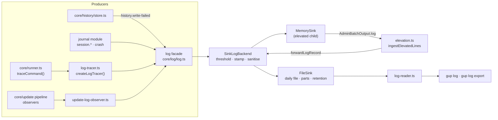

# Design note — the debug log (`feat/debug-log`)

Status: shipped on `feat/debug-log` (wave 2, first branch of the observability lane). It gives
gup a structured debug log — what gup did, which command it ran, why it failed — that a user can
read with `gup log` and attach to a bug report with `gup log export`. The activity journal
(`feat/activity-journal`) and the HTML report (`feat/html-report`) build on it.

User ask (translated): "a log journal to make debugging easier, with export".

Sources: observability spec steps 2–9, integrated plan §6.5, amendments O-1, F-15, F-16, W2-3,
W2-7. The foundation's contracts (`foundation.md`) are used as shipped; one is extended
additively (§6).

---

## 1. What the user gets

| | |
|---|---|
| A log of every run | One JSON line per event in `<logs>/gup-YYYY-MM-DD.jsonl` (UTC day): session start/end/crash, every command gup spawns, every update attempt, the elevated batch. Levels `error warn info debug trace`, default `info`. |
| `--log-level <niveau>` | Global option, wins over `GUP_LOG_LEVEL`, which wins over the default. `off` writes nothing and opens nothing. |
| `gup log [show]` | `-n/--lines` (50), `-l/--level`, `-s/--since` (`7d`, `12w`, `6m`, `1y`, `all`, `YYYY-MM-DD`; default `7d`), `-g/--grep`, `--json`. |
| `gup log path` | The log directory, on stdout. |
| `gup log export` | A diagnostic `.zip` (log files of the period, a machine description, a README), redacted again, written as a private file in the reports directory or at `--out` (`--force` to replace). Nothing is uploaded. |
| `gup doctor` | A "Journal de debug" line in "Système": level, where it came from, directory; a warning when the log stopped writing or `GUP_LOG_LEVEL` held garbage. |

Directories (foundation `stateDir`): logs `%LOCALAPPDATA%\gup\logs`, `~/Library/Logs/gup`,
`$XDG_STATE_HOME/gup/logs`; reports `…\gup\reports`. Overrides `GUP_LOG_DIR`,
`GUP_REPORT_DIR`. Retention: `GUP_LOG_RETENTION_DAYS` (1..365, default 14).

## 2. Architecture

| File | Role |
|---|---|
| `core/log/types.ts` | `LogRecord` (the JSONL format, `v: 1`), `LogSink`, level ranks, `parseThreshold`, `isEventName`. |
| `core/log/redact.ts` | Secret shapes, home → `~`, argv flags, `clip`/`tail`, `isSecretName`. |
| `core/log/sanitize-data.ts` | Bounded deep copy of a record's data; `sanitizeContext`, `resanitizeRecord`. |
| `core/log/file-sink.ts` | Cached append fd, UTC day files, size parts, capped notice, retention prune. |
| `core/log/log-backend.ts` | `SinkLogBackend` (the facade's backend) and `formatLogLine` (the sinks' own notices). |
| `core/log/log-tracer.ts` | `createLogTracer(): CommandTracer` — the runner's tracer slot (F-16). |
| `core/log/update-log-observer.ts` | `createUpdateLogObserver(): UpdateObserver` — added with `observeUpdates`. |
| `core/log/elevated-bridge.ts` | `MemorySink`, `elevatedLogBuffer`, `ingestElevatedLines`. |
| `core/log/log-reader.ts` | `listLogFiles`, `readLogTail`, strict `parseLogLine`. |
| `core/state/system-snapshot.ts` | Versions, platform, TTYs, allowlisted environment. |
| `core/export/output-file.ts` | Exports: `wx` dated names, `--out`/`--force`, 20 files kept per kind. |
| `core/export/diagnostic-bundle.ts` | The diagnostic zip (adm-zip), every line re-parsed and re-redacted; the README text is injected (`DiagnosticInput.readme`). |
| `commands/journal/journal-module.ts` | The `CliModule`: `--log-level`, `gup log`, startup, crash hook, doctor line. |
| `commands/journal/log-settings.ts` | Threshold precedence and the sink per command (pure). |
| `commands/journal/log-session.ts` | Installs backend, tracer and observer; `session.*` records. |
| `commands/journal/log-command.ts`, `log-show.ts`, `diagnostic.ts` | `gup log show|path|export` (`--since` through `core/time/period.ts` since `feat/activity-journal`). |
| `ui/log-line.ts` | A record as one readable line (`Line` for the TUI, ANSI text for the CLI), stripped of the terminal escapes and control characters a tool printed. |
| `ui/text/journal/log-labels.ts` | Every French string of the above, the diagnostic archive's README included. |

### Startup

`journalModule` (`order: MODULE_ORDER.logging`, `runsInElevatedChild: true`) resolves the
settings in `beforeAction`, after the foundation recorded the run trigger (a module's
`triggerFor`, F-15, is already applied):

1. `--log-level` is validated; anything but a level or `off` exits 2 before the command runs.
2. Threshold: flag > `GUP_LOG_LEVEL` > `info`. A non-level `GUP_LOG_LEVEL` is ignored and
   reported by `gup doctor`. A `schedule` trigger raises `error`/`warn` to `info` (an unattended
   run's log is its only witness); `off` stays off.
3. Sink by command: `__admin-batch` → memory; `log`, `log show|path|export` → none (reading the
   log never writes to it); anything else → the file sink. A file sink at `off` installs nothing
   at all: no backend, no tracer, no observer, no file (W2-3).
4. Slots: `installLogBackend`, `setCommandTracer(createLogTracer())`,
   `observeUpdates(createUpdateLogObserver())`, a `process.once("exit")` hook for `session.end`.
5. `session.start` with the command path, trigger, options (sanitised) and the system snapshot.

`onCrash` records `session.crash` (or `session.cancelled` for a Ctrl+C in a prompt).

### Record and event catalog

`{ v, ts, level, event, runId, pid, ctx?, data?, elevated? }` — `runId` is the history's
`RUN_ID`, `ctx` the foundation's `currentOperation()` (the registry and `applyUpdate` already
set it; `__admin-batch` now sets it around each target too).

| Event | Level | Data |
|---|---|---|
| `session.start` | info | `command`, `trigger`, `options`, `system` |
| `session.end` | info | `code`, `ms` |
| `session.crash` / `session.cancelled` | error / info | `error` (name, message, stack) |
| `cmd.start` | trace (probe) / info | `mode`, `cmd`, `args` |
| `cmd.end` | debug (probe) / info, warn when failed or timed out | + `exitCode`, `ms`, `failed`, `timedOut?`, `aborted?`, `stderrTail` (failed probe), `stdoutTail` (probe, trace), `outputTail` (PTY/pipe sink) |
| `update.planned` | info | `direct`, `elevated` |
| `update.start` / `update.end` | info / info, warn when failed | `providerId`, `packageId`, `from?`, `to?`, `retry?`, `scheduleId?`; end adds `status`, `ms?`, `message?` |
| `elevation.batch`, `update.cancelled` | info | `count`, `packages` |
| `update.waiting` | info | `kind`, `pid`, `since` |
| `history.write-failed` | warn | `reason` |
| `log.capped` | warn | `day` (file sink) or the caps (memory sink) |
| `log.bad-event` | as emitted | the original name under `data.event` |

The foundation's own events (`scan.ownership-excluded`, `ui.appearance-failed`, …) land in the
same file. Scan events (`scan.start/provider/end`) arrive with `feat/activity-journal`, which owns
`ui/scan-progress.ts`.

## 3. Security

- **Redaction everywhere a string is written.** `sanitizeData` passes every string of a record
  — keys included — through `redactText` (secret shapes + home → `~`), masks values under
  secret-looking keys (`password`, `token`, `api_key`, `authorization`, `cookie`…), bounds strings
  (2,000 chars), keys (32), items (50), depth (3) and the whole record (16 KiB of text), drops
  prototype keys and never calls a foreign `toString()`. Argv values after `--token`,
  `--password`… are masked; `--token-file <path>` is not a secret.
- **Secret shapes.** URL credentials (empty user and `@` in the password included); any query
  parameter or `name=value` / `name: value` / `"name": "value"` whose name *ends* like a secret's
  (`password`, `passwd`, `pwd`, `passphrase`, `secret`, `token`, `auth`, `api/access/account/
  private/secret` + `key`) — so `NPM_TOKEN=`, `.npmrc`'s `:_authToken=` / `:_auth=` /
  `:_password=`, `AWS_SECRET_ACCESS_KEY=`, Azure `AccountKey=` / `SharedAccessKey=` and the SAS
  `sig=` are all caught while `max_tokens:`, `--auth-type=` or `SharedAccessKeyName=` are not;
  an `Authorization` header whatever its scheme and case; `Bearer`/`Basic` credentials; token
  formats (GitHub `gh[pousr]_`/`github_pat_`, npm, GitLab, Slack, PyPI, NuGet, AWS `AKIA`/`ASIA`,
  Google, JWT) and PEM private keys. A short `-p <value>` argv flag is **not** treated as
  secret: too many tools use `-p` for a port, a path or a prefix.
- **Patterns are linear.** Every pattern starts at a literal prefix or only where a run of its own
  class starts (lookbehind), with single bounded quantifiers; the name rule's prefix is bounded
  and lazy. PEM keys use two forward-only searches. A test redacts 1 MiB of sixteen hostile
  shapes and bounds each run to 100 ms (measured: about 10 ms). Value classes exclude `"` and
  `\`, so redacted JSON stays JSON.
- **Display.** `gup log` and the Debug tab print record text through `printable()`
  (`ui/log-line.ts`): escape sequences a tool printed (colours, a title, an OSC 52 clipboard
  write) are dropped and control characters become spaces, so a log line never drives the
  terminal it is shown on. `--json` output is JSON-escaped already.
- **Elevated child (CWE-59).** The child never writes into the user's log directory: its records
  stay in memory (1,000 lines / 512 KiB, one `log.capped` notice) and return in
  `AdminBatchOutput.log`. The parent parses each line strictly, re-redacts it, applies its own
  threshold and writes it under its own `runId`, marked `elevated: true`. A malformed log never
  changes an outcome; it is read even when the outcomes are malformed, since it explains them.
- **Files.** Directory `0700`, files `0600` on POSIX (per-user `%LOCALAPPDATA%` ACL on Windows).
  Retention and export pruning delete only names matching anchored patterns, `lstat`-checked
  regular files (never a symlink or a junction). Exports are created with `wx`; `--out` replaces
  an existing file only with `--force`.
- **History.** `message` (updates) and `error` (scans) go through `redactSecrets` at write time;
  paths stay verbatim (decision of the plan, §13).
- **Diagnostic archive.** Fixed entry names (or validated log file names), every log line parsed
  and redacted again (rules may have improved), non-records dropped and counted in the README,
  environment through the snapshot's allowlist only; the README asks for a review before sharing.
  A test builds an archive from an older line holding the home directory and secrets in its
  context, keys and values, and finds neither (plain, JSON-escaped, any case) in the zip.
- **Never break a run.** The facade swallows backend errors; the backend stops at its first sink
  failure and queues one notice for the process exit (`deferUntilExit`) — nothing is written to
  the terminal while the TUI is mounted. Writes are synchronous so `process.exit(code)` loses
  nothing (an integration test runs the real CLI and finds `session.end` on disk).

## 4. Cross-platform

- Every platform decision is injected or read from `process.platform`: home shortening is
  case-insensitive with both separators (single or JSON-escaped) on Windows, case-sensitive on
  POSIX, and never cuts a longer name (`C:\Users\danae` survives a home of `C:\Users\dana`).
- Day files are named by UTC date (one file per day whatever the zone); `gup log` shows local
  times (`03/10 14:22:05.112`).
- File modes are asserted on POSIX legs only.

## 5. Decisions and deviations

- **No `gup log --follow`, no `log-follow.ts`** (amendment O-1).
- **Backend file names** follow F-16: `log-backend.ts` (not `logger.ts`), `createLogTracer()` in
  `log-tracer.ts` installed through the foundation's `setCommandTracer` (no second
  `traceCommand`), `OperationContext` for the context, `LogLevel` from `log.ts`.
- **Logging update observer** (`update.*`, `elevation.batch`) replaces the spec's hooks in
  `apply-update.ts` and `update.ts`: the pipeline's observer slot hears every run whoever drives
  it, and those files stay untouched.
- **Tails are ~2,000 characters**, not 4 KiB: the per-string cap keeps the *start* of a longer
  string, which would lose the last lines — the ones that explain a failure.
- **`Bearer`/`Basic` values must contain something other than lowercase letters**
  ("Basic configuration" is prose, a credential has digits, capitals or symbols).
- **Forwarded records take the parent's `runId`** (and keep the child's `pid`): the elevated
  outcomes are recorded in the history under the parent's run, and the log groups with it.
- **The elevated log is read before the outcomes are validated** (spec: after), so a malformed
  batch still leaves its explanation in the log.
- **`gup log` options**: `--grep` and `--json` from the spec are kept; `--force` is added to
  `gup log export` (otherwise an existing `--out` could never be replaced). The diagnostic
  archive has no `history-summary.json` nor `providers.json` yet: the first needs the insights
  of `feat/activity-journal` (which adds it with `--no-history`), the second a detection pass the
  plan keeps off by default (§13).
- **Log `--since` parser** lived in `commands/journal/since-option.ts` because `core/time/` is
  owned by `feat/activity-journal`; that branch folded it into `core/time/period.ts`.
- **A file sink at `off` installs nothing**; the elevated child always gets its memory backend,
  since its threshold arrives later in the payload.
- **Secret names match on their end** (`NPM_TOKEN`, `_authToken`, `AWS_SECRET_ACCESS_KEY`), not
  on a word boundary as the spec's `\b(password|…|token)` sketch did: that sketch let every
  underscore- or camelCase-prefixed name through. Values may be quoted (`"password": "x"`), and
  the query rule covers every secret-named parameter, not a fixed list.
- **The archive's README is injected** (`DiagnosticInput.readme`, `diagnosticReadme` in
  `log-labels.ts`): it is French interface text, and `core/` cannot import `ui/`.

## 6. Contract changes (additive)

| Contract | Change | Why |
|---|---|---|
| `LogBackend` (`core/log/log.ts`) | optional `forward?(record: LogRecord)` + `forwardLogRecord(record)` | the parent writes the elevated child's records with their own time and pid, through whatever backend is installed |
| `AdminBatchOutput` (`core/elevation.ts`) | optional `log?: string[]`; `writeBatchOutput(file, outcomes, log = [])` | the elevated log bridge; old/new parent–child pairs still understand each other |
| `core/history/store.ts` | exports `updateStatusOf(outcome)` | one definition of success/failed/skipped for the history and the log |
| `tests/commands/cli/cli-modules.test.ts` | the command list gains `log` | the registration line's companion |

## 7. Folder budget

`core/log` 10 (full) · `core/state` 4 · `core/export` 2 (+2 activity-journal, +3 html-report) ·
`commands/journal` 7 (+3 activity-journal = 10) · `ui` root 7 · `ui/text` 3.

## 8. Hand-off to the next branches

- **`feat/activity-journal`**: the Debug tab reads with `readLogTail` and draws with
  `logRecordLine(record, width)`; the write threshold and its source come from
  `currentLogSession()`. `report-command.ts` registers from `journalModule.register`. Fold
  `since-option.ts` into `core/time/period.ts`; add `history-summary.json` and `--no-history` to
  `gup log export` (`DiagnosticInput` gains the insights, `DiagnosticContents` what the README
  lists, `diagnosticReadme` its line). Scan events go in `scan-progress.ts`.
- **`feat/html-report`**: `writeOutputFile({ kind: "report", extension: "html", … })` already
  names, protects and prunes report files.
- **`feat/journal-settings`** (wave 3): add the `setting` source to `LogSource` and read
  `log.level` between the environment and the default in `resolveLogSettings`. (Done:
  [`journal-settings.md`](journal-settings.md) §3.)
- **`feat/scheduled-updates`**: nothing to do — `triggerFor("__schedule-tick")` makes the tick log
  at least `info`; a pipe sink's kept output arrives as `cmd.end.outputTail`.
