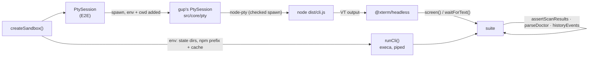

# Design note — test consolidation, platform simulation, coverage floors, end-to-end suites and CI (`test/e2e-coverage-ci`)

Status: `test/e2e-coverage-ci` (wave 3), in two parts. Part 1 (§1–§7) finishes the test strategy
over the suites the earlier branches left in place: one home per behaviour, security rules
gathered where the security workflow runs them, every view of the menu held to WCAG, every
provider replayed on every OS it supports, and coverage floors on the modules where a gap can do
harm. Part 2 (§8–§13) adds the real-machine end-to-end toolkit and suites, CI for them, the
weekly E2E workflow, the local gate runner and the testing guides
([`../testing.md`](../testing.md) and its two checklists).

Sources: testing spec S10, S12, S13, S14, §4, §5.8, §5.10, §5.11, §9, §10; integrated plan §7
(the `test/e2e-coverage-ci` row), §9, §11; amendments IT-1, IT-2, IT-6, X-3, X-4, U-3. Read with
[`test-harness.md`](test-harness.md) (the projects, the fake machine) and
[`provider-contracts.md`](provider-contracts.md) (the contract cases this branch replays).

---

## 1. Consolidation (S10)

Every deleted or merged test is mapped in the body of the commit that removes it: to the test that
now holds its behaviour, or "dropped" with one of the allowed reasons (a duplicate, a mock's call
shape that a behaviour test covers, unshipped code). Each rewrite was checked with seeded
mutations, listed in the same commit bodies.

| Before | After |
|---|---|
| `core/install-source`, `-extra`, `-macos` (three files, two `setPlatform` copies) | one table-driven `core/install-source.test.ts` at the process and `realpath` boundaries; the path classifier stays pinned once, in `security/install-source` |
| `core/registry`, `-extra`, `-log` (the last mocking gup's ownership filter) | one `core/registry.test.ts`; the ownership exclusion runs the real filter over a faked `where` |
| `core/history-paths`, `history-store` at the root of `tests/core` | `core/history/{paths,store}.test.ts`; `paths` keeps what `historyLocation` adds to `stateDir`, whose roots `state/app-dirs` pins |
| argv hardening in `security/command-injection` (3 payloads) and `integration/runner-spawn` (15) | `security/command-injection`: the 15 payloads through `run()` and through the embedded terminal's trampoline (§2) |
| `core/update/retry-consent` | `security/retry-consent`, so `npm run test:security` runs it |
| `ui/select` (a mocked picker) | `ui/prompts/package-picker`: `promptPackageSelection` opens the real picker on the test host |
| `commands/list` (registry, scan screen and table mocked, options checked on the mocks) | the real command over registered providers whose probe and scan are stubbed: stdout, stderr and the history record it writes |
| `renderScanTable` only ever mocked (gap F5) | `ui/table.test.ts`: rows, order, error rows, totals |
| `gup doctor`'s fail-soft detection (F6) tested layer by layer | `commands/doctor-fail-soft.test.ts`: the real command over a throwing and a wedged registered probe |
| 15 suites with their own `process.platform` switch | `tests/support/platform.ts` everywhere |

**Mock call shapes.** A script (kept out of the repository) flagged every test of `tests/{core,
commands,ui,security}` whose assertions were all on mocks: about eighty. A call assertion stays
when the mock *is* the boundary — the argv a process receives, the UAC batch, a PTY kill, a
terminal notification, a log backend, a port a component hands its decisions to: that is what the
code does to the outside world. It goes when it only proves that gup's own helper was called:
the list forwarding tests, `select`'s name mapping, corepack's "both probes in parallel" (which
counted calls and proved no parallelism). `commands/update.test.ts` and `ui/scan-progress.test.ts`
keep their module mocks for now (the spec's verdict is "keep"); their forwarding assertions are
the next candidates.

## 2. The security suite

`tests/security` now gathers, beside the source scans and pins it already had:

- **argv hardening on both spawn paths** — shell metacharacters and variable syntax as literal
  argv entries through `run()`, and through `runInherit` routed to the embedded terminal (a real
  ConPTY/PTY, the tsup-built trampoline). The child writes its argv to a file, so terminal
  wrapping cannot blur the comparison. Skipped only where node-pty is not built (Linux without a
  toolchain).
- **retry consent** (gap F5).
- **package-id allowlists** — every place an id, a font family, a release slug or a path is
  spliced into something another program parses: scoop's charset before its shell, NpackdCL's
  option parser, R code, the Nerd Fonts family, PowerShell literals (PSResourceGet, PowerShell
  modules, the Podman and Rancher Desktop exe paths, the user's font path), GitHub slugs before a
  URL. Most validators are private, so the suite drives the providers on the fake machine: vitest
  routes `tests/security/providers/**` to the `providers` project, and the membership self-test
  pins the route. `npm run test:security` (and the security workflow) runs both projects' files.

## 3. The contrast audit, every view

The audit's machinery is `tests/support/tui/contrast-audit.ts`: the audited rows (every RGB theme
on an unknown terminal; `auto`, `terminal` and `monochrome` on Campbell and Terminal.app Basic;
AAA at 256 colours), `auditMenu()` (the menu booted under the theme engine, frames captured by
state), and the measure (the independent WCAG oracle: 4.5:1 text, 7:1 at AAA, 3:1 borders).
Three suites share it and run in parallel:

| Suite | Walk |
|---|---|
| `contrast-audit` | Paquets (rows, checks, filter, confirmation), Scan with a failure, Providers, Options with every dialog, the JOURNAL rows (the level overridden by the environment, its hint in the warning tone), the colour editor with an unreadable accent |
| `contrast-audit-views` | the Journal's four tabs, the export dialog, the report-opened and failed-export notices; Planification with an enabled, a disabled and a failed schedule, the editor and its warning note, the trigger consent, the run-now notice |
| `contrast-audit-run` | an in-menu update: confirmation, a package installing, typing mode, the stop dialog, the UAC step and its refusal notice, the results with a failure, the HTML report's notice |

Each suite also proves it can fail: the legacy look on a white terminal must produce violations.

**The embedded terminal (IT-6).** The run view's pane is not drawn in the theme's colours, so the
theme says nothing about it: the audit takes the pane's texts out of the theme's measure and holds
them to the IT-6 rule instead — they sit on the terminal's own background, never a painted one,
and are readable there whenever the audited terminal's colours are known. A pane made opaque fails
18 of the 19 run tests.

## 4. Platform simulation (S12)

`tests/platform/platform-simulation.test.ts` (providers project) runs on every CI leg, so a darwin
or linux behaviour runs on the Windows box and a win32 one on the Mac leg:

- **Every contract case on the other OSes its provider supports.** The cases are found on disk
  (`contract-cases.ts`: each exported case list of each `tests/providers/<domain>/*.cases.ts`), so
  a new domain or case file joins without an edit. The machine is rebased (`rebase-machine.ts`:
  the home swapped, separators and drive letters converted, Windows executable extensions dropped;
  paths embedded in a longer argument are left alone) and loaded in explore mode: whatever nobody
  scripted fails, as it would on a real machine.
- **Every registered provider, on each OS it supports, where every probe answers** (a permissive
  machine), each instance built once the OS is simulated (its install hint is picked at
  construction).
- **Contract coverage:** every registered provider has a contract case.

Nothing may reject — `isAvailable`, `listOutdated`, `update`, `updateAll` — and rows and outcomes
keep the contract invariants, with each case's waivers (an update of an id no scan listed only has
to resolve: a single-tool provider answers for its own id). The rows may differ from the case's:
a provider on another OS looks elsewhere. 993 tests; 573 of the 595 replays detect their provider
on the target OS and 385 list rows there, so the parsers do run. A Linux-only throw seeded in the
JetBrains root lookup — a path no case covered — fails 6 of them.

What the simulation cannot show (real `which`, exec bits, symlinks, a real PTY, Terminal.app)
belongs to the macOS CI leg, the E2E workflow (part 2) and the Mac session's checklist (plan
§11.3).

## 5. Coverage floors (S14)

No global threshold any more: coverage is a flashlight, and `src/ui/**` and `menu.ts` are
reported again. `tests/support/coverage-floors.ts` lists the floors of the modules where an
untested branch can do harm — the runner and the PATH lookup, the trampoline payload,
install-source and ownership, elevation and the admin batch, the update pipeline, the config
store, the scheduler's model, triggers and artifact builders, log redaction and data sanitising,
the history, the HTML report's escaping and CSP — each with its measure (Windows 11, Node 26.10,
unit + providers + integration). A floor sits a few points under its measure: some branches only
run on another OS, and CI measures on Linux. Ratchet only: lowering a floor needs its reason in
the commit body. A self-test fails a floor whose glob no longer names a source file (vitest would
say nothing). `check.cmd` runs the typecheck beside security, tests and coverage; its coverage job
fails only on the floors.

Measured with the floors in place: all files 92.38 % branches, 97.54 % lines (UI included).

## 6. Deviations from the testing spec

| # | Spec | Shipped | Why |
|---|---|---|---|
| D1 | `support/tui/frames.ts`: `expectFrameGolden`, `assertFitsWidth` | Not added | The screenshot pipeline (`npm run screenshots:check`) already pins every scene byte for byte; a second golden set would churn on every copy change. The view suites check their own widths (`expectFits`). |
| D2 | `package-id-allowlists` in the unit project | `tests/security/providers/**`, routed to the providers project | The validators are private: only a provider on the fake machine shows the refusal or the escape. |
| D3 | `core/install-source.test.ts` | Stays in the unit project, faking the runner and `realpath` | The fake machine answers `where`/`which` from `bin` itself; the detection table needs multi-line answers, empty successes and rejecting probes. |
| D4 | `history-paths` kept | Slimmed to three tests | `core/state/app-dirs` (scheduler branch) now owns the roots it re-tested. |
| D5 | Platform simulation: each case under each supported platform | Each case under each *other* supported platform | The case's own platform is its domain contract's run. |
| D6 | Floors on five modules (with "added by their areas when they land") | Sixteen globs | The areas that landed in waves 2 and 3 (pipeline, config, scheduler, redaction, report) are the ones the spec deferred to them. |
| D7 | `commands/update.test.ts` reworked when in-TUI updates land | Kept with its module mocks | Out of this part's reach; its forwarding assertions are listed in §1 as the next candidates. |

## 7. Findings in `src` (not fixed here: the run view belongs to `feat/in-tui-updates`)

- **Installer output is white on a light terminal.** The embedded terminal paints text in the
  default colour — an installer's output, gup's own notes in the pane — as explicit white, not in
  the terminal's foreground: OpenTUI 0.5.14's `EmbeddedTerminalRenderable` has no
  default-foreground option. On a light terminal (Terminal.app's Basic profile, macOS's default)
  it measures 1.00:1. `contrast-audit-run` keeps every other check of the four affected rows and
  runs their pane check as `it.fails`, so it turns red once the pane follows the terminal's
  foreground. To check by hand in the Mac session (checklist M-03).

## 8. The end-to-end project (S13)

The `e2e` vitest project exists only with `GUP_E2E=1` and runs the **built** CLI. Its suites live
in three folders, which say what a suite needs:

| Folder | Needs | Runs |
|---|---|---|
| `tests/e2e/smoke/` | nothing but the build and npm | every pull request, three OSes (`GUP_E2E_SCOPE=smoke` keeps the project to it) |
| `tests/e2e/full/` | the machine's real tools, the npm registry | `npm run test:e2e`, `e2e.yml` |
| `tests/e2e/mutate/` | `GUP_MUTATE=1` too (each suite skips without it) | `npm run test:e2e:mutate`, `e2e.yml` |

Files run one at a time (one real machine), 120 s per test, one retry — except the mutating
suites (`retry: 0`: a retry would replay a change). The project's global setup refuses a missing
or stale `dist/` and reports whether node-pty loaded; on macOS that detection also restores
`spawn-helper`'s exec bit (IT-2). The root `reporters` gain the summary reporter (§9) whenever
`GUP_E2E=1`. The membership self-test checks the folders route as described, smoke scope
included.

## 9. The toolkit (`tests/support/e2e/`)

- **Sandbox.** One temp root per suite holds every state directory gup writes to, npm's global
  prefix and its cache. Its `env` is the whole environment of a process started there: the
  worker's own minus gup's variables (the test env turns history and settings off) and the
  `npm_*` variables of the outer `npm run` (`npm_config_prefix` names the real global prefix),
  plus the sandbox's directories. `restrictMenuScan()` writes the scan filter through the
  settings store, so the menu scans npm alone; `historyEvents()` reads the history back with gup's
  own line parser.
- **CLI.** `runCli(args, { sandbox })`: `node dist/cli.js`, stdout and stderr piped (no TTY),
  `extendEnv: false`, a timeout; `describeRun()` makes an assertion message of a run.
- **Terminal.** The E2E `PtySession` does not drive node-pty itself: it starts gup's own
  `PtySession` (`src/core/pty/pty-session.ts`) through a `PtyModule` that adds the sandbox's
  `env` and `cwd` to node-pty's spawn options, so a session ends exactly as an install does —
  `ptyKill`'s tree kill, `releaseConpty` once node-pty reports the exit, the conout worker's
  error contained — and `IPty.kill()` stays out (X-3; `process-chokepoints` now also accepts the
  harness's `#session` receiver). @xterm/headless interprets the output; its answers to the
  app's terminal queries go back to the child, as a real terminal's would. A screen is read once
  xterm has parsed everything received, clipped to the width (a narrowing resize leaves stale
  cells beyond the last column).
- **Oracles.** `assertScanResults` (the `gup list --json` contract, unknown fields refused),
  `parseDoctor` (the three provider groups; an id is a row's last parenthesis, never a hint's),
  `npm-prefix.ts` (install, read and look up versions in the sandbox's prefix). Their pure parts
  have self-tests (`self-test/e2e-toolkit.test.ts`).
- **Reporting.** `summary-reporter.ts` prints one row per suite — result, the tests'
  `annotate()` notes, duration — and appends it to `$GITHUB_STEP_SUMMARY` in CI.
  `saveArtifact()` writes screens of failed menu tests and scan JSON only when
  `GUP_E2E_ARTIFACTS` names a directory: a local screen shows the developer's own packages.

## 10. The suites

| Suite | Asserts |
|---|---|
| `smoke/cli-smoke` | `--version` = package.json; `--help` lists `list update doctor log report schedule`, never `__admin-batch` / `__schedule-tick`; an unknown command exits 1, `update nope` exits 2 (`Format invalide`), `gup` without a terminal exits 1 with the non-TTY message; `doctor` exits 0 with every registered provider in the group this OS gives it (incompatible = the registry's foreign set, detected ∪ missing = the supported set) and, on Windows and macOS, the embedded terminal available; `list --json --fast --provider npm-g` on the empty prefix: the published shape and one `cli` scan in the history; `report --no-open`: a CSP `<meta>` with `default-src 'none'` and no network reference, JSON on stdout; `schedule list`, `list --json`, `status --json` (no trigger, the platform's mechanism), an invalid `add` refused with nothing saved |
| `smoke/menu-pty` | first frame (`gup v<version>`) on the alternate screen; every sidebar view in order, each with a line only it draws, then "Quitter" → exit 0; `q` → exit 0; Ctrl+C → 130; normal screen back each time; a resize to 80×24 redraws the frame on the new last column, hints on the new last row; no process or pseudo-console left (a conhost per session on Windows would show) |
| `full/list-json` | `list --json --fast` on the real tools: the published shape, only providers `doctor` detects, no slow one, one `cli` scan recorded; `--provider` narrows it |
| `full/real-providers` | every detected provider scanned alone, concurrently: exit 0, the shape, its own row only, **no scan error** — a provider that throws on today's tool output is a parser out of step |
| `full/menu-select` | two outdated packages installed in the prefix: Paquets opens on them, `a` checks both, Espace unchecks the one under the cursor, Entrée's confirmation names the other, "non" updates nothing |
| `mutate/sandboxed-update` | `is-number` 6.0.0 in the prefix: `list --json` sees it outdated, `gup update npm-g:is-number --yes` installs the registry's latest (`OK   1 mise(s) à jour effectuée(s)`, a `cli` success in the history); then from the menu: check, Entrée, `o`, the run view's results (`✔ 1 mis à jour`), back to an empty Paquets, a `menu` success with `from`/`to` |
| `mutate/scheduled-update` | a schedule written into the sandbox by gup's own repository, armed two days ago: listed by `schedule list --json`; `schedule run-now` updates the package (`manual` run, success); on Windows, Task Scheduler starts the built tick from a `gup-it-<random>` task through a launcher that applies the sandbox's environment: the package updated, a `schedule` success carrying the schedule's id, the run recorded as on time or caught up, the task deleted — and `afterAll` deletes it again and verifies `schtasks /Query` fails |

The mutating suites touch nothing outside the sandbox: npm's prefix and cache are the sandbox's,
`PATH` is unchanged, the history, settings, log and scheduler state are the sandbox's, and the
scheduled task is not the user's `gup-scheduler-<SID>`. They wait out the tick's five-minute
boot grace on a freshly booted CI runner.

## 11. CI, the E2E workflow and the local runner

**`ci.yml`.** The `test` job keeps its name and matrix (`test (node 26 / <os>)`, the required
checks). Per leg: typecheck (src and tests), build, the tests with `GUP_MUTATE=1` — hosted runners
are thrown away, so the Task Scheduler round trip of `tests/integration/scheduler-windows`
runs on the Windows leg — then the end-to-end smoke. Lint and the security lint stay on Linux,
where the tests run once with coverage (`test:coverage`: the floors) and the report is uploaded.
A new `packed install (node 26 / <os>)` job on Windows and macOS (X-4) runs `npm pack`, then
`npm install --global ./*.tgz --ignore-scripts`, then `gup doctor` must say the embedded terminal
is available.

**`e2e.yml`.** Weekly, on dispatch (`mutate`, `record-fixtures` inputs), and on pull requests
labelled `e2e-full`: the full suites, mutating ones included, on macOS and Windows runners
(JUnit + summary reporter, artifacts uploaded), and `fixtures:record --all` on macOS and Linux,
the recordings uploaded for review.

**`scripts/check.ps1`** (`check.cmd`). Typecheck, lint, security and the tests with coverage in
parallel, then the end-to-end run alone (`-E2E smoke|full|mutate|none`, smoke by default): it
measures a real terminal, which must not compete with the jobs above. The tests now run once
(`test:coverage`) instead of twice.

**The ConPTY fast-exit test.** `integration/pty-session` asserted that a successful install is
reported in under 500 ms, end to end — node's start-up included, which a busy machine (the whole
suite in parallel) easily pushes past it. It now measures what the exit file is for: the success
is reported before node-pty's own exit event, which comes after ConPTY's fixed one-second flush.
Load delays both paths alike. Disabling the fast path makes every attempt lose to the event
(−2, −1, −1 ms) and the test fail.

**The developer's shell.** The runner sets `NO_COLOR=1` for its jobs, and three theme suites
(`themed-appearance`, `options-view`, `settings-module`) went red: they inherited the colour
switch. The worker setup now drops the inherited `NO_COLOR`, `FORCE_COLOR` and every `GUP_*`
variable but the shared test env's and the run's opt-ins (`GUP_E2E`, `GUP_E2E_SCOPE`,
`GUP_MUTATE`, `GUP_E2E_ARTIFACTS`) before any test (`isDroppedFromShell` in `test-env.ts`). The
whole suite is green with `NO_COLOR=1 FORCE_COLOR=1 GUP_ASCII=1` exported.

## 12. Deviations from the testing spec (part 2)

| # | Spec | Shipped | Why |
|---|---|---|---|
| D8 | `PtySession` over node-pty directly | Over gup's own `PtySession`, node-pty's options extended with `env`/`cwd` | One session lifecycle (tree kill, ConPTY release, conout errors), already proven by the integration suites; X-3 holds by construction. |
| D9 | Scope from `GUP_E2E_SCOPE` per suite; `test:e2e`, `test:e2e:mutate` | Folders `smoke`/`full`/`mutate`, the scope choosing the project's `include`; also `test:e2e:smoke` and `opt-in-smoke.env` | The folder says what a suite needs; CI and `check.cmd` call the smoke the same way a contributor does. |
| D10 | A scheduler round trip in the E2E (plan R9: `gup schedule add` → … → `uninstall`) | Windows only, through `WindowsTaskTrigger` with a `gup-it-<random>` name and the built tick; `gup schedule add` never runs | `add`, `enable`, `disable` and `remove` reconcile the per-user trigger `gup-scheduler-<SID>` — on a developer's machine, the user's real one (a disabled-only sandbox would even delete it). launchd's label and the crontab block are fixed too: their round trips stay manual (macOS checklist M-10). |
| D11 | Artifacts always under `e2e/` | Only when `GUP_E2E_ARTIFACTS` is set (`e2e.yml` sets it) | Screens and scan JSON of a developer's machine list their packages. |
| D12 | `e2e.yml` on three OSes | macOS and Windows; fixtures recorded on macOS and Linux | The task's scope; Linux runs the smoke on every pull request, and its fixtures are recorded. |
| D13 | Menu smoke over whatever the machine has | The scan restricted to npm on an empty prefix, through the settings file | Deterministic frames, no network, same on every runner. |
| D14 | Multi-select in the smoke | In `full/` | Outdated packages need the registry. |
| D15 | CI: tests on all legs, coverage on ubuntu, a separate mutate step | Coverage *is* the test run on ubuntu; `GUP_MUTATE=1` on the test step | One run per leg; the only mutating integration suite gates itself on Windows. |

## 13. Findings (not fixed here)

- **`gup update provider:package` records no `from`/`to`.** A named target is updated without a
  scan, so its history record lacks the versions the plan (R6 a) and the testing spec (§9.4)
  expect; the menu's record has them. `mutate/sandboxed-update` asserts what ships and says why.
  A product decision (a scan of the target's provider first) for `src/commands/update.ts`.
- **The confirmation dialog collapses double spaces.** `CONFIRM_UPDATE.item` reads
  `• ms  2.0.0 → 2.1.3`; the dialog shows `• ms 2.0.0 → 2.1.3` (word wrapping). Cosmetic;
  `full/menu-select` compares single-spaced.
- **Unit suites leave temp directories behind.** This machine's temp folder holds thousands of
  `gup-config-*`, `gup-elevation-test-*`, `gup-batch-*`, `gup-admin-batch-test-*`, `gup-nerd-*`,
  `gup-atomic-*`, `gup-lock-*` directories from the waves' runs: suites that `mkdtemp` without
  removing. Harmless, but each run adds to it.
- **Unverified until the branch runs on GitHub:** the new CI steps and jobs (validated against
  the workflow schema, and the packed-install check rehearsed on Windows in a throw-away prefix),
  the Task Scheduler round trip on a hosted Windows runner (its interactive session), the menu
  suites on macOS and Linux runners, and the coverage floors measured on Linux.

## 14. Local campaign (Windows 11, Node 26.10, consent U-3)

| Run | Result |
|---|---|
| `npm run test:e2e:smoke` | 2 files, 21 tests passed (first frame 270–460 ms, `q` → exit 0 in about 1 s) |
| `npm run test:e2e` (read-only) | 7 files: 52 passed, the 5 mutating tests skipped; every provider detected here scanned without an error |
| `npm run test:e2e:mutate` | 7 files, 57 tests passed: `is-number` 6.0.0 → 7.0.0 through `gup update`, the menu's run view, `schedule run-now` and a Task Scheduler tick (`gup-it-<random>`, deleted) |
| afterwards | `Get-ScheduledTask gup-*` empty; no `gup-e2e-*` directory left; the machine's npm prefixes and gup's own state directories untouched |
| `check.cmd` | every check green in 68 s: 354 files, 7828 tests, coverage 92.4 % branches / 97.5 % lines (floors held), the e2e smoke 21/21 |
