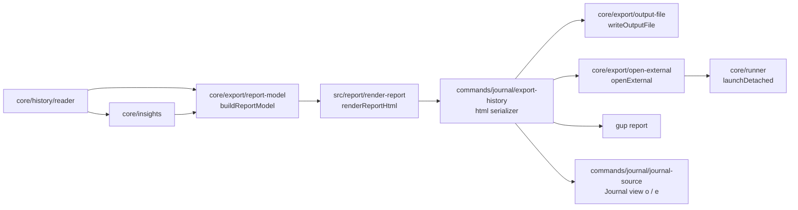

# Design note — the HTML report (`feat/html-report`)

Status: shipped on `feat/html-report` (wave 2, third branch of the observability lane, stacked
on `feat/activity-journal`). It turns the activity history of a period into one self-contained
HTML file, opens it in the user's browser, and makes it the default of `gup report` and the `o`
key of the Journal view.

User ask (translated): "an HTML export that opens a browser window with all the details, a
polished UX/UI, easy to navigate for the average user".

Sources: observability spec §2.4, §3.2 (`core/export`, `ui/report`), §6.3, steps 17–22; integrated
plan §6.7, §9.2 (DoD), C16, C17; amendments F-8, O-2, W2-2, W2-4; the activity-journal hand-off
(`activity-journal.md` §8). Contracts are extended additively (§7).

---

## 1. What the user gets

| | |
|---|---|
| `gup report` | Writes `gup-report-YYYYMMDD-HHmmss.html` to the reports directory (or `--out`) and opens it in the default browser when run from a terminal outside CI; `--no-open` keeps it closed; `--out -` writes the HTML to stdout. The other formats (`text`, `json`, `csv`) are unchanged and still default to stdout. |
| Journal view | `o` (any tab) writes the period's report and opens it; `e` offers it first in the export dialog. The status line says *Rapport ouvert dans le navigateur — path*, or *Rapport écrit, ouverture automatique impossible — ouvrez : path*. |
| The page | French, light/dark/auto theme, five pages: **Vue d'ensemble** (a sentence summing up the period, key numbers that link to their details, the latest weeks' calendar, attempts per week or month, outdated packages over time, failures to watch, most updated packages, providers), **Calendrier** (a grid per year, keyboard-navigable, day → its sessions), **Paquets** (sortable, filterable table; a drawer per package with figures, installed versions and every attempt), **Échecs** (grouped by package and message), **Sessions** (runs by day, attempts on demand, outcome/provider/day filters). Search (`/`), print, a data table behind every chart. |

Screens checked in Chromium (headless, CDP) at 1280 × 900 and 390 × 844, light and dark, with a
year of realistic history and with 56 000 events (50 000 attempts kept: a 2.3 MB file whose
overview is drawn by `DOMContentLoaded`, about 40 ms in headless Chromium on the development
machine; filters answer in under 10 ms).

## 2. Architecture

| Folder | Files | Role |
|---|---|---|
| `core/export/` | `report-types.ts`, `report-model.ts`, `open-external.ts` | The report's data model and its builder; the platform opener. |
| `src/report/` | `render-report.ts`, `html-shell.ts`, `csp.ts`, `embed-json.ts`, `report-dom.ts`, `report-labels.ts` | The page: assembly, static markup, policy, JSON embedding, the id/page contract shared with the script, every French word. |
| `src/report/client/` | `index.ts` + 9 modules | The browser script, plain ES2022 in raw template strings. |
| `src/report/styles/` | `index.ts`, `theme-tokens.ts`, `base.ts`, `components.ts`, `adaptive.ts` | The stylesheet, the themes built from one token table. |

### The model (`report-types.ts`, `report-model.ts`)

`buildReportModel({ events, insights, stats, context })` returns a dictionary-encoded document:

- `strings`: every free text (versions, messages, retry labels, scan errors) interned once, each
  distinct raw value passed through `redactText` (secrets, home → `~`) and bounded to 2 000
  characters (never splitting a surrogate pair). Package ids and provider names are redacted and
  bounded the same way.
- `providers`, `packages` (from the insights: counts, first/last attempt, last version, median
  interval, cadence), `runs` (newest first), `failures`, `days`, `weeks`, `trend`, `totals`.
- `updates`: the newest `MAX_REPORT_UPDATES` (50 000) attempts as tuples
  `[at, package, status, from, to, durationMs, message, run, flags, retry]` (`UPDATE_ROW` names
  the positions, `NONE` = -1 marks an absent value, `UPDATE_FLAGS` = retry 1 · elevated 2 ·
  scheduled 4). `truncated` counts the attempts left out; the figures always cover the whole
  period.
- `meta`: generation instant, gup version, platform, the IANA zone the days were computed in,
  the period (`key`, `label`, `lead` — "Sur les 12 derniers mois" —, `since`, `until`,
  `firstDay`, `lastDay`), the read statistics.

The French period wording comes from the composition root (`periodLabel`/`periodLead` in
`ui/text/journal/activity-labels.ts`): `core` never imports `ui`. 50 000 attempts: 2.2 MB of JSON, built
in about 0.1 s.

### The page (`src/report/`)

`renderReportHtml(model)` assembles: CSP meta, `referrer` no-referrer, `color-scheme`, the escaped
title, a `data:` SVG icon, ``, the static body (`html-shell.ts`), two
JSON blocks (`gup-report-labels`, `gup-report-data`) and ``.

- **Shell**: skip link, header (title, period, search, theme switch, print), nav (with counts),
  one empty `<section>` per page, footer (generation line, privacy line, read notes, "Comment lire
  ce rapport"), the drawer (`<dialog>`), tooltip, live region, `<noscript>`, and an inline
  zero-size SVG holding the hatch/dot patterns. Every text comes from `REPORT_LABELS` through
  `escapeHtml`; data never reaches the markup.
- **Script** (`client/index.ts`): one strict IIFE: a prelude of constants generated from the
  TypeScript sources (`NONE`, `IDS`, `ROW`, `FLAGS`, `STATUS`, `STATUS_NAMES`), then `core`
  (data, labels with French plural rules, `Intl` formatting in the report's zone, day arithmetic,
  DOM builders), `ui` (cards, figures with their data tables, tooltip, pills, controls),
  `charts` (stacked columns, step line with a crosshair, heat grid), the five pages, `drawer`,
  `main` (hash router, header, search, theme, print, `boot()`). Pages render on first visit;
  lists show 100 rows (50 for failures and sessions) at a time, each list's "Afficher … de plus"
  naming and applying its own step.
- **Routing**: `#/overview`, `#/calendar`, `#/packages[/<n>]`, `#/failures`, `#/sessions[?day=]`,
  and `?pkg=<n>` on any page for the drawer — Back closes it, focus returns to the control that
  opened it (or the package's button when a row was clicked outside it: the click focused the
  `<main>` region, which is not a control). Closing the drawer with its button or Échap goes back
  over the history entry the page added to open it, so the next Back leaves the page rather than
  reopening the package; an address typed or reloaded with `?pkg=` gets a new entry instead. A
  visit redraws a list only when what it shows changed (the search, the day asked for), so
  closing a drawer leaves the page as it was, opened sessions included.
- **Moving between pages**: a page reached from another one opens at its top; its heading takes
  the focus when the focus was inside the old page (a key number, *Tous les paquets*, a calendar
  day) or the move came from the navigation, while a focus in the header — the search box being
  typed in — stays put. The sticky header (120 to 180 px as it wraps) sets the page's
  `scroll-padding-top` through a `--masthead-height` property updated on resize, so a control
  reached with Tab or Shift+Tab is never under it. The skip link moves the focus to `<main>`
  without touching the address; an address not starting with `#/` (a typed `#main`) is an
  anchor, not a route.
- **Styles**: system fonts only, a token table per theme (`THEME_TOKENS`) emitted as custom
  properties under `:root`, `prefers-color-scheme: dark` (unless *Clair*), `[data-theme="dark"]`,
  and `@media print` (always light). Narrow screens stack the header, keep charts and the packages
  table readable by scrolling them sideways — opened on their latest weeks —, give the package
  column a readable width, put the drawer's buttons above its title, and hide two optional
  columns. Print hides the same columns (the table then fits A4) and every control. Reduced
  motion and forced colours are handled.

### Data-visualisation choices

Checked against the data-viz method used for this branch (form, colour job, marks, hover,
accessibility): one sequential green ramp for the calendar (levels by quartiles of the distinct
daily counts, the terminal heatmap's rule), status colours only for outcomes and always with an
icon and a word, thin columns (≤ 24 px, 4 px rounded data end, 2 px gap between stacked
segments), hairline grid, a 10 % area under the outdated line with a ringed end dot, a legend for
the three outcomes, a tooltip on every column, cell and the line (keyboard focus shows the same in
the calendar), a table view for every chart. The palette validator rates the green/red/amber
status trio as indistinguishable for deuteranopes (ΔE 1.8), so failures are always hatched and
skips dotted — the spec's patterns, kept on by default for that reason.

## 3. Security

| Threat | Answer |
|---|---|
| Script injection through history text (package ids, messages are tool output) | Data travels only in `` is shown as text (DOM and Chromium checked). |
| Anything else running or loading | CSP `default-src 'none'; script-src 'sha256-…'; style-src 'sha256-…'; img-src data:; base-uri 'none'; form-action 'none'; require-trusted-types-for 'script'; trusted-types 'none'`. Hashes computed at render time over the exact inline texts; a test recomputes them from the file. Trusted Types makes any string-to-HTML sink throw where enforced. |
| Network / tracking | No URL anywhere in the script (the SVG namespace is read from the page's own SVG element); the only `http` string in the file is the `xmlns` inside the inline icon. `no-referrer`, no external resource, no fonts. |
| Sinks creeping in | `tests/ui/report/report-client-lint.test.ts` lints the shipped script with ESLint's `Linter` (browser globals only, `no-undef`, `no-unused-vars`, function ≤ 30 lines, complexity ≤ 10, depth ≤ 3, params ≤ 3, `no-eval`/`no-implied-eval`/`no-new-func`, no `innerHTML`/`outerHTML`/`insertAdjacentHTML`/`write`) and searches it for forbidden tokens (`innerHTML`, `eval(`, `new Function`, `javascript:`, `http(s)://`, `fetch(`…). |
| Secrets in a shared file | Every free text redacted again when the model is built (`redactText`), home shortened to `~`. |
| Opening the file | `openExternal` → `runner.launchDetached` (argv barrier, no shell, detached, `stdio: "ignore"`): `%SystemRoot%\explorer.exe` by absolute path (fallback `C:\Windows`), `/usr/bin/open`, `xdg-open` / `wslview`. A path with `,` or `"` is never handed to explorer (its parser splits there); relative paths are refused. Never `cmd /c start`, `rundll32`, nor the `open` package. A launcher refused or failing to start is "not opened", never an error. |
| Files | Written by `writeOutputFile` (`wx`, 0600, 20 newest kept). |

## 4. Cross-platform

- The opener is a pure function of injected facts (`openerFor(file, { platform, env, launchers })`):
  Windows, macOS, Linux and WSL are tested from any machine; `openExternal` takes `launch`,
  `which`, `platform`, `env` overrides and only searches PATH where a desktop launcher must be
  found.
- Days are the generating machine's local days; the page formats every date in the zone recorded
  in `meta.timeZone` (falling back to the viewer's when the browser does not know it), so a report
  reads the same wherever it is opened. Relative times ("il y a 2 jours") are relative to the
  generation instant: the report is a snapshot.
- Browsers: Chrome/Edge, Firefox, Safari of the last years (native `<dialog>`, `:focus-visible`,
  container query units for the calendar size); unknown CSP directives are ignored.

## 5. Tests

| Suite | Checks |
|---|---|
| `tests/core/export/report-model.test.ts` | tuples decode back to the events, interning, insights/meta carried, redaction and home shortening, 2 000-character bound, a package unknown to the insights, the 50 000 cap with its count, under 5 MB |
| `tests/core/export/open-external.test.ts` | argv per platform (explorer by SystemRoot and fallback, comma/quote/relative refusals, `/usr/bin/open`, `xdg-open`, WSL `wslview` first), PATH searched on Linux only, launchers that fail, refuse or throw — always a mocked launcher |
| `tests/ui/report/render-report.test.ts` | CSP hashes equal the SHA-256 of the inline style and script, no external resource/handler/`style=`, the only URL is the icon's namespace, the JSON blocks read back intact, hostile text escaped in the data block and absent from the markup, the title escaped |
| `tests/ui/report/report-client-lint.test.ts` | the ESLint pass and the token search above, classic-script compilation, no `</script` in the script, every label key the script asks for exists |
| `tests/ui/report/contrast.test.ts` | the custom properties parsed from the shipped stylesheet: dark under the media query equals the explicit dark theme, print equals light; text pairs ≥ 4.5:1, marks ≥ 3:1 on surface and page, heat levels ordered — with the shared oracle `tests/support/contrast/wcag.ts` |
| `tests/ui/report/report-dom.test.ts` | the generated file loaded in a happy-dom `Window` running the page's own script: hero sentence and key numbers, nav counts, chart table toggle, empty period, truncation banner, 366 calendar cells in two year grids, arrow keys and Entrée to the day's sessions, heat levels 1,1,2,3,4,8 → 1,1,1,2,3,4, search (live count, failure messages, from another page), sorting with `aria-sort`, drawer open/close with focus back (also after a click outside the row's button) and address sync, Back closing it, a closed drawer leaving no entry for Back, failures, sessions filters, 50 at a time and lazy attempts, hostile text as text, theme switch and memory, `/` and Échap, the search keeping the focus while it changes the page, a link to another page focusing its heading, the skip link keeping the address, every page and row rendered before printing and the first rows after — and no console error |
| `tests/commands/journal/report-command.test.ts` | html by default to the reports directory and opened (mocked), `--no-open`, no terminal or CI → not opened, open failure → exit 0 with the address, `--out -`, the truncation notice past 50 000 attempts, `report.export` and `report.open` logged |
| `tests/commands/journal/journal-source.test.ts`, `tests/ui/panels/journal/journal-panel.test.ts`, `tests/ui/views/journal-view.test.ts` | `html` export asks to open and reports `opened`; `o` on every tab; the dialog's first choice; the not-opened warning line; `o` through `bootMenu` |
| `tests/ui/text/journal/activity-labels.test.ts` | `periodLead` for every period form |

No unit test starts a browser: `openExternal` is injected or module-mocked (W2-4).

happy-dom computes no layout, so what depends on it — the sideways charts opening on their latest
weeks, the scroll padding under the sticky header, the phone and print layouts — was checked in
headless Chromium through CDP (390 × 844 and 1280 × 900, light and dark, print media emulation
after `beforeprint`, real mouse and key events for the focus paths), not by the unit suites.

## 6. Decisions and deviations

- **`src/report/**`, not `src/ui/report/**`** (F-8, O-2): the page is not terminal-rendered, so it
  stays outside the terminal glyph guard; its tests live under `tests/ui/report/` (W2-2). The CLAUDE.md
  scope map has no entry for `src/report/`; commits use the scope `report`.
- **Report labels in `src/report/report-labels.ts`**, not `src/ui/text/` (F-10 targets terminal
  labels): they are browser strings, embedded as a JSON block so the script carries no text and
  its hash does not move when a word changes. `gup report`'s own terminal messages stay in
  `ui/text/journal/report-labels.ts`, the Journal's in `ui/text/journal/journal-labels.ts`.
- **Model shape**: as the spec, plus `meta.period.lead/firstDay/lastDay`, `UPDATE_FLAGS.scheduled`,
  run outcome counts, `UPDATE_ROW` positions; `buildReportModel` takes the context (now, names,
  wording, version, platform, zone) as one object.
- **WSL opens with `wslview` before `xdg-open`** (spec: the reverse): a bare `xdg-open` in WSL
  without a desktop falls back to a text browser, invisible behind a detached launch.
- **DOM tests load the real file in a happy-dom `Window`** with the page's script evaluated by
  happy-dom, rather than a per-file `@vitest-environment happy-dom` and a manual `eval`: the page
  installs window listeners, and a fresh window per test is the isolation a fresh tab gives.
- **Print**: `beforeprint` renders the pages not yet visited and lifts the row limits; CSS shows
  every page one after the other. No `#print-root` copy (it would duplicate ids and patterns).
  The packages table drops its two optional columns on paper (the median interval and the last
  version, both in the drawer): with eight columns it ran past an A4 page's right margin.
- **Patterns always on** for failures and skips (§2), not only in print.
- **Empty calendar days are a dot** at 3:1, not an outlined square: a year of outlined squares
  is noisy; the dot echoes the terminal's `·`.
- **No URL in the script**: the SVG namespace comes from `document.querySelector("svg.defs")`,
  which keeps `tests/security/http-targets.test.ts` untouched and the script's token test strict.
- **Opening rules**: `--open` is implicit for `html` written to a file, in a terminal, outside CI;
  `--out -` prints the HTML and never opens.
- **The Échecs nav count is the number of failed attempts** (the key number), not of groups.
- **`report.open`** is logged (opened, launcher, reason) after `report.export`.
- **One search box** in the header for the whole report (packages, providers, versions, failure
  messages); typing elsewhere goes to Paquets.
- **The drawer's address** also works as `?pkg=<n>` on every page, so opening a package from
  Échecs or Sessions keeps that page underneath. Closing it pops the entry the page pushed
  (`history.back()`, only when the address is still that entry) rather than pushing the page
  again, which made Back reopen the package before leaving.
- **Weekly columns become monthly** beyond 60 weeks (an "all" period over years).
- **Calendar detail panel**: the focused or hovered day is described in a live region and links
  to its sessions; it starts on the last active day.
- **No `o` in the run view** (O-3): wave 3, through a port injected by `menu-views.ts` (done:
  [`journal-settings.md`](journal-settings.md) §6).

## 7. Contract changes (additive)

| Contract | Change |
|---|---|
| `commands/journal/export-history.ts` | `HistoryFormat` gains `html` (first); `HistoryExportRequest.open?`; `HistoryExportResult.truncated` and `.opened` (`OpenResult \| null`); `ExportDeps.openExternal`; `SERIALIZERS.html` |
| `commands/journal/report-command.ts` | default format `html`; `--no-open`; `ReportOptions.open?` |
| `ui/panels/journal/journal-source.ts` | `ExportFormat` gains `html`; `ExportOutcome.opened?` |
| `ui/text/journal/activity-labels.ts` | `periodLead(period)` |
| `ui/text/journal/report-labels.ts`, `journal-labels.ts` | the report's command help, messages and status lines; the Activité hint gains `o rapport HTML` |

## 8. Folder budget

`core/export` 7 · `src/report` 6 + `client/` 10 + `styles/` 5 · `tests/ui/report` 5.

## 9. Hand-off

- **`feat/journal-settings` (wave 3)**: `report.autoOpen` → `reportRequestOf` (`opensBrowser`)
  and the Journal's `o` (`journal-source.ts` asks to open every HTML export today). (Done, as
  `journal.openReport`: [`journal-settings.md`](journal-settings.md).)
- **Run view (O-3)**: a port giving `exportHistory({ format: "html", open: true, … })` for the
  run's period. (Done: [`journal-settings.md`](journal-settings.md) §6.)
- **Wave-3 docs**: `cli-reference.md` (`gup report` html default, `--no-open`, `report.open`),
  `SECURITY.md` (the report's CSP, Trusted Types, JSON embedding, opener), `architecture.md`
  (`src/report/` and the data flow above), README feature list; screenshots of the report for
  the docs (the CDP harness used here is not committed: `chore/screenshot-pipeline` owns
  screenshots). (Done in the 0.5.0 documentation pass; the picture is
  `docs/assets/screens/html-report.png`, made by `npm run screenshots:report`.)
- **Manual pass (R7)**: open a real report in Edge, Chrome, Firefox, Safari; check the DevTools
  console for CSP messages, keyboard-only navigation, print preview, dark mode, Narrator /
  VoiceOver on the key numbers, table and drawer.
