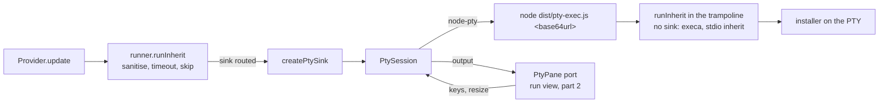

# Design note — in-app updates (`feat/in-tui-updates`)

Status: **part 1 of 2 shipped — the process side** (`src/core/pty/`, `src/pty-exec.ts`). It lets
any install run in an embedded pseudo-terminal through the foundation's install sink, and it is
complete and tested on its own. Part 2 — the run view (`src/ui/run/`), the in-screen launcher,
the `embeddedTerminalModule` and the user guide — plugs into the port described in §4 and
extends this note. Sources: `update-flow.md` (B5, B8), the integrated plan §6.4, amendments
IT-1…IT-4, F-4, W2-5.

---

## 1. The chain



Providers do not change: they keep calling `runInherit`. With the PTY sink routed
(`routeInheritTo(createPtySink(support, panes))`), the runner hands the already-sanitised
request to the sink, which starts the **trampoline** in a pseudo-terminal. The trampoline calls
the same `runInherit` with no sink, so execa resolves PATHEXT, escapes `.cmd` targets and
applies the argv barrier exactly as without a PTY. node-pty never starts an installer directly:
its Windows spawn ignores PATHEXT and has no cmd.exe escaping.

## 2. Modules (`src/core/pty/`, 9 files, no OpenTUI import)

| File | Role |
|---|---|
| `pty-loader.ts` | `loadEmbeddedTerminal()` (cached) / `detectEmbeddedTerminal(steps)`; the node-pty subset gup types (`PtyHandle` has **no** `kill`); `NODE_PTY_PIN` |
| `trampoline.ts` | `locateTrampoline()`, `trampolineLaunch(request, location, exitFile?)` |
| `trampoline-payload.ts` | payload v1: `encodePayload`, `decodePayload` |
| `pty-session.ts` | `PtySession` (an `InheritProcess`), `releaseConpty`, `isReleasableConpty` |
| `pty-kill.ts` | `ptyKill.terminate/force` |
| `exit-file.ts` | the Windows exit-code fast path |
| `spawn-helper.ts` | macOS `spawn-helper` exec bit |
| `pty-sink.ts` | `createPtySink(backend, panes)` and the pane port |
| `pty-labels.ts` | the French strings (reasons, pane note, trampoline refusal) |

`src/pty-exec.ts` is the trampoline, a second tsup entry (`dist/pty-exec.js`, 9 KB: dependencies
stay external) so an install does not pay for loading the CLI. `tsup.config.ts` also marks
`node-pty` external (tsup externalises dependencies and peers, not optional dependencies).

## 3. Detection

`detectEmbeddedTerminal` never rejects; each step can say no, with the reason shown by the
update confirmation and `gup doctor`:

| Step | Unavailable reason |
|---|---|
| `GUP_PTY` ∈ `0 false off no` (trimmed, any case) | `désactivé par GUP_PTY` |
| no `pty-exec` sibling of the real CLI file | `lanceur pty-exec introuvable` |
| `import(<non-literal "node-pty">)` fails or has no `spawn` | `node-pty absent` (message at `debug`) |
| macOS: prebuilt `spawn-helper` not executable and not ours to fix | `spawn-helper non exécutable — chmod +x <path>` |
| probe: `node -e ""` in a 20×5 PTY, exit 0 within 5 s | `échec du test du pseudo-terminal : <détail>` |

- **Trampoline lookup.** `realpath(process.argv[1])` (the npm global bin symlink), then
  `pty-exec` with the CLI's own extension, so `tsx src/cli.ts` finds `src/pty-exec.ts`. Node
  flags are kept by allowlist: `--import`, `--require`/`-r`, `--loader`, `--experimental-*`,
  `--disable-warning*`, `--no-warnings` (with their values). `--inspect*`, `--debug*` and anything
  else are dropped.
- **Non-literal specifier.** `NODE_PTY_SPECIFIER` is typed `string`, so typecheck and the bundle
  never resolve node-pty: gup builds and runs where the optional install failed.
- **ConPTY shape guard (IT-1).** On Windows the loader wraps node-pty's `spawn`: a handle that
  `releaseConpty` cannot release (another node-pty version, winpty on a pre-1903 build) is
  tree-killed and the spawn throws. The probe goes through it, so such a node-pty is reported
  unavailable up front instead of leaking a conhost per install. A unit test ties `NODE_PTY_PIN`
  to `package.json`'s exact pin: bumping node-pty means re-checking `releaseConpty`.
- **spawn-helper (IT-2).** On macOS, before the probe: `prebuilds/darwin-<arch>/spawn-helper`
  under node-pty's resolved package directory. Not executable and owned by the current uid →
  `chmod 0755` once; owned by someone else or still not executable → the reason above. A missing
  prebuild (node-pty built from source) needs nothing.
- **Cost.** The probe waits for node-pty's own exit event: about 1.1 s on Windows (ConPTY's
  flush, §5), node's start-up time elsewhere, once per process. Part 2 should start `loadEmbeddedTerminal()`
  when the menu opens so the confirmation never waits for it.

## 4. The sink and its pane port

```ts
createPtySink(backend: PtyBackend, panes: PtyPanes): InheritSink   // mode "pty"
interface PtyPanes { current(): PtyPane }
interface PtyPane {
  size(): { cols; rows };              // the child's start size
  write(data: string): void;           // VT output
  note(line: string): void;            // gup's own line (installConsole, spawn failure)
  attach(input: PtyInput): () => void; // keys, pastes, terminal responses, resizes → session
  tail(): string;                      // visible tail → InheritExit.outputTail (the trace)
}
interface PtyInput { write(data: string | Uint8Array): void; resize(cols, rows): void }
```

`start(request)` binds `panes.current()` **at spawn** (IT-3): the run view opens the next
package's pane as soon as this one reports its outcome, while this child's last output may still
be on its way. Then: trampoline launch → `PtySession.start` at the pane's size → `attach`; on
`exited` the keyboard is given back (`detach`) and `outputTail = pane.tail()`. A session that
cannot start (spawn error, payload too long) is an already-exited failed process (`-1`) with
`Impossible d'ouvrir le terminal intégré : <raison>` noted in the pane; `runInherit` never throws
for it. A pane that throws on output, note, attach or tail never fails the install.

## 5. Sessions, exit and kill

- **Spawn.** `TERM=xterm-256color`, the pane's size clamped to at least 20×3, node-pty's default
  env (`process.env`; node-pty drops `TMUX`, `COLUMNS`, `LINES` on POSIX), no cwd (the cwd travels
  in the payload). ConPTY defaults: system ConPTY (`useConptyDll` false: 3 s per call measured).
- **Exit mapping.** `signal ? -1 : exitCode`, `failed` on a non-zero code or any signal;
  `runInherit` normalises Windows codes to signed 32-bit, so `-1` and `3010` read the same in both
  modes.
- **Kill (skip, timeout).** `ptyKill.terminate(pid)`: Windows `taskkill /T /F` on the trampoline
  (the runner's `killProcessTree`), POSIX `SIGTERM` to the process group (node-pty starts the
  child as a session leader); after 5 s without an exit, `SIGKILL` to the group (POSIX).
  Idempotent, never throws. **`IPty.kill()` is never called**: on Windows it forks a
  console-list agent that crashed with `AttachConsole failed` and printed its stack on gup's
  stderr, over the full-screen app.
- **ConPTY release (IT-1).** node-pty 1.1.0 calls `ClosePseudoConsole` only inside
  `WindowsPtyAgent.kill()`. After a natural exit it left one `conhost.exe` and one conout drain
  worker (a `MessagePort`) per session for the life of gup. Once node-pty reported the exit, the
  session calls `releaseConpty(handle)`: `_ptyNative.kill(_pty, false)` (the close),
  `_conoutSocketWorker.dispose()`, `_inSocket.destroy()`, `_outSocket.destroy()` — shape-checked,
  once per handle (a second close is a native use-after-free), Windows only, never throwing —
  also after a fast exit (below), whose pseudo-console still closes at node-pty's event.
  Exported for the wave-3 E2E harness.
- **Exit-file fast path (B8, IT-3, IT-4).** node-pty reports a ConPTY exit only after a fixed 1 s
  flush. On Windows the sink gives the trampoline an exit file: a random name in a fresh private
  `mkdtemp` directory (`gup-pty-*`), removed before the install is reported settled (so
  nothing is left if gup exits right after its last install). The trampoline writes
  `<name>.tmp` with `wx` and renames it; the session polls every 100 ms and accepts only
  `/^-?\d{1,10}\n$/`. **A 0 settles the install at once; any other code still waits for the exit
  event**, by which time ConPTY has flushed, so a failure's tail is complete. Measured: about
  250 ms per successful install instead of 1.2 s. Output that arrives after a fast exit still
  lands in the pane bound at spawn.
- **Trampoline.** Ignores `SIGINT` (Ctrl+C typed in the pane is the installer's to handle), runs
  the request with `timeout: 0` (the parent owns the timeout and kills the tree), exits with the
  installer's code. A payload it cannot decode, or a request the runner's barrier refuses:
  `gup : requête de terminal invalide` on the pane, exit 2.

## 6. Payload v1

One argument, `base64url(JSON.stringify({ v: 1, command, args, cwd?, shell?, exitFile? }))`, at
most 24 000 characters (headroom under Windows' 32 767-character command line; cmd.exe's 8 191
still applies to `.cmd` targets, as without a PTY). `decodePayload` checks the charset and length,
parses, and rebuilds the object from validated fields: another version, an unknown key (including
`__proto__`), a wrong type or an empty command is refused.

## 7. Security properties

1. **One spawn path for installers.** They are started only by execa inside `runInherit` — in
   the parent (terminal, pipe) or in the trampoline (PTY). node-pty's command line is always
   `process.execPath`, the kept loader flags, the trampoline's absolute path and `[A-Za-z0-9_-]+`.
2. **Sanitisers run twice:** the request reaching the sink was built after `sanitizeCommand` /
   `sanitizeArgs`, and the trampoline's `runInherit` applies them again.
3. **`shell` stays a boolean variable**, never a `shell: true` literal (`shell-usage` drift test).
4. **No new exposure.** Same environment; the payload in the process list carries what the
   installer's own command line carries. The exit file is private, random, `wx`, integer-only.
5. **Drift tests** (`tests/security/process-chokepoints.test.ts`, TypeScript AST): node-pty is
   named only by `pty-loader.ts` in `src`, never imported by tests or tooling, spawned only by
   `PtySession`; no `.kill(…)` / `["kill"](…)` on any receiver but `process`, a `session`/`child`
   install process, or `_ptyNative` in files that can reach a node-pty handle (the PTY layer, its
   test support and their importers — `src`, `tests`, `scripts`); `PtyHandle` has no `kill`
   (type-level assertion).

## 8. Refused packages no longer stop a batch (W2-5)

`applyUpdate` turns a rejecting `provider.update()` into a failed outcome, finalised (interrupt
flags consumed) and recorded in the history like any failure, and the batch goes on:
`refusé par la barrière de sécurité : <raison>` when the runner's argv barrier refused (its errors
start with `runner: `), `erreur inattendue : <raison>` for anything else.

## 9. Cross-platform notes

- **Windows (ConPTY).** The pid node-pty reports is the trampoline's (inner pid); `taskkill /T`
  takes the installer tree down. Exit codes come back signed. GUI-fallback installers keep
  their windows (the trampoline runs today's execa options). The UAC batch (`Start-Process -Verb
  RunAs -Wait`) runs in the pane; the elevated window is outside our tree, as before.
- **macOS.** Prebuilds for x64/arm64 through `spawn-helper` (§3). `sudo port|fink|pkgin` and the
  POSIX elevated batch (`sudo node … __admin-batch`, F-4) go through `runInherit`, so they run in
  the pane: one password prompt per batch, typed in the pane (IT-7; the pane title is part 2).
- **Linux.** No prebuild: node-pty builds with node-gyp when a toolchain exists, otherwise the
  optional install is skipped and the menu falls back to updating outside the screen.
- **npm 11** reviews install scripts (`--allow-scripts=node-pty`; `--ignore-scripts` is harmless
  on Windows and macOS thanks to the runtime `spawn-helper` fix) — foundation note §6.

## 10. Tests

| Suite | What it holds |
|---|---|
| `tests/core/pty/*.test.ts` (unit, every OS) | payload round trip and refusals; trampoline lookup, symlinked CLI, execArgv allowlist, launch; exit file write/read/watch, strict parse, `wx`; ptyKill per platform (taskkill and `process.kill` replaced); session I/O, clamping, exit mapping, kill grace (fake timers), fast path, ConPTY release once and only for the pinned shape; every detection step and reason, default probe, Windows shape guard, cache, pin; sink binding, keyboard, tail, spawn failure, routed by `runInherit`; spawn-helper branches (+ a real 0644 file on POSIX) |
| `tests/integration/pty-session.test.ts` | a real ConPTY / PTY: availability (**fails** on Windows and macOS, may skip on Linux), output, exit codes 0/3010/7/-1, a prompt answered by typing in the pane, a skip that kills the whole tree and leaves no child, a `.cmd` shim by bare name, shell routing, a success under 500 ms (best of 3), 20 sequential installs leaving no conhost child and no `MessagePort`, the sources under tsx |
| `tests/security/process-chokepoints.test.ts` | §7.5 |
| `tests/core/update/apply-update.test.ts` | §8, through the real argv barrier |

The integration suite builds the trampoline with tsup's API (same options as `tsup.config.ts`)
into `node_modules/.cache/gup-pty-exec-*`, so its external imports resolve like `dist/`'s; one
test runs `src/pty-exec.ts` under tsx. The leak test was checked against a build without
`releaseConpty` (it fails: 20 conhost children). Process queries (`tests/support/pty/processes.ts`)
use CIM on Windows and `ps` on POSIX, read-only.

## 11. Deviations from the plan and the spec

| Spec / plan | Shipped | Why |
|---|---|---|
| `PtyTerminalSink` class in `ui/run/pty-terminal-sink.ts`, taking `TerminalPanes` | `createPtySink(backend, panes)` in `core/pty/pty-sink.ts`, over a `PtyPanes` port | No OpenTUI type in `core`; the sink is tested with recording panes; part 2's `TerminalPanes` implements the port. `ui/run` keeps a slot. |
| `exitFileDir()` (async) + `exitFilePath(dir)` + `readExitFile` | `createExitFileSlot()` (sync, one private directory per session, released on close) + `watchExitFile` | `InheritSink.start` is synchronous; per-session directories need no sink lifecycle. |
| Fast path on the first valid code | Only a 0 settles early | IT-3's "skip the fast path on non-zero exit": a failure's tail must be complete. |
| Shape check "for the probe" | Loader's spawn wrapper, every spawn (probe included) | One check site; production handles come from the same module. |
| Integration trampoline `src/pty-exec.ts` under `--import tsx`; spawn-helper chmod in a globalSetup | The tsup-built bundle (plus one tsx test); the suite calls `detectEmbeddedTerminal`, which runs the chmod | What users run, timing without tsx start-up; `vitest.config.ts` is frozen in wave 2. |
| W2-5 message for every rejection | Barrier refusals get it; other rejections `erreur inattendue : …` | A provider bug labelled "security barrier" would mislead. |
| `PtySession.start/exited/lastOutputAt/write/resize/kill` | Same, without a `pid` getter | Nothing needs it; the kill goes through the session. |
| execArgv: "keep … drop `--inspect*`/`--debug*`" | Allowlist: everything not kept is dropped | Predictable, and no stray value of a dropped flag survives. |

No foundation contract changed. The `0 false off no` switch set now exists in three modules
(`config/paths.ts`, `history/store.ts`, `pty/pty-loader.ts`); the first two belong to other
branches, so the shared helper is left to the wave-3 consolidation.

## 12. Hand-off to part 2

- `ui/run/terminal-panes.ts` implements `PtyPanes` over `EmbeddedTerminalRenderable` (`onData` →
  `input.write`, `onTerminalResize` → `input.resize`, `tail()` from `screen().lines`).
- The in-screen launcher: `support = await loadEmbeddedTerminal()` (warmed at menu start);
  unavailable → `outsideLauncher` with `support.reason`; available → `routeInheritTo(
  createPtySink(support, panes))` around the run, restored in `finally`; closes its own gate on
  SIGBREAK/SIGTERM/SIGHUP while the batch runs (W2-6).
- `embeddedTerminalModule`: installs the launcher factory for the menu; `diagnostics()` reports
  `loadEmbeddedTerminal()` (available, or the reason — the spawn-helper path included).
- UI amendments IT-5 (dialog focus), IT-6 (default background), IT-7 (sudo pane title).
