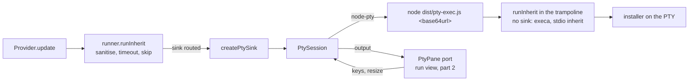
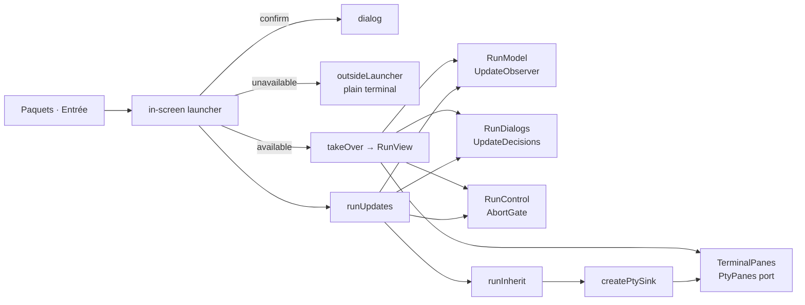

# Design note — in-app updates (`feat/in-tui-updates`)

Status: **shipped.** Part 1 is the process side (`src/core/pty/`, `src/pty-exec.ts`, §1–§11):
any install can run in an embedded pseudo-terminal through the foundation's install sink. Part 2
is the screen side (§12–§19): the run view (`src/ui/run/`), the in-screen launcher
(`src/ui/app/in-screen-launcher.ts`) and the `embedded-terminal` CLI module, so an update
confirmed in the menu runs inside gup and lands back on Paquets. User guide:
[`docs/guide/interactive-app.md`](../../guide/interactive-app.md). Sources: `update-flow.md`
(B5, B7, B8), the integrated plan §6.4, amendments IT-1…IT-7, F-4, F-6, W2-5, W2-6, W2-7.

---

## 1. The chain



Providers do not change: they keep calling `runInherit`. With the PTY sink routed
(`routeInheritTo(createPtySink(support, panes))`), the runner hands the already-sanitised
request to the sink, which starts the **trampoline** in a pseudo-terminal. The trampoline calls
the same `runInherit` with no sink, so execa resolves PATHEXT, escapes `.cmd` targets and
applies the argv barrier exactly as without a PTY. node-pty never starts an installer directly:
its Windows spawn ignores PATHEXT and has no cmd.exe escaping.

## 2. Modules (`src/core/pty/`, 9 files, no OpenTUI import)

| File | Role |
|---|---|
| `pty-loader.ts` | `loadEmbeddedTerminal()` (cached) / `detectEmbeddedTerminal(steps)`; the node-pty subset gup types (`PtyHandle` has **no** `kill`); `NODE_PTY_PIN` |
| `trampoline.ts` | `locateTrampoline()`, `trampolineLaunch(request, location, exitFile?)` |
| `trampoline-payload.ts` | payload v1: `encodePayload`, `decodePayload` |
| `pty-session.ts` | `PtySession` (an `InheritProcess`), `releaseConpty`, `isReleasableConpty` |
| `pty-kill.ts` | `ptyKill.terminate/force` |
| `exit-file.ts` | the Windows exit-code fast path |
| `spawn-helper.ts` | macOS `spawn-helper` exec bit |
| `pty-sink.ts` | `createPtySink(backend, panes)` and the pane port |
| `pty-labels.ts` | the French strings (reasons, pane note, trampoline refusal) |

`src/pty-exec.ts` is the trampoline, a second tsup entry (`dist/pty-exec.js`, 9 KB: dependencies
stay external) so an install does not pay for loading the CLI. `tsup.config.ts` also marks
`node-pty` external (tsup externalises dependencies and peers, not optional dependencies).

## 3. Detection

`detectEmbeddedTerminal` never rejects; each step can say no, with the reason shown by the
update confirmation and `gup doctor`:

| Step | Unavailable reason |
|---|---|
| `GUP_PTY` ∈ `0 false off no` (trimmed, any case) | `désactivé par GUP_PTY` |
| no `pty-exec` sibling of the real CLI file | `lanceur pty-exec introuvable` |
| `import(<non-literal "node-pty">)` fails or has no `spawn` | `node-pty absent` (message at `debug`) |
| macOS: prebuilt `spawn-helper` not executable and not ours to fix | `spawn-helper non exécutable — chmod +x <path>` |
| probe: `node -e ""` in a 20×5 PTY, exit 0 within 5 s | `échec du test du pseudo-terminal : <détail>` |

- **Trampoline lookup.** `realpath(process.argv[1])` (the npm global bin symlink), then
  `pty-exec` with the CLI's own extension, so `tsx src/cli.ts` finds `src/pty-exec.ts`. Node
  flags are kept by allowlist: `--import`, `--require`/`-r`, `--loader`, `--experimental-*`,
  `--disable-warning*`, `--no-warnings` (with their values). `--inspect*`, `--debug*` and anything
  else are dropped.
- **Non-literal specifier.** `NODE_PTY_SPECIFIER` is typed `string`, so typecheck and the bundle
  never resolve node-pty: gup builds and runs where the optional install failed.
- **ConPTY shape guard (IT-1).** On Windows the loader wraps node-pty's `spawn`: a handle that
  `releaseConpty` cannot release (another node-pty version, winpty on a pre-1903 build) is
  tree-killed and the spawn throws. The probe goes through it, so such a node-pty is reported
  unavailable up front instead of leaking a conhost per install. A unit test ties `NODE_PTY_PIN`
  to `package.json`'s exact pin: bumping node-pty means re-checking `releaseConpty`.
- **spawn-helper (IT-2).** On macOS, before the probe: `prebuilds/darwin-<arch>/spawn-helper`
  under node-pty's resolved package directory. Not executable and owned by the current uid →
  `chmod 0755` once; owned by someone else or still not executable → the reason above. A missing
  prebuild (node-pty built from source) needs nothing.
- **Cost.** The probe waits for node-pty's own exit event: about 1.1 s on Windows (ConPTY's
  flush, §5), node's start-up time elsewhere, once per process. Part 2 should start `loadEmbeddedTerminal()`
  when the menu opens so the confirmation never waits for it.

## 4. The sink and its pane port

```ts
createPtySink(backend: PtyBackend, panes: PtyPanes): InheritSink   // mode "pty"
interface PtyPanes { current(): PtyPane }
interface PtyPane {
  size(): { cols; rows };              // the child's start size
  write(data: string): void;           // VT output
  note(line: string): void;            // gup's own line (installConsole, spawn failure)
  attach(input: PtyInput): () => void; // keys, pastes, terminal responses, resizes → session
  tail(): string;                      // visible tail → InheritExit.outputTail (the trace)
}
interface PtyInput { write(data: string | Uint8Array): void; resize(cols, rows): void }
```

`start(request)` binds `panes.current()` **at spawn** (IT-3): the run view opens the next
package's pane as soon as this one reports its outcome, while this child's last output may still
be on its way. Then: trampoline launch → `PtySession.start` at the pane's size → `attach`; on
`exited` the keyboard is given back (`detach`) and `outputTail = pane.tail()`. A session that
cannot start (spawn error, payload too long) is an already-exited failed process (`-1`) with
`Impossible d'ouvrir le terminal intégré : <raison>` noted in the pane; `runInherit` never throws
for it. A pane that throws on output, note, attach or tail never fails the install.

## 5. Sessions, exit and kill

- **Spawn.** `TERM=xterm-256color`, the pane's size clamped to at least 20×3, node-pty's default
  env (`process.env`; node-pty drops `TMUX`, `COLUMNS`, `LINES` on POSIX), no cwd (the cwd travels
  in the payload). ConPTY defaults: system ConPTY (`useConptyDll` false: 3 s per call measured).
- **Exit mapping.** `signal ? -1 : exitCode`, `failed` on a non-zero code or any signal;
  `runInherit` normalises Windows codes to signed 32-bit, so `-1` and `3010` read the same in both
  modes.
- **Kill (skip, timeout).** `ptyKill.terminate(pid)`: Windows `taskkill /T /F` on the trampoline
  (the runner's `killProcessTree`), POSIX `SIGTERM` to the process group (node-pty starts the
  child as a session leader); after 5 s without an exit, `SIGKILL` to the group (POSIX).
  Idempotent, never throws. **`IPty.kill()` is never called**: on Windows it forks a
  console-list agent that crashed with `AttachConsole failed` and printed its stack on gup's
  stderr, over the full-screen app.
- **ConPTY release (IT-1).** node-pty 1.1.0 calls `ClosePseudoConsole` only inside
  `WindowsPtyAgent.kill()`. After a natural exit it left one `conhost.exe` and one conout drain
  worker (a `MessagePort`) per session for the life of gup. Once node-pty reported the exit, the
  session calls `releaseConpty(handle)`: `_ptyNative.kill(_pty, false)` (the close),
  `_conoutSocketWorker.dispose()`, `_inSocket.destroy()`, `_outSocket.destroy()` — shape-checked,
  once per handle (a second close is a native use-after-free), Windows only, never throwing —
  also after a fast exit (below), whose pseudo-console still closes at node-pty's event.
  Exported for the wave-3 E2E harness.
- **Exit-file fast path (B8, IT-3, IT-4).** node-pty reports a ConPTY exit only after a fixed 1 s
  flush. On Windows the sink gives the trampoline an exit file: a random name in a fresh private
  `mkdtemp` directory (`gup-pty-*`), removed before the install is reported settled (so
  nothing is left if gup exits right after its last install); a directory still open when the
  process exits (a signal during an install) is removed on the way out, and the trampoline's
  late write then fails for want of a directory, which it ignores. The trampoline writes
  `<name>.tmp` with `wx` and renames it; the session polls every 100 ms and accepts only
  `/^-?\d{1,10}\n$/`. **A 0 settles the install at once; any other code still waits for the exit
  event**, by which time ConPTY has flushed, so a failure's tail is complete. Measured: about
  250 ms per successful install instead of 1.2 s. Output that arrives after a fast exit still
  lands in the pane bound at spawn.
- **Trampoline.** Ignores `SIGINT` (Ctrl+C typed in the pane is the installer's to handle), runs
  the request with `timeout: 0` (the parent owns the timeout and kills the tree), exits with the
  installer's code. A payload it cannot decode, or a request the runner's barrier refuses:
  `gup : requête de terminal invalide` on the pane, exit 2.

## 6. Payload v1

One argument, `base64url(JSON.stringify({ v: 1, command, args, cwd?, shell?, exitFile? }))`, at
most 24 000 characters (headroom under Windows' 32 767-character command line; cmd.exe's 8 191
still applies to `.cmd` targets, as without a PTY). `decodePayload` checks the charset and length,
parses, and rebuilds the object from validated fields: another version, an unknown key (including
`__proto__`), a wrong type or an empty command is refused.

## 7. Security properties

1. **One spawn path for installers.** They are started only by execa inside `runInherit` — in
   the parent (terminal, pipe) or in the trampoline (PTY). node-pty's command line is always
   `process.execPath`, the kept loader flags, the trampoline's absolute path and `[A-Za-z0-9_-]+`.
2. **Sanitisers run twice:** the request reaching the sink was built after `sanitizeCommand` /
   `sanitizeArgs`, and the trampoline's `runInherit` applies them again.
3. **`shell` stays a boolean variable**, never a `shell: true` literal (`shell-usage` drift test).
4. **No new exposure.** Same environment; the payload in the process list carries what the
   installer's own command line carries. The exit file is private, random, `wx`, integer-only.
5. **Drift tests** (`tests/security/process-chokepoints.test.ts`, TypeScript AST): node-pty is
   named only by `pty-loader.ts` in `src`, never imported by tests or tooling, spawned only by
   `PtySession`; no `.kill(…)` / `["kill"](…)` on any receiver but `process`, a `session`/`child`
   install process, or `_ptyNative` in files that can reach a node-pty handle (the PTY layer, its
   test support and their importers — `src`, `tests`, `scripts`); `PtyHandle` has no `kill`
   (type-level assertion).

## 8. Refused packages no longer stop a batch (W2-5)

`applyUpdate` turns a rejecting `provider.update()` into a failed outcome, finalised (interrupt
flags consumed) and recorded in the history like any failure, and the batch goes on:
`refusé par la barrière de sécurité : <raison>` when the runner's argv barrier refused (its errors
start with `runner: `), `erreur inattendue : <raison>` for anything else.

## 9. Cross-platform notes

- **Windows (ConPTY).** The pid node-pty reports is the trampoline's (inner pid); `taskkill /T`
  takes the installer tree down. Exit codes come back signed. GUI-fallback installers keep
  their windows (the trampoline runs today's execa options). The UAC batch (`Start-Process -Verb
  RunAs -Wait`) runs in the pane; the elevated window is outside our tree, as before.
- **macOS.** Prebuilds for x64/arm64 through `spawn-helper` (§3). `sudo port|fink|pkgin` and the
  POSIX elevated batch (`sudo node … __admin-batch`, F-4) go through `runInherit`, so they run in
  the pane: one password prompt per batch, typed in the pane (IT-7, §15).
- **Linux.** No prebuild: node-pty builds with node-gyp when a toolchain exists, otherwise the
  optional install is skipped and the menu falls back to updating outside the screen.
- **npm 11** reviews install scripts (`--allow-scripts=node-pty`; `--ignore-scripts` is harmless
  on Windows and macOS thanks to the runtime `spawn-helper` fix) — foundation note §6.

## 10. Tests

| Suite | What it holds |
|---|---|
| `tests/core/pty/*.test.ts` (unit, every OS) | payload round trip and refusals; trampoline lookup, symlinked CLI, execArgv allowlist, launch; exit file write/read/watch, strict parse, `wx`; ptyKill per platform (taskkill and `process.kill` replaced); session I/O, clamping, exit mapping, kill grace (fake timers), fast path, ConPTY release once and only for the pinned shape; every detection step and reason, default probe, Windows shape guard, cache, pin; sink binding, keyboard, tail, spawn failure, routed by `runInherit`; spawn-helper branches (+ a real 0644 file on POSIX) |
| `tests/integration/pty-session.test.ts` | a real ConPTY / PTY: availability (**fails** on Windows and macOS, may skip on Linux), output, exit codes 0/3010/7/-1, a prompt answered by typing in the pane, a skip that kills the whole tree and leaves no child, a `.cmd` shim by bare name, shell routing, a success under 500 ms (best of 3), 20 sequential installs leaving no conhost child and no `MessagePort`, the sources under tsx |
| `tests/security/process-chokepoints.test.ts` | §7.5 |
| `tests/core/update/apply-update.test.ts` | §8, through the real argv barrier |

The integration suite builds the trampoline with tsup's API (same options as `tsup.config.ts`)
into `node_modules/.cache/gup-pty-exec-*`, so its external imports resolve like `dist/`'s; one
test runs `src/pty-exec.ts` under tsx. The leak test was checked against a build without
`releaseConpty` (it fails: 20 conhost children). Process queries (`tests/support/pty/processes.ts`)
use CIM on Windows and `ps` on POSIX, read-only.

## 11. Deviations from the plan and the spec

| Spec / plan | Shipped | Why |
|---|---|---|
| `PtyTerminalSink` class in `ui/run/pty-terminal-sink.ts`, taking `TerminalPanes` | `createPtySink(backend, panes)` in `core/pty/pty-sink.ts`, over a `PtyPanes` port | No OpenTUI type in `core`; the sink is tested with recording panes; part 2's `TerminalPanes` implements the port. `ui/run` keeps a slot. |
| `exitFileDir()` (async) + `exitFilePath(dir)` + `readExitFile` | `createExitFileSlot()` (sync, one private directory per session, released on close) + `watchExitFile` | `InheritSink.start` is synchronous; per-session directories need no sink lifecycle. |
| Fast path on the first valid code | Only a 0 settles early | IT-3's "skip the fast path on non-zero exit": a failure's tail must be complete. |
| Shape check "for the probe" | Loader's spawn wrapper, every spawn (probe included) | One check site; production handles come from the same module. |
| Integration trampoline `src/pty-exec.ts` under `--import tsx`; spawn-helper chmod in a globalSetup | The tsup-built bundle (plus one tsx test); the suite calls `detectEmbeddedTerminal`, which runs the chmod | What users run, timing without tsx start-up; `vitest.config.ts` is frozen in wave 2. |
| W2-5 message for every rejection | Barrier refusals get it; other rejections `erreur inattendue : …` | A provider bug labelled "security barrier" would mislead. |
| `PtySession.start/exited/lastOutputAt/write/resize/kill` | Same, without a `pid` getter | Nothing needs it; the kill goes through the session. |
| execArgv: "keep … drop `--inspect*`/`--debug*`" | Allowlist: everything not kept is dropped | Predictable, and no stray value of a dropped flag survives. |

No foundation contract changed. The `0 false off no` switch set now exists in three modules
(`config/paths.ts`, `history/store.ts`, `pty/pty-loader.ts`); the first two belong to other
branches, so the shared helper is left to the wave-3 consolidation.

---

# Part 2 — the screen side

## 12. At a glance



The foundation gave the menu a launcher slot, a takeover, the update pipeline and its ports;
part 1 gave the PTY sink and its pane port. Part 2 composes them and owns no seam of its own:
no foundation contract changed, and `menu-session.ts` is untouched.

## 13. Modules

| File | Role |
|---|---|
| `ui/app/in-screen-launcher.ts` | `inScreenLauncher(deps?)`: the `LauncherFactory` the CLI module installs |
| `ui/run/run-view.ts` | `RunView`, the takeover: layout, ports, keys, Ctrl+C, frame, results |
| `ui/run/run-model.ts` | `RunModel implements UpdateObserver`: items, phase, counts, timing |
| `ui/run/run-lines.ts` | pure renderers: progress header, aligned rows, summary, facts, titles |
| `ui/run/run-keys.ts` | pure `keyModeOf`, `runCommandFor`, `runHintsFor` |
| `ui/run/run-control.ts` | `RunControl implements AbortGate` (skip, stop, stop after the step, Ctrl+C ×2); `closeOnExitSignals` (W2-6) |
| `ui/run/run-dialogs.ts` | `RunDialogs implements UpdateDecisions`, plus the stop confirmation; one dialog at a time |
| `ui/run/run-layout.ts` | the boxes: status `TextPanel`, terminal frame, pane host on the terminal background |
| `ui/run/terminal-panes.ts` | `TerminalPanes implements PtyPanes`: one pane per package, retention, lock |
| `ui/run/terminal-pane.ts` | `TerminalPane implements PtyPane` over OpenTUI's `EmbeddedTerminalRenderable` |
| `ui/run/prompt-hint.ts` | pure `isLikelyAwaitingInput` |
| `ui/text/run-labels.ts` | every French string of the above, the confirmation extras and the doctor line |
| `commands/cli/embedded-terminal-module.ts` | installs the launcher for the menu; the doctor line (W2-7) |

`ui/run` holds 10 files (the folder budget), `ui/app` reaches 10 with the launcher.

## 14. The in-screen launcher

1. **Warm-up.** The factory runs when a menu session starts and immediately calls
   `loadEmbeddedTerminal()` (cached per process): the spawn probe costs about a second on
   Windows, paid while the user browses, not at the confirmation.
2. **Launch** (refused while another one is starting or running): the detection's answer, then
   the confirmation (when `confirmBeforeUpdate`): the packages (admin ones tagged), then
   `n paquet(s) nécessitent les droits administrateur : une invite UAC s'ouvrira en fin de lot.`
   (or the `sudo` sentence), then, when the embedded terminal is unavailable,
   `Terminal intégré indisponible (<raison>) : la mise à jour s'exécutera dans le terminal, hors
   de l'interface.`
3. **Unavailable** → the foundation's `outsideLauncher`, its own confirmation turned off (the
   user already answered): the session ends `outside`, as in 0.4.
4. **Available** → `takeOver` starts the `RunView`; then `routeInheritTo(createPtySink(support,
   view.panes))`, `closeOnExitSignals(view.control)` and `screen.interceptCtrlC(view.ctrlC)`;
   `runUpdates(requestsFrom(packages, { scheduleId }), view.ports)`. The sink and the signal gate
   go as soon as the batch is over; the results stay until the user leaves; then everything is
   released in reverse order and `afterUpdate(report, returnTo)` prunes Paquets (or rescans, per
   the preferences).
5. **A pipeline that throws** (a bug): the view is released, a dialog says
   `La mise à jour s'est interrompue : <message>`, the menu stays as it was. `launch` never
   rejects.

**W2-6.** The screen host skips the install in flight on SIGBREAK/SIGTERM/SIGHUP (and SIGINT on
POSIX), then tears the screen down and exits, which takes a few event-loop turns. While the batch
runs, the launcher listens to the same signals and closes the run's gate, so the pipeline starts
no package in between.

**Frames after a promise continuation.** OpenTUI 0.5.14 drops a frame request made between the
end of a frame's native render and the end of its `activateFrame` (the request sees a frame
still "scheduled", but that frame was already drawn). The launcher changes the menu from promise
continuations — the confirmation once the detection answered, the browse layout back after the
results — right in that window after a key's frame. While the run view is up the session's
100 ms tick redraws anyway; an idle menu does not, and showed those changes only at the next key
press (seen driving the built CLI in ConPTY). The launcher therefore requests a frame on the
next event-loop turn (`setImmediate`) after each of those changes. The in-memory test renderer
forces its frames, so only the real-terminal smoke shows it (§18).

## 15. The run view

**Layout.** In the chrome's body: the status list (`TextPanel` titled `Mise à jour`,
`Mise à jour — arrêt demandé`, `Mise à jour — terminée`) and the terminal frame below. Balanced:
the list takes the rows it needs, at most 45 % of the body; the terminal always keeps 6 rows.
`v` enlarges: the list shrinks to the progress line and the package in flight. The pane is laid
out at 100 % of its host (it follows the list's growth) and created at the layout's expected
size, so a child starts at the right size; later layout changes resize the child.

**Status list.** Header: a 10–40 column bar, `done/total`, `✔ ↷ ✖` (and `⊘` when some were
cancelled), the clock. Rows: `STATUS_GLYPHS` icon (spinner while in flight), the package name,
provider and versions in aligned columns, `admin` / `fenêtre admin…` / `sudo…` /
`↻ retry --force` and the duration on the right; a muted `└ message` under a row; the retry
offer suffix while the run goes on. The window keeps the package in flight (or the one scrolled
to, or the selection) in view. Facts in the title bar: `Mise à jour · 2/5 · 01:12`, then
`Mise à jour terminée · 5 paquet(s) · 03:12`.

**Panes.** One `EmbeddedTerminalRenderable` per package (1 MB scrollback), one visible. The PTY
sink binds the pane at spawn (IT-3). Retention: failures and skips keep their pane (12 newest),
the 3 latest successes too; others go when the next pane opens — never the one on screen. A
retry reopens the package's pane under a `› ↻ retry --force` note. gup's own lines (notes,
spawn failures) are dimmed, behind `›`, on their own line, glyph-mapped in ASCII mode.

**Keys** (`run-keys.ts`). The session gives the takeover every key after the dialogs; Ctrl+C
never reaches it (the screen owns it). Modes: running, elevating, waiting, typing, done. The
view calls `preventDefault()` on every key it consumes: `t` focuses the pane while that very key
is still being dispatched, and OpenTUI would hand it to the pane too. Ctrl+C (through
`interceptCtrlC`): typing → nothing (the focused pane sends `^C` to the installer); done →
leave; otherwise skip, or stop on a second press within 1.5 s.

**Typing.** A pane is focusable only while a child is attached and no dialog is open, so `t`
or a click can only ever reach a running installer; `Ctrl+G` (`preventDefault`, never sent)
gives the keyboard back, and so does the end of the package. The prompt hint samples the pane
every 500 ms: 2.5 s of silence on a prompt-looking cursor line.

**Dialogs (IT-5).** Every dialog of the run goes through `RunDialogs`: one at a time (the
dialog layer holds a single active box; a pipeline question waits behind the stop
confirmation), and while one is open the panes are locked — blurred first (OpenTUI's `blur()` is
a no-op on an unfocusable renderable), unfocusable, and the user's input dropped while terminal
responses still reach the child. A question whose turn comes after a stop is answered "no"
unseen.

**Elevated step.** `elevationStarted` opens the elevated pane. Windows: `Administrateur (UAC)`,
two notes, rows tagged `fenêtre admin…`; `s` and `t` are refused (the window is outside gup's
tree, and `^C` would only kill the waiter and lose the outcomes); `x` stops after the step,
without a confirmation. POSIX (IT-7): `Administrateur (sudo)`, the `sudo` child runs in the
pane, `t` to type the password, once for the batch; `s` is refused (it would lose every outcome
of the batch).

**Waiting (F-6).** `waiting(holder)` shows who holds the update batch and since when; `x` (or
Ctrl+C ×2) gives up, the guard returns, every package is cancelled.

**Results.** The summary header, the cursor on the first failure, `↑↓` or a click to show what a
package's pane kept (`Sortie non conservée (mise à jour réussie).` / `Aucune sortie pour ce
paquet.` otherwise), `Entrée` / `Échap` / `q` / Ctrl+C to leave.

**End-of-run notification.** With `notifyOnDone` and a run of 60 s or more, the view calls
`renderer.triggerNotification` (written by OpenTUI's renderer, never by gup).

## 16. Panes on the terminal's background (IT-6)

The pane host is a box painted `RGBA.defaultBackground()` — the terminal's own background, not a
colour — and the panes draw with a transparent background over it. Installers choose colours for
the user's terminal palette; under a themed background their text could become unreadable, and
gup's contrast enforcement cannot see it. Only the frame's border and title follow the
appearance. This is the one colour built outside `ui/theme`, like the dialog's fallback in
`ui/tui/dialog.ts`, and for the same reason: it names the terminal's default, not a theme
colour. A UI test renders under an opaque themed background and checks that the pane's cells
keep the default background while the chrome's do not.

## 17. `gup doctor` and the CLI module (W2-7)

`embeddedTerminalModule` (id `embedded-terminal`) installs the launcher for the menu only
(command path `""`) — it never runs in the elevated child — and contributes one "Système" line:
`● Terminal intégré  disponible — mises à jour dans l'interface`, or the unavailable reason
(`spawn-helper non exécutable — chmod +x <path>` included) followed by `— mises à jour hors de
l'interface`; status `off` when the user turned it off with `GUP_PTY`, `warn` otherwise.

## 18. Tests (part 2)

| Suite | What it holds |
|---|---|
| `tests/ui/run/{run-model,run-lines,run-keys,run-control,prompt-hint}.test.ts` | pure state, rendering, key tables, the gate and Ctrl+C double press, W2-6 signals on an injected emitter |
| `tests/ui/run/terminal-panes.test.ts` | real `EmbeddedTerminalRenderable`s on the in-memory renderer: one pane at a time, retention, notes, keyboard only with a child, the lock (a click and Enter write nothing, terminal responses still pass), resize |
| `tests/ui/run/run-view.test.ts` | the real menu, launcher, pipeline, runner and PTY sink on a fake node-pty: nominal run and pruned return, `s`, `x` (Non / Oui), Ctrl+C ×1 and ×2, `q` refused, typing (Ctrl+C forwarded, Ctrl+G never sent), a dialog + a click + Enter write nothing, the UAC wait, the sudo password in the pane, the retry dialog, the waiting holder, the prompt hint, the notification (≥ 60 s, short run), IT-6, the signal gate's lifetime |
| `tests/ui/app/in-screen-launcher.test.ts` | warm-up, confirmation text, outside fallback with the reason and no second confirmation, decline, no-confirmation preference, double Entrée, pipeline error, run-now `scheduleId` + `returnTo` |
| `tests/commands/cli/embedded-terminal-module.test.ts` | the launcher installed for the menu only; the doctor line ok / off / warn |
| `tests/integration/pty-menu-run.test.ts` | one run end to end on a real PTY (ConPTY): three node one-liners as installers, one answered by typing in the pane, the failure's retained output on the results, back to Paquets pruned, no child process left |

Manual smoke (Windows 11, the built CLI in a ConPTY driven by `@xterm/headless`, scratchpad
script, not committed): a sandboxed npm prefix holding `is-number@6.0.0`; the menu's real scan;
filter, check, Entrée, confirmation, run view with npm's output in the pane, results, back to
Paquets without the package, `q`, exit 0 — and the same with `GUP_PTY=off` through the outside
fallback. Only the sandbox's `is-number` was updated.

The review pass repeated it with the terminal's buffer and gup's child processes watched: the
alternate screen holds from the first frame to `q` (no switch during the run, the results or the
return), the normal buffer comes back on exit, and `Win32_Process` shows the pseudo-console's
`conhost.exe` and the trampoline only while npm runs — none once the results show, none after
exit. Ctrl+C during npm's install skips it (`↷ ignorée par l'utilisateur`), twice stops the
batch (`↷ 1`, `⊘ 1`), and leaves the results; Ctrl+Break during the install ends gup with
status 149 (128 + SIGBREAK), the screen restored, the install's tree gone and the sandbox
untouched. The UAC wait and the waiting state were checked as frames on the in-memory renderer
at 80×24 and 60×15 (the real UAC round trip stays manual).

## 19. Deviations (part 2) and notes for the wave-3 consolidation

| Spec / plan | Shipped | Why |
|---|---|---|
| `controller.updateInScreen` on `MenuController` | The launcher calls `runUpdates` (injectable) | `menu-session.ts` is frozen in wave 2; the cookbook's way to update packages. |
| IT-5: "the session calls `key.preventDefault()` when a dialog consumes a key" | Panes locked (blurred, unfocusable, user input dropped) while any run dialog is open | Same guarantee without editing the frozen session; every dialog of a run goes through `RunDialogs`. |
| `RunView.finish(report)` | `finish()` | The model already holds every outcome; the launcher keeps the report for `afterUpdate`. |
| W2-6: SIGBREAK/SIGTERM/SIGHUP | Same, plus SIGINT on POSIX | Exactly the screen host's exit set: whatever ends the screen closes the gate. |
| `s` refused during the UAC step | Refused during the POSIX `sudo` step too; `t` refused during the UAC step | Killing the batch's child loses every outcome; typing into the UAC waiter can only kill it. |
| `x` asks first | No confirmation during the elevated step | Nothing is interrupted there, the run only ends after the step. |
| — | A repaint on the next turn after the launcher's asynchronous changes | OpenTUI 0.5.14 frame-request race (§14). |

For the consolidation (shared docs are frozen in wave 2): `cli-reference.md` still describes
updates that leave the screen and should point at the guide; `themes-and-accessibility.md`
(options-themes) should state IT-6 (installer output uses the terminal's palette); the contrast
audit (options-themes, then e2e-coverage-ci) can include the run view through the menu driver and
this launcher; other views that change the idle menu from a promise continuation (lazy loads on
`onShow`) can hit the same OpenTUI frame race (§14); the real UAC and `sudo` round trips stay
manual (the UI suites replace `runElevatedBatch`; macOS session for `sudo`).
