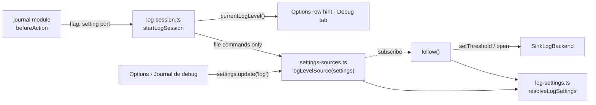

# Design note — journal settings (`feat/journal-settings`)

Status: shipped on `feat/journal-settings` (wave 3). It turns the observability lane's defaults
into settings the user changes in the Options view — how much the debug log records, the period
the Journal opens on, whether an HTML report opens in the browser — and closes the lane's
hand-offs: the run results gain `o rapport HTML` (amendment O-3), the Journal's event detail
names the schedule an update ran for, and `gup report --format text` draws with the symbol set
chosen in Options.

Sources: integrated plan §7 (the `feat/journal-settings` row), §8, §9, §10; amendments O-3, F-3,
F-10, F-16, W2-3; observability spec §2.3; the hand-offs of
[`debug-log.md`](debug-log.md) §8, [`activity-journal.md`](activity-journal.md) §8,
[`html-report.md`](html-report.md) §9 and [`options-themes.md`](options-themes.md) §5.4, §9.
User guides: [`journal-and-reports.md`](../../guide/journal-and-reports.md),
[`configuration.md`](../../guide/configuration.md).

---

## 1. What the user gets

| | |
|---|---|
| Options › **JOURNAL** | Between CONFORT and FICHIER: `Journal de debug` (`OFF · erreurs · avert. · info · debug · trace`), `Période du journal` (`30 derniers jours · 90 derniers jours · 12 derniers mois · tout l'historique`), `Ouvrir le rapport` (`ON · OFF`). Saved and applied as they change; `Réinitialiser… › Tout` covers them. |
| Debug log level | `--log-level` > `GUP_LOG_LEVEL` > `log.level` > `info`. Changed in Options, it applies at once to the running menu — unless the flag or the variable decided it, which the row then says (`imposé par GUP_LOG_LEVEL (debug)`). `gup doctor` and the Debug tab name the source `réglage`. |
| Journal period | The view shows `journal.period` each time it comes to the front, until `p` picks another period for the session. |
| Opening reports | `journal.openReport` decides whether an HTML report written for the user opens in the browser: the Journal's `o` and `e › Rapport HTML`, the run results' `o`, and `gup report` (from a terminal, outside CI). `gup report --open` / `--no-open` decide for one run. |
| Text charts | `gup report --format text` draws with `interface.glyphs` (Options › Symboles): `ascii`, `unicode`, or `auto` (`GUP_ASCII`, the terminal, the locale). |
| Run results | `o rapport HTML` writes the report of the Journal's period — which ends with the run — and says where it went, as the Journal does. |
| Event detail | `Planification  Outils dev` instead of the schedule's raw id; an id the scheduler no longer knows stays as it is. |
| Debug tab, log off | The hint says how to turn it back on given what turned it off: Options, the variable, or nothing to do (`--log-level off` lasts one run). |

## 2. The settings

| Section | File | Fields | Defaults | Read by |
|---|---|---|---|---|
| `log` | `core/config/log-section.ts` | `level` ∈ `LOG_THRESHOLDS` | `info` | the log session (`commands/journal/log-session.ts`), never in the elevated child nor for `gup log` |
| `journal` | `core/config/journal-section.ts` | `period` ∈ `PERIOD_CYCLE`, `openReport` | `12m`, `true` | the Journal view, the journal source's exports, `gup report` |

Both are registered in `SettingsService` (`ui/settings/settings-service.ts`): the Options rows
read and write them through the host's service, `status()` reads them so their field issues are
printed at startup and by `gup doctor` like every other section's, and `Réinitialiser… › Tout`
resets them. `log-settings.ts` takes its default from `LOG_SECTION.defaults.level` and the
Journal panel its fallback from `JOURNAL_SECTION.defaults.period`: one place for each default.

## 3. The debug log level

- **Resolution** (`resolveLogSettings`): flag, then a valid `GUP_LOG_LEVEL`, then the setting,
  then the default; a scheduled run is still raised to `info`, `off` still stays off. A setting
  equal to the default reads as `défaut`: the file keeps only what differs from the defaults, so
  "chose info" and "never chose" are the same state on disk.
- **Who reads it.** `createJournalModule({ logLevelSetting })` hands the log session a factory;
  `startLogSession` calls it only when the command writes the log file. The elevated
  `__admin-batch` child never touches the settings (it takes its parent's threshold from the
  batch payload, F-3), and `gup log …` writes nothing. Tests pin both.
- **Following it.** The session subscribes to the setting for the life of the process. On a
  change it decides again with the same flag, environment and trigger: an unchanged decision
  (the flag or the variable still win) does nothing; an installed backend takes the new
  threshold and records `log.threshold` (`threshold`, `source`) under the louder of the old and
  the new threshold — before the switch when the level goes down, so a log turned down to
  `error` or `off` still says why it went quiet; a log that was off starts now — backend,
  tracer, observer and its own `session.start`. Turned off, it keeps the file open and records
  nothing after that last `log.threshold`.
- **`currentLogLevel()`** (threshold and source, the backend's threshold before any startup)
  feeds the Debug tab's header and the Options row's hint.

## 4. The Options rows

`journalOptions({ logLevel })` (`ui/settings/journal-options.ts`, `ui/panels/options` being
full) is a `SectionFactory` registered through `optionsView({ extraSections })` in
`commands/menu-views.ts`. Its rows are `choiceRow`s over the host's settings and
`controls.save`, so a failed save becomes the panel's notice line like any other row. The level
row replaces its hint with a warning while `currentLogLevel()` reports the flag or the
environment: the row cannot see `--log-level` itself, hence the port. Period values are the
Journal's own words (`periodLabel`), so the row and the view's title agree. Labels live in
`ui/text/settings/journal-options-labels.ts` (F-10).

## 5. The Journal view

- `journalView(source, { settings?, scheduleName? })`. The default period comes from
  `settings().get("journal").period` (default: the process-wide service, as `optionsView`), read
  by the panel at construction and at every load until `p` sets `#isPeriodChosen`.
- **Schedule names.** The history keeps only the schedule id. `menu-views.ts` injects
  `(id) => schedules.scheduleName(id)`; `SchedulesController.scheduleName` reads the menu's cached
  snapshot (no file read while drawing). `EventsTab` passes it to `eventDetail` through
  `DetailContext.scheduleName`; an unknown id is shown as it is rather than called deleted — the
  menu's snapshot may predate a schedule another terminal created.

## 6. `o rapport HTML` on the run results (O-3)

```mermaid
flowchart LR
  MV["commands/menu-views.ts"] -->|"journalSource"| JV["journalView<br/>resultActions()"]
  JV --> VR["ViewRegistry.resultActions()"]
  VR --> LC["LauncherContext.resultActions"]
  LC --> IL["in-screen launcher"] -->|"RunViewDeps.actions"| RV["RunView (results)"]
  RV -->|"o"| A["ResultAction.run()"] -->|"source.export('html', period)"| JS["commands/journal/journal-source"]
```

- **Contract** (`ui/app/view-definition.ts`): `ResultAction { key, hint, pending, run():
  Promise<ResultNotice> }` and `ViewDefinition.resultActions?(context)` — the run results'
  counterpart of `PackageAction`. The session collects them like the package actions and hands
  them to the launcher (`LauncherContext.resultActions`), which gives them to the run view.
  `ui/run` imports types from `ui/app` only; it never sees the journal.
- **Run view.** Only on the results (`phase === "done"`), never with Ctrl, one at a time:
  `pending` as the notice, then the action's notice; a rejected promise becomes
  `Action impossible : <raison>`; a notice arriving after the user left draws nothing. Their hints
  come right after `entrée retour` on the results' key bar, before `v`, which a narrow bar drops
  first: at 80 columns the whole bar fits (`fix/final-polish`).
- **The journal's action** writes the report of `presetPeriod(journal.period, now)` through the
  same `JournalSource.export("html", …)` as the Journal's `o` — so it obeys `openReport` — and
  words the outcome with `exportNotice`, shared with the panel's status line: the path reads
  from `~` in both; the panel also passes its width, so the path is cut in its middle to fit one
  row there (wave-2 polish), while the results' one-row notice gets it whole.

## 7. `gup report`

`runReport(options, deps, preferences = settingsPreferences())`; `reportRequestOf(options,
{ now, preferences })`. Both `--open` and `--no-open` are declared: a lone `--no-open` would make
commander default the value to `true`; with both, it stays `undefined` when neither is given (the
declaration order does not matter in commander 15). `opensBrowser`: a file target of the `html`
format only;
`--open`/`--no-open` decide; otherwise `openReport` and somebody watching (stdout is a TTY, `CI`
empty). `glyphMode` is `resolveGlyphMode(preferences.glyphs)`.

## 8. Tests

| Suite | Checks |
|---|---|
| `tests/core/config/{log,journal}-section.test.ts` | defaults, every value read, a wrong field falls back with its issue (the neighbour kept), sparse writes |
| `tests/commands/journal/log-settings.test.ts` | flag > env > setting > default, setting = default reads `default`, `GUP_LOG_LEVEL=off` over a `trace` setting, a garbage variable falls through to the setting, a scheduled run raises a `error` setting |
| `tests/commands/journal/journal-module.test.ts` | the setting at startup and `gup doctor`'s `(réglage)`; flag and variable win; the elevated child never asks; live: a raised level records at once (`log.threshold`), a lowered one records the change before going quiet, off → on starts the log, on → off records nothing after the change, a flagged level never moves; round trip: the level the Options row saves to a real file is the next start's, `--log-level` still winning |
| `tests/commands/journal/journal-source.test.ts` | the HTML export written without `open` when the setting says not to |
| `tests/commands/journal/report-command.test.ts` | the setting keeps the report closed in a terminal, `--open` opens it without one (also through the real command line, where neither flag leaves the choice to the setting); text charts in ASCII or Unicode as set, an explicit `unicode` winning over `GUP_ASCII` |
| `tests/ui/settings/journal-options.test.ts` | the section and its values, each row saved to its section, the level's full cycle, the override hint (variable and flag), `Tout` resets both sections |
| `tests/ui/panels/journal/{journal-panel,tabs}.test.ts` | the period follows the setting until `p`; schedule name or id in the detail; the off hint by source, wrapped in the 50 columns an 80-column terminal leaves the panel |
| `tests/ui/views/journal-view.test.ts` | the menu's Journal opens on the period set in the settings |
| `tests/ui/run/{run-view,run-keys}.test.ts` | in the real menu with the journal view: `o` ignored while running, offered on the results, the export's notice shown; the actions' hints on the results' bar before `v`, whole at 80 columns |
| `tests/commands/schedule/schedules-controller.test.ts` | a schedule named by its id, nothing once it is deleted (the detail then shows the id) |

The suites run with `GUP_LOG_LEVEL=off` and `GUP_CONFIG=0` (W2-3): tests of the setting clear the
variable and inject their own `SettingsService` (in memory, or over a file in the test's own
temporary directory for the round trip); nothing writes through the process-wide one.

## 9. Decisions and deviations

| # | Spec / plan | Shipped | Why |
|---|---|---|---|
| J1 | `report.autoOpen` (spec §2.3) | `journal.openReport` | `core/config` reaches its 10-file budget with the two planned sections; opening the reports is a journal concern. |
| J2 | A `Graphiques` row and `ui.charts` (spec §2.3) | none: charts follow `interface.glyphs` | F-16 (no charts glyph resolver) and the task: one symbol setting for the whole app. |
| J3 | `log.level` read at startup (spec: "bootstrapLogging precedence") | also followed live | Every Options row applies at once (`options-themes.md` §5.5); a level that changed only at the next launch would contradict the row's own value. |
| J4 | `journal.period` = the panel's initial period | followed at every load until `p` | Same reason: the Journal shows the new period the next time it comes to the front, without a restart. |
| J5 | `--no-open` only | `--open` added | With a setting able to turn opening off, one run must be able to ask for it. An explicit `--open` opens even without a terminal or under CI. |
| J6 | `e › Rapport HTML (s'ouvre dans le navigateur)` | `Rapport HTML (page à lire dans le navigateur)` | It no longer always opens. |
| J7 | O-3: "a port injected by `menu-views.ts`" | a generic `ResultAction` contributed by the journal view, whose source `menu-views.ts` injects | Mirrors `PackageAction`: `ui/run` and the session know nothing of the journal, and another feature adds its key without touching them. |
| J8 | html-report hand-off: the report "for the run's period" | the Journal's default period, which ends with the run | A report of the run's day alone leaves the overview nearly empty; the run is the newest session of the period. |
| J9 | Labels | `Ouvrir le rapport` with `ON · OFF`; the level's off value written `OFF` | Plan §7's label; `OFF` as every other off value of the view. |
| J10 | — | `SettingView<T>` exported from `settings-sources.ts` (the private `Cached<T>`), `logLevelSource` | The log session's port type, one definition. |
| J11 | — | `JournalPanelDeps.initialPeriod` replaced by `defaultPeriod: () => PeriodPreset` | Nothing used `initialPeriod`; the setting is read at every load. |
| J12 | — | `exportNotice` exported from `journal-panel.ts` | The panel's status line and the run results word an export outcome the same way. |

## 10. Contract changes (additive)

| Contract | Change |
|---|---|
| `ui/app/view-definition.ts` | `ResultNotice`, `ResultAction`, `ViewDefinition.resultActions?` |
| `ui/app/session/view-registry.ts` | `resultActions()` |
| `ui/app/update-launcher.ts` | `LauncherContext.resultActions` (filled by the session) |
| `ui/run/run-view.ts`, `run-keys.ts` | `RunViewDeps.actions?`; `RunHintsContext.resultHints?` |
| `ui/settings/settings-service.ts` | `SettingsMap.log`, `SettingsMap.journal` |
| `commands/journal/log-settings.ts` | `LogSource` gains `setting`; `LogSettingsInput.setting?` |
| `commands/journal/log-session.ts` | `startLogSession(context, { flag?, setting? })`; `currentLogLevel()` |
| `commands/journal/journal-module.ts` | `createJournalModule(deps)` (the module is `createJournalModule()`) |
| `commands/journal/journal-source.ts` | `JournalSourceDeps.opensReport` |
| `commands/journal/report-command.ts` | `ReportPreferences`, `ReportContext`; `runReport(options, deps, preferences)`; `--open` |
| `commands/schedule/schedules-controller.ts` | `scheduleName(id)` |
| `ui/text/journal/log-labels.ts`, `journal-labels.ts` | `LOG_SOURCE_LABELS.setting`; `DEBUG_LABELS.offHint` keyed by source; `JOURNAL_HINTS.report` |

## 11. Folder budget

`core/config` 10 (full) · `ui/settings` 6 · `ui/text/settings` 4 · `commands/journal` 9 ·
`ui/run` 10, `ui/app` 10, `ui/panels/journal` 10 (unchanged: edits only).

## 12. Hand-off

- **`docs/feature-guides`**: `cli-reference.md` (`gup report --open`, the level setting in the
  precedence), `interactive-app.md` completion, `architecture.md` (the `ResultAction` seam next
  to `PackageAction`); screenshots of Options › JOURNAL and of the results' `o` notice. (Done in
  the 0.5.0 documentation pass: Options › JOURNAL is `options-journal.svg`; the results show
  the `o` key on `update-summary.svg`, not the notice written after it.)
- **`test/e2e-coverage-ci`**: the contrast audit can register the JOURNAL section
  (`optionsView({ extraSections: [journalOptions({ logLevel })] })`, its override hint is the
  `warning` tone) and the run results with an action notice.
