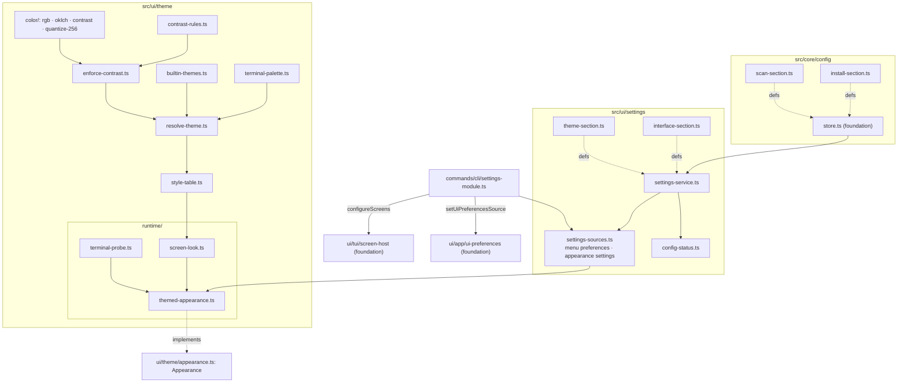

# Design note — settings, themes and WCAG contrast (`feat/options-themes`)

Status: **part 1 of 2 shipped** on `feat/options-themes` — the engine half: the persisted
settings the app reads, the colour science, the contrast enforcement, the ten built-in themes,
terminal palette detection, the style tables and the theme engine's `Appearance`, installed at
startup by a settings CLI module. **Part 2** (same branch) rebuilds the Options view on top of it:
sectioned list, theme picker with live preview, colour editor, comfort rows, file row and the
`extraSections` extension point.

Source spec: `themes-options.md` (§3–§8), integrated plan §6.3, amendments F-16 and IT-6. The
foundation's contracts (`foundation.md`) are used as shipped; nothing of them changed.

---

## 1. What the user gets (part 1)

| Change | Where |
|---|---|
| Plain text, package names and the dialog's input are painted in an explicit colour — the theme's text colour, or the terminal's own foreground — instead of OpenTUI's white default, which was invisible on light terminals (white on white, 1.0:1). | `ui/theme/style-table`, `runtime/themed-appearance` |
| The default theme (`terminal`) follows the terminal's palette when the terminal reports it (OSC 4/10/11), with every colour pair raised to WCAG AA; otherwise it paints the terminal's own foreground and ANSI slots, and draws the cursor row in inverse video (its contrast is the terminal's own). | `ui/theme/*` |
| Ten themes, chosen in the settings file (the Options view comes in part 2): `terminal`, `auto`, `dark`, `light`, `high-contrast`, `colorblind`, `dracula`, `catppuccin-mocha`, `github-light`, `monochrome`. | `ui/theme/builtin-themes` |
| `NO_COLOR` (present, not empty) turns colours off in the screens (monochrome) and in console output (chalk level 0). | settings module |
| Settings persisted in `config.json`: menu preferences, density, symbols, mouse, scan mode and filter (menu only), install timeout (every command; `--timeout` > `GUP_INSTALL_TIMEOUT` > file > default). | `core/config`, `ui/settings` |
| Problems with the file are printed once on stderr before any screen; `gup doctor` shows a "Configuration" line. | settings module |

---

## 2. Architecture

Layering: `core/config` knows nothing about the UI; sections are passed in. Everything under
`ui/theme/` except `runtime/` is pure (no OpenTUI import at runtime). `runtime/` is the only part
that touches OpenTUI, and only `screen-look.ts` builds an `RGBA` from a theme.

### 2.1 Folders (≤ 10 files each)

`core/config` 8 · `ui/settings` 5 · `ui/theme` 10 (+ `color/` 4, `runtime/` 3) · `ui/text` 3 ·
`commands/cli` 4. `ui/theme` is full: part 2 adds no file there; a new theme-engine module goes
under `color/` or `runtime/`.

---

## 3. Settings

### 3.1 Sections

| Key | Owner file | Fields | Applies to |
|---|---|---|---|
| `scan` | `core/config/scan-section.ts` | `fast`, `providerFilter` (≤ 200 ids, `/^[A-Za-z0-9][A-Za-z0-9-]{0,47}$/`) | the menu only |
| `install` | `core/config/install-section.ts` | `timeoutSeconds` (0..86 400, default `DEFAULT_INSTALL_TIMEOUT_S`) | every command except `__admin-batch` |
| `theme` | `ui/settings/theme-section.ts` | `id`, `contrast` (`AA`/`AAA`), `custom[themeId][role] = #RRGGBB` | the screens |
| `interface` | `ui/settings/interface-section.ts` | the menu's `UiPreferences` fields (minus `scan`), `density`, `glyphs`, `mouse` | menu + screens |

F-16: `INTERFACE_SECTION.defaults` is `DEFAULT_UI_PREFERENCES` without `scan`, plus the screens'
defaults; a test pins the equality, and the scan section's defaults are pinned against
`DEFAULT_UI_PREFERENCES.scan` the same way. `Density`, `GlyphPreference`, `PackageSort`,
`NoteColumn` and `ViewId` are imported, never redeclared; their runtime value lists are built from
`Record<T, true>` literals, so a new member of the foundation's unions fails to compile here until
it is listed.

Customisations belong to their base theme (`custom.dark`, `custom.terminal`, `custom.auto`…). A
custom accent also colours the accent fill (title bar, active button) and the focused border.

### 3.2 `SettingsService` and the sources

`SettingsService` (`get`, `update(key, patch)`, `reset(keys)`, `status`, `subscribe`) is the typed
façade over the store for the four sections; `settingsService()` is the process-wide one over
`configStore()`, the one the settings module and the Options view share. `status()` reads every
section first, so the issue list is complete.

`settings-sources.ts` adapts it to the foundation's ports: `menuPreferencesSource(settings,
isKnownProvider)` (a `UiPreferencesSource`; filtered provider ids unknown to this build are
dropped) and `appearanceSource(settings)` (theme, glyphs, density). Each view is rebuilt only when
one of its sections changed — the menu asks for its preferences on every frame.

### 3.3 The settings CLI module

`settingsModule` (`commands/cli/settings-module.ts`, order `MODULE_ORDER.settings`, not opted
into the elevated child) runs, before every command:

1. `NO_COLOR` → `chalk.level = 0` (chalk 6 honours only `FORCE_COLOR`);
2. `applyPersistedInstallTimeout(settings.get("install"), env)` — skipped when
   `GUP_INSTALL_TIMEOUT` is set and not empty, as the runner reads it; the `--timeout` flag,
   applied by the update action afterwards, wins over both;
3. the file's problems (field issues, recovery, unknown filtered providers), once, through
   `installConsole.warn` (stderr, dim) — before any screen, so they never paint over a frame;
4. `configureScreens({ createAppearance: themedAppearance(appearanceSource(settings)),
   rendererOptions: () => ({ useMouse }) })` — the mouse preference is read when each screen opens;
5. `setUiPreferencesSource(menuPreferencesSource(...))`.

Its `diagnostics()` line: `Configuration  <path> — <state>` (`describeConfigStatus`: saved,
defaults, disabled, read-only, not saved, recovered, invalid fields), `ok`/`warn`/`off`.

---

## 4. The theme engine

### 4.1 Tokens and painted pairs

14 tokens: grounds (`background`, `highlight`), neutral text (`text`, `strong`, `muted`,
`disabled`), semantic text (`accent`, `success`, `warning`, `danger`), the accent fill and its
text (`accentFill`, `onAccent`), borders (`borderIdle`, `borderFocus`). `disabled` is derived (the
neutral of text blended 65 % into the background, lifted to the floor), never hand-written.

`contrast-rules.ts` is the single list of painted pairs: every text token on the background and
the highlight (≥ 4.5:1, AAA 7:1); `onAccent` on `accentFill` (text); `accentFill`, both borders
against the background (≥ 3:1, WCAG 1.4.11). `TONE_TOKEN: Record<Tone, ColorToken>` maps every
`Tone`; on the accent fill every tone paints as `onAccent`. Off the fill, the `onAccent` tone reads
as `strong` (see §7), so no (tone, fill) combination can reach a ground it was not checked against.

### 4.2 Colour science (`color/`)

- `rgb.ts`: 8-bit sRGB, strict hex parsing (never `RGBA.fromHex` on user data), WCAG relative
  luminance and ratio. All checks run on the 8-bit values that are painted, no epsilon.
- `oklch.ts`: Ottosson's OKLab/OKLCH; out-of-gamut colours keep hue and lightness, chroma is
  bisected into sRGB.
- `contrast.ts`: `correctLightness(color, grounds, target)` — identity when passing, else a
  bisection on OKLCH lightness (24 steps) in **both** directions, each step judged on the rounded
  8-bit colour, keeping the smaller move; black or white when nothing reaches the target.
- `quantize-256.ts`: xterm slots 16–255 (the standardized cube and grey ramp), nearest by OKLab
  distance; `quantizeWithin` re-corrects with a growing margin (0.25 × round, 5 rounds) until the
  nearest slot meets the requirements, else the best cube corner.

### 4.3 Enforcement (`enforce-contrast.ts`)

Grounds first: the background, then the highlight (anchored on the background's side), each far
enough from the extreme on its far side (text target + 1.5) that text can always reach the
target. Then every text token on both grounds, the accent fill (first far enough from the extreme
on the background's side that some `onAccent` can reach the text target, then ≥ 3:1 on the
background), `onAccent` on the fill, the borders. Corrections are reported (`requested`, `applied`,
`before`, `after`) except for target-seeking tokens (`disabled`; the detected `muted`).
`minTextRatio` excludes them too, so the picker shows a theme's real floor (dark: 6.1).

**Guarantees, tested:** the seven RGB themes pass AA with zero corrections (`high-contrast` AAA);
1,000 seeded random palettes per level (AA and AAA) meet every rule after enforcement, checked
with the independent oracle `tests/support/contrast/wcag.ts`.

### 4.4 Resolution and paint modes (`resolve-theme.ts`, `style-table.ts`)

Precedence: `NO_COLOR` → monochrome; `monochrome` → monochrome; depth 16 → trusted (notice
`depth-16` for RGB themes and `auto`); `terminal` → detected when the palette is known, else
trusted (`palette-pending` / `palette-unknown`); `auto` → dark or light per the terminal's
background (dark when unknown); RGB themes → their palette. Depth 256 → every colour painted in
RGB moves to a standardized slot, re-checked (notice `depth-256`).

| Mode | Text | Fills | Background |
|---|---|---|---|
| rgb | palette RGB (slots on 256 colours), no DIM | highlight / accent fill as RGB | painted |
| detected | unchanged colours keep the terminal's slot or default (with the detected RGB as snapshot); corrected ones RGB | idem | the terminal's own |
| trusted | terminal foreground, ANSI slots 6/2/3/1, DIM for muted/disabled | inverse video, no background colour | the terminal's own |
| monochrome | terminal foreground only, no DIM | inverse video (+ bold on the accent fill) | the terminal's own |

A terminal "default" colour means its foreground in the foreground role and its background in the
background role, so the detected background's colour reaches `onAccent` (a foreground) as RGB.

### 4.5 Runtime (`runtime/`)

- `terminal-probe.ts`: `renderer.getPalette({ size: 16, timeout: 1000 })`, converted only when the
  default colours and slots 1/2/3/6 are reported; `waitForThemeMode(250)` when the renderer does
  not know the background yet; the `palette`, `theme_mode` and `capabilities` events re-notify. The
  palette is asked once per process (module cache) and only for `terminal`/`auto` (current or
  previewed), never under `NO_COLOR`. `detect()` never rejects; `settle(ms)` waits, bounded, for
  the query in flight. `staticProbe(facts)` for tests.
- `screen-look.ts`: a `ThemePaint` as OpenTUI values (chunk styles, borders, background, text
  field), memoized per resolve. Idle borders rounded, the focused one heavy, ASCII `+-|` / `*=|`.
- `themed-appearance.ts`: `ThemedAppearance implements Appearance` (F-16). It follows the settings
  and the probe live, re-resolving and notifying its listeners (the chrome, panels and session
  redraw); `preview(theme)` / `endPreview()` paint another theme on the whole screen without saving
  it; `availability()` resolves every theme on this terminal (unavailable on 16 colours);
  `dispose()` stops following, awaits `probe.settle(300)` then disposes the probe — the screen host
  awaits it before `destroyRenderer`, so no late OSC reply lands in the shell.

---

## 5. Tests

| Suite | Checks |
|---|---|
| `tests/ui/theme/color.test.ts` | hex parsing, reference ratios, agreement with the oracle on random pairs, OKLCH round trip, hue kept by corrections, smallest move, black/white fallback, xterm slots never 0–15, `quantizeWithin` |
| `tests/ui/theme/enforce-contrast.test.ts` | built-ins with zero corrections (AA; high-contrast AAA); 1,000 seeded palettes × AA/AAA; correction report; seeking tokens unreported; mid-grey background moved |
| `tests/ui/theme/terminal-palette.test.ts` | OSC answers converted or refused; sources; Campbell, Terminal.app Basic, Solarized Dark, One Half Light meet every rule at AA and AAA |
| `tests/ui/theme/resolve-theme.test.ts` | the precedence matrix, customs per theme, 256-colour slots still AA, availability, `NO_COLOR` |
| `tests/ui/theme/style-table.test.ts` | accent fill, no DIM in palette modes, detected defaults, trusted inverse fills, monochrome without colour |
| `tests/ui/theme/terminal-probe.test.ts` | lazy and bounded queries, process cache, unsupported/suspended terminals, events, bounded settle, dispose |
| `tests/ui/theme/themed-appearance.test.ts` | finding 1 (plain text and input in the terminal's colour), on-screen AA for RGB and detected themes, preview, live settings, detection policy, dispose |
| `tests/ui/app/contrast-audit.test.ts` | the whole menu walked (Paquets, checked rows, filter, confirmation, Scan with a failure, Providers, Options and its dialog) under every RGB theme and the terminal theme on two real palettes: every span ≥ 4.5:1, borders ≥ 3:1; the legacy look on a light terminal is caught |
| `tests/core/config/{scan,install}-section.test.ts`, `tests/ui/settings/*.test.ts`, `tests/commands/cli/settings-module.test.ts` | parsing, sparse writes, precedence, service, sources, status lines, the module (elevated child skipped, issues printed once before the action, `NO_COLOR`, preferences, screens, mouse, diagnostics) |

Shared helpers: `tests/support/tui/reference-palettes.ts` (real palettes, OSC shape) and
`tests/support/tui/frame-contrast.ts` (every captured span against its effective ground with the
oracle; a cell on the terminal's default background counts as the ground).

---

## 6. Security and cross-platform

- The elevated `__admin-batch` child never reads the settings: the module does not opt in (test).
- Theme colours are parsed strictly; `RGBA.fromHex` is never called on user data.
- Terminal queries go through OpenTUI only, bounded by timeouts, settled before teardown; gup
  writes no escape sequence itself and never changes the terminal's palette or background (OSC
  11/111): backgrounds are cell fills. The teardown order (`teardown.ts`) is untouched.
- Every resolution is a pure function of injected facts (depth, palette, theme mode, env), so
  macOS Terminal.app (256 colours, light), the Linux console (16 colours) and Windows palettes are
  tested on any OS.
- conhost does not render SGR 2 (DIM): in trusted mode muted text then looks plain; meaning is
  carried by glyphs and labels. Palette modes never use DIM.

---

## 7. Deviations from the spec and the plan

| # | Spec / plan | Shipped | Why |
|---|---|---|---|
| D1 | `TONE_TOKEN.onAccent = "onAccent"` | `"strong"` off the accent fill; every tone on the fill paints `onAccent` | `onAccent` has the background's lightness: as plain text it would be invisible. Only the title bar and the active button use it, always on the fill. |
| D2 | Correction direction: lighter on dark grounds, darker on light ones | both directions searched, smaller move kept | On a mid-tone fill (One Half Light's teal) the one-direction rule turned a light title-bar text black; both directions keep it light, same guarantee. |
| D3 | Rounding guard: nudge by 0.002 up to 50 times | every bisection step is judged on the rounded 8-bit colour | The invariant "the far bound passes as painted" makes the nudge unnecessary. |
| D4 | `onAccent` keeps a `terminal-bg` source in detected mode | always RGB | A "default" colour in the foreground role is the terminal's foreground: the source would paint the wrong colour. |
| D5 | Depth 16 → trusted for RGB themes and `auto` | also for `terminal` with a detected palette (no notice) | Corrected colours and blended greys are RGB; a 16-colour terminal cannot show them. |
| D6 | `auto` awaits `waitForThemeMode(250)` in `run()` before mounting | resolves at once (dark when unknown) and re-resolves when the probe learns the mode | The appearance factory is synchronous and `screen-host.ts` is frozen in wave 2; worst case is a single dark → light redraw. |
| D7 | `PROVIDER_ID_PATTERN = /^[a-z0-9][a-z0-9-]{0,47}$/` | upper case allowed | The registry has `R-packages`. |
| D8 | `custom` applies to RGB ids and `terminal` | also `custom.auto` | `auto` is pickable and editable like the others; enforcement makes its customs safe on both grounds. |
| D9 | `Appearance` (class) in `runtime/appearance.ts`, `AppearanceFactory` param on `createScreenHost` | `ThemedAppearance` in `runtime/themed-appearance.ts` + `themedAppearance(settings)` factory installed through `configureScreens` | Foundation seam (F-16); `ui/theme/appearance.ts` is the foundation's interface file. |
| D10 | `ChunkStyle`/RGBA conversion in the appearance | `runtime/screen-look.ts` | One responsibility per file: the appearance is a state machine, the look a conversion. |
| D11 | The test host's default appearance = terminal theme, trusted | unchanged (`configureScreens` default, legacy); suites pass `createAppearance` | `tests/support/tui/test-host.ts` is the foundation's file. |
| D12 | Theme labels, status strings and `formatRatio` in part 1 | in part 2, with the picker that shows them | No consumer in part 1 (dead-code rule). |
| D13 | `applyPersistedInstallTimeout(store, env)` | `(installSettings, env)` | The module reads every section through the shared `SettingsService`; the function keeps the one precedence rule. |

---

## 8. Notes for part 2 and the other branches

- **Options view (part 2):** reach the engine through `screen.appearance instanceof
  ThemedAppearance` (`resolved`, `preview`, `endPreview`, `availability`); settings through
  `settingsService()` (the module's own); file row through `describeConfigStatus`. Part 2 adds
  `formatRatio` to `color/rgb.ts` (French decimal comma, truncated: a shown "4,5" is never a
  rounded-up 4.46) with the picker that shows ratios. A mouse change applies to the next screen
  through `rendererOptions`; the live switch sets `screen.renderer.useMouse`.
- **In-TUI updates (IT-6):** the embedded terminal panes must sit on `RGBA.defaultBackground()`
  (the terminal's own), never on the theme's background: subprocess output uses the host
  palette, which gup does not check. The contrast audit gains a case asserting it when the panes
  land.
- **Journal settings (wave 3):** register `log`/`journal` sections in `core/config/` and Options
  rows through part 2's `extraSections`; the settings module already prints every store issue at
  startup.
