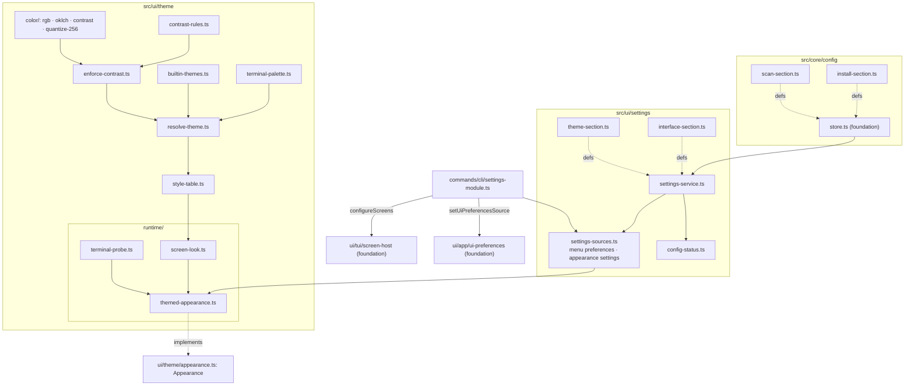
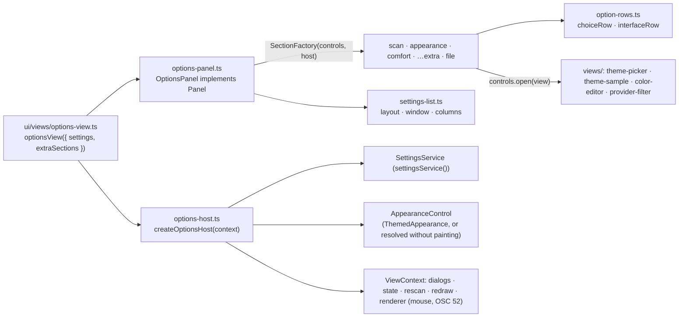

# Design note — settings, themes and WCAG contrast (`feat/options-themes`)

Status: **shipped** on `feat/options-themes`, in two parts. Part 1, the engine: the persisted
settings the app reads, the colour science, the contrast enforcement, the ten built-in themes,
terminal palette detection, the style tables and the theme engine's `Appearance`, installed at
startup by a settings CLI module. Part 2, the Options view on top of it: a sectioned list edited
in place, the theme picker with a live preview of the whole app, the colour editor with ratios and
auto-correction warnings, the comfort, scan and file rows, reset, and the `extraSections`
extension point (§5).

Source spec: `themes-options.md` (§3–§8), integrated plan §6.3, amendments F-16 and IT-6. The
foundation's contracts (`foundation.md`) are used as shipped; nothing of them changed.

---

## 1. What the user gets

| Change | Where |
|---|---|
| Plain text, package names and the dialog's input are painted in an explicit colour — the theme's text colour, or the terminal's own foreground — instead of OpenTUI's white default, which was invisible on light terminals (white on white, 1.0:1). | `ui/theme/style-table`, `runtime/themed-appearance` |
| The default theme (`terminal`) follows the terminal's palette when the terminal reports it (OSC 4/10/11), with every colour pair raised to WCAG AA; otherwise it paints the terminal's own foreground and ANSI slots, and draws the cursor row in inverse video (its contrast is the terminal's own). | `ui/theme/*` |
| Ten themes: `terminal`, `auto`, `dark`, `light`, `high-contrast`, `colorblind`, `dracula`, `catppuccin-mocha`, `github-light`, `monochrome`. | `ui/theme/builtin-themes` |
| `NO_COLOR` (present, not empty) turns colours off in the screens (monochrome) and in console output (chalk level 0). | settings module |
| Settings persisted in `config.json`: menu preferences, density, symbols, mouse, scan mode and filter (menu only), install timeout (every command; `--timeout` > `GUP_INSTALL_TIMEOUT` > file > default). | `core/config`, `ui/settings` |
| Problems with the file are printed once on stderr before any screen; `gup doctor` shows a "Configuration" line. | settings module |
| The Options view: SCAN & INSTALLATION, APPARENCE, CONFORT, FICHIER, every row saved as it changes; a save that fails stays in effect and says why above the list. | `ui/panels/options` |
| The theme picker paints the whole app with the theme under the cursor (nothing saved until Entrée, Échap restores), with each theme's lowest contrast and what this terminal cannot paint. | `ui/panels/options/views/theme-picker` |
| The colour editor: each role's chosen and painted colour, its contrast, `avant → après ⚠` when an unreadable choice was moved; typed hex, hue and lightness nudges previewed live, `a` keeps the adjusted colours, Suppr gives a role back to the theme. | `ui/panels/options/views/color-editor` |
| Reset by group (Apparence, Confort, Scan & installation, Tout) after a confirmation that defaults to Non; the file's state and path, `c` copies the path (OSC 52). | `ui/panels/options/file-section` |

---

## 2. Architecture



Layering: `core/config` knows nothing about the UI; sections are passed in. Everything under
`ui/theme/` except `runtime/` is pure (no OpenTUI import at runtime). `runtime/` is the only part
that touches OpenTUI, and only `screen-look.ts` builds an `RGBA` from a theme.

### 2.1 Folders (≤ 10 files each)

`core/config` 8 · `ui/settings` 5 · `ui/theme` 10 (+ `color/` 4, `runtime/` 3) · `ui/text` 5 ·
`ui/panels` 6 (+ `options/` 10, + `options/views/` 4) · `ui/views` 4 · `commands/cli` 4.
`ui/theme` and `ui/panels/options` are full: a new theme-engine module goes under `color/` or
`runtime/`, a new Options sub-view under `options/views/`, and another feature's rows in its own
folder (an `extraSections` factory, §5.4).

---

## 3. Settings

### 3.1 Sections

| Key | Owner file | Fields | Applies to |
|---|---|---|---|
| `scan` | `core/config/scan-section.ts` | `fast`, `providerFilter` (≤ 200 ids, `/^[A-Za-z0-9][A-Za-z0-9-]{0,47}$/`) | the menu only |
| `install` | `core/config/install-section.ts` | `timeoutSeconds` (0..86 400, default `DEFAULT_INSTALL_TIMEOUT_S`) | every command except `__admin-batch` |
| `theme` | `ui/settings/theme-section.ts` | `id`, `contrast` (`AA`/`AAA`), `custom[themeId][role] = #RRGGBB` | the screens |
| `interface` | `ui/settings/interface-section.ts` | the menu's `UiPreferences` fields (minus `scan`), `density`, `glyphs`, `mouse` | menu + screens |

F-16: `INTERFACE_SECTION.defaults` is `DEFAULT_UI_PREFERENCES` without `scan`, plus the screens'
defaults; a test pins the equality, and the scan section's defaults are pinned against
`DEFAULT_UI_PREFERENCES.scan` the same way. `Density`, `GlyphPreference`, `PackageSort`,
`NoteColumn` and `ViewId` are imported, never redeclared; their runtime value lists are built from
`Record<T, true>` literals, so a new member of the foundation's unions fails to compile here until
it is listed.

Customisations belong to their base theme (`custom.dark`, `custom.terminal`, `custom.auto`…). A
custom accent also colours the accent fill (title bar, active button) and the focused border.

### 3.2 `SettingsService` and the sources

`SettingsService` (`get`, `update(key, patch)`, `reset(keys)`, `status`, `subscribe`) is the typed
façade over the store for the four sections; `settingsService()` is the process-wide one over
`configStore()`, the one the settings module and the Options view share. `status()` reads every
section first, so the issue list is complete.

`settings-sources.ts` adapts it to the foundation's ports: `menuPreferencesSource(settings,
isKnownProvider)` (a `UiPreferencesSource`; filtered provider ids unknown to this build are
dropped) and `appearanceSource(settings)` (theme, glyphs, density). Each view is rebuilt only when
one of its sections changed — the menu asks for its preferences on every frame.

### 3.3 The settings CLI module

`settingsModule` (`commands/cli/settings-module.ts`, order `MODULE_ORDER.settings`, not opted
into the elevated child) runs, before every command:

1. `NO_COLOR` → `chalk.level = 0` (chalk 6 honours only `FORCE_COLOR`);
2. `applyPersistedInstallTimeout(settings.get("install"), env)` — skipped when
   `GUP_INSTALL_TIMEOUT` is set and not empty, as the runner reads it; the `--timeout` flag,
   applied by the update action afterwards, wins over both;
3. the file's problems (field issues, recovery, unknown filtered providers), once, through
   `installConsole.warn` (stderr, dim) — before any screen, so they never paint over a frame;
4. `configureScreens({ createAppearance: themedAppearance(appearanceSource(settings)),
   rendererOptions: () => ({ useMouse }) })` — the mouse preference is read when each screen opens;
5. `setUiPreferencesSource(menuPreferencesSource(...))`.

Its `diagnostics()` line: `Configuration  <path> — <state>` (`describeConfigStatus`: saved,
defaults, disabled, read-only, not saved, recovered, invalid fields), `ok`/`warn`/`off`.

---

## 4. The theme engine

### 4.1 Tokens and painted pairs

14 tokens: grounds (`background`, `highlight`), neutral text (`text`, `strong`, `muted`,
`disabled`), semantic text (`accent`, `success`, `warning`, `danger`), the accent fill and its
text (`accentFill`, `onAccent`), borders (`borderIdle`, `borderFocus`). `disabled` is derived (the
neutral of text blended 65 % into the background, lifted to the floor), never hand-written.

`contrast-rules.ts` is the single list of painted pairs: every text token on the background and
the highlight (≥ 4.5:1, AAA 7:1); `onAccent` on `accentFill` (text); `accentFill`, both borders
against the background (≥ 3:1, WCAG 1.4.11). `TONE_TOKEN: Record<Tone, ColorToken>` maps every
`Tone`; on the accent fill every tone paints as `onAccent`. Off the fill, the `onAccent` tone reads
as `strong` (see §7), so no (tone, fill) combination can reach a ground it was not checked against.

### 4.2 Colour science (`color/`)

- `rgb.ts`: 8-bit sRGB, strict hex parsing (never `RGBA.fromHex` on user data), WCAG relative
  luminance and ratio. All checks run on the 8-bit values that are painted, no epsilon.
- `oklch.ts`: Ottosson's OKLab/OKLCH; out-of-gamut colours keep hue and lightness, chroma is
  bisected into sRGB.
- `contrast.ts`: `correctLightness(color, grounds, target)` — identity when passing, else a
  bisection on OKLCH lightness (24 steps) in **both** directions, each step judged on the rounded
  8-bit colour, keeping the smaller move; black or white when nothing reaches the target.
- `quantize-256.ts`: xterm slots 16–255 (the standardized cube and grey ramp), nearest by OKLab
  distance; `quantizeWithin` re-corrects with a growing margin (0.25 × round, 5 rounds) until the
  nearest slot meets the requirements, else the best cube corner.

### 4.3 Enforcement (`enforce-contrast.ts`)

Grounds first: the background, then the highlight (anchored on the background's side), each far
enough from the extreme on its far side (text target + 1.5) that text can always reach the
target. Then every text token on both grounds, the accent fill (first far enough from the extreme
on the background's side that some `onAccent` can reach the text target, then ≥ 3:1 on the
background), `onAccent` on the fill, the borders. Corrections are reported (`requested`, `applied`,
`before`, `after`) except for target-seeking tokens (`disabled`; the detected `muted`).
`minTextRatio` excludes them too, so the picker shows a theme's real floor (dark: 6.1).

**On 256-colour terminals** (`quantizeToXterm256`), the grounds move first, each to the nearest
slot that still keeps the same headroom against the background's far extreme — so a cube corner
(pure black or white) stays readable on both, and `quantizeWithin` always has a passing fallback.
Then every token painted in RGB moves to a slot meeting its requirements on the grounds *as
quantized*. A colour kept as the terminal's own (a detected slot or default) is re-checked too: if
a moved ground leaves it short, it moves to a slot as well. Without these two rules a quantized
highlight could drop the terminal's own accent to 4.2:1, and AAA grounds lose enough headroom on
their slot that no text reached 7:1.

**Guarantees, tested:** the seven RGB themes pass AA with zero corrections (`high-contrast` AAA);
1,000 seeded random palettes per level (AA and AAA) meet every rule after enforcement, checked
with the independent oracle `tests/support/contrast/wcag.ts`; and end to end, on the paint itself
(what each cell shows), 300 seeded cases per scenario of random custom colours on every theme gup
paints and of random terminal palettes (with random customs) under the terminal theme, on
truecolor and 256-colour terminals, at AA and AAA (`resolve-theme.test.ts`).

### 4.4 Resolution and paint modes (`resolve-theme.ts`, `style-table.ts`)

Precedence: `NO_COLOR` → monochrome; `monochrome` → monochrome; depth 16 → trusted (notice
`depth-16` for RGB themes and `auto`); `terminal` → detected when the palette is known, else
trusted (`palette-pending` / `palette-unknown`); `auto` → dark or light per the terminal's
background (dark when unknown); RGB themes → their palette. Depth 256 → every colour painted in
RGB moves to a standardized slot, re-checked, and a kept terminal colour that the moved grounds
leave short moves too (notice `depth-256`, §4.3).

| Mode | Text | Fills | Background |
|---|---|---|---|
| rgb | palette RGB (slots on 256 colours), no DIM | highlight / accent fill as RGB | painted |
| detected | unchanged colours keep the terminal's slot or default (with the detected RGB as snapshot); corrected ones RGB | idem | the terminal's own |
| trusted | terminal foreground, ANSI slots 6/2/3/1, DIM for muted/disabled | inverse video, no background colour | the terminal's own |
| monochrome | terminal foreground only, no DIM | inverse video (+ bold on the accent fill) | the terminal's own |

A terminal "default" colour means its foreground in the foreground role and its background in the
background role, so the detected background's colour reaches `onAccent` (a foreground) as RGB.

### 4.5 Runtime (`runtime/`)

- `terminal-probe.ts`: `renderer.getPalette({ size: 16, timeout: 1000 })`, converted only when the
  default colours and slots 1/2/3/6 are reported; `waitForThemeMode(250)` when the renderer does
  not know the background yet; the `palette`, `theme_mode` and `capabilities` events re-notify. The
  palette is asked once per process (module cache) and only for `terminal`/`auto` (current or
  previewed), never under `NO_COLOR`. `detect()` never rejects; `settle(ms)` waits, bounded, for
  the query in flight. `staticProbe(facts)` for tests.
- `screen-look.ts`: a `ThemePaint` as OpenTUI values (chunk styles, borders, background, text
  field), memoized per resolve. Idle borders rounded, the focused one heavy, ASCII `+-|` / `*=|`.
- `themed-appearance.ts`: `ThemedAppearance implements Appearance` (F-16). It follows the settings
  and the probe live, re-resolving and notifying its listeners (the chrome, panels and session
  redraw); `preview(theme)` / `endPreview()` paint another theme on the whole screen without saving
  it; `availability()` resolves every theme on this terminal (unavailable on 16 colours);
  `dispose()` stops following, awaits `probe.settle(300)` then disposes the probe — the screen host
  awaits it before `destroyRenderer`, so no late OSC reply lands in the shell.

---

## 5. The Options view



### 5.1 Contracts (`ui/panels/options/option-row.ts`)

- `OptionRow`: `id` (the cursor follows it), `label`, `value()` (shown `[value]`; empty for an
  action row, whose hint then starts in the value column), `hint()` (a styled line: an
  explanation, the contrast status, why the row is disabled), `isEnabled()`, `activate()`
  (Entrée, Espace, a click), optional `step(±1)` (← →).
- `OptionSection`: `id`, `title`, `rows()`, optional `shortcuts()` — keys a section answers
  anywhere in the list, with their hint (`c copier le chemin`).
- `OptionsView`: a sub-view shown in place of the list (`title`, `hints`, `render`, `press`,
  `click`) until it closes itself.
- `OptionsControls` (what the panel gives its sections): `open(view)`, `close()`, `save(write)` —
  runs a settings write, turns a `ConfigWriteError` into the notice line (the value stays in
  effect for the session), lets any other error through — `notify(line)`,
  `scanSettingsChanged()` (offers `r`).
- `OptionsHost` (the rest of gup, built once per session by
  `createOptionsHost(context, { settings })`): `settings`, `appearance` (`AppearanceControl`:
  `resolved`, `preview`, `endPreview`, `availability`), `state`, `dialogs`, `env`, `density()`,
  `rescan()`, `copyToClipboard(text)` (OSC 52 through the renderer; false when unsupported),
  `setMouse(on)` (`renderer.useMouse`), `redraw()`.
- `SectionFactory = (controls, host) => OptionSection`.

### 5.2 The panel and the keys

`OptionsPanel(sections, host)` lays the sections out (`settings-list.ts`): a title per section
(never selectable), the rows in aligned columns, a blank row between sections unless the density
is compact; only the part around the cursor is drawn when the list is taller than the panel. The
notice line and the rescan offer are pinned above the list, so they stay visible whatever the
scroll. When some row cannot show its whole hint beside it (an 80-column terminal leaves the panel
50 columns), a hint that would be cut below 16 columns is left out of its row, and when the
cursor stands on a row whose hint does not fit, that hint is shown whole under the list — in an
area of two rows kept (blank) whatever the row, so the list never jumps as the cursor moves. The key-hint bar puts what matters first (the rescan offer before `c`, `échap
retour` third in the colour editor): a narrow bar cuts the end. Keys: ↑ ↓ `k` `j` `pgup` `pgdn` `home` `end` move; Entrée / Espace / a click activate an
enabled row; ← → step the row under the cursor; `r` rescans after a scan setting changed; the
sections' shortcuts last. `wantsKey` claims ← → only on an enabled row that steps (elsewhere ←
keeps its menu meaning, the sidebar), and every key while a sub-view is open; the session keeps
`q` and Tab. The panel's title follows the sub-view: `Options › Thème`.

### 5.3 Sections and sub-views

| Section | Rows | Persistence |
|---|---|---|
| SCAN & INSTALLATION (`scan-section.ts`) | Mode rapide, Timeout install (dialog, integer 0–86 400), Filtre providers (`views/provider-filter.ts`) | the session's `MenuState` / effective timeout first, then `scan` / `install`; fast mode and the filter offer `r` |
| APPARENCE (`appearance-section.ts`) | Thème (`views/theme-picker.ts`, hint = contrast status), Couleurs perso. (`views/color-editor.ts`), Niveau de contraste, Symboles, Densité | `theme`, `interface` |
| CONFORT (`comfort-section.ts`) | Vue au lancement, Scanner au lancement, Confirmer les MAJ, Rescanner après MAJ, Tri des paquets, Colonne Note, Providers incompat., Animations, Souris, Notification de fin | `interface`; the mouse also switches on the screen at once |
| …`extraSections` | another feature's rows | its own section of the store |
| FICHIER (`file-section.ts`) | Réinitialiser… (`reset-settings.ts`), Fichier (state + path; Entrée or `c` copies the path) | — |

- **Theme picker.** Opens on the saved theme; each row shows the theme's label and mark
  (`✔ 6,1`, `⚠ 4,6` adjusted, `? —` unverifiable, `✔ —` monochrome, `–` greyed when this terminal
  cannot paint it). Moving the cursor previews the theme on the whole app
  (`AppearanceControl.preview`, with the saved contrast level and customs); the saved theme and
  unavailable ones are not previewed. Entrée saves and ends the preview; Échap or ← ends it. The
  right column: description, the sample block (`theme-sample.ts`: every tone and fill the
  screens paint), the contrast report and the paint mode's note. Below 66 columns it goes under
  the list, the contrast report right after the description, so a short panel cuts the sample
  rather than the verdict. The title bar carries `aperçu du thème` while a preview is on screen
  (`ViewDefinition.facts`), before the scan mode so an 80-column bar still shows it.
- **Colour editor.** The saved theme's eight customizable roles: Choisie (the custom hex or
  `(thème)`), Affichée (the painted colour), Contraste (worst ratio on the background and the
  highlight; `2,1 → 4,6:1 ⚠` from the engine's correction report; grounds show `—`), Aperçu (the
  role painted). The table is `views/color-table.ts` (pure rendering); on a panel narrower than
  its fixed columns, Affichée is left out — Contraste already says when it differs from the
  choice, and the screen is painted with it. Entrée asks for a hex (strictly parsed, `#RGB`/`#RRGGBB`), saved at once under
  `custom[baseTheme]`; ← → nudge the hue by 10°, `+` `-` the OKLCH lightness by 0.03 — the draft
  is kept in OKLCH (no drift through gamut clamping), previewed live, and saved when the user
  changes role or leaves (no timer). `a` stores the adjusted value of every corrected role;
  Suppr drops the role's custom colour. Disabled (with its reason) when the painted theme has no
  palette to tune: `NO_COLOR`, monochrome, 16 colours, trusted terminal mode.
- **Reset.** Choose a scope (Apparence: the `theme` section, density, symbols; Confort: the rest
  of `interface`, the mouse applied at once; Scan & installation: `scan` and `install`, applied to
  the session — fast mode, filter, and the timeout with the environment's precedence; Tout), then
  confirm (default Non). Every step runs even when one cannot be persisted; the first failure
  becomes the notice line.

### 5.4 The extension point

`optionsView({ extraSections })` inserts the factories, in order, between CONFORT and FICHIER. A
feature (wave 3: journal settings) builds rows over its own section of the store with the
panel's controls, for example:

```ts
export const journalOptions: SectionFactory = (controls) => {
  const rows = [
    choiceRow({
      id: "logLevel",
      label: JOURNAL_OPTION_LABELS.level,
      choices: LOG_LEVEL_CHOICES,
      hint: JOURNAL_OPTION_HINTS.level,
      read: () => configStore().read(LOG_SECTION).level,
      write: (level) => controls.save(() => configStore().write(LOG_SECTION, { level })),
    }),
  ];
  return { id: "journal", title: "JOURNAL", rows: () => rows };
};
// src/commands/menu-views.ts
optionsView({ extraSections: [journalOptions] }),
```

### 5.5 Live effects

Everything the Options view writes goes through the process-wide `SettingsService` — the one the
settings module built the screens' appearance and the menu's preferences from — so a change
reaches its consumer without the Options view knowing it: the theme engine re-resolves (theme,
level, customs, symbols, density) and the chrome, panels and session redraw; the packages panel
reads the sort and the Note column on use; the session reads the animations; the outside launcher
reads the confirmation. Only the mouse needs a direct act on the screen (`renderer.useMouse`):
the renderer reads it when it is created.

---

## 6. Tests

| Suite | Checks |
|---|---|
| `tests/ui/theme/color.test.ts` | hex parsing, reference ratios, agreement with the oracle on random pairs, OKLCH round trip, hue kept by corrections, smallest move, black/white fallback, xterm slots never 0–15, `quantizeWithin` |
| `tests/ui/theme/enforce-contrast.test.ts` | built-ins with zero corrections (AA; high-contrast AAA); 1,000 seeded palettes × AA/AAA; correction report; seeking tokens unreported; mid-grey background moved |
| `tests/ui/theme/terminal-palette.test.ts` | OSC answers converted or refused; sources; Campbell, Terminal.app Basic, Solarized Dark, One Half Light meet every rule at AA and AAA |
| `tests/ui/theme/resolve-theme.test.ts` | the precedence matrix, customs per theme, 256-colour slots still AA, availability, `NO_COLOR`; seeded property test on the paint: random custom colours and terminal palettes, truecolor and 256 colours, AA and AAA |
| `tests/ui/theme/style-table.test.ts` | accent fill, no DIM in palette modes, detected defaults, trusted inverse fills, monochrome without colour |
| `tests/ui/theme/terminal-probe.test.ts` | lazy and bounded queries, process cache, unsupported/suspended terminals, events, bounded settle, dispose |
| `tests/ui/theme/themed-appearance.test.ts` | finding 1 (plain text and input in the terminal's colour), on-screen AA for RGB and detected themes, preview, live settings, detection policy, dispose |
| `tests/ui/app/contrast-audit.test.ts` | every registered view walked — Paquets (cursor, checked rows, filter, confirmation), Scan with a failure, Providers, Options (list, timeout dialog, theme picker and a preview, reset choice and confirmation, colour editor, hex dialog, an accent typed unreadable on purpose) — under every built-in theme: the seven RGB ones, `auto` on a light terminal, `terminal` on Campbell and Terminal.app Basic (also as a 256-colour terminal), `dark` at AAA on a 256-colour terminal, `monochrome` on both with the terminal's own text colour. Every span ≥ 4.5:1 (7:1 at AAA), borders ≥ 3:1; the legacy look on a light terminal is caught |
| `tests/ui/panels/options/options-panel.test.ts` | section order, headers skipped, switches saved, ← → claimed on stepping rows only, disabled rows never activated, comfort rows to `interface` (mouse at once), extra sections between CONFORT and FICHIER, compact density, scrolling, clicks, a failed save kept and reported then cleared, timeout dialog and its bounds, provider filter; on a 50-column panel: hints left out of the rows and the cursor row's whole below (the list never jumps), clicks below the list ignored, the filter's empty message wrapped |
| `tests/ui/panels/options/{theme-picker,color-editor,file-section}.test.ts` | picker marks, preview without saving, Échap, Entrée, customs kept while trying, unknown palette, 16 colours refused, narrow layout with the verdict before the sample; editor columns (Affichée left out on a narrow panel, the ratio and its ⚠ kept whole), typed hex saved per theme and validated, `avant → après ⚠` and `a`, Suppr, hue and lightness previews saved on moving on; file state and path, `c` copy (and its failure), reset scopes with the Non default, session scan state and timeout precedence |
| `tests/ui/views/options-view.test.ts` | in the running menu with the theme engine on the same settings: the whole app repainted by the preview and restored by Échap, Entrée applies, symbols switch at once, mouse on/off on the renderer, Paquets re-sorted at once; in an 80 × 24 terminal, the cursor row's hint whole under the list and `échap retour` on the colour editor's bar; on a real settings file: what Options saves is what the next start applies (timeout, menu preferences, theme, density), a corrupt file is copied aside and replaced by a clean one on the first save, a newer gup's file is never overwritten while the change applies for the session |
| `tests/ui/text/settings/theme-labels.test.ts` | `formatRatio` truncation, the contrast status of each situation (pass, adjusted, unverifiable, pending, NO_COLOR, monochrome, 16 and 256 colours) |
| `tests/core/config/{scan,install}-section.test.ts`, `tests/ui/settings/*.test.ts`, `tests/commands/cli/settings-module.test.ts` | parsing, sparse writes, precedence, service, sources, status lines, the module (elevated child skipped, issues printed once before the action, `NO_COLOR`, preferences, screens, mouse, diagnostics) |

Shared helpers: `tests/support/tui/reference-palettes.ts` (real palettes, OSC shape) and
`tests/support/tui/frame-contrast.ts` (every captured span against its effective ground with the
oracle; a cell on the terminal's default background counts as the ground, and its default
foreground as the terminal's text colour when given). The Options component tests share
`tests/ui/panels/options/options-fixture.ts` (an in-memory settings service, dialogs answered by
the test, an appearance control resolving for real).

---

## 7. Security and cross-platform

- The elevated `__admin-batch` child never reads the settings: the module does not opt in (test).
- Theme colours are parsed strictly; `RGBA.fromHex` is never called on user data.
- Terminal queries go through OpenTUI only, bounded by timeouts, settled before teardown; gup
  writes no escape sequence itself and never changes the terminal's palette or background (OSC
  11/111): backgrounds are cell fills. The teardown order (`teardown.ts`) is untouched.
- Every resolution is a pure function of injected facts (depth, palette, theme mode, env), so
  macOS Terminal.app (256 colours, light), the Linux console (16 colours) and Windows palettes are
  tested on any OS.
- conhost does not render SGR 2 (DIM): in trusted mode muted text then looks plain; meaning is
  carried by glyphs and labels. Palette modes never use DIM.

---

## 8. Deviations from the spec and the plan

| # | Spec / plan | Shipped | Why |
|---|---|---|---|
| D1 | `TONE_TOKEN.onAccent = "onAccent"` | `"strong"` off the accent fill; every tone on the fill paints `onAccent` | `onAccent` has the background's lightness: as plain text it would be invisible. Only the title bar and the active button use it, always on the fill. |
| D2 | Correction direction: lighter on dark grounds, darker on light ones | both directions searched, smaller move kept | On a mid-tone fill (One Half Light's teal) the one-direction rule turned a light title-bar text black; both directions keep it light, same guarantee. |
| D3 | Rounding guard: nudge by 0.002 up to 50 times | every bisection step is judged on the rounded 8-bit colour | The invariant "the far bound passes as painted" makes the nudge unnecessary. |
| D4 | `onAccent` keeps a `terminal-bg` source in detected mode | always RGB | A "default" colour in the foreground role is the terminal's foreground: the source would paint the wrong colour. |
| D5 | Depth 16 → trusted for RGB themes and `auto` | also for `terminal` with a detected palette (no notice) | Corrected colours and blended greys are RGB; a 16-colour terminal cannot show them. |
| D6 | `auto` awaits `waitForThemeMode(250)` in `run()` before mounting | resolves at once (dark when unknown) and re-resolves when the probe learns the mode | The appearance factory is synchronous and `screen-host.ts` is frozen in wave 2; worst case is a single dark → light redraw. |
| D7 | `PROVIDER_ID_PATTERN = /^[a-z0-9][a-z0-9-]{0,47}$/` | upper case allowed | The registry has `R-packages`. |
| D8 | `custom` applies to RGB ids and `terminal` | also `custom.auto` | `auto` is pickable and editable like the others; enforcement makes its customs safe on both grounds. |
| D9 | `Appearance` (class) in `runtime/appearance.ts`, `AppearanceFactory` param on `createScreenHost` | `ThemedAppearance` in `runtime/themed-appearance.ts` + `themedAppearance(settings)` factory installed through `configureScreens` | Foundation seam (F-16); `ui/theme/appearance.ts` is the foundation's interface file. |
| D10 | `ChunkStyle`/RGBA conversion in the appearance | `runtime/screen-look.ts` | One responsibility per file: the appearance is a state machine, the look a conversion. |
| D11 | The test host's default appearance = terminal theme, trusted | unchanged (`configureScreens` default, legacy); suites pass `createAppearance` | `tests/support/tui/test-host.ts` is the foundation's file. |
| D12 | Theme labels, status strings and `formatRatio` in part 1 | in part 2, with the picker that shows them | No consumer in part 1 (dead-code rule). |
| D13 | `applyPersistedInstallTimeout(store, env)` | `(installSettings, env)` | The module reads every section through the shared `SettingsService`; the function keeps the one precedence rule. |
| D14 | Sections APPARENCE, CONFORT, SCAN & INSTALLATION, extras, FICHIER | SCAN & INSTALLATION first, then APPARENCE, CONFORT, extras, FICHIER | The foundation's `menu-session.test.ts` (frozen in wave 2) opens Options and takes the second row as the timeout; it is also the 0.4 panel's order (fast, timeout, filter), which users know. |
| D15 | `formatRatio` in `color/rgb.ts` | `ui/text/settings/theme-labels.ts`, on `formatDecimal` | French display formatting belongs with the labels and `fr-format`; the colour science stays locale-free, and `ui/theme` is full. |
| D16 | Under 80 columns the hint column is dropped; picker side by side from 90 columns, cut to 4 lines below | a hint with fewer than 16 columns left is dropped from its row, and whenever some hint does not fit the cursor row's is shown whole under the list; picker side by side from 66 columns, the contrast report first when stacked; the colour editor drops Affichée on a narrow panel | The panel is 50 columns wide in an 80-column terminal: hints cut to 4 characters said nothing and hid the Thème row's contrast status. The list (31) and the sample (32) fit side by side in a 100-column terminal's panel (70). |
| D17 | `c` copies the path on the FICHIER row | anywhere in the list (a section shortcut), and Entrée on the Fichier row | One key the hint bar can announce; `OptionSection.shortcuts` keeps it in the file section. |
| D18 | `a` keeps the adjusted value (of the row) | keeps every adjusted role | Matches the warning under the table, which counts every adjusted role. |
| D19 | Colour editor: "Échap/←" leaves (§2.4), ← → nudge the hue (key table) | ← → nudge the hue, Échap leaves | The key table is the precise one; ← → on a colour read as "turn the hue". |
| D20 | — | ← also leaves the picker (cancel) and the provider filter | Back, as everywhere else in the menu; neither view uses ← otherwise. |
| D21 | The FICHIER row shows the store status | as specified since `fix/wave-2-polish`: a failed save shows on the row (and on the notice line) until a later save persists | The first version hid `lastWriteError` from the row, because `ConfigStore` kept it for the rest of the process; the store now clears it once a write persists, so the workaround is gone. |
| D22 | Launch view values: Scan, Paquets, Providers, Options | every `ViewId` (Planification and Journal too) | The view cannot see which views are registered; an unregistered launch view falls back to the first entry (foundation). |
| D23 | Échap restores the saved theme | a preview left open while browsing other views stays until Entrée or Échap, the title bar saying `aperçu du thème` | `Panel` has no "hidden" event, and adding one edits the frozen session; the preview is then a way to try a theme on every view. |
| D24 | — | `ThemeAvailability.mode` and `.isCorrected`; `ThemedAppearance.isPreviewing`; availability cached per resolve | The picker's marks and the title-bar fact; the picker redraws on every frame of a running scan. Additive, in this branch's files. |
| D25 | — | the "Notification de fin" and "Providers incompat." rows ship before their consumers | The settings exist since part 1; in-TUI updates and OS-compat read them at integration. |
| D26 | Timeout dialog: ">= 0" | integer 0–86 400, a second message for out-of-range values | The file keeps only that range (the elevated payload's bound); a value it cannot keep would be dropped at the next start. |

---

## 9. Notes for the other branches

- **Integration:** `menu-views.ts` keeps calling `optionsView()`; its ports are optional
  (`settings` defaults to `settingsService()`, the one the settings module wires the screens and
  the menu to). `src/ui/panels/options-panel.ts` is gone (moved and split); nothing else imported
  it.
- **Foundation:** `ConfigStore.status().lastWriteError` is cleared once a later write persists
  (`fix/wave-2-polish`), and a `missing` state turns `loaded` once a save creates the file, so
  the Options view shows the store status as it is (D21) — no "aucun fichier" after the first
  save. The issues of a section go once a save rewrote it from valid values (`fix/final-polish`):
  the row stops saying a setting is invalid after it was fixed; a corrupt file's backup notice
  stays.
- **In-TUI updates (IT-6):** the embedded terminal panes must sit on `RGBA.defaultBackground()`
  (the terminal's own), never on the theme's background: subprocess output uses the host
  palette, which gup does not check. The contrast audit gains a case asserting it when the panes
  land.
- **Journal settings (wave 3):** register `log`/`journal` sections in `core/config/` and Options
  rows through `optionsView({ extraSections: [...] })` (§5.4) in `menu-views.ts`; `choiceRow` and
  `controls.save` cover switches and choices, a sub-view goes through `controls.open`. The
  settings module already prints every store issue at startup. (Done:
  [`journal-settings.md`](journal-settings.md) §4.)
- **OS-compat / in-TUI updates:** "Providers incompat." writes `showIncompatibleProviders`,
  "Notification de fin" `notifyOnDone`, "Confirmer les MAJ" `confirmBeforeUpdate` and "Rescanner
  après MAJ" `rescanAfterUpdate`: read them through `ViewContext.preferences()` /
  `LauncherContext.preferences()`, they change live.
