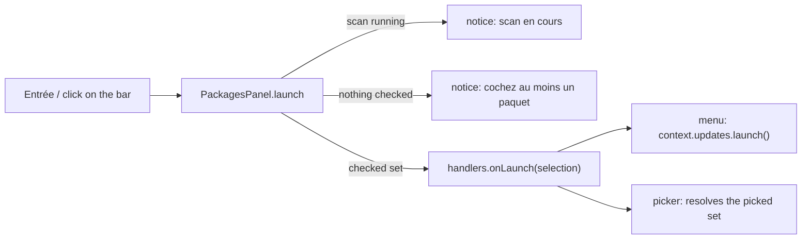

# Design note — package multi-select (`fix/package-multi-select`)

Status: shipped on `fix/package-multi-select` (0.5.0, wave 2). Source: update-flow spec §3.1 (step
A1), integrated plan §6.1, decision C13. Built on the foundation's packages seams
([`foundation.md`](foundation.md) §3.9); no foundation contract changed.

---

## 1. The problem

In 0.4.0, Entrée in **Paquets** with nothing checked updated the package — or the whole provider —
under the cursor, and the hint said so (`entrée mettre à jour ce paquet`). The checked count only
appeared inside the hint text and `a` was lost among the hints. Users read the table as "one
package per Entrée": picking several packages felt like updating them one by one.

## 2. What changed for the user

| Gesture | 0.4.0 | Now |
|---|---|---|
| Entrée, nothing checked | updates the row under the cursor | updates nothing; notice `Cochez au moins un paquet (espace), ou tout cocher avec a.` |
| Entrée, packages checked | updates them | same, **including those the filter hides** (unchanged, now stated) |
| Entrée while a scan runs | updates from the table being replaced | updates nothing; notice `Scan en cours — la mise à jour sera possible à la fin du scan.` |
| Click on the selection bar | — | same as Entrée |
| `a` | "a tout", always | `a tout cocher` / `a tout décocher`, by what it will do |
| Hint `entrée mettre à jour (n)` | always, with a fallback wording | only when Entrée can launch (n > 0, no scan running) |
| Another view's key (`p planifier`) | checked packages only, notice otherwise | unchanged; its notice moves above the bar |
| `gup update` picker | Entrée on the cursor row picks it | same rules as the menu; `q` still cancels |

The **selection bar** is the last row of the table whenever the scan found a package:

```
 ● 2 sur 9 coché(s)                         ▐ Entrée  Mettre à jour (2) ▌
```

- nothing checked: `Aucun paquet coché — espace pour cocher, a pour tout cocher` (shortened to
  `Aucun paquet coché` when the panel is too narrow — Paquets gets about 52 columns on an
  80-column terminal; the keys stay in the hint bar);
- the button is drawn on the accent fill between half blocks, so it still reads as a button
  without colours (`| Entrée  Mettre à jour (2) |` in ASCII mode); while a scan runs it is drawn
  inert (`disabled` tone, no fill);
- the row above the bar is blank, or holds the notice of the last refused key, word-wrapped to
  the panel's width. A notice lasts until the next key or click.

## 3. Design



| File | Responsibility |
|---|---|
| `src/ui/panels/package-list.ts` | the model: groups, filter, cursor, checked set. `underCursor` is gone; `isAllVisibleChecked()` tells `a`'s label. |
| `src/ui/panels/packages-panel.ts` | keys, clicks and the launch rule; composes one frame (`compose()`): head, the rows around the cursor, blank rows, then the foot. Render and click use the same composition, so a click maps to exactly what was drawn. |
| `src/ui/panels/selection-bar.ts` | pure rendering of the foot (notice row + bar) from `{ checked, total, canLaunch, notice }` and a width. |
| `src/ui/prompts/package-picker.ts` | the same panel on its own screen; now also redraws on resize, since the bar is pinned to the last row. |
| `src/ui/views/packages-view.ts` | wiring unchanged (`onLaunch` → launcher, `onRescan`, actions, marks, `isScanning`). |
| `src/ui/text/packages-labels.ts` | every French string of the table, bar, hints and picker. |

**One rule for every bulk gesture (C13).** Entrée, a click on the bar and every contributed
`PackageAction` act on `PackageList.selection` — the checked packages in display order, hidden
ones included — and never on the cursor row. `PackagesHandlers.onLaunch` is never called with an
empty list.

**Scan running.** `PackagesOptions.isScanning` (foundation) already chose the wait message before
the first results; it now also holds Entrée back afterwards, because the finishing scan rebuilds
the table (`onScansChanged` → a new `PackageList`) and would race the update. The picker passes
no `isScanning`: its table never changes.

## 4. Decisions and deviations

| # | Spec / plan | Shipped | Why |
|---|---|---|---|
| D1 | update-flow §9.1: `PackageList.selectedCount` | not added; `selection.length` | one source for the count; an extra getter would be API with no other use |
| D2 | §3.1 "the bar flashes a notice" | the notice takes the row above the bar until the next key or click | no timer in a panel (panels have no tick); the bar keeps its count and button, and a long notice wraps instead of being cut beside the button |
| D3 | §3.11 hint order `… / filtrer · r rescanner[ · entrée …]` | plan §10.2 order: `… / filtrer · entrée mettre à jour (n) · r rescanner · p planifier` | the plan outranks the area spec; the launch hint also survives a cut on narrow terminals better |
| D4 | task: "package actions in hints gated on a non-empty selection" | action hints always shown; running them gated on a non-empty checked set (`emptyNotice` otherwise) | discoverability, and the foundation's `menu-session` test (not editable in wave 2) pins `p planifier` visible with nothing checked. Actions are not held back during a scan — only an update launch is, since only it races the rebuilt table |
| D5 | §3.11 `sel.bar.empty` | plus a short form `Aucun paquet coché` when the sentence does not fit | the full sentence is cut mid-word on an 80-column terminal |
| D6 | §3.1 mockup button | half-block edges + accent fill; inert while a scan runs | non-colour cue (WCAG 1.4.1); an inert look tells why Entrée is refused before it is pressed |
| D7 | "clickable launch button" | the whole bar row is clickable | `TextPanel` reports rows, not columns; the spec says "Clicking it [the bar] is the same as Entrée" |
| D8 | — | before the first results, the hints list only `r rescanner` | the other keys do nothing yet |

Checks do not survive a rescan or the pruning after an update: the table is rebuilt, nothing
checked (unchanged from the foundation). Carrying them over — handy to retry the failed packages
of a batch — is a possible follow-up for the in-screen update flow, not part of this fix.

## 5. Accessibility and platforms

- Pure rendering: no platform branch. The glyphs used (`●`, `▐`, `▌`, `■`, `–`, `›`, `→`) all have
  one-column ASCII stand-ins in `glyphs.ts`; nothing was added there.
- Counts go through `formatCount` (`1 284`, plain spaces: width = length).
- The checked state never relies on colour alone: `[■]` vs `[ ]`, the count in words, the
  button's edges.

## 6. Tests

| Suite | Covers |
|---|---|
| `tests/ui/panels/package-list.test.ts` | `a` checks and clears what is shown; `isAllVisibleChecked` judged on the visible packages only |
| `tests/ui/panels/selection-bar.test.ts` | empty message (and short form), count + right-aligned button, inert button, wrapped notice |
| `tests/ui/panels/packages-panel.test.ts` | Entrée launches the checked set only (filtered-out included); nothing checked → notice, cursor row not launched; scan running → notice, inert button, no launch hint; bar on the last row; `a` label flips; click on a row toggles, click on the bar launches; actions keep the checked-set rule |
| `tests/ui/prompts/package-picker.test.ts` | picker parity: Entrée with nothing checked keeps the screen open with the notice; `a` + Entrée picks all; `q` cancels |
| `tests/ui/views/packages-view.test.ts` (`bootMenu`) | in the real menu: no confirmation on an empty Entrée; `a` then a mouse click on the bar opens the confirmation for every package and updates them; Entrée held back while a rescan runs |

## 7. Hand-off

- **Shared docs (wave 3, `docs/feature-guides`):** `docs/guide/cli-reference.md` ("Picking
  packages": the "with nothing checked, the package (or provider) under the cursor" sentence is
  now wrong; add the selection bar, `a`'s two labels, the scan notice) and
  `docs/development/how-gup-works.md` (the `gup update` picker paragraph says the same). Wave-2
  branches may not edit them.
- **Folder budget:** `src/ui/panels` holds 8 files after this branch; with the planned
  `options/`, `journal/` and `schedules/` sub-folders (and `options-panel.ts` deleted) it reaches
  10 entries. `src/ui/text` holds 3.
- **Scheduler (`p planifier`):** unchanged contract — `PackageAction.run` gets the non-empty
  checked set; its `emptyNotice` shows above the selection bar.
- **In-screen updates:** `UpdateLauncher.launch` is only reached with a non-empty checked set and
  never while a scan runs.
