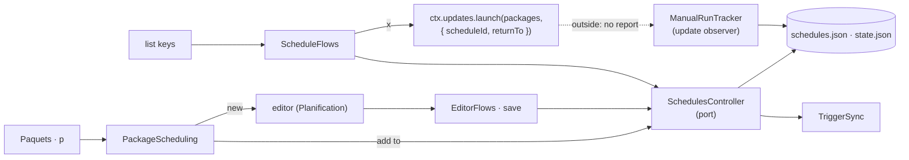

# Design note — scheduled updates (`feat/scheduled-updates`)

Status: **shipped — core, command line (part 1) and menu (part 2).** Sources:
the scheduler spec, the integrated plan §6.8, §8, §10 and amendments S-1…S-5,
F-5, F-6, F-10, F-13, F-15, C13, C22, W2-4, W2-7. The user guide is
[`../../guide/scheduled-updates.md`](../../guide/scheduled-updates.md).

A **schedule** is an explicit list of `provider:packageId` targets plus a
recurrence; it can never designate a whole provider. Execution is OS-native
and non-resident: while at least one schedule is enabled, one per-user OS
trigger starts `gup __schedule-tick` every 15 minutes; the tick decides what
is due, does the work through the shared update pipeline, records it, exits.

---

## 1. Windows spike (step 0), recorded

Windows 11 Pro 10.0.26200.9550, standard user, Node 26.10.0, throw-away tasks
named `gup-it-<random>`, each deleted and verified absent
(`Get-ScheduledTask -TaskName 'gup-*'` empty afterwards).

| Question | Finding |
|---|---|
| SID | `whoami /user /fo csv /nh` → `"host\user","S-1-5-21-…"`: non-localised CSV, parsed with `"(S-1-[0-9-]+)"` |
| Registration | `schtasks /Create /TN <name> /XML <file> /F` accepts a UTF-16LE file with BOM, in the root folder, as a standard user, with a SID `<UserId>`, `InteractiveToken`, `LeastPrivilege` |
| `conhost --headless` | node runs; `stdin.isTTY` and `stdout.isTTY` are **true**; the parent conhost has `MainWindowHandle = 0` (no window); node's exit code 7 shows as `LastTaskResult = 0` (not propagated) |
| Process context | working directory `C:\WINDOWS\system32`; the user's registry environment (`PATH`, `LOCALAPPDATA`) |
| `IgnoreNew` | a second `/Run` while the first instance runs answers "est en cours d'exécution" and starts nothing |
| `direct` launcher | the XML with node.exe as `<Command>` registers (not run: it would flash a window on the user's desktop) |
| Output | localised (French, OEM code page): only exit codes are interpreted; `/Query` of a missing task exits 1 |
| `/Query /XML` | returns the *normalised* definition: values equal to their default are dropped (`RunLevel LeastPrivilege`, `Priority 7`, `StopAtDurationEnd false`), a `<URI>` is added |

Consequences in the code: the tick sets `GUP_NONINTERACTIVE=1` (TTYs lie),
changes to the scheduler state dir (no System32 cwd), and never relies on its
exit code; status = exit code of `/Query`; the integration test asserts on
the normalised XML.

## 2. Layout

```
src/core/scheduler/                    6 files + 4 folders
  scheduler-timing.ts   the time budget (one place: the values only make sense together)
  target-resolver.ts    targeted scan → planTick; requestsOf(plan)
  scheduled-run.ts      ScheduledRun.tick() / stop()
  manual-run.ts         ManualRun: prepare (scan + plan) / settle (record) — CLI and menu run-now
  manual-run-tracker.ts ManualRunTracker: records a menu run-now from the pipeline's attempts
  run-summary.ts        report → per-schedule ScheduleRunRecord + RunStatus; unseenRuns
  model/       (7)      types, schedule-target, recurrence, cron (only croner importer),
                        validate-schedule, due, tick-plan — all pure
  persistence/ (5)      scheduler-files, schedules-section, schedule-repo, run-state, install-record
  artifacts/   (4)      windows-task-xml, launchd-plist, crontab-block, xml-text — pure builders
  trigger/     (9)      os-trigger (types), trigger-factory, task-command, captured-env,
                        windows-task, launchd-agent, crontab-trigger, trigger-sync, trigger-health
src/commands/schedule/ (10, full)     schedule-module, scheduler-services, schedule-args,
                                      crud-commands, report-commands, trigger-commands,
                                      run-now, run-deps, tick, schedules-controller
src/ui/panels/schedules/ (9)          schedules-port (types), schedules-panel, schedule-editor,
                                      schedule-list-lines, schedule-editor-lines, flow-context,
                                      schedule-flows, editor-flows, package-flow
src/ui/views/schedules-view.ts        schedulesView(port): sidebar entry, badge, facts, p, ◷
src/ui/text/schedule/ (3)             schedule-labels: vocabulary shared by the command line and
                                      the menu; schedule-cli-labels: what `gup schedule` prints;
                                      schedule-menu-labels: what the Planification view says
```

Names follow the plan (C26): `ScheduledTarget` / `TickPlan`, never the
pipeline's `PlannedUpdate` / `UpdatePlan`.

## 3. Model

- **Targets.** `parseTarget("winget:Git.Git")`; a bare provider, an empty id,
  `*`/`?`, a leading `-`, control characters or more than 256 characters are
  refused. The stored id only *selects* a scan row; the id handed to
  `update()` is the scan's (`planTick`).
- **Recurrence.** `daily | weekly | monthly (1–28 | "last") | cron`, all
  evaluated as a 5-field cron by `CronExpression` (croner 10.0.1, exact pin,
  `mode: "5-part"`, OR semantics for dom/dow, local time zone, DST-safe).
  croner's `previousRuns` throws on never-matching patterns (`0 9 31 2 *`):
  every call is guarded. Errors are translated ("valeur invalide pour les
  minutes : 60").
- **Validation** (`validateDraft`): name 1–60, ≤ 50 targets, ≤ 50 schedules,
  no duplicate, provider known and supported here (`lookupProvider`
  messages), `canUpdateUnattended`, fires within a year, **at most hourly**
  (smallest gap over the next 24 occurrences), a custom expression of at
  most 120 characters once its blanks are collapsed.
- **What is saved reads back.** The schedules file is read leniently: a
  schedule with a malformed field is dropped whole, and the next write
  rewrites the section from what was read. So every bound the file applies
  is one the model validates first (`MAX_CRON_LENGTH` and the others live in
  `validate-schedule.ts`), and a custom expression is stored in its
  evaluated form, single spaces between fields (`storedRecurrence`): a tab
  typed on the command line would otherwise be a control character the file
  refuses.
- **Due** (`evaluateDue`): anchor = `min(now, max(armedAt, lastAttemptAt))`;
  the first occurrence after it decides; the latest passed occurrence runs
  once — on time within 30 minutes, else catch-up (or *missed* without
  catch-up). Consuming sets the anchor to now: any number of missed windows
  collapse into one run; a clock set backwards cannot freeze a schedule;
  creating, re-timing or re-enabling re-arms. Across DST (pinned in
  Europe/Paris): a local time the spring-forward night skips runs on time at
  the next valid minute — never "missed" — and one the fall-back night
  repeats runs once.

## 4. Runs

**Tick** (`ScheduledRun.tick`): nothing enabled → idle, no write. Heartbeat
(`lastTickAt`). Every enabled schedule read from disk is checked again
(`scheduleIssues`: its name and its recurrence, the hourly minimum included):
one `schedules.json` edited by hand past the editor's rules is never run,
only logged (`scheduler.schedule-invalid`, warn) at every tick; a target's
own problems still skip just that target at run time (`planTick`). The
one-year horizon is the editor's and the CLI's alone (`validateDraft`): seen
from the tick that runs it, a 29 February schedule's next occurrence is four
years away. Batch: `BatchLock.tryAcquire(location, "scheduled")` — the
foundation's OS-released lock (F-13, S-2), never waited for: busy → nothing
consumed. Missed occurrences recorded. Due ones consumed **before any work**
(crash safety), then `TargetResolver`: detect and scan only the needed
providers (`detectAvailableProviders(candidates)` + `scanAll({ detected,
only })`, recorded in the history with trigger `schedule`), `planTick`.
Every installed provider failing to scan → the occurrence is given back
(anchor restored, `deferrals + 1`) up to `MAX_DEFERRALS` (4), then reported
failed. Otherwise the plan runs through `runUpdates` with `HEADLESS_DECISIONS`
(never elevate, never retry, `unattended` → winget `--disable-interactivity`,
F-5) and `batch: "scheduled"`, inside a pipe sink (stdin ignored, installer
output line by line to the log, 256 KiB per stream), under a gate that closes
at the run deadline (120 min) or on `stop()`. Results are summarised per
schedule, deferrals cleared, orphan states pruned; targets skipped before
install go to the history once (with a schedule id) and to the log.

**Time budget (S-1).** The tick clamps the install timeout:
`setting === 0 ? DEFAULT : clamp(setting, 60, 1800)`. A unit test pins
`MAX_RUN_MINUTES + cap < TICK_WATCHDOG_MINUTES (170) < EXECUTION_TIME_LIMIT (180)`.

**Headless entry** (`commands/schedule/tick.ts`): `GUP_NONINTERACTIVE=1`,
`chalk.level = 0`, boot grace (300 s), scheduler dir created and made the
working directory, captured environment applied (POSIX), launchd stderr
trimmed past 1 MiB (macOS), clamped timeout, SIGTERM/SIGINT/SIGHUP (+SIGBREAK
on Windows) → `stop()` with a 30 s grace, watchdog. Never used: scan
progress UI, skip session, retry prompts, elevation, anything under `ui/tui`.

**Run now** (`ManualRun`): `prepare` (same resolver and plan) then `settle`
(summary stored as the last run, `kind: "manual"`); the anchor is untouched.
The updates run where the user watches: on the CLI
`updateOnConsole(requests, { yes: true })`, which enters the interactive
batch guard (waits, with a message, for a running tick); in the menu, the
menu's launcher (§12). A state file that cannot be written costs a log line,
not the run.

## 5. Persistence (machine-local, `stateDir("scheduler")`)

| File | Writer | Notes |
|---|---|---|
| `schedules.json` | interactive commands | `ConfigStore({ file, maxBytes: 4 MiB })`, section `scheduler` v1 (C3): `schedules` and `seenRunsUntil` (null until the menu marks runs seen); re-read under the file lock before every change; a malformed schedule is dropped whole; a missing `enabled` reads as disabled. `ScheduleRepo.reload()` rebuilds the store, whose reads are cached, for the long-lived menu |
| `state.json` | runs | `RunStateStore`: atomic write inside `withFileLock`; corrupt → empty (logged) |
| `install.json` | `TriggerSync` | argv, launcher, captured env, date, gup version |
| `agent-stderr.log` | launchd | macOS only |

`purgeSchedulerFiles` removes them (their `.lock` files and the copies of a
corrupt file the store set aside, `schedules.corrupt-<date>.json`, included),
then the directory only if empty (a `GUP_SCHEDULER_DIR` may point at a shared
folder). The update batch's lock lives in `<state root>/gup/locks`, not here
(unless `GUP_SCHEDULER_DIR` is set): an update never recreates this folder.

## 6. OS triggers

| | Windows | macOS | Linux |
|---|---|---|---|
| Adapter | `WindowsTaskTrigger` | `LaunchdTrigger` | `CrontabTrigger` |
| Artefact | task `gup-scheduler-<SID>`, XML (UTF-16LE+BOM) in a `mkdtemp` dir, `wx`, removed | `~/Library/LaunchAgents/io.github.lindecker-charles.gup.scheduler.plist`, atomic, owner-only | managed block in the user crontab |
| Install | `schtasks /Create /XML /F` | write, `bootout` (ignored), `bootstrap gui/<uid>` (retried after 0.25, 0.5 and 1 s while it answers `Bootstrap failed: 5`: launchd still booting the old agent out), `enable` | `crontab -l` (LC_ALL=C) → upsert → `crontab -` on stdin |
| Status | `/Query` exit code | `print` exit code + `print-disabled` parse | block present |
| Binaries | `%SystemRoot%\System32\{schtasks,whoami,conhost}.exe` (SystemRoot validated) | `/bin/launchctl` | `crontab` resolved once, then absolute |

`resolveTaskCommand` registers realpath'd node and gup entry (package name
checked) and refuses npx caches, temp dirs, `.ts` sources, root, WSL, and
paths the format would re-interpret. `captureEnv` snapshots an allowlist
(never credentials; `GUP_*` except `GUP_NONINTERACTIVE`/`GUP_SCHEDULER_DIR`).

**TriggerSync**: `reconcile` (after a change: install the first time, repair,
remove at zero enabled), `heal` (at start: never a first registration),
`reinstall`, `remove`; all failures become `{ kind: "failed", reason }`.
**S-3**: a recorded registration whose node or entry no longer exists, or
belongs to the same package root, is re-registered; one from **another
existing installation** is reported `foreign` and kept — by `heal` and by
`reconcile` alike — until `gup schedule install` moves it.

**Health** (`assessTrigger`): none / not-installed / disabled-by-user /
foreign / outdated / stale (no heartbeat for 45 min while up for 45 min,
measured from the install when no tick ever ran) / active — one verdict for
`list`, `status`, `doctor` and the menu (`triggerLine(health, { repair })`).

## 7. Command line (`scheduleModule`)

`gup schedule add|list|status|remove|enable|disable|run-now|install|uninstall`
(+ `--json` on `list`/`status`), hidden `__schedule-tick`. Exit codes: 0, 1
(trigger not changed / run failures — schedules always saved first), 2
(invalid arguments, nothing changed). The module:

- `triggerFor("__schedule-tick") = "schedule"` (F-15), so the journal module
  sees scheduled runs;
- `beforeAction`: installs `createBatchGuard(location)` for every command but
  the tick (interactive runs wait for a scheduled batch); heals the trigger
  before `schedule list|status|run-now` (printing a repair notice) and, in
  the background and silently, when the menu starts; for the menu only,
  installs the Planification view's run tracker as an update observer
  (`observeUpdates`, §12);
- `diagnostics()`: one "Planification" line for `gup doctor` (W2-7).

Commands take `SchedulerServices` (stores, trigger, sync, registry facts,
scanner, clock) and a `CommandOutput`, so tests run them on sandboxed stores
with an in-memory trigger; nothing in a unit test registers a real trigger or
scans the machine (W2-4). The module and the menu share one set of services
per process (`processSchedulerServices()`).

## 8. Security

- No shell anywhere; argv vectors through `core/runner.ts`; `crontab -` on stdin.
- System binaries by absolute path; `%SystemRoot%` accepted only as a plain
  drive path; `crontab` resolved once.
- Least privilege: Windows `InteractiveToken` + `LeastPrivilege`, no stored
  password; `gui/<uid>` agent; user crontab; root/sudo refused.
- Registered command line: realpath'd and identity-checked; XML/plist text
  escaped; `"`/`%` refused for Task Scheduler, `'`/`%` for cron, control
  characters everywhere (`tests/security/scheduler-injection.test.ts`).
- Config is data: a tampered `schedules.json` can only select among rows the
  provider itself reports outdated; option-like ids are dropped at load.
- Never provider-wide, enforced three times: the model (parse/validate), the
  menu gesture (`p` acts on checked packages only, leaves `aggregate` rows
  and admin-only providers out with the reason, never treats a provider row
  as its packages) and execution (`aggregate` rows, admin-only providers).
- The OS trigger is registered from the menu only after the user consented
  (once: while no install record exists).
- Never elevated, never forced, never prompting.
- Files: owner-only modes (temp-then-rename 0600), XML in a private `mkdtemp`
  dir; env captured from an allowlist; child output capped per install.

## 9. Testing

Pure builders and parsers are tested for every platform on any platform
(`path.win32`/`path.posix` chosen from the context), and their output is
also read back by a parser (`artifact-syntax.test.ts`): the plist and the
task XML are well-formed (happy-dom's XML parser, a dev dependency already)
and decode to exactly the registered paths, markup and shell syntax
included; the task's command line splits into the registered argv; the cron
line is five valid fields firing every 15 minutes, then the argv `/bin/sh`
would see. The gesture's whole-provider filter is proven by a fake registry
that knows `nvim-lazy` (otherwise validation, not the gesture, refused its
aggregate row). Adapters run against a
scripted runner (exact argv, unreadable crontab never overwritten, status
mapping). Behavioural tables cover due evaluation, planning, summaries and
validation; `ScheduledRun` is tested with fakes (idle, busy, consume-before-
work, deferrals, deadline, stop, orphan pruning, skipped history).

The menu is tested at three levels: the editor and the panel as plain objects
(`tests/ui/panels/schedules/`, over `FakeSchedulesPort` — real validation,
in-memory schedules and trigger); the view inside a real `MenuSession` on
OpenTUI's test renderer through `bootMenu` (`tests/ui/views/schedules-view.test.ts`:
sidebar, badge, facts, `◷`, `p` and its refusals, consent, editor dialogs,
run-now with a scripted launcher and with the outside one); the controller
over the sandboxed scheduler services (`tests/commands/schedule/`). The built
bundle was driven once through a real ConPTY with every `GUP_*_DIR` in a temp
dir and only a disabled schedule (no trigger registered): list, editor, quit.

**Real system, opt-in (`GUP_MUTATE=1`, Windows):**
`tests/integration/scheduler-windows.test.ts` registers a uniquely named
`gup-it-<random>` task running a probe script (never gup, never the user's
schedules), reads the normalised XML back, runs it headless, checks the probe
saw `__schedule-tick` and TTYs, deletes it and verifies it is gone; a second
`gup-it-<random>-sync` task is driven by `TriggerSync` as `gup schedule`
drives it — first registration recorded, a start leaving it alone, the last
schedule switched off removing the task (`schtasks /Query` fails) and
`install.json`, a removal with nothing registered still succeeding.
`afterAll` deletes both whatever happened. Green on this machine;
`Get-ScheduledTask 'gup-*'` is empty afterwards.

## 10. Foundation contracts extended (additive) and touch points

- `FieldReader` gains `text(key, bounds)`, `objects(key, max)` and
  `kindOf(key)` (`src/core/config/field-reader.ts`): sections that hold
  records — a list of schedules, each with a list of targets and a
  `day: number | "last"` field — need them. New test file
  `tests/core/config/field-reader-records.test.ts`.
- `ConfigStoreOptions.maxBytes?` (default: the 256 KiB settings bound) and
  `readConfigFile(file, maxBytes?)`: at its documented limits the schedules
  file reaches ~1.5 MiB, and the settings bound would move it aside as
  corrupt. New test file `tests/core/config/store-size.test.ts`.
- `src/commands/cli/cli-modules.ts`: one line, `scheduleModule`.
- `tests/commands/cli/cli-modules.test.ts`: the pinned command list gains
  `schedule` and the hidden `__schedule-tick` (every branch adding a command
  edits these adjacent lines).
- `eslint.config.security.js`: a justified `detect-non-literal-fs-filename`
  override for `trigger/task-command.ts` (realpath of the running node and gup,
  their package.json, the temp dir).
- `src/commands/menu-views.ts`: `schedulesView(menuSchedules())`, last in
  module order, and its two imports (§8 of the plan).
- `tests/commands/menu-views.test.ts`: the pinned sidebar gains
  `["Planification", 0]` after Paquets.

Part 2 extends no foundation contract: the view uses `ViewDefinition`
(`badge`, `facts`, `packageActions`, `packageMarkers`), `ViewContext`
(`dialogs`, `updates.launch(packages, { scheduleId, returnTo })`, `show`,
`redraw`, `onScansChanged`) and `observeUpdates` as they are.

## 11. Deviations from the spec and the plan

| # | Deviation | Why |
|---|---|---|
| D1 | No `LOCK_STALE_MINUTES`; S-1's inequality uses the tick watchdog | F-13's lock is OS-released and never broken by age |
| D2 | The heartbeat is written before taking the batch | a long interactive update must not make a working trigger look stale |
| D3 | `ScheduleRepo.enable/disable` instead of `setEnabled(ids, flag)`; `replace`/`markSeen` arrived with part 2, plus `seenUntil` and `reload` | no flag parameters; no dead code before their caller |
| D4 | `SyncResult` gains `foreign`; `reconcile` keeps a foreign registration too | S-3 applied consistently: two installations never take the trigger from each other implicitly |
| D5 | Environment drift alone does not re-register | the POSIX env lives in install.json and is applied by the tick; re-registering on every start from a shell with another `PATH` would re-announce the macOS background item |
| D6 | Plist written owner-only (atomic write) instead of 0644 | launchd refuses group/world-writable plists only; owner-only is stricter |
| D7 | The tick changes to the scheduler dir; no `<WorkingDirectory>` in the XML | Task Scheduler starts in System32 (spike); one rule for every OS |
| D8 | `$`, backticks, `"` and `&` allowed in crontab paths | inert inside single quotes; the security test proves they stay in their word |
| D9 | `gup schedule status` added; `list --json` has `trigger.health`; no `notify` | task scope; S-4 |
| D10 | Run-now on the CLI uses console ports with `-y` semantics | no retry question with destructive flags, as for scheduled runs; the user still sees installers |
| D11 | A package listed by several due schedules is installed once; its history attempt carries the first schedule id; skipped targets are recorded once per run | one install per package; `UpdateRequest.scheduleId` is single |
| D12 | XML namespace and plist DTD identifiers in single-quoted constants | the shared `http-targets` drift test flags double-quoted `http://` literals; these are identifiers, never fetched |
| D13 | `GUP_SCHEDULER_DIR` is not captured; `add`/`install` warn when it is set | the directory must be known before `install.json` is read |
| D14 | The opt-in Linux crontab integration test is not written | it cannot run here; the pure block and the adapter's argv are unit-tested |
| D15 | Cron nicknames (`@daily`) accepted | croner accepts them in 5-part mode; validation still applies |
| D16 | A menu run-now that falls back to the plain terminal is recorded by `ManualRunTracker`, an update observer the scheduler module installs for the menu | F-6: `launch` resolves `null` both when declined and when it ran outside, so the view never gets that report; S-5's `recordManualRun(report)` still records the in-screen report |
| D17 | Run-now is confirmed once (since `fix/wave-2-polish`; it used to ask twice): with `confirmBeforeUpdate` on, no question before the scan, the launcher's list of the packages found is the confirmation; with it off, "Exécuter « X » maintenant ?" before the scan | the launcher's question says what will actually be updated and follows the user's preference; with the preference off, the run-now question still keeps a stray `x` from starting updates. A scan alone changes nothing, and finding nothing to update only records the run |
| D18 | `p` also leaves out packages of admin-only providers (and any target `validateDraft` refuses), with the reason, not only `aggregate` rows | one rule, the validation's, at the gesture as at saving; the user learns it before the editor opens |
| D19 | The monthly day is typed (`1`–`28` or `dernier`) instead of chosen in a 29-entry list | the dialog layer does not scroll: 29 entries do not fit on a 24-row terminal |
| D20 | Unseen runs count each schedule's *last* run, scheduled ones only (not `manual`, not `missed`); `seenRunsUntil` is written when the view is shown and something is unseen | the state keeps one run per schedule; a run-now happened under the user's eyes; a missed occurrence ran nothing |
| D21 | No "Notification" field; the catch-up reads `[oui]`/`[non]`; the buttons sit on two lines | S-4; French UI; one cursor stop per line keeps clicks and keys simple |
| D22 | The table drops the package count and next-run columns below a 120-column terminal; the details under it give the next run | a 100-column terminal leaves 70 columns to the panel |
| D23 | `q` quits the menu with an editor open; with changes not saved, only once the user confirms (default "Non") — since `fix/wave-2-polish` | `q` is global in the session unless a panel captures text, and a panel cannot claim it; `Panel.hasUnsavedChanges()` lets the session ask instead, for "Quitter" in the sidebar too |

## 12. Menu (part 2)



**View** (`schedulesView(port)`, order 30, group 0, between Paquets and
Providers): the panel, a sidebar badge (enabled count in `muted`, or `!` in
`warning` while an unseen scheduled run failed), a title-bar fact while runs
are unseen (`planif. : 2 exécution(s) · 1 échec`), the `p` package action and
the `◷` marker (enabled schedules' targets, matched case-insensitively like a
run; the key set is rebuilt once per snapshot because Paquets asks at every
frame). The view reloads the files when the view is shown and after each scan.

**Port** (`schedules-port.ts`, type-only): `ScheduleBook` (cached snapshot,
reload, markSeen, validate, create/replace/remove/enable/disable, names,
clock), `TriggerControl` (summary, mechanism, needsConsent, repair) and
`RunNowControl` (prepareRun, recordRun). `SchedulesController`
(`commands/schedule/`) implements it over the services; every change saves
first, then `reconcileTrigger` — the same path as `gup schedule`. A file that
cannot be written saves nothing and says why; a schedule removed meanwhile
by another terminal is reported, not recreated.

**Panel** (`SchedulesPanel`, a plain object): list mode — trigger line (the
CLI's `triggerLine` with `i` as the repair, tone by health), table, details of
the schedule under the cursor (next run and cron, last run per package, or
its packages when it never ran) — and editor mode (`ScheduleEditor`: fields
by recurrence, text typed in place with the draft following every keystroke,
`ownIssues` for a time that is not `HH:MM`, then `validateDraft` rendered
under each field; *Enregistrer* muted while anything is wrong). The cursor
follows a schedule by id across reloads. Everything with a side effect is a
handler: `ScheduleFlows` (list), `EditorFlows` (dialogs, save, leave),
`PackageScheduling` (`p`), sharing a `FlowContext` (consent, change notices,
trigger refresh, "is the screen still there" after each await).

**Consent.** Saving or switching on a schedule, or `i`, while no install
record exists asks first (per mechanism: Task Scheduler, launchd agent,
crontab line; what runs, every 15 minutes, nothing resident, how to remove).
*Non* saves nothing.

**Run now (S-5).** `x` → confirm → `prepareRun` (targeted scan, plan; the
tracker is armed when something is outdated) → nothing outdated: recorded at
once; otherwise `ctx.updates.launch(scan rows, { scheduleId, returnTo:
"schedules" })`. A report (in-screen run view) is recorded through
`recordRun`, which disarms the tracker. The record ends when the run's last
update ended, as the tracker saw it: the in-screen launcher only resolves
once the user leaves the results screen, and dating the run then would
count the reading time as run time. `null` means declined or run outside
the screen: the session may be ending, so the view does nothing more, and the
tracker — an `UpdateObserver` installed by the scheduler module for the menu
— records the outside run from its attempts: after each `finished` (latest
outcome per package, so a retry replaces the first attempt) and on
`cancelled`, an update not attempted yet counting as stopped. A declined run
sends no attempt and records nothing.

## 13. Integration notes

- Merge order puts `feat/in-tui-updates` before this branch: with its
  in-screen launcher, run-now returns a report; with `GUP_PTY=off` or no
  node-pty it falls back and the tracker records the run.
- `menu-views.ts` and its test, `cli-modules.ts` and its test: adjacent-line
  conflicts with other wave-2 branches; keep every line, sorted.
- The Planification view joins the contrast audit and the screenshot scenes
  in wave 3 (`test/e2e-coverage-ci`, `docs/feature-guides`). (Done: `schedules.svg`,
  `schedule-edit.svg`.)
