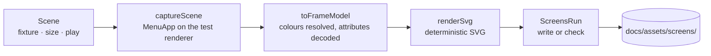

# Design note — reproducible TUI screenshots (`chore/screenshot-pipeline`)

Status: shipped on `chore/screenshot-pipeline` (wave 2 of 0.5.0): the generator, its scenes
for the views the menu has today (Scan, Paquets, Providers, Options), its unit tests and the
documentation conventions. The generated SVGs, the scenes of the 0.5.0 views and the
`screenshots:check` CI step come with the wave-3 documentation pass (`docs/feature-guides`),
once every view has merged: generated now, the images would be stale by the end of wave 2.
Nothing under `src/` changed.

The how-to lives in [`../documentation.md`](../documentation.md#screenshots); this note
records the architecture, the guarantees and the decisions.

---

## 1. What it does

`npm run screenshots` mounts gup's interactive app on OpenTUI's in-memory renderer, plays a
few key presses per scene on fixture data, captures the frame's spans and serialises them to
a standalone SVG terminal screenshot under `docs/assets/screens/`, with a generated gallery
page. `npm run screenshots:check` renders the same scenes and fails on any file that differs,
is missing, or no longer matches a scene; it writes nothing.

## 2. Architecture

| Module (`scripts/screenshots/`) | Responsibility |
|---|---|
| `vitest.config.ts`, `setup.ts`, `capture.screens.ts` | The generator: vitest hosts it (fake timers, the UI suites' transform, `--mode check`); the setup installs the sandbox, the frozen clock and the spawn guard around every scene; the entry runs one test per scene, then the gallery and the orphan sweep. |
| `sandbox/env-sandbox.ts` | Drops every `GUP_*` variable, points the history, config, log, report and scheduler directories at a fresh temporary tree, pins the terminal identity; returns the restore. |
| `sandbox/frozen-clock.ts` | Fakes `Date`, `setInterval`, `clearInterval` only — OpenTUI flushes through `setTimeout`/`setImmediate`. |
| `sandbox/no-spawn.ts` | The spawn guard (§4). |
| `fixtures/` | The fixture machine: the scan (`SCAN_FIXTURE`), the provider listing (`PROVIDERS_FIXTURE`), `FixtureController implements MenuController`, and `appFixture()`, the menu as `gup` builds it on that machine. |
| `scenes/` | The `Scene` contract, `captureScene`, `renderScene`, sizes, the catalogue and its validation. |
| `render/` | The docs palette, colour resolution, the frame model, the SVG serialiser. |
| `output/` | `syncFile` (write or compare, CRLF-normalised), `findOrphans`, the gallery page, and `ScreensRun`, which applies the mode to all three. |

**What is mounted.** `captureScene` runs the production `MenuApp` — the object `gup` itself
starts, with the same first-session rules (scan at launch, launch view) — on a test host
whose screens also end when the capture is over, whatever the app is doing (a dialog open, a
scan held). The views are the production ones, `menuViews()`, with one port swapped: the
Providers view reads `PROVIDERS_FIXTURE` instead of probing the machine. A view another
branch adds to the menu therefore shows up in the screenshots by itself, and one whose port
reaches the system trips the spawn guard until `app-fixture.ts` gives it a fixture port.

**The fixture machine** is a Windows developer machine, fictional but plausible: real
provider ids, display names and declared platforms read from the registry (a renamed
provider shows renamed; an id the registry lost fails the run), made-up versions. Twelve
outdated packages in five providers, Scoop's scan failing, fourteen providers scanned. The
controller replays the scan event by event; a scene can hold it midway (`holdScan:
{ finished, running }`) and the capture always releases it. Install hints of the missing
providers are fixed in the fixture: a provider's own hint depends on the OS rendering the
screenshot. The incompatible group is computed from the registry's declared platforms, so it
fills in as soon as providers declare theirs.

## 3. Determinism

The same scenes give the same bytes on every run and every OS, by construction:

| Input | Pinned by |
|---|---|
| Time | `Date` frozen at 2026-09-15 09:30 UTC; the menu's frame clock (`setInterval`) frozen, so spinners stand on their first frame. |
| Time zone | `TZ=Europe/Paris` in the generator's `test.env` (assigned inside the worker, where Node honours it on Windows); the setup refuses to run without it. |
| Developer's data and settings | every `GUP_*` dropped; data directories in an empty temporary tree. |
| Glyph mode | `TERM=xterm-256color`, `LC_ALL=C.UTF-8`, `NO_COLOR` dropped: Unicode on every host, including a CI runner with a `C` locale or `TERM=dumb`. |
| Colours | one palette, GitHub Dark Default (the scheme of `demo.svg`): ANSI slots map through it, slots ≥ 16 take OpenTUI's xterm-256 values, OpenTUI's literal white stays literal (it is what a terminal shows). |
| Platform-dependent data | from the fixtures (`platform: "win32"`), never by stubbing `process.platform`. |
| Serialisation | numbers with one decimal, colour classes numbered by first use, backgrounds merged per run of a colour, one element per line, LF, final newline. |

Proven by `tests/scripts/screenshots/screens-run.test.ts` (two consecutive runs write the
same bytes) and checked by hand on the shipped catalogue: two runs of `npm run screenshots`
on Windows are identical (`diff -r`). The cross-OS half — Windows-generated, Linux-checked —
is verified by the CI step of wave 3.

## 4. Security and privacy

- **No process.** `src/core/runner.ts` is gup's only spawn site (pinned by the
  process-chokepoint drift test). The setup mocks it with `spawnGuard.guard(runner)`: every
  function export is replaced by a refusal that throws `screenshots must not spawn processes`
  and records the call, **except** a reviewed list of process-free helpers (install timeout
  get/set, `consumeInterrupt`, `normalizeExitCode`, `skipCurrent`). Deny by default: a runner
  export added later is refused until someone reviews it. Providers swallow probe errors, so
  the record is what matters — the setup fails the scene that made any call. Verified
  against the real detection path: a scene left on the production Providers port fails with
  131 recorded probes.
- **No personal data.** Fixtures are fictional; `GUP_*` is scrubbed; data directories are
  temporary and deleted afterwards. A screenshot cannot show the developer's packages,
  history, paths or user name.
- **Safe SVGs.** Text is XML-escaped (and characters XML forbids replaced); no script, no
  external reference, no `foreignObject`, no animation — safe through GitHub's camo proxy,
  npm and the landing. Scene ids are validated (`^[a-z0-9]+(-[a-z0-9]+)*$`) before any path
  is built from them; output stays in `docs/assets/screens/`. The gallery writes titles and
  alt texts as literal Markdown (one line, markup characters escaped).

## 5. Tests

`tests/scripts/screenshots/` (the `unit` project, main suite):

| File | Behaviour |
|---|---|
| `resolve-color.test.ts` | ANSI slots through the palette, xterm-256 above slot 15, default and transparent colours, literal colours kept |
| `frame-model.test.ts` | INVERSE, HIDDEN, wide-glyph column accounting, attribute decoding |
| `svg-frame.test.ts` | grid placement, escaping, merged backgrounds, classes by first use, blank cells, same bytes, document size and labels |
| `output.test.ts` | CRLF counts as unchanged, stale/missing in check mode without writing, write mode, orphans, gallery markup escaped |
| `catalogue-problems.test.ts` | the shipped catalogue is valid; unsafe or duplicate ids, alt text and sizes refused |
| `env-sandbox.test.ts` | `GUP_*` hidden, data dirs in a temporary tree, Unicode glyphs whatever the host, full restore |
| `frozen-clock.test.ts` | `Date` and the frame clock stopped at the instant while timeouts run, real timers back on thaw |
| `no-spawn.test.ts` | every process-starting runner export refused and recorded, process-free helpers real, unknown exports refused, a refusal the app swallowed still on record |
| `capture-scene.test.ts` | the frame of the reached state, waiting for data a view loads while the renderer idles, opening a view wherever the sidebar lists it, teardown when a scene fails (held scan released) |
| `screens-run.test.ts` | byte-identical consecutive runs; check mode fails on stale, missing and orphan files and writes nothing; write mode deletes orphans |

The pipeline tests wait for fixture data only (a provider, a package, an install command)
and reach views with `Stage.open`, not the shipped catalogue: the catalogue follows UI
strings and keys that other wave-2 branches change, and its own check is the generator's
run. One test inserts a view ahead of Providers, as the scheduler's Planification will be,
and still opens Providers.

## 6. Deviations from the plan and the spec (`oss-docs.md` §4.3)

- **`MenuApp` instead of `MenuSession`/`bootMenu`.** `bootMenu` ties the app's lifetime to
  the test (teardown in `onTestFinished`) and mounts `defaultViews()`, a hand-kept copy of
  the menu; a capture needs its own teardown and the production views. `captureScene` mounts
  `MenuApp` on `createTestHost` through a host that ends its screens when the capture is
  over — no Ctrl+C needed, which a run view will intercept.
- **Spawn guard, deny by default.** The spec mocked four runner functions; the foundation
  added `launchDetached`, `killProcessTree`, `createPipeSink` and `isElevated` (which spawns
  `net session` on Windows from inside the runner). Every function export is refused unless
  reviewed process-free, and refusals are recorded and asserted per scene.
- **Terminal identity pinned** (`TERM`, `LC_ALL`, `NO_COLOR`): the foundation made the glyph
  mode depend on them.
- **Mode variable `SCREENSHOTS_MODE`**, not `GUP_SCREENSHOTS_CHECK`: the sandbox drops every
  `GUP_*`, and the mode is not gup configuration. For the same reason the config does not set
  `GUP_INSTALL_TIMEOUT` — it is scrubbed with the rest.
- **`waitForText` retries until a 10 s deadline** (`performance.now()`, `Date` being frozen):
  OpenTUI's wait gives up as soon as the renderer is idle, which it is while a view loads
  data.
- **`Stage.open(view)`**, not in the spec: Tab, Up to the sidebar's first entry, Down to the
  view's entry in the production order (`sidebarEntries`), Entrée. Counting rows from Paquets
  would break as soon as Planification and Journal join the sidebar (§10.1 of the plan).
- **Fixture shapes.** Display names come from the registry (no `displayNames` map); a scan
  step carries its duration and its outcome is derived from the results (one source); the
  hold is `{ finished, running }` instead of `holdScanAfter` plus outcome-less steps. The
  catalogue has 12 packages — the spec's "14" miscounted its own table. The providers fixture
  already has the foundation's `ProviderStatusReport` shape, incompatible group included.
- **Deferred to phase C, nothing consuming them yet** (dead-code rule): the history fixture,
  the light palette and `Scene.palette`, the `wide` size, `Stage.type`, the
  `confirm-update` scene (the launcher changes in wave 2: an in-screen launcher replaces the
  outside one, so the confirmation must be captured with it).
- **Scan-progress alt text** speaks of update counts, not timings: at 100 columns the Scan
  view's time column is cut off (see §8).
- **`.gitattributes`** (`*.svg text eol=lf`) is owned and already added by
  `docs/open-source-community`; check mode normalises CRLF anyway.
- **`typecheck:scripts`** overlaps `npm run typecheck` (whose test config includes
  `scripts/**`); it stays as the fast, scoped check the wave-3 CI step runs.
- **Reporter `verbose`**: one line per scene, as the spec's §2.6 output shows.

## 7. Notes for the wave-3 pass (`docs/feature-guides`, phase C)

1. Merge-time breakage is expected and loud: after the 0.5.0 views merge, `packages-select`
   (multi-select keys and hints, row counts) needs a new key script, and `providers`
   (→ `providers-os`, three groups) and `options` (→ `options-themes`) may need new wait
   texts — they reach their view with `Stage.open`, so new sidebar entries do not move them.
   A scene that cannot reach its state fails alone with the frame dumped.
2. Fixture ports in `app-fixture.ts` for every new view port that reaches the system (the
   guard names it), and guards for the modules that start processes outside the runner, if
   any lands (node-pty's loader, the report opener, the OS scheduler backend).
3. The process-wide slots. The generator runs no `CliModule.beforeAction`, so every slot
   stays at its default: legacy appearance, default preferences, outside launcher, no log
   backend. Install what the shipped app installs — the themed appearance
   (`createTestHost({ createAppearance })`, or `configureScreens`), the preferences source
   over the sandbox config (`setUiPreferencesSource`), the in-screen launcher
   (`setLauncherFactory`) — and reset each with `null` afterwards, or the screenshots show
   0.4.0's look and the outside update flow.
4. History and schedules fixtures write through the real stores into the sandbox
   directories (`GUP_HISTORY_DIR`, `GUP_SCHEDULER_DIR`, `GUP_CONFIG_DIR` are already there).
5. Light-theme scenes: add the light palette (GitHub Light Default, from
   `primer/github-vscode-theme`) and `Scene.palette`.
6. Generate, eyeball in a browser, commit; then the `screenshots:check` step on the Ubuntu
   leg of `ci.yml` — the first run is the cross-OS byte-identity proof (risk R3).
7. Shared docs this branch could not edit in wave 2: list
   `docs/development/documentation.md` in the docs index (`docs/README.md`), as the page's
   own rule asks, and turn its mention of `docs/development/releasing.md` into a link. Its
   "Link checking" section describes the `docs` workflow that `docs/open-source-community`
   adds; it merges first (plan §3.5).

## 8. Observations for the UI owners

Seen while capturing at 100 × 28 (the README column), not changed here:

- The Scan view's per-provider time column needs 75 columns of panel; at 100 terminal
  columns it is cut off.
- At 100 columns the key-hint bar of Paquets loses its tail (`tab menu · q quitter`), and the
  Options view cuts its setting descriptions.
- `PackageList` and `ScanPanel` sort names with `localeCompare()` and no locale: the order
  depends on the host's ICU locale (identical for the fixture's ASCII names today).
- The title bar draws slot 0 on slot 6 (`onAccent` on cyan), about 4:1 with GitHub Dark —
  faithful, below AA; a known item for the themes branch.
