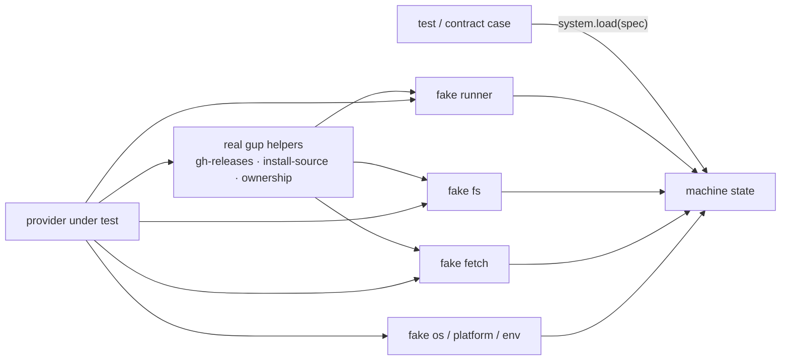

# Design note — test harness and shared test support

Branch `test/harness-and-support` (wave 1). Scope: testing spec steps S0, S2 and S3, and
amendments H-1 and H-2. Audience: anyone writing or migrating a test in waves 2 and 3.

Nothing under `src/` changed. Every suite that existed before still runs, unchanged, with the
same results (2,932 tests, 2 skipped on Windows).

---

## 1. Vitest projects

| Project | Files | Setup | Runs |
|---|---|---|---|
| `unit` | `tests/{core,commands,ui,security,scripts,cli}/**/*.test.ts`, but `tests/security/providers/**` | worker sandbox | always |
| `providers` | `tests/providers/*/**/*.test.ts`, `tests/platform/**`, `tests/security/providers/**`, `tests/support/self-test/**` | worker sandbox + **fake system** | always |
| `integration` | `tests/integration/**/*.test.ts` (real spawns, 30 s timeout) | worker sandbox | always |
| `e2e` | `tests/e2e/**/*.e2e.test.ts`, only `tests/e2e/smoke/**` with `GUP_E2E_SCOPE=smoke` (120 s, serial, one retry) | worker sandbox + its global setup (fresh `dist/`) | only when `GUP_E2E=1` |

- **Every test file belongs to exactly one project.**
  `tests/support/self-test/project-membership.test.ts` enforces it on the real tree, with and
  without `GUP_E2E`, and pins where the paths the next branches plan land
  (`tests/scripts/…` and `tests/cli/…` go to `unit`, a domain folder to `providers`).
- Project defaults (environment, `clearMocks`, env, `execArgv`, the worker setupFile) are spread
  into each project instead of inherited with `extends: true`: inheritance also re-ran the root
  global setups once per project.
- Every provider suite lives in a domain folder and runs on the fake system. Until the migration
  ended, a `providers-legacy` project ran the flat `tests/providers/*.test.ts` files, each mocking
  the runner; `test/provider-contracts` retired it once the last one had moved (amendment X-1, its
  design note §4). A flat file under `tests/providers/` now matches no project, and the
  membership self-test fails on it. The e2e project's global setup, summary reporter and npm
  scripts came with the E2E toolkit ([`e2e-coverage-ci.md`](e2e-coverage-ci.md) §9).

| Script | Runs |
|---|---|
| `npm test` | watch mode, `unit` + `providers` |
| `npm run test:run` | every declared project (CI) |
| `npm run test:unit` | `unit` + `providers`, no real process |
| `npm run test:integration` | `integration` |
| `npm run test:security` | `vitest run tests/security` — unchanged, `security.yml` relies on it |
| `npm run test:coverage` | `test:run` with coverage |
| `npm run test:e2e:smoke`, `test:e2e`, `test:e2e:mutate` | build, then `e2e` with `tests/e2e/opt-in*.env` (smoke; every suite; every suite and `GUP_MUTATE=1`) |

## 2. Shared environment and sandboxes (H-2)

`tests/support/test-env.ts` builds the env every project starts from:

| Variable | Value |
|---|---|
| `GUP_HISTORY`, `GUP_CONFIG` | `0` |
| `GUP_LOG_LEVEL` | `off` |
| `TZ` | `UTC` |
| `GUP_LOG_DIR`, `GUP_REPORT_DIR`, `GUP_SCHEDULER_DIR` | under the run's sandbox |
| `GUP_TEST_SANDBOX` | the run's sandbox root (test-only, read by the worker setup) |

- The sandbox root is `<os.tmpdir()>/gup-vitest-<pid>`, unique per run. The worker setupFile
  (`tests/support/worker-setup.ts`) moves the three directories to `<root>/w<VITEST_POOL_ID>/…`,
  unique per worker. A root teardown removes the whole root at the end of the run.
- **Rule: a test that writes uses its own `mkdtemp`** and points the matching variable at it. The
  sandbox is a safety net for stray writers, never a place a test relies on. `useTempDirs()`
  (`tests/support/temp-dirs.ts`, wave 3) makes those directories and removes each one once its
  test ends.
- Every new persistent writer gets a kill switch or a directory override here, off or sandboxed.

## 3. Node guard and coverage

- `tests/support/node-guard.ts` (root global setup) fails the run below
  `package.json#engines.node` with `gup's tests need Node >=26.9.0 (OpenTUI loads its renderer
  through node:ffi). Current: vX.Y.Z.` instead of letting the UI suites die on `node:ffi`.
- Coverage: the global 90 % thresholds this branch kept until wave 3 are gone; floors on the
  safety-critical modules replace them (`tests/support/coverage-floors.ts`, see
  [`e2e-coverage-ci.md`](e2e-coverage-ci.md) §5). `coverage.all` was dropped in wave 0;
  `src/pty-exec.ts` runs in a child process and stays excluded.

## 4. The fake system (`tests/support/system/`)

The providers project runs every test on one simulated machine. Only the boundaries are faked;
gup's own helpers (`gh-releases`, `install-source`, `ownership`, `pickInstallHint`…) run for real
on top of it.



| Boundary | Faked by | Behaviour |
|---|---|---|
| runner | `fake-runner.ts` | `run`: injected fault › `where`/`which` from `bin` › `CommandScript` (with `then` repeats, final newline stripped) › ENOENT-like failure for an absent binary › strict error for a present but unscripted one. `runInherit`: the `answerInstall` queue, exit 0 when empty. `whichFirst`, `commandExists`, `isElevated`, `consumeInterrupt` from the spec. Every other runner export stays real. |
| `node:fs`, `node:fs/promises` | `fake-fs.ts`, `fs-tree.ts` | The functions `src` imports, over a tree with the simulated OS's path rules (win32 case-insensitive and separator-agnostic; POSIX strict), symlinks (relative targets, intermediate links, loops), exec bits, real error codes. Writes land in the tree. Any other function is a usage error, never the real disk. |
| `node:os`, `process` | `os-identity.ts` | `process.platform`, a scrubbed per-platform env (case-insensitive proxy on win32), `process.getuid` (501 darwin, 1000 linux, absent on win32), `homedir`/`tmpdir`/`platform()` derived from them. The machine has a home and a temp dir; each `bin` path exists as an executable file. |
| `fetch` | `fake-net.ts` | Exact method + URL routes answered with native `Response`s; an aborted signal rejects with its reason. |

**Strictness.** An unscripted spawn of a present binary or an unscripted URL throws, *and* is
recorded: providers swallow probe errors by design, so the setupFile fails the test afterwards
whatever the provider did. A test that provokes one on purpose calls
`system.acknowledgeUnscripted()`. Duplicate scripts or routes are refused at `load`.

**Faults.** `system.inject({ on: "spawn" | "http" | "fs", … })` — spawn `exit-1`, `empty`,
`garbage`, `timeout`, `rejects`; http `status-500`, `rate-limited` (GitHub's 403 body),
`network`, `abort`, `bad-json`; fs `missing`, `eacces` (applies to the path and below; existence
stays visible under `eacces`). `explore(true)` answers unscripted calls as failures (fault sweep
only). `permissive: true` puts every binary and path on the machine, answers every command with
an empty success and every URL with a 404 (platform simulation, wave 3).

**Isolation.** `beforeEach` resets to an empty machine of the host platform with a scrubbed env;
`afterEach` restores the real platform, env object, `getuid` and `fetch`. The real values are
captured once per worker on `globalThis`, so a file that forgot to restore cannot poison the next.
`tests/support/platform.ts` (`setPlatform`, `restorePlatform`, `HOST_PLATFORM`) serves the same
purpose for suites outside the providers project.

Externalised CommonJS dependencies keep the real fs (vitest does not transform `node_modules`):
`nerd-fonts.test.ts` keeps its own `vi.mock("adm-zip")`.

## 5. The provider contract harness (`tests/support/contract/`)

```ts
// tests/providers/<domain>/contract.test.ts
defineProviderContract({ domain: "iac", cases: [...iacCases, ...hashicorpCases] });
```

A case is pure data plus a factory (`create`, `system`, `outdated` rows or a `golden(...)`,
optional `update: { packageId, installs, outcome?, onFailure? }`, `updateAll` shape, `waivers`).
Per case the harness generates:

| Test | Asserts |
|---|---|
| detects itself on a machine that has it | `isAvailable()` is true on `case.system` |
| stays hidden on a clean machine | false on an empty machine of the same platform |
| lists exactly the expected rows | deep equality, or `toMatchFileSnapshot` of the golden |
| returns rows that satisfy the row invariants | `row-shape`, `row-current-differs` (the `?` and `refresh` markers excepted), `row-unique-ids`, `slow-flag` |
| survives every injected fault | the fault sweep below |
| installs through the documented argv | install argv, `update-no-shell` (scoop's shim only), `outcome-id`, the expected outcome |
| reports a failed install as an outcome | last install exits 1 → failure outcome; each install × {`exit-1`, `timeout`} → failure, never a rejection |
| does nothing for an empty updateAll | `[]`, no install |
| updateAll follows the `<shape>` shape | install count and outcome ids per shape |
| needs every declared waiver | only when waivers exist: each covers a real violation |

The **fault sweep** runs the nominal scan, derives every reachable fault (each distinct probe argv,
URL and fs path read × each mode), replays the scan under each in explore mode, and requires a
resolution with valid rows. Its failure message is a table naming the provider, each fault and
what broke, plus a one-line replay.

Suite mistakes fail at collection: duplicate case labels, a waiver without a reason.

## 6. Fixtures and shared helpers

| File | For |
|---|---|
| `fixtures/refs.ts` | `fixture("providers/<domain>/<id>/<slug>.<platform>.<ext>")`, `golden(domain, name)`: lazy, path-checked references |
| `fixtures/load.ts` | resolves references with the real fs, cached per worker |
| `fixtures/redact.ts` | home/user/host redaction (both slash styles, case rules per OS, whole tokens only) and the secret scan; shared with the fixture recorder |
| `tests/fixtures/.gitattributes` | `-text`: recorded output stays byte-exact on any checkout |
| `builders.ts` | `pkg()`, `outcome()`, `scan()` |
| `history-fixtures.ts` | history records, JSONL, monthly shards, `writeHistoryShards(dir, …)`, `syntheticHistory({ events, seed })` |
| `random.ts` | `seededRandom(seed)` (mulberry32), `pick()` |
| `contrast/wcag.ts` | independent WCAG 2.1 oracle: `contrastRatio`, `relativeLuminance`, `parseHexColor`, `mix`, `WCAG_MIN_CONTRAST`. Never import production contrast code into a test that checks it. |

## 7. Deviations from the testing spec

| # | Spec | Shipped | Why |
|---|---|---|---|
| D1 | The sweep injects each spawn argv × 5 modes and installs × {exit-1, rejects, timeout}; generated test 7 also requires "install rejects → resolves" | Spawn modes `exit-1`, `empty`, `garbage`, `timeout`; installs `exit-1`, `timeout`; `rejects` stays available to `system.inject` | `run`/`runInherit` use `reject: false`: they only reject when the argv barrier refuses a call, which is not an environmental fault. Providers let that refusal propagate (the registry records it), so the spec's own opentofu example would fail tests 5 and 7. |
| D2 | Five runner functions are faked | `consumeInterrupt` too | The real one reads the real runner's private slot, which the fake `runInherit` cannot set. |
| D3 | `InstallAnswer { exitCode, rejects, timedOut }` | + `aborted` | Mirrors the runner's second interrupt cause (Ctrl+C skip). |
| D4 | Fake fs: the listed functions, the rest real | Also `mkdir` and `copyFile` (imported by `nerd-fonts`); every unmodelled function is a recorded usage error | The real disk must be unreachable from the providers project. `readdir` with `withFileTypes`/`recursive` is a usage error too (no `src` caller). |
| D5 | `node:os`: homedir and tmpdir | + `platform()` | A simulated `process.platform` next to the real `os.platform()` is an inconsistency waiting to happen. |
| D6 | `reset()`: empty machine | Also the host platform's scrubbed env | No test of the providers project sees the developer's real environment, loaded or not. |
| D7 | Unscripted calls throw | Throw, are recorded and fail the test after it; `system.unscripted`, `acknowledgeUnscripted()` | Providers swallow probe errors; a throw alone would let an incomplete case pass. |
| D8 | Dead waivers fail the suite | A generated test, "needs every declared waiver", computed from the nominal scenario | Self-contained, so a filtered run (`-t`) cannot report a false dead waiver. |
| D9 | Test 6: the outcome equals the expected one | `toMatchObject` | Declared fields must match; providers may add fields (a success message) without every case spelling them. |
| D10 | `system/platform.ts` | `tests/support/platform.ts` (process.platform, any suite) + `system/os-identity.ts` (env, uid, os) | Two consumers with different needs; the plan lists `platform.ts` as a top-level helper. |
| D11 | `<tmp>/gup-vitest-<pid>` suffixed with the pool id | `<root>/w<poolId>`, root passed as `GUP_TEST_SANDBOX` | Nested: one teardown removes every worker's sandbox. The variable is test-only. |
| D12 | e2e project with its global setup and reporter; e2e scripts | The project only | Those files are S13 (wave 3); a reference to a missing file would break `GUP_E2E=1` runs. |
| D13 | The sweep report prints `http GET <url>` | `http <url>` | Faults are keyed by URL; printing a method would be a guess. |

## 8. Notes for the next branches

- **Foundation** (merged with this branch at `int/wave-1`). `whichFirst` / `commandExists` now
  live in `src/core/process/which.ts` and resolve PATH in-process; `src/core/runner.ts`
  re-exports them, and every `src` module imports them through the runner, which is what
  `install.ts` mocks. Keep it that way: a module importing `process/which.js` directly bypasses
  the fake `bin` map. The foundation also added two runner exports the fake does not replace,
  both of which spawn for real: `launchDetached` (detached child) and `killProcessTree`
  (`taskkill` on win32). Nothing a provider reaches calls them today; a module that does and
  runs under the `providers` project needs a fake in `fake-runner.ts` first. `isElevated()` is
  `process.getuid() === 0` on POSIX (F-4), so the fake's `false` default matches a non-root user
  on every OS; a case that needs root sets `elevated: true`.
- **Provider contracts.** Cases go in `tests/providers/<domain>/<domain>.cases.ts` (no vitest
  import: the recorder loads them). Knowledge tests use `system` directly. Goldens:
  `golden(domain, name)`; update them only with `-u`, and review the diff.
- **Themes / HTML report.** Contrast assertions go through `contrast/wcag.ts`; frame-level helpers
  (`tests/support/tui/frame-contrast.ts`, reference palettes) build on it.
- **Observability.** `syntheticHistory()` and `writeHistoryShards()` feed the insights and reader
  suites; a test writing shards uses its own `mkdtemp`.
- **`.gitignore`.** This note was first added with `git add -f`, because the bare `design`
  pattern also matched `docs/development/design/`. The foundation anchored it to `/design/`, so
  from `int/wave-1` on, design notes are added normally.
