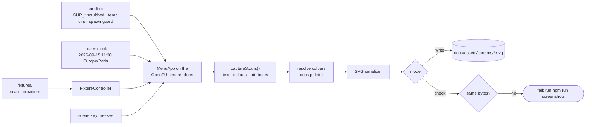

# Documentation conventions

How `gup`'s documentation is written: where a page goes, what the README may
contain, how diagrams are drawn and how the screenshots of the interactive app
are produced. For the code conventions, see
[`CONTRIBUTING.md`](../../CONTRIBUTING.md).

---

## Language and audience

- **Everything is written in English**: guides, development notes, release
  notes, code comments. Contributors and bug reports arrive in English.
- **The interface is French** and stays quoted as it is: name a UI label in
  **bold**, with an English gloss the first time a page uses it —
  "**Paquets** (packages)", "**Mode rapide** (fast mode)". Never translate a
  label in place: a reader looks for the French word on screen.
- User pages explain what to do; contributor pages explain how it works. A
  page that does both is two pages.

## Where things go

| Path | Content |
|---|---|
| `docs/guide/` | User-facing pages: install, CLI reference, scope, provider catalog. |
| `docs/development/` | Contributor-facing pages: architecture, internals, releasing, these conventions. |
| `docs/development/design/` | Design notes of the work in flight, one per area; folded into `architecture.md` and `how-gup-works.md` when the release closes. |
| `docs/releases/` | Release notes, the text of each GitHub Release. |
| `docs/changelog/` | Commit-level history; `unreleased/` holds one fragment per branch ([how](../changelog/README.md)). |
| `docs/assets/` | Images. `demo.svg` (the animated `gup list`) is hand-made; `screens/` is generated ([Screenshots](#screenshots)). |
| `docs/archived/` | Local working documents, gitignored except its README. |

A new page is listed in the [documentation index](../README.md) in the same
pull request.

## The README is also the npm page

`README.md` ships in the npm package, and npm renders neither Mermaid nor
relative image paths:

- no Mermaid block in `README.md` — put the diagram in a page under `docs/`
  and link to it;
- images by absolute URL
  (`https://raw.githubusercontent.com/LINDECKER-Charles/gup/main/docs/assets/…`);
- links to other files by absolute GitHub URL when the README must work on npm
  as well.

## Mermaid diagrams

A diagram earns its place when it explains a mechanism — a flow, a sequence,
the states of a screen — that prose would spread over several paragraphs.

- **Stable diagram types only**, which GitHub and VS Code render: `flowchart`,
  `sequenceDiagram`, `stateDiagram-v2`, `classDiagram`, `gitGraph`. No
  `*-beta` type.
- **One diagram, one question**, about 20 nodes at most. A one-sentence
  caption before the block says what it answers.
- **Labels in English**; French UI labels stay verbatim, inside quotes. Quote
  any label holding `( ) : , #`; break lines with `<br/>`.
- **No custom colours**: no `classDef` fills, no `style` colours. GitHub
  switches between light and dark themes and a fixed fill breaks one of them.
  The existing `stroke-dasharray` boundary class is the one exception.
- **Never in `README.md`** ([why](#the-readme-is-also-the-npm-page)).
- Check the rendering in the pull request's rich diff before asking for a
  review: a syntax error only shows there.

## Screenshots

The screenshots of the interactive app are **generated**, never captured by
hand: `npm run screenshots` renders the real views headless, on fixture data,
with a frozen clock, into SVG terminal screenshots under
`docs/assets/screens/`, plus a generated gallery page
(`docs/assets/screens/README.md`). A UI change regenerates them in the same
pull request, so the docs never show a screen gup no longer has.

How a screenshot is made:



### Commands

| Command | Effect |
|---|---|
| `npm run screenshots` | Renders every scene, writes `docs/assets/screens/<id>.svg` and the gallery, deletes the SVGs no scene produces any more. One line per scene. |
| `npm run screenshots:check` | Renders every scene and compares with the committed files; writes nothing. Fails on a stale, missing or orphan file, naming it: ``docs/assets/screens/packages-select.svg is out of date — run `npm run screenshots` and commit the result.`` |
| `npm run typecheck:scripts` | Type-checks the generator against the real app: a member added to `MenuController` must be implemented by the fixture controller. |

Run `npm run screenshots:check` before pushing a change to the interactive
app. The screenshot commands need Node ≥ 26.9, like the UI tests.

### Adding a scene

1. **Data.** If the view needs data the fixture machine does not have, add it
   under `scripts/screenshots/fixtures/`. If the view reads it through a port
   that reaches the system (detection, the OS scheduler, a browser), give it
   a fixture port in `fixtures/app-fixture.ts` — otherwise the spawn guard
   fails the scene.
2. **Scene.** Add a `Scene` to `scripts/screenshots/scenes/core-views.ts` (or a
   sibling module for a feature): an `id` in kebab-case (the file name), a
   `title` `gup — <view label as the app shows it>` built from the labels
   constants, an `alt` text, a size from `SCENE_SIZES`, the `fixture()`, and a
   `play()` that drives the app with key presses and ends on a `waitForText`
   of something only the target state shows. Reach a view with
   `stage.open("<view id>")`, never by counting sidebar rows: it follows the
   menu's own order, so a view added later does not shift the scene.
3. **Catalogue.** List it in `scripts/screenshots/scenes/catalog.ts`, in
   gallery order.
4. **Render.** Run `npm run screenshots`, open the SVG in a browser, and
   commit it with the gallery in the same commit as the change it shows.
5. **Embed.** In `docs/`, by relative path:
   ``; in `README.md`, by absolute
   URL ([the README is also the npm page](#the-readme-is-also-the-npm-page)).

### Fixture rules

- **Fictional but plausible.** Real provider ids — display names and declared
  platforms come from the registry, so a screenshot shows what gup shows —
  with made-up versions. Never data copied from a real machine: no user name,
  path, host or token can reach a screenshot.
- **The platform comes from the fixtures** (the fixture machine runs Windows),
  never from stubbing `process.platform`, which OpenTUI needs to load its
  native renderer. A value that depends on the OS rendering the screenshots,
  such as a provider's install hint, is fixed in the fixture.
- **No process.** The generator replaces every runner function that can
  start a process with a refusal, and records each call: a scene that tried
  fails, even when the app swallowed the refusal (providers treat a failed
  probe as "not installed"). Fixtures never reach the network either.
- **No data from the developer's machine.** Every `GUP_*` variable is dropped,
  and gup's history, settings, log, report and scheduler directories point at
  an empty temporary tree: the app runs on its defaults.
- **Time is frozen** at 2026-09-15 11:30 in Paris (`Date` and the frame
  clock, so spinners stand still). The UI formats dates and numbers through
  `src/ui/text/fr-format.ts` (explicit `fr-FR`), never with the host's
  locale: a CI runner in `en-US` must render the same bytes as a developer in
  `fr-FR`.

### Alt text

English, at most 250 characters, saying what the screen shows and what state
it is in — "The Paquets view: 12 outdated packages grouped by provider, Winget
fully checked…" — never "Screenshot of…". Figures match the fixture. The
generator refuses an empty or longer text.

### Why the output is byte-identical

Same scenes, same bytes, on every run and every OS:

- the clock, the time zone (`Europe/Paris`, set inside the vitest worker,
  where Windows honours it) and the data directories are fixed;
- the terminal is pinned (`TERM=xterm-256color`, a UTF-8 locale), so the
  glyph mode is Unicode even on a CI runner whose locale is `C`;
- colours are resolved against one fixed palette (GitHub Dark Default, the
  scheme of `demo.svg`): gup paints through ANSI slots, the palette says what
  each slot looks like;
- the SVG is serialised deterministically: one decimal, colour classes
  numbered by first use, one element per line, LF endings.

Every cell is placed on a fixed grid (`textLength` per span), so the image
holds whatever monospace font the viewer falls back to. Should a platform
ever render an ambiguous-width glyph differently, generate on Linux (WSL on
Windows) and say so in the pull request.

### Inside `scripts/screenshots/`

```
scripts/screenshots/
├── vitest.config.ts     the generator's runner: one worker, TZ, --mode check
├── tsconfig.json        npm run typecheck:scripts
├── setup.ts             sandbox, frozen clock, spawn guard for every scene
├── capture.screens.ts   entry: catalogue check, one test per scene, gallery, orphans
├── sandbox/             env-sandbox · frozen-clock · no-spawn
├── fixtures/            clock · scan · providers · controller · app-fixture
├── scenes/              scene contracts · capture · render · sizes · catalogue
├── render/              docs palette · colour resolution · frame model · SVG
└── output/              sync-file · find-orphans · render-gallery · screens-run
```

vitest hosts the generator for its fake timers, the same TypeScript transform
as the UI suites, and a `--mode check` switch that works in every shell. The
unit tests of the pipeline live in `tests/scripts/screenshots/` and run with
the main suite.

## Link checking

The `docs` workflow (`.github/workflows/docs.yml`) checks every relative link
and its anchor in the tracked Markdown files, offline (lychee with
`--include-fragments`), on pull requests that touch Markdown or
`docs/assets/`. It is not a required check — a path-filtered workflow cannot
be — but a red run is fixed before merging.

- Link to a file by relative path, to a section by its GitHub anchor:
  [`documentation.md#screenshots`](#screenshots).
- An anchor is the heading, lowercased, punctuation dropped, spaces turned to
  hyphens. Keep numbers out of the headings other pages link to: renumbering a
  section would break every link to it.
- External URLs (badges, npm, commits) are not checked: offline keeps the job
  deterministic.

## Changelog and release notes

- Each branch writes its changelog fragment, `docs/changelog/unreleased/<branch-slug>.md`,
  as described in the [changelog README](../changelog/README.md).
- Release notes live in [`docs/releases/`](../releases/README.md); the release
  procedure is `docs/development/releasing.md`. The version shows in the title
  bar of every screenshot: a release regenerates them.
