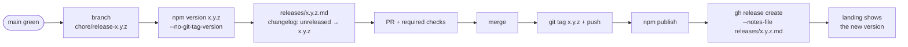

# Releasing

How a version of `gup` goes from `main` to npm, GitHub Releases and the
landing page. Only a maintainer runs this flow: it needs push rights on tags
and the npm publish rights of `@charles_lindecker/gup`.

## Versioning

- [Semantic versioning](https://semver.org/). While `gup` is in `0.x`, a
  **minor** version may break compatibility (a raised Node floor, a changed
  flag); a **patch** never does.
- Tags are plain `x.y.z`, no `v` prefix, matching every existing tag and the
  links in [`docs/releases/README.md`](../releases/README.md).
- The version bump is its own commit: `chore(release): x.y.z`. The tag points
  at that commit.

## Release flow

The flow, from a green `main` to a published version:



## 1. Pre-flight

- `main` is green: the eight required checks listed in
  [CONTRIBUTING.md § Pull request flow](../../CONTRIBUTING.md#9-pull-request-flow)
  passed on its last commit.
- Open Dependabot pull requests are processed: merged when green and relevant,
  closed with a reason otherwise. A release never ships with a known
  advisory that a pending bump fixes.
- The changelog is complete. Every fragment under `docs/changelog/unreleased/`
  is folded into [`docs/changelog/unreleased.md`](../changelog/unreleased.md)
  under the fixed headings of the [changelog guide](../changelog/README.md),
  and the fragment files are deleted.

## 2. Prepare the release branch

```bash
git switch main && git pull
git switch -c chore/release-x.y.z
npm version x.y.z --no-git-tag-version   # package.json + package-lock.json
```

Then, in the same branch:

1. **Changelog.** Rename `docs/changelog/unreleased.md` to `x.y.z.md`, set its
   title and header links (release notes, compare view), add its row to the
   table in [`docs/changelog/README.md`](../changelog/README.md), and start a
   fresh `unreleased.md`.
2. **Release notes.** Write `docs/releases/x.y.z.md` in the shape described in
   [`docs/releases/README.md` § Writing the next one](../releases/README.md#writing-the-next-one),
   and add its row to the table there.
3. **Landing facts.** Run `npm --prefix index run sync:facts`. It regenerates
   `index/src/data/facts.js` (version, provider count, Node floor) from the
   root `package.json` and the registry; the landing build does the same, but
   the committed copy must not lag behind the release.
4. **Screenshots.** Run `npm run screenshots`. The title bar of every generated
   screenshot shows `gup v<version>`, read from `package.json`: after the bump
   they are all out of date, and CI's **Screenshots up to date** step fails
   the release pull request until they are regenerated.
5. **Full checks** on Node 26, the npm gates CI runs (CodeQL, Semgrep and
   gitleaks run on the pull request):

   ```bash
   npm run typecheck && npm run lint && npm run lint:security \
     && npm run test:run && npm run build && npm run security \
     && npm run screenshots:check
   node dist/cli.js --version    # prints x.y.z
   npm pack --dry-run            # package.json, dist/, LICENSE, README.md
   ```

   On Windows, `check.cmd` runs the security audit, the tests and the coverage
   in parallel and prints a summary; it does not replace the gates above.
6. Commit the bump as `chore(release): x.y.z`, with the changelog, the release
   notes, the landing facts and the regenerated screenshots in the same commit
   (release notes travel with the commit they document).

## 3. Merge, tag, publish

1. Open the pull request, wait for the required checks, merge it.
2. Tag the `chore(release): x.y.z` commit once it is on `main`:

   ```bash
   git switch main && git pull
   git tag x.y.z <sha of chore(release): x.y.z>
   git push origin x.y.z
   ```

3. Publish from a clean checkout of the tag, on Node 26, so nothing outside
   the tagged tree can end up in the tarball:

   ```bash
   git worktree add ../gup-release x.y.z
   cd ../gup-release
   npm ci            # runs `prepare`, which builds dist/
   npm publish
   cd - && git worktree remove ../gup-release
   ```

4. Create the GitHub Release from the notes file. GitHub appends its generated
   "What's Changed" block; edit the file, never the release body:

   ```bash
   gh release create x.y.z --title "x.y.z" \
     --notes-file docs/releases/x.y.z.md --generate-notes
   ```

5. Check that the landing page shows the new version. It reads the version
   from `package.json` at build time, so it only changes once
   `.github/workflows/pages.yml` has run for this release. If that workflow did
   not start on its own, run it by hand: `gh workflow run pages.yml`.

## 4. After the release

- In [`docs/releases/README.md`](../releases/README.md), replace "not yet
  published" with the npm publication date (UTC) and link the GitHub Release
  and the npm version. Do the same in
  [`docs/changelog/README.md`](../changelog/README.md), and in the title and
  header links of `docs/changelog/x.y.z.md`.
- Verify what users get:
  - the npm page shows `x.y.z` and the README renders correctly;
  - `npx @charles_lindecker/gup@x.y.z --version` prints `x.y.z`;
  - the landing page shows `x.y.z`.

## Hotfix

A patch for a published version follows the same flow, starting from its tag
instead of `main`, so that unreleased work on `main` does not ship with it:

```bash
git switch -c fix/short-description x.y.z
# fix, test, then bump to x.y.(z+1) as in § 2
```

Tag and publish from that branch as in § 3, then merge it back into `main`
through a pull request so the fix and the changelog entry are not lost.
