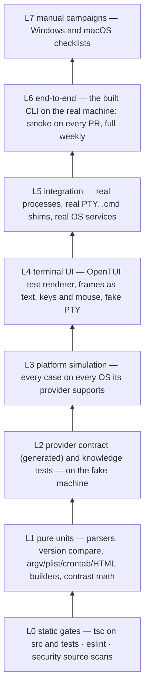
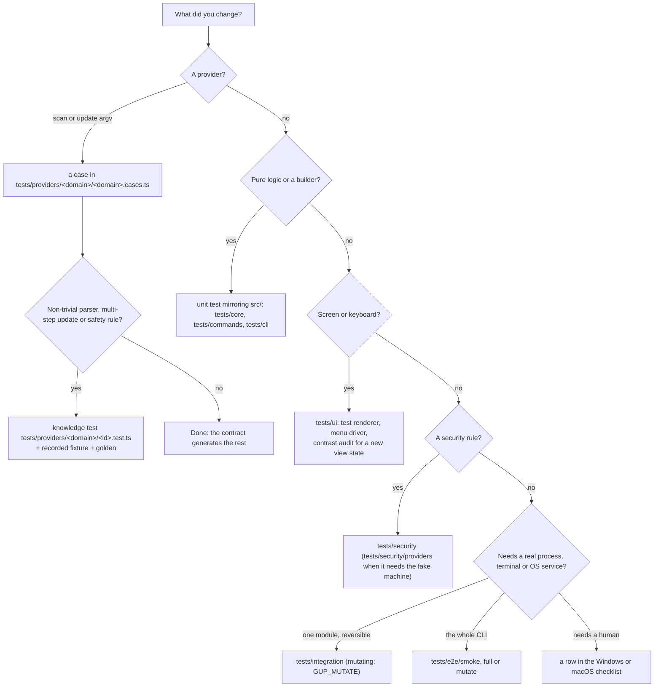

# Testing gup

How gup is tested, how to run each layer, and where a new test goes. Written for contributors;
the design notes behind it go deeper:
[`test-harness.md`](design/test-harness.md) (vitest projects, the fake machine, the contract
harness), [`provider-contracts.md`](design/provider-contracts.md) (provider suites and recorded
fixtures) and [`e2e-coverage-ci.md`](design/e2e-coverage-ci.md) (platform simulation, contrast
audit, coverage floors, the end-to-end suites and CI). The manual campaigns have their own
checklists: [Windows](testing-windows-checklist.md) and [macOS](testing-macos-checklist.md).

## Table of contents

1. [Principles](#1-principles)
2. [The test pyramid](#2-the-test-pyramid)
3. [Running the tests](#3-running-the-tests)
4. [Where does my test go?](#4-where-does-my-test-go)
5. [Rules every suite follows](#5-rules-every-suite-follows)
6. [End-to-end suites](#6-end-to-end-suites)
7. [Continuous integration](#7-continuous-integration)
8. [Coverage](#8-coverage)
9. [Manual campaigns](#9-manual-campaigns)
10. [Troubleshooting](#10-troubleshooting)

---

## 1. Principles

- **Behaviour at the boundary.** A test states what gup does to the outside world — the argv it
  spawns, the URLs it requests, the rows it returns, the frames it draws, the files it writes,
  its exit code — never which of gup's own functions called which.
- **One fake per boundary**, written once in `tests/support`: the process runner, `fetch`,
  `node:fs`, the OS identity (`process.platform`, env, `node:os`), the clock, the terminal.
  gup's own helpers (`gh-releases`, `install-source`, `ownership`…) always run for real.
- **Generated tests prove the shape, written tests carry knowledge.** The provider contract
  generates detection, fail-soft, argv and `updateAll` checks from a case; a hand-written test is
  for a parser, a multi-step update or a safety rule.
- **Real output beats imagined output.** Parsers are tested against tool output recorded on a
  real machine (`npm run fixtures:record`), redacted and secret-scanned.
- **Every OS runs every simulation.** A macOS case runs on the Windows box, a Windows case on
  the Mac leg; real-OS behaviour is proven separately by integration and end-to-end runs on each.
- **Coverage is a flashlight, not a target** ([§8](#8-coverage)).
- **Tests are production code for their maintainers**: typechecked and linted like `src`.

## 2. The test pyramid



| Level | Vitest project | What is faked | Runs |
|---|---|---|---|
| L0 | — (`tsc`, `eslint`) | nothing | every PR: typecheck on the three OSes, lint on Linux |
| L1, L4 | `unit` | the module's own boundary (a mocked runner, the test renderer) | every PR, three OSes |
| L2, L3 | `providers` | the whole machine (`tests/support/system/install.ts`) | every PR, three OSes |
| L5 | `integration` | nothing: real spawns, a real pseudo-terminal | every PR, three OSes; the mutating ones on CI runners only |
| L6 smoke | `e2e` (`GUP_E2E_SCOPE=smoke`) | nothing: the built CLI in a sandbox | every PR, three OSes |
| L6 full | `e2e` | nothing: real tools, the network | weekly, on demand, on PRs labelled `e2e-full` (macOS, Windows) |
| L7 | checklists | — | before a release |

## 3. Running the tests

The tests need **Node ≥ 26.9** (OpenTUI loads its renderer through `node:ffi`); a root global
setup stops the run with that message on an older Node. With several Node versions installed,
put 26 first on `PATH` for the session:

| Shell | Command |
|---|---|
| Git Bash, zsh, bash | `export PATH="<node-26-dir>:$PATH"` |
| PowerShell | `$env:Path = "<node-26-dir>;" + $env:Path` |
| cmd | `set "PATH=<node-26-dir>;%PATH%"` |

| Command | Runs |
|---|---|
| `npm test` | watch mode, `unit` + `providers` |
| `npm run test:run` | `unit`, `providers` and `integration` once (what each CI leg runs) |
| `npm run test:unit` | `unit` + `providers`: no real process |
| `npm run test:integration` | real spawns and a real pseudo-terminal |
| `npm run test:security` | every file under `tests/security` (the security workflow runs this) |
| `npm run test:coverage` | `test:run` with coverage; fails on the floors only; HTML report in `coverage/` |
| `npm run test:e2e:smoke` | build, then the smoke end-to-end suites (no network) |
| `npm run test:e2e` | build, then every end-to-end suite, read-only (real tools, network) |
| `npm run test:e2e:mutate` | build, then every end-to-end suite, the sandboxed mutating ones included |
| `npm run fixtures:record -- --provider <id>…` | re-record provider fixtures from the tools installed here ([`provider-contracts.md`](design/provider-contracts.md#7-recorded-fixtures-s11)) |
| `npm run typecheck` | `tsc` on `src`, then on `tsconfig.tests.json` (tests, scripts, configs) |
| `npm run lint` | `eslint src tests scripts` |
| `check.cmd` (Windows) | every gate above in parallel, then the end-to-end smoke alone; `check.cmd -E2E full` or `-E2E mutate` for more, `-E2E none` for less |

The end-to-end scripts load their switches with `node --env-file=tests/e2e/opt-in*.env`, which
behaves the same in every shell. To run one file or one test, call vitest directly with the same
switches, for example in Git Bash:

```bash
GUP_E2E=1 node node_modules/vitest/vitest.mjs run --project e2e tests/e2e/smoke/menu-pty.e2e.test.ts
```

and in PowerShell:

```powershell
$env:GUP_E2E = "1"; node node_modules/vitest/vitest.mjs run --project e2e tests/e2e/smoke/menu-pty.e2e.test.ts
```

## 4. Where does my test go?



| Folder | Project | Setup |
|---|---|---|
| `tests/{core,commands,cli,ui,security,scripts}/**` | `unit` | sandboxed state directories; mock what the module reaches |
| `tests/providers/<domain>/**`, `tests/platform/**`, `tests/security/providers/**`, `tests/support/self-test/**` | `providers` | the fake machine |
| `tests/integration/**` | `integration` | none: real processes, 30 s per test |
| `tests/e2e/{smoke,full,mutate}/**/*.e2e.test.ts` | `e2e` (only with `GUP_E2E=1`) | the built CLI; one file at a time, 120 s per test, one retry |

A file matching no project never runs, and one matching two runs twice:
`tests/support/self-test/project-membership.test.ts` fails on either.

## 5. Rules every suite follows

- **Nothing real is written.** Every test process starts with history, settings and the debug
  log off and every state directory in a per-run sandbox (`tests/support/test-env.ts`). A test
  that writes creates its own `mkdtemp` directory and points the matching variable at it
  (`GUP_HISTORY_DIR`, `GUP_CONFIG_DIR`, `GUP_LOG_DIR`, `GUP_REPORT_DIR`, `GUP_SCHEDULER_DIR`).
- **Nothing real is updated, opened or scheduled** outside the mutating suites, and those only
  ever touch a throw-away npm prefix and a uniquely named `gup-it-<random>` task. A unit test
  never spawns a browser, a scheduled task or `taskkill`: `launchDetached` and `killProcessTree`
  are mocked explicitly.
- **French strings come from their constants.** Tests import the labels the interface uses
  (`src/ui/text/**`) rather than retyping them; a copy change then touches one constant. Only
  strings asserted as behaviour (`Format invalide`, the non-TTY refusal, the `gup update`
  summary lines) stay literal.
- **node-pty is reached through `detectEmbeddedTerminal()`**, and a pseudo-terminal is ended
  through gup's `PtySession.kill()` / `ptyKill`, never node-pty's `IPty.kill()`
  (`tests/security/process-chokepoints.test.ts` scans `src`, `tests` and `scripts`).
- **No personal data** in fixtures, goldens, screenshots or docs: user and host names, home
  paths and the packages installed on a contributor's machine stay out of the repository.

## 6. End-to-end suites

The `e2e` project runs the **built** CLI (`dist/cli.js`) on the real machine. Its global setup
refuses a missing or stale `dist/` and reports whether the embedded terminal loads.

| Suite | Scope | Covers |
|---|---|---|
| `smoke/cli-smoke` | smoke | `--version`, `--help` (no internal command listed), an unknown command, an invalid target, the non-TTY refusal, `doctor` (every registered provider in the group this OS gives it, the embedded terminal found on Windows and macOS), `list --json --fast` (published shape, the scan recorded), `report --no-open` (self-contained HTML, CSP, JSON export), `schedule list` / `status` / an invalid `add` |
| `smoke/menu-pty` | smoke | the menu in a real pseudo-terminal: first frame on the alternate screen, every view of the sidebar, quitting by `q`, by "Quitter" and by Ctrl+C (exit 130), a resize, no process or pseudo-console left behind |
| `full/list-json` | full | `list --json --fast` over the machine's real tools: shape, only detected providers, no slow one, `--provider` |
| `full/real-providers` | full | every detected provider scanned alone: no scan error on today's tool output (drift) |
| `full/menu-select` | full | Paquets on two outdated packages: `a`, Espace, the confirmation, "non" updates nothing |
| `mutate/sandboxed-update` | full + mutate | `is-number` 6.0.0 updated to the latest through `gup update` and through the menu's run view, history records checked |
| `mutate/scheduled-update` | full + mutate | a schedule run by `gup schedule run-now`; on Windows, the built tick started by Task Scheduler from a `gup-it-<random>` task, then deleted and verified gone |

The smoke suites need no network: the menu's scan is restricted (through the settings file) to
npm on an empty, sandboxed global prefix. The full suites read the machine's real tools and the
npm registry; the mutating ones also need `GUP_MUTATE=1`.

| Variable | Effect |
|---|---|
| `GUP_E2E=1` | declares the `e2e` project |
| `GUP_E2E_SCOPE=smoke` | keeps it to `tests/e2e/smoke/` |
| `GUP_MUTATE=1` | runs the mutating end-to-end and integration suites instead of skipping them |
| `GUP_E2E_ARTIFACTS=<dir>` | where suites save what helps read a CI failure (screens of failed menu tests, scan JSON); unset, nothing is saved, since a local screen shows the developer's own packages |

**The toolkit** (`tests/support/e2e/`):

| Module | Gives |
|---|---|
| `sandbox.ts` | `createSandbox(label)`: a temp root holding every state directory, the npm prefix and cache, and the complete environment of a gup started there (gup's own variables and the `npm_*` variables of the outer `npm run` removed); `restrictMenuScan()`, `historyEvents()` |
| `cli.ts` | `runCli(args, { sandbox, input?, timeoutMs? })` → `{ code, stdout, stderr, ms, timedOut }`, piped (no TTY) |
| `pty-session.ts` | `detectTerminal()`, `PtySession.start(pty, sandbox)`: the menu in a 100×30 terminal, with `screen()`, `waitForText()`, `waitForScreen()`, `press(...keys)`, `type(text)`, `resize()`, `exited()`, `dispose()`. node-pty runs the CLI through gup's own `PtySession` (tree kill, ConPTY release); @xterm/headless renders the screen |
| `scan-schema.ts` | `assertScanResults(value)`: the `gup list --json` contract, unknown fields included |
| `doctor.ts` | `parseDoctor(stdout, platform)`: the detected, missing and incompatible ids |
| `npm-prefix.ts` | `installGlobal()`, `installedVersion()`, `latestVersion()` in the sandbox's prefix |
| `summary-reporter.ts` | one table row per suite, the tests' `annotate()` notes included, printed and appended to `$GITHUB_STEP_SUMMARY` |

A new suite in a few lines:

```ts
let sandbox: Sandbox;
beforeAll(async () => { sandbox = await createSandbox("my-feature"); });
afterAll(async () => { await sandbox.dispose(); });

it("does the thing", async () => {
  const run = await runCli(["my-command", "--json"], { sandbox });
  expect(run.code, describeRun(["my-command", "--json"], run)).toBe(0);
});
```

A suite that changes anything real wraps its tests in `describe.runIf(isMutateEnabled())` with
`{ retry: 0 }`, restores or deletes what it created in `afterAll`, and verifies it is gone.

## 7. Continuous integration

`ci.yml`, on every pull request and push to `main`. The job names are the required checks of the
`main` ruleset and do not change.

| Step | `test (node 26 / windows-latest)` | `… / macos-latest` | `… / ubuntu-latest` |
|---|---|---|---|
| Typecheck (src and tests) | ✓ | ✓ | ✓ |
| Lint, security lint | | | ✓ |
| Build | ✓ | ✓ | ✓ |
| Tests (`test:run`, `GUP_MUTATE=1`) | ✓ (the Task Scheduler round trip included) | ✓ | |
| Tests with coverage (floors), report uploaded | | | ✓ |
| End-to-end smoke | ✓ | ✓ | ✓ (menu suite skipped if node-pty did not build) |

The `packed install (node 26 / <os>)` job, on Windows and macOS, installs what users install:
`npm pack`, then `npm install --global ./*.tgz --ignore-scripts`, then `gup doctor` must report
the embedded terminal available — node-pty loading from its prebuilds, with macOS's
`spawn-helper` made executable by gup itself.

`e2e.yml` runs the full suites (mutating ones included) on macOS and Windows weekly, on demand,
and on a pull request labelled `e2e-full`; it also records the provider fixtures on macOS and
Linux. Its artifacts — screens, scan JSON, the JUnit report, the recorded fixtures — are kept
14 days:

```bash
gh workflow run e2e.yml --ref <branch> -f mutate=true -f record-fixtures=true
gh run watch
gh run download --name e2e-macos-latest --name fixtures-macos-latest
```

Review a downloaded fixture's diff before committing it: the recorder redacts user, home and host
names, but the package names are whatever the runner image holds.

## 8. Coverage

There is no global threshold. `tests/support/coverage-floors.ts` sets a floor on each module
where an untested branch can do harm — the runner and the PATH lookup, the trampoline payload,
install-source and ownership, elevation and the admin batch, the update pipeline, the config
store, the scheduler's model, triggers and artifact builders, log redaction, the history, the
HTML report's escaping — each a few points under its measure. Raising a floor is routine;
lowering one needs its reason in the commit body. CI measures once, on Linux, and keeps the
report as the `coverage` artifact.

## 9. Manual campaigns

What no automated layer can see — a real conhost window, a UAC prompt, Terminal.app's light
profile, a `sudo` password typed into the embedded pane, VoiceOver — is checked by hand before a
release, on the checklists: [Windows](testing-windows-checklist.md) and
[macOS](testing-macos-checklist.md). Each result table goes into the pull request description.

## 10. Troubleshooting

| Symptom | Cause, fix |
|---|---|
| `gup's tests need Node >=26.9.0` | an older Node first on `PATH`: see [§3](#3-running-the-tests) |
| `dist/ is older than src/…: run npm run build first` | the end-to-end suites test the build; the `test:e2e*` scripts build first |
| the menu suites skip on Linux | node-pty did not build (no compiler toolchain); the CLI suites still run the fallback |
| `embedded terminal unavailable (désactivé par GUP_PTY)` | `GUP_PTY=0` (or `off`) in the shell: unset it |
| a test fails only when the whole suite runs | a shared directory or a timing: use your own `mkdtemp`, and wait on a condition, never a fixed delay |
| `gup-e2e-*` directories left in the temp dir | a run killed before its `afterAll` (Ctrl+C, a closed pipe): delete them |
