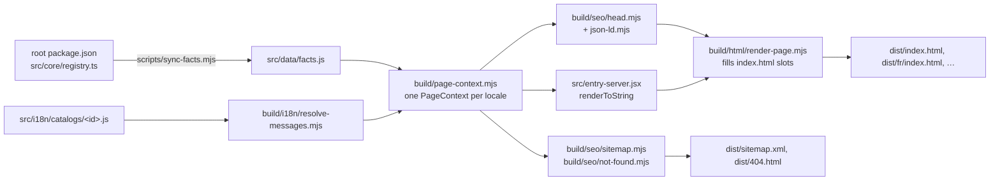

# The website (`index/`)

The landing page at <https://lindecker-charles.github.io/gup/> lives in `index/`: a Vite + React
18 app, prerendered into one static HTML page per language and deployed to GitHub Pages by
`.github/workflows/pages.yml`. It has its own `package.json` and lockfile and builds with
Node ≥ 22.19 — the CLI's Node 26 floor does not apply to it.

```bash
cd index
npm ci
npm test            # node:test suites, no build needed (< 1 s)
npm run build       # facts sync → Vite → SSR bundle → per-locale prerender → stamp
npm run verify      # Playwright checks on dist/ (add -- --shots for screenshots in .verify/)
npm run lhci        # Lighthouse, ≥ 0.95 on the four categories
npm run dev         # every locale at http://localhost:5173/gup/<locale>/
npm run og          # re-render the social cards (committed PNGs)
```

`verify`, `lhci` and `og` need Playwright's Chromium: `npx playwright install chromium`.

## How a page is built



- **Facts are derived, never typed.** The version, the Node floor, the provider count and the
  per-domain inventory come from the repository (`scripts/sync-facts.mjs`), so the site cannot
  advertise a stale number.
- **Messages are resolved at build time.** Placeholders, plural forms (`Intl.PluralRules`) and
  markup validation run in Node. Each page embeds its resolved messages in a
  `<script id="gup-boot" type="application/json">` block and the client hydrates from exactly
  those strings: no i18n runtime, no catalog in the bundle (a test and a verify check enforce
  it), no ICU drift between Node and the browser.
- **The head is a string builder** (`build/seo/head.mjs`): title, description, canonical,
  reciprocal `hreflang` with `x-default`, Open Graph and Twitter cards, font preloads per script,
  and a JSON-LD `@graph` whose FAQPage is generated from the same entries as the visible FAQ.
- **`build/` vs `scripts/`**: `build/` holds importable, side-effect-free modules (used by the
  scripts, `vite.config.js` and the tests); `scripts/` holds the executables. Nothing under
  `src/` may import `build/` or a catalog.
- **Production CSP.** The prerender adds a `<meta http-equiv="Content-Security-Policy">`
  (everything same-origin, `style-src 'unsafe-inline'` for React `style` attributes). The dev
  server omits it: Vite's HMR client needs inline scripts and a websocket. `verify` fails on any
  CSP violation in the console.
- **Every published URL keeps working**: `/gup/` (now the English `x-default`; French moved to
  `/gup/fr/`), `/gup/public/*`, `/gup/fonts/*`, `robots.txt`, `sitemap.xml`, `llms.txt`,
  `llms-full.txt`, and every fragment the old page published (`#pourquoi`, `#plateformes`,
  `#usage`, …) through alias anchors declared in `src/data/structure.js`.

## Content model

| Where | What |
|---|---|
| `src/data/structure.js` | Language-neutral structure: section ids and legacy anchors, feature cards, FAQ order, example commands, footer link graph. |
| `src/data/links.js` | Every absolute URL. Change the deploy target here. |
| `src/data/platforms.js`, `src/data/scenes/` | Product truth: OS cards, the terminal demo (the TUI mock is French on purpose — it is the real interface). |
| `src/i18n/catalogs/<id>.js` | Words only, keyed by the same ids. English (`en.js`) is the source. |
| `src/i18n/locales.js` | The locale registry, in speaker-ranking order. |

Catalog strings may use:

- placeholders from a closed set: `{providers}`, `{version}`, `{node}`, `{nodeEngine}`,
  `{packageName}`, `{installCommand}`, `{year}`, `{endonym}`;
- plural objects `{ $count: "providers", one: "…", other: "…" }` listing **every** CLDR category
  of the locale (ar: zero/one/two/few/many/other; es/fr/pt: one/many/other; en/hi/bn: one/other;
  zh: other);
- three inline markups, never nested: `` `code` `` (commands, flags, ids — never translated),
  `**strong**`, `[[Key]]` (key caps; the key name may be translated). `meta.*`, `common.*` and
  `nav.*` are plain text only.

Latin digits everywhere (`String(n)`, never `Intl.NumberFormat`): a technical site that shows
versions and CLI output stays on 0–9 in every language.

## Adding or changing a locale

1. Translate **from `en.js`**, never from another translation. Keep the key tree, every
   placeholder, every code span byte for byte, and the number of `[[Key]]` caps.
2. Apply the glossary below and the register of the language (see "Register").
3. Add the catalog to `build/i18n/load-catalogs.mjs` and the locale to `src/i18n/locales.js` in
   speaker-ranking order (en, zh, hi, es, ar, fr, bn, pt). Registry values:

   | id | path | htmlLang | hreflang | dir | ogLocale | endonym | script |
   |---|---|---|---|---|---|---|---|
   | en | `""` | en | en | ltr | en_US | English | latin |
   | zh | zh | zh-Hans | zh-Hans | ltr | zh_CN | 简体中文 | han |
   | hi | hi | hi | hi | ltr | hi_IN | हिन्दी | devanagari |
   | es | es | es | es | ltr | es_ES | Español | latin |
   | ar | ar | ar | ar | rtl | ar_AR | العربية | arabic |
   | fr | fr | fr | fr | ltr | fr_FR | Français | latin |
   | bn | bn | bn | bn | ltr | bn_BD | বাংলা | bengali |
   | pt | pt | pt-BR | pt | ltr | pt_BR | Português | latin |

4. `npm test` — fix every parity, glossary, plural and SERP-budget failure (title ≤ 60 and
   description ≤ 160 display columns; a Han character counts 2, a combining mark 0). A string
   that is legitimately identical to English goes into `SAME_AS_ENGLISH` in
   `tests/i18n/catalogs.test.mjs`.
5. Back-translate the new catalog into English in a separate pass and fix meaning drift.
6. `npm run og`, then set `ogImage: "public/og/<id>.png"` on the registry entry.
7. `npm run build && npm run verify -- --shots` and look at the screenshots (wrapping, clipping,
   right-to-left). `npm run lhci` audits one page per script family (en, ar, zh, hi) as soon as
   those locales exist.

Non-Latin scripts render from system fonts (`src/styles/foundation/scripts.css`): no webfont
download, no uppercase, no letter-spacing (it breaks Arabic joining and the Devanagari/Bengali
headline bar), taller line height. Only Latin faces are self-hosted.

### Glossary

Protected terms (product, tool and standard names, plus gup's own word *provider*) must appear
verbatim in Latin script whenever the English string contains them; the list lives in
`build/i18n/glossary.mjs` and is enforced by the catalog tests. Recommended renderings of the
recurring concepts (consistency is checked in review, not by tests):

| EN | fr | es | pt | zh | hi | ar | bn |
|---|---|---|---|---|---|---|---|
| package manager | gestionnaire de paquets | gestor de paquetes | gerenciador de pacotes | 包管理器 | पैकेज मैनेजर | مدير الحزم | প্যাকেজ ম্যানেজার |
| update (n.) | mise à jour | actualización | atualização | 更新 | अपडेट | تحديث | আপডেট |
| outdated | obsolète | desactualizado | desatualizado | 过时 | पुराना | قديم | পুরোনো |
| source | source | fuente | fonte | 来源 | स्रोत | مصدر | উৎস |
| scan | scan | escaneo | varredura | 扫描 | स्कैन | فحص | স্ক্যান |
| interface | interface | interfaz | interface | 界面 | इंटरफ़ेस | الواجهة | ইন্টারফেস |
| terminal | terminal | terminal | terminal | 终端 | टर्मिनल | الطرفية | টার্মিনাল |
| scheduled update | mise à jour planifiée | actualización programada | atualização agendada | 定时更新 | निर्धारित अपडेट | تحديث مجدول | নির্ধারিত আপডেট |
| activity journal | journal d'activité | registro de actividad | registro de atividades | 活动日志 | गतिविधि लॉग | سجل النشاط | কার্যকলাপ লগ |
| theme / contrast | thème / contraste | tema / contraste | tema / contraste | 主题 / 对比度 | थीम / कंट्रास्ट | سمة / التباين | থিম / কনট্রাস্ট |
| open source | open source | código abierto | código aberto | 开源 | ओपन सोर्स | مفتوح المصدر | ওপেন সোর্স |

### Register

- **en** — direct, second person, short sentences.
- **fr** — tutoiement (the brand voice); U+202F before `: ; ! ?` and inside « » (tested).
- **es** — neutral international Spanish, *tú*, no *vosotros*; `¿ ¡`.
- **pt** — Brazilian Portuguese (`lang="pt-BR"`), *você*; served as `hreflang="pt"`.
- **zh** — Simplified, mainland tech register; full-width punctuation; a half-width space
  between Han and Latin/digits (`更新 153 个来源`).
- **hi** — standard Hindi, formal *आप*; danda `।`.
- **ar** — Modern Standard Arabic, formal; `، ؛ ؟`; Western digits.
- **bn** — standard written Bengali, *আপনি*; danda `।`.

## Quality gates

| Gate | What it pins |
|---|---|
| `tests/i18n/*` | Catalog parity (keys, placeholders, code spans, key caps, glossary, untranslated copy), plural completeness, resolver and parser errors, SERP budgets, French typography. |
| `tests/seo/*` | Head (canonical, alternates, Open Graph, preloads, escaping), JSON-LD graph, sitemap, template slots, CSP placement, 404. |
| `tests/rules/*` | Logical CSS properties only, WCAG AA contrast of the tokens (every text colour comes from a token), no catalog or build module imported by `src/`. |
| `npm run verify` | Per locale: files, lang/dir, budgets, hreflang reciprocity, social card size, JSON-LD vs visible FAQ, leaked placeholders, legacy anchors, CSP, clean console (hydration and CSP errors included), heading outline, skip link, no-JS and reduced-motion rendering, overflow at 1440/820/390 px, RTL geometry (on a forced-RTL page until an RTL locale exists). Site-wide: sitemap, 404, legacy URLs, llms.txt languages, no catalog in the bundle, tabs, copy, language menu. |
| `npm run lhci` | Lighthouse mobile ≥ 0.95 on performance (best of 3), accessibility, best practices and SEO (median of 3). |

Budgets: HTML ≤ 30 KB gzipped per locale, JavaScript ≤ 62 KB, CSS ≤ 12 KB, preloaded fonts
≤ 3 files / 75 KB on Latin pages and a single Geist Mono file elsewhere.

`tests/rules/` is not named `tests/design/` because the repository's `.gitignore` ignores every
`design` directory.

Code limits follow the repository rules (functions ≤ 30 lines, ≤ 3 parameters, lines ≤ 100
characters, files ≤ 300 lines). Catalogs are the one exception to the file length: they are flat
data, one file per language, and splitting them would only scatter a translation across files.

## Deployment

`pages.yml` builds, tests, verifies and audits on every push to `main` and every pull request
touching the site or the facts it derives from. It **deploys only on a published release or a
manual dispatch**, so the site never advertises a version that is not on npm yet. Release runs
execute on the release tag: the `github-pages` environment must allow tags matching `v*`
(Settings → Environments → github-pages → Deployment branches and tags). The workflow is not a
required check: being path-filtered, it never reports on pull requests that do not touch the
site.

After a deployment that changes languages or URLs, resubmit `sitemap.xml` in Search Console and
inspect `/gup/` and one translated page.
