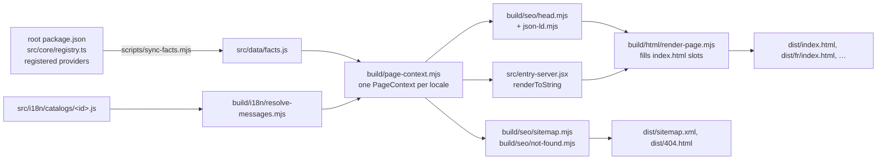

# The website (`index/`)

The landing page at <https://lindecker-charles.github.io/gup/> lives in `index/`: a Vite + React
18 app, prerendered into one static HTML page per language and deployed to GitHub Pages by
`.github/workflows/pages.yml`. It has its own `package.json` and lockfile and builds with
Node ≥ 22.19 — the CLI's Node 26 floor does not apply to it.

```bash
cd index
npm ci
npm test            # node:test suites, no build needed (< 1 s)
npm run build       # facts sync → Vite → SSR bundle → per-locale prerender → stamp
npm run verify      # Playwright checks on dist/ (add -- --shots for screenshots in .verify/)
npm run lhci        # Lighthouse, ≥ 0.95 on the four categories
npm run dev         # every locale at http://localhost:5173/gup/<locale>/
npm run og          # re-render the social cards (committed PNGs)
```

`verify`, `lhci` and `og` need Playwright's Chromium: `npx playwright install chromium`.

## How a page is built



- **Facts are derived, never typed.** The version, the Node floor, the provider count, the
  per-domain inventory and how many providers each system supports come from the repository
  (`scripts/sync-facts.mjs` over `build/facts/read-registry.mjs`), so the site cannot advertise
  a stale number. The reader walks `ALL_PROVIDERS`, never the filesystem (unregistered provider
  files do not count), takes each provider's one-line `readonly platforms = PLATFORMS.<set>;`
  declaration (none: every system), and fails the build on a set or a declaration form it
  cannot read rather than counting the provider everywhere.
- **Messages are resolved at build time.** Placeholders, plural forms (`Intl.PluralRules`) and
  markup validation run in Node. Each page embeds its resolved messages in a
  `<script id="gup-boot" type="application/json">` block and the client hydrates from exactly
  those strings: no i18n runtime, no catalog in the bundle (a test and a verify check enforce
  it), no ICU drift between Node and the browser.
- **The head is a string builder** (`build/seo/head.mjs`): title, description, canonical,
  reciprocal `hreflang` with `x-default`, Open Graph and Twitter cards, font preloads per script,
  and a JSON-LD `@graph` whose FAQPage is generated from the same entries as the visible FAQ.
- **`build/` vs `scripts/`**: `build/` holds importable, side-effect-free modules (used by the
  scripts, `vite.config.js` and the tests); `scripts/` holds the executables. Nothing under
  `src/` may import `build/` or a catalog.
- **Production CSP.** The prerender adds a `<meta http-equiv="Content-Security-Policy">`
  (everything same-origin, `style-src 'unsafe-inline'` for React `style` attributes). The dev
  server omits it: Vite's HMR client needs inline scripts and a websocket. `verify` fails on any
  CSP violation in the console.
- **Every published URL keeps working**: `/gup/` (now the English `x-default`; French moved to
  `/gup/fr/`), `/gup/public/*`, `/gup/fonts/*`, `robots.txt`, `sitemap.xml`, `llms.txt`,
  `llms-full.txt`, and every fragment the old page published (`#pourquoi`, `#plateformes`,
  `#usage`, …) through alias anchors declared in `src/data/structure.js`.

## Content model

| Where | What |
|---|---|
| `src/data/structure.js` | Language-neutral structure: section ids and legacy anchors, feature cards, FAQ order, example commands, footer link graph. |
| `src/data/links.js` | Every absolute URL. Change the deploy target here. |
| `src/data/platforms.js` | Product truth: the OS cards (their per-system counts come from `facts.js`). |
| `src/data/scenes/` | Product truth: the terminal demo (below). |
| `src/i18n/catalogs/<id>.js` | Words only, keyed by the same ids. English (`en.js`) is the source. |
| `src/i18n/locales.js` | The locale registry, in speaker-ranking order. |

### The terminal demo

The hero's three tabs show one sample machine (`scenes/sample-machine.js`): **Interface** is
Paquets with three packages checked (`app-scene.js`), **Update** is the run view updating exactly
those three (`update-scene.js`), **JSON** is `gup list --json --fast` (`json-scene.js`). The TUI
mocks are French on purpose — they are the real interface — and are drawn as structured HTML
(`src/ui/terminal/`), never as box-drawing art.

`tests/rules/scenes-truth.test.mjs` holds them to the CLI's sources, read as text (a small
literal reader in `tests/helpers/ts-literals.mjs`; the site's tests never depend on the CLI's
TypeScript toolchain). It fails when a mock shows:

- a title-bar fact, panel title, column heading, selection-bar text or key hint that no string
  or template literal under `src/ui/` writes (a template's interpolations may only take numbers
  or texts the TUI writes elsewhere, so `entrée mettre à jour (3)` passes and `entrée lancer (3)`
  does not);
- a sidebar other than the one the views registered in `src/commands/menu-views.ts` build (labels
  resolved from their constants, ordered by group and order, separators between groups,
  `Quitter` last);
- a mark other than the TUI's (`STATUS_GLYPHS`, the checkboxes, the cursor);
- a provider the registry does not register (display names in the mocks, ids in the JSON tab).

Numbers (versions, counts, clocks), layout, colours and the order of the key hints are outside
its reach. When the interface renames a label or a key, the site's tests fail until the scene
follows. Where the wording in the plan and the shipped code disagree, the scenes follow the code
(the run view says `s passer ce paquet` and `v agrandir le terminal`).

Catalog strings may use:

- placeholders from a closed set: `{providers}`, `{version}`, `{node}`, `{nodeEngine}`,
  `{packageName}`, `{installCommand}`, `{year}`, `{endonym}`;
- plural objects `{ $count: "providers", one: "…", other: "…" }` listing **every** CLDR category
  of the locale (ar: zero/one/two/few/many/other; es/fr/pt: one/many/other; en/hi/bn: one/other;
  zh: other). Use one only where the counted noun changes within a realistic provider count:
  French, Spanish and Portuguese keep plain strings (their noun only changes for 0–1 and for
  millions), Hindi, Bengali and Chinese do not inflect after a numeral. Arabic does — 103
  مصادر, 153 مصدرًا, 200 مصدر — so `ar.js` builds every count phrase from one grammar table
  (`countingSources`), pinned by a test;
- three inline markups, never nested: `` `code` `` (commands, flags, ids — never translated),
  `**strong**`, `[[Key]]` (key caps; the key name may be translated). `meta.*`, `common.*` and
  `nav.*` are plain text only.

Latin digits everywhere (`String(n)`, never `Intl.NumberFormat`): a technical site that shows
versions and CLI output stays on 0–9 in every language.

## Adding or changing a locale

1. Translate **from `en.js`**, never from another translation. Keep the key tree, every
   placeholder, every code span byte for byte, and the number of `[[Key]]` caps.
2. Apply the glossary below and the register of the language (see "Register").
3. Add the catalog to `build/i18n/load-catalogs.mjs` and the locale to `src/i18n/locales.js` in
   speaker-ranking order (en, zh, hi, es, ar, fr, bn, pt). Registry values:

   | id | path | htmlLang | hreflang | dir | ogLocale | endonym | script |
   |---|---|---|---|---|---|---|---|
   | en | `""` | en | en | ltr | en_US | English | latin |
   | zh | zh | zh-Hans | zh-Hans | ltr | zh_CN | 简体中文 | han |
   | hi | hi | hi | hi | ltr | hi_IN | हिन्दी | devanagari |
   | es | es | es | es | ltr | es_ES | Español | latin |
   | ar | ar | ar | ar | rtl | ar_AR | العربية | arabic |
   | fr | fr | fr | fr | ltr | fr_FR | Français | latin |
   | bn | bn | bn | bn | ltr | bn_BD | বাংলা | bengali |
   | pt | pt | pt-BR | pt | ltr | pt_BR | Português | latin |

4. `npm test` — fix every parity, glossary, plural and SERP-budget failure (title ≤ 60 and
   description ≤ 160 display columns; a Han character counts 2, a combining mark 0). A string
   that is legitimately identical to English goes into `SAME_AS_ENGLISH` in
   `tests/i18n/catalogs.test.mjs`.
5. Back-translate the new catalog into English in a separate pass and fix meaning drift.
6. `npm run og`, then set `ogImage: "public/og/<id>.png"` on the registry entry.
7. `npm run build && npm run verify -- --shots` and look at the screenshots (wrapping, clipping,
   right-to-left). `npm run lhci` audits one page per script family: en, ar, zh and hi.

Non-Latin scripts render from system fonts (`src/styles/foundation/scripts.css`): no webfont
download, no uppercase, no letter-spacing (it breaks Arabic joining and the Devanagari/Bengali
headline bar), taller line height. Only Latin faces are self-hosted. Each script lists its faces
once and the sans, display **and mono** stacks are built from that list: the mono labels
(navigation, kickers, buttons) otherwise fall to whatever the OS picks for a monospace request —
Times New Roman for Arabic, NSimSun for Chinese on Windows. Text is only letter-spaced through the
`--*-tracking` tokens, which the non-Latin scripts set to 0.

### Glossary

Protected terms (product, tool and standard names, plus gup's own word *provider*) must appear
verbatim in Latin script whenever the English string contains them; the list lives in
`build/i18n/glossary.mjs` and is enforced by the catalog tests on Latin word boundaries ("brew"
never matches inside "Homebrew", but Arabic may attach و to it: "وbrew"). Recommended renderings
of the recurring concepts (consistency is checked in review, not by tests):

| EN | fr | es | pt | zh | hi | ar | bn |
|---|---|---|---|---|---|---|---|
| package manager | gestionnaire de paquets | gestor de paquetes | gerenciador de pacotes | 包管理器 | पैकेज मैनेजर | مدير الحزم | প্যাকেজ ম্যানেজার |
| update (n.) | mise à jour | actualización | atualização | 更新 | अपडेट | تحديث | আপডেট |
| outdated | obsolète | desactualizado | desatualizado | 过时 | पुराना | قديم | পুরোনো |
| source | source | fuente | fonte | 来源 | स्रोत | مصدر | উৎস |
| scan | scan | escaneo | varredura | 扫描 | स्कैन | فحص | স্ক্যান |
| interface | interface | interfaz | interface | 界面 | इंटरफ़ेस | الواجهة | ইন্টারফেস |
| terminal | terminal | terminal | terminal | 终端 | टर्मिनल | الطرفية | টার্মিনাল |
| scheduled update | mise à jour planifiée | actualización programada | atualização agendada | 定时更新 | निर्धारित अपडेट | تحديث مجدول | নির্ধারিত আপডেট |
| activity journal | journal d'activité | registro de actividad | registro de atividades | 活动日志 | गतिविधि लॉग | سجل النشاط | কার্যকলাপ লগ |
| theme / contrast | thème / contraste | tema / contraste | tema / contraste | 主题 / 对比度 | थीम / कंट्रास्ट | سمة / التباين | থিম / কনট্রাস্ট |
| open source | open source | código abierto | código aberto | 开源 | ओपन सोर्स | مفتوح المصدر | ওপেন সোর্স |

### Register

- **en** — direct, second person, short sentences.
- **fr** — tutoiement (the brand voice); U+202F before `: ; ! ?` and inside « » (tested).
- **es** — neutral international Spanish, *tú*, no *vosotros*; `¿ ¡` (tested); *la* terminal;
  key caps *Espacio*, *Intro*.
- **pt** — Brazilian Portuguese (`lang="pt-BR"`), *você*; served as `hreflang="pt"`; "scan" is
  *verificar* (verb) and *varredura* (noun).
- **zh** — Simplified, mainland tech register; full-width punctuation; a half-width space
  between Han and Latin/digits, placeholders, code and key caps (`更新 153 个来源`) — both
  tested.
- **hi** — standard Hindi, formal *आप*; danda `।` (tested); *कमांड* is feminine.
- **ar** — Modern Standard Arabic, formal; `، ؛ ؟` (tested); Western digits; the conjunction و
  attaches to Latin names (`وbrew`); *provider* never takes the article ال (`وحدات provider`,
  `حسب provider`).
- **bn** — standard written Bengali, *আপনি*; danda `।` (tested); case endings join Latin words
  with a hyphen (`gup-এর`); counts take the classifier টি (`153টি উৎস`).

### Translation record

Every catalog except French was written by Claude from `en.js`, then translated back into English
in a separate pass and compared with the source, key by key. The table keeps what that pass
looked at and what it changed. A native speaker has not reviewed these yet: one
"Native review wanted: <language>" issue (label `i18n`) per language follows the first deployment.

| Locale | Key risks | Back-translation notes |
|---|---|---|
| zh | Idiomatic headings drift easily ("know everything" vs "in control"); spacing between Han and Latin runs; colloquial verbs in marketing copy. | One fix: the install title "一切尽在掌握" read "everything under control" — now "一切了然" ("everything is clear"). "折腾" (fiddle with) in the lead is informal but common in Chinese developer copy: kept. The terminal caption adds "目前" (for now), consistent with the FAQ. "updates reviewed weekly" made explicit as dependency updates. |
| hi | Symlink "resolved" has no settled Hindi verb; gender of *कमांड*; English-heavy loanwords. | One fix: "सिमलिंक … हल होते हैं" read "symlinks get solved" — now "फ़ॉलो किए जाते हैं" (followed). The hero adds "हमेशा" (always) before *अप-टू-डेट*: idiomatic headline, accepted. *कमांड* kept feminine throughout. |
| es | *registro* means both a package registry and a log; *terminal* has both genders across regions; Enter is *Intro* on Spanish keyboards. | Clean except one fix: "Sin registro" read as "no logging", contradicting the journal — now "Sin registro de paquetes". "one full-screen terminal app" shortened to "una app de terminal" in `meta.description` for the 160-column budget, as in French. "opt-in scheduling" reads "optional scheduling": same meaning for a reader. |
| ar | The counted noun changes with the number; *سجل* means both a log and a registry; Latin names inside right-to-left sentences; *shell* and *commit* have no single settled term. | Count phrases are plural objects built from one table (few/many/other verified for 103/153/200). One fix: "لا سجل حزم" (no package registry) collided with "سجل النشاط" (activity journal) — now "لا مستودع حزم". The hero's last line is "كلها محدَّثة" (all of them updated), which avoids an agreement error after the accusative count noun. *shell* is "صدفة الأوامر", *commit* "إيداع" (Microsoft terminology). Bidi of mixed runs, punctuation placement and mirroring checked on the 1440 and 390 px screenshots. |
| bn | Same symlink issue; "enforces" weakened to "maintains"; Latin words need hyphenated case endings. | Two fixes: "সিমলিংক … শনাক্ত হয়" read "symlinks are detected" — now "অনুসরণ করা হয়" (followed); "WCAG AA কনট্রাস্ট বজায় রাখে" read "maintains" — now "নিশ্চিত করে" (ensures). Hero "সবসময়" (always) accepted as in Hindi. |
| pt | "built accordingly" is easy to turn into "built for that"; *registry* is often left in English in Brazil. | One fix: "E foi construído para isso" read as "built to run privileged commands" — now "com isso em mente". "Sem registry" became "Sem registro de pacotes" (clearer, distinct from *registro de atividades*). "keeps the providers moving" reads "keeps the providers up to date": accepted. |

The 0.5.0 alignment with the shipped interface rewrote four feature cards (in-app updates and
their fallback, schedules with `p`, the report with `o`, the exact contrast policy), the FAQ's
coverage answer (JetBrains IDEs, not extensions: the plugin providers are not registered) and
added the OS cards' "supported providers" label. The same back-translation pass found the eight
versions equivalent; points worth keeping: the schedule card says the OS scheduler starts *gup*
briefly (it wakes every 15 minutes and runs what is due), not that it starts each schedule; the
French, Spanish and Portuguese ratios use a decimal comma (`4,5:1`, as the TUI writes it); the
FAQ's "JetBrains IDEs" is "بيئات التطوير من JetBrains" in Arabic and keeps "IDE" in Latin in
the other languages; the OS cards show "label: value", so no language agrees a noun with the
per-system count.

The review of that branch reworded what still read as translated: French "exécuter ce qui est
dû" is now "faire ce qui arrive à échéance", Spanish "corrige lo que no llega" is "lo que se queda
corto", Portuguese "o que ficar abaixo" gained "do limite", and the Hindi schedule card's "वे अपडेट
चल जाएँ" (let those updates run) is "वे पूरे हो जाएँ" (get done). It also corrected two FAQ answers
in every language: Linux's OS level is Homebrew/Linuxbrew *and Nix*, and "no direct download" is
gone (the `nerd-fonts` provider downloads release archives).

The hero lead and the social description no longer say that gup updates "without ever leaving its
interface": the Windows administrator batch installs in its own UAC window, and without an
embedded terminal gup updates in the user's own terminal. They now say where updates run — "in a
terminal embedded in its interface", the lead adding "live" — in every language, with the
card's wording for the embedded terminal (French *terminal intégré*, Spanish *terminal
integrada*, Portuguese *terminal embutido*, Arabic *طرفية مدمجة*, Bengali *বসানো টার্মিনাল*,
Hindi *एम्बेड किया गया टर्मिनल*, Chinese *内嵌的终端*). Back-translated, the eight read alike;
"live" is *en direct*, *en directo*, *ao vivo*, *مباشرةً* (directly), *সরাসরি* (directly),
*लाइव* and *实时* (in real time). A rule test holds the English source to it.

The footer's Project column links the community files a visitor looks for besides
CONTRIBUTING: `SUPPORT.md` and `CODE_OF_CONDUCT.md`. Their labels use each language's usual
name for the document — for the code of conduct, French *Code de conduite*, Spanish *Código de
conducta*, Portuguese *Código de conduta*, Chinese *行为准则*, Hindi *आचार संहिता*, Bengali
*আচরণবিধি*, Arabic *مدونة السلوك* — and, for support,
the word for user help rather than one that also means backing, which the install section's
"Useful to you?" block asks for: *Assistance*, *Soporte*, *Suporte*, *获取帮助* (get help),
*सहायता*, *সহায়তা*, *المساعدة* (help; *الدعم* also means backing). Back-translated, each
reads "code of conduct" and "support" or "help".

## Quality gates

| Gate | What it pins |
|---|---|
| `tests/i18n/*` | Catalog parity (keys, placeholders, code spans, key caps, glossary, untranslated copy), plural completeness, resolver and parser errors, SERP budgets, each language's register (French spacing, Spanish `¿ ¡`, Chinese spacing and full-width punctuation, the Hindi and Bengali danda, Arabic punctuation), Arabic count agreement. |
| `tests/seo/*` | Head (canonical, alternates, Open Graph, preloads, escaping), JSON-LD graph, sitemap, template slots, CSP placement, 404. |
| `tests/rules/*` | Logical CSS properties only, WCAG AA contrast of the tokens (every text colour comes from a token), no catalog or build module imported by `src/`, letter-spacing only through tracking tokens zeroed for non-Latin scripts, every non-Latin script rendering its sans, display and mono faces from its own fonts, the terminal demo held to the CLI's sources (see "The terminal demo"), every `gup` command and flag the page, its examples and the two llms texts cite registered by the CLI's commander declarations (flags of the tools gup drives, such as Homebrew's `--greedy`, are named in the test), every provider id llms.txt lists under a category named after a domain (`Cloud CLIs`, `Dev CLIs`…) belonging to that domain, and the English hero lead and social description saying updates run in the embedded terminal, never "without ever leaving" the interface (the UAC window and the no-PTY fallback are exceptions). |
| `tests/facts/*` | The registry reader: registered providers only, per-system counts from the `platforms` declarations, refusal of an unknown set, an unreadable declaration or a count mismatch. |
| `npm run verify` | Per locale: files, lang/dir, budgets, hreflang reciprocity, social card size, JSON-LD vs visible FAQ, leaked placeholders, legacy anchors, CSP, clean console (hydration and CSP errors included), heading outline, skip link, no letter-spacing on Arabic, Indic or Han text, no-JS and reduced-motion rendering, overflow at 1440/820/390 px. Every right-to-left locale: brand on the right, arrows mirrored, terminal caption in the page's direction, language menu names on the right, terminal, commands and key caps left-to-right, header fade on the scrolling side. Site-wide: sitemap, 404, legacy URLs, llms.txt languages, no catalog in the bundle, tabs, copy, language menu (each name tagged with its own language, all starting on one edge). |
| `npm run lhci` | Lighthouse mobile ≥ 0.95 on performance (best of 3), accessibility, best practices and SEO (median of 3). |

Budgets: HTML ≤ 30 KB gzipped per locale, JavaScript ≤ 62 KB, CSS ≤ 12 KB, preloaded fonts
≤ 3 files / 75 KB on Latin pages and a single Geist Mono file elsewhere.

`tests/rules/` holds the tests the website spec files under `tests/design/`.

Code limits follow the repository rules (functions ≤ 30 lines, ≤ 3 parameters, lines ≤ 100
characters, files ≤ 300 lines). Catalogs are the one exception to the file length: they are flat
data, one file per language, and splitting them would only scatter a translation across files.

## Deployment

`pages.yml` builds, tests, verifies and audits on every push to `main` and every pull request
touching the site or the facts it derives from. It **deploys only on a published release or a
manual dispatch**, so the site never advertises a version that is not on npm yet. Release runs
execute on the release tag: the `github-pages` environment must allow tags matching `v*`
(Settings → Environments → github-pages → Deployment branches and tags). The workflow is not a
required check: being path-filtered, it never reports on pull requests that do not touch the
site.

After a deployment that changes languages or URLs, resubmit `sitemap.xml` in Search Console and
inspect `/gup/` and one translated page.
