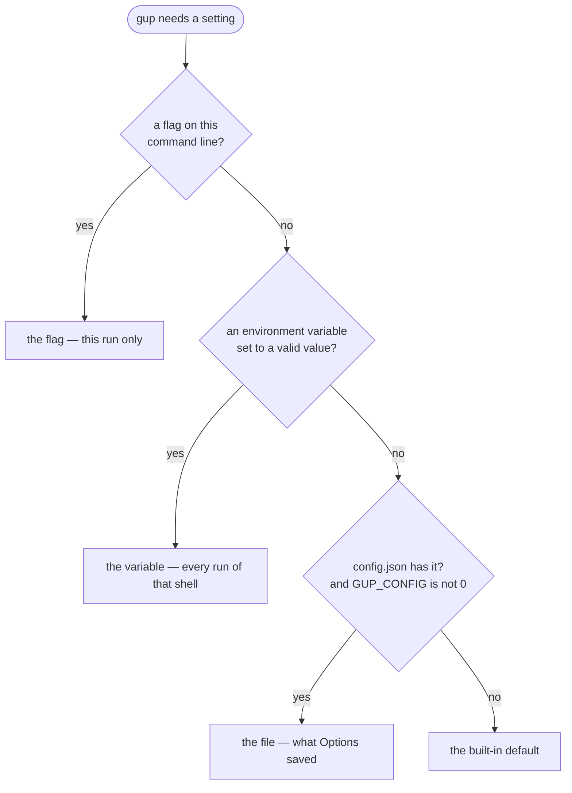

# Configuration

`gup` works without any configuration. Change its settings in the **Options**
view of the interactive app (`gup`, then Options in the menu): each change
applies at once and is kept in one JSON file, read when `gup` starts. Scripts
are never affected by it except for the install timeout (see
[Scan & install](#scan--install)), the debug log's level, what
`gup report` does in a terminal (see [Journal](#journal)) and the language
gup speaks (see [Interface language](#interface-language)).

- [The Options view](#the-options-view)
- [Which value wins](#which-value-wins)
- [Interface language](#interface-language)
- [Where the file lives](#where-the-file-lives)
- [What it looks like](#what-it-looks-like)
- [Sections](#sections)
- [Environment variables](#environment-variables)
- [When something is wrong](#when-something-is-wrong)
- [Security](#security)

Themes, custom colours and the contrast guarantee have their own page:
[`themes-and-accessibility.md`](themes-and-accessibility.md).

## The Options view

The settings are grouped in sections, one row per setting: `Label   [value]   hint`.

| Section | Rows |
|---|---|
| SCAN & INSTALL | Fast mode, Install timeout, Provider filter |
| APPEARANCE | Theme, Custom colors, Contrast level, Symbols, Density |
| BEHAVIOR | Language, Startup view, Scan at startup, Confirm updates, Rescan after updates, Package sort, Note column, Incompatible providers, Animations, Mouse, Notify when done |
| JOURNAL | Debug log, Journal period, Open the report (see [journal-and-reports.md](journal-and-reports.md#settings)) |
| FILE | Reset…, File (the file's state and path) |

| Key | Effect |
|---|---|
| `↑` `↓` (`k` `j`), `pgup` `pgdn`, `home` `end` | move between rows (section titles are skipped) |
| `enter` / `space` / a click | switch a value on or off, show the next value, or open the row (theme picker, colour editor, provider filter, a dialog) |
| `←` `→` | previous / next value of the row under the cursor (on other rows, `←` goes back to the menu as everywhere) |
| `r` | rescan with the new settings, after a scan setting changed |
| `c` | copy the settings file's path to the clipboard (terminals that support OSC 52) |
| `esc` | leave the theme picker, the colour editor or the provider filter |
| `tab` / `q` | back to the menu / quit, from anywhere |

- **Every change is saved at once**, except the theme under the picker's cursor
  (saved with `enter`) and the colour nudges of the colour editor (saved when
  you move to another colour or leave it).
- When a change cannot be saved (locked file, read-only section), it stays in
  effect until `gup` exits and a line above the list says why:
  `‼ Setting not saved — <reason>`. The next save that works clears it.
- **Reset…** puts a group back to its defaults, after a confirmation that
  answers *No* by default: *Appearance* (theme, colours, contrast, symbols,
  density), *Behavior* (the language — back to English — and the rest of the
  behavior rows, mouse included), *Scan & install* (fast mode, filter,
  timeout), or *All* (the JOURNAL rows included).
- Fast mode, the filter and the timeout apply to the session at once; for the
  first two, `r` rescans with them. The startup view and "scan at startup"
  apply the next time the menu opens, the language the next time gup starts;
  everything else applies at once (sort, Note column, animations, mouse,
  symbols, density, theme, colours, the debug log's level; the Journal's
  period the next time the view comes to the front).
- In a narrow terminal (80 columns leave the Options panel 50), a hint that
  does not fit beside its row is shown whole under the list while the cursor is
  on that row, and the colour editor leaves out its "Shown" column — the
  contrast column already says when a colour was adjusted.

## Which value wins

A few settings can also come from a command-line flag or an environment
variable. For those, the most specific source wins:



| Setting | Flag | Variable | File | Default |
|---|---|---|---|---|
| Install timeout | `--timeout` (`gup update`) | `GUP_INSTALL_TIMEOUT` | `install.timeoutSeconds` | 1200 s |
| Debug log level | `--log-level` | `GUP_LOG_LEVEL` | `log.level` | `info` |
| Open the HTML report | `--open`, `--no-open` (`gup report`) | — | `journal.openReport` | open, in a terminal outside CI |
| Interface language | — | `GUP_LANG` | `interface.language` | `en` (English) |
| Symbols | — | `GUP_ASCII=1` (when the file says `auto`) | `interface.glyphs` | `auto` |
| Colours | — | `NO_COLOR` (wins over every theme) | `theme.id` | `terminal` |

Three exceptions:

- **Scan settings** (fast mode, provider filter) apply to the interactive
  app only: `gup list` and `gup update` keep their explicit flags, so a script
  never changes behaviour because of a setting it cannot see.
- **Scheduled runs** log at least `info` (nobody watches them; the log is all
  that is left) and cap each install at 30 minutes.
- **The elevated helper** — the one UAC or `sudo` prompt of an update — reads
  no setting at all; it takes its timeout, log level and language from the gup
  that started it (see [Security](#security)).

## Interface language

gup speaks English or French. English is the default; French is one command
away:

```bash
gup language fr        # French, saved for every run from now on
gup language en        # back to English
gup language           # the language in use, and where it comes from
```

or Options › **Language**, the first row of BEHAVIOR (CONFORT in the French
interface). Both save `interface.language`. The language is chosen when gup
starts: an app already open keeps its own until it closes. To pick French
while installing gup, see [installation.md](installation.md#choosing-the-language).

Which language a run speaks:

1. `GUP_LANG`, when it names a language gup speaks — `en` or `fr`, in any
   case, a region or an encoding after it allowed (`FR`, `fr-CA`,
   `fr_FR.UTF-8`). It decides for every run of the shell it is set in. A
   language gup has no translation for (`GUP_LANG=de`) is ignored, never
   fatal: `gup language` and `gup doctor` say so.
2. The `interface.language` setting.
3. English.

Your system's own locale (`LANG`, the Windows display language) is never
consulted: on a French system, gup speaks English until you choose French.

What follows the language: every screen, message and dialog, the commands'
output and their `--help`, the HTML report (its labels and its `<html lang>`),
and how dates and numbers are written — `2026-10-03`, `Oct 03 14:22` and
`18.4 s` in English; `03/10/2026`, `03/10 14:22` and `18,4 s` in French. What
does not: the field names of the JSON and CSV exports, of `--json` output and
of the history and debug log records, the same in both languages, so a script
never depends on the one gup speaks.

**Reset… › Behavior** (or *All*) in Options puts the language back to English.

## Where the file lives

| Platform | Path |
|---|---|
| Windows | `%APPDATA%\gup\config.json` (roams with your profile; the activity history stays machine-local) |
| macOS | `~/Library/Application Support/gup/config.json` |
| Linux and others | `$XDG_CONFIG_HOME/gup/config.json`, else `~/.config/gup/config.json` |
| Anywhere | `GUP_CONFIG_DIR=<dir>` → `<dir>/config.json` |

The Options view's **File** row shows the same state and path — from `~`,
cut in its middle when the row is too short, so the file name stays whole;
when the row cannot hold even the name, the path shows on the line under the
list once the row is selected; `c` copies the whole path — and `gup doctor`
prints them in its "System" section
(`Configuration`). With `GUP_CONFIG=0` the file is neither read nor written:
`gup` runs on its defaults, which is the quickest way to tell whether a problem
comes from your settings.

## What it looks like

```json
{
  "version": 1,
  "sections": {
    "theme": { "v": 1, "id": "dark", "custom": { "dark": { "accent": "#FF8800" } } },
    "interface": { "v": 1, "mouse": false, "glyphs": "ascii", "language": "fr" },
    "scan": { "v": 1, "fast": true },
    "install": { "v": 1, "timeoutSeconds": 600 },
    "log": { "v": 1, "level": "debug" },
    "journal": { "v": 1, "period": "30d" }
  }
}
```

- **Only what differs from the defaults is written.** A default changed by a
  later release reaches you unless you changed that setting yourself.
- Each section has its own version (`v`). Sections and fields this version of
  `gup` does not know are kept as they are when it saves, so a newer and an
  older `gup` can share the file.
- Writes are atomic (temporary file, then rename): a crash leaves either the old
  file or the new one, never half of each.
- You may edit it by hand while `gup` is not running. A wrong value only resets
  that one setting to its default, and `gup` tells you which (see
  [When something is wrong](#when-something-is-wrong)).

## Sections

### `theme`

| Field | Values | Default |
|---|---|---|
| `id` | `terminal`, `auto`, `dark`, `light`, `high-contrast`, `colorblind`, `dracula`, `catppuccin-mocha`, `github-light`, `monochrome` | `terminal` |
| `contrast` | `AA` (text ≥ 4.5:1) or `AAA` (text ≥ 7:1) | `AA` |
| `custom` | per theme, colours for `accent`, `success`, `warning`, `danger`, `text`, `muted`, `background`, `highlight`, as `#RRGGBB` or `#RGB` | none |

Custom colours belong to the theme they are written under: an accent tuned for
`dark` does not change `light`. A colour too pale or too dark to read is adjusted
when painted (see [themes-and-accessibility.md](themes-and-accessibility.md#the-contrast-guarantee)).

### `interface`

| Field | Values | Default | What it does |
|---|---|---|---|
| `language` | `en`, `fr` | `en` | the interface language, read when gup starts; `GUP_LANG` wins over it ([details](#interface-language)) |
| `launchView` | `scan`, `packages`, `schedules`, `providers`, `journal`, `options` | `scan` | the view in front when the menu opens |
| `scanOnLaunch` | `true`, `false` | `true` | scan when the menu opens |
| `confirmBeforeUpdate` | `true`, `false` | `true` | ask before an update starts |
| `rescanAfterUpdate` | `true`, `false` | `false` | after an update, rescan everything instead of dropping the updated packages |
| `packageSort` | `provider`, `name`, `bump` | `provider` | package order inside each provider (`bump`: biggest version jump first) |
| `noteColumn` | `auto`, `hidden` | `auto` | the Packages "Note" column |
| `animations` | `true`, `false` | `true` | spinners turn |
| `notifyOnDone` | `true`, `false` | `false` | notify the terminal when a long update ends |
| `showIncompatibleProviders` | `true`, `false` | `true` | list providers foreign to this OS (greyed) |
| `density` | `comfortable`, `compact` | `comfortable` | blank rows and inner padding |
| `glyphs` | `auto`, `unicode`, `ascii` | `auto` | symbol set (`auto`: ASCII on `TERM=linux`/`dumb`, `GUP_ASCII=1`, or without a UTF-8 locale on macOS/Linux) |
| `mouse` | `true`, `false` | `true` | mouse clicks and wheel in the screens |

### Scan & install

| Section | Field | Values | Default | Applies to |
|---|---|---|---|---|
| `scan` | `fast` | `true`, `false` | `false` | the interactive menu only |
| `scan` | `providerFilter` | provider ids (`["winget", "npm-g"]`), empty = all | `[]` | the interactive menu only |
| `install` | `timeoutSeconds` | `0` (no cap) to `86400` | `1200` | every command |

`gup list` and `gup update` keep their explicit flags (`--fast`, `--provider`):
a script never changes behaviour because of a setting it cannot see. The install
timeout is a safety net and applies everywhere, with this precedence:

> `--timeout` > `GUP_INSTALL_TIMEOUT` > `install.timeoutSeconds` > 1200 s

A filtered provider id this version of `gup` does not know is ignored (and
reported at startup).

### Journal

| Section | Field | Values | Default | Applies to |
|---|---|---|---|---|
| `log` | `level` | `off`, `error`, `warn`, `info`, `debug`, `trace` | `info` | the debug log of every command but the elevated helper |
| `journal` | `period` | `30d`, `90d`, `12m`, `all` | `12m` | the period the Journal view shows |
| `journal` | `openReport` | `true`, `false` | `true` | opening an HTML report in the browser (the Journal, the update results, `gup report` in a terminal) |

The debug log's level follows this precedence:

> `--log-level` > `GUP_LOG_LEVEL` > `log.level` > `info`

`gup report --open` and `--no-open` win over `journal.openReport`. What each
setting does: [journal-and-reports.md](journal-and-reports.md#settings).

## Environment variables

| Variable | Effect |
|---|---|
| `GUP_CONFIG` | `0`, `false`, `off` or `no`: run on defaults, never read or write the file |
| `GUP_CONFIG_DIR` | keep `config.json` in another directory |
| `GUP_LANG` | the interface language, `en` or `fr` (`FR`, `fr_FR.UTF-8` too); wins over `interface.language`; a language gup does not speak is ignored |
| `NO_COLOR` | any non-empty value: no colour at all, in the screens (monochrome) and in console output ([no-color.org](https://no-color.org)) |
| `GUP_INSTALL_TIMEOUT` | per-install cap in seconds; wins over the file, `--timeout` wins over it |
| `GUP_LOG_LEVEL` | the debug log's level; wins over `log.level`, `--log-level` wins over it |
| `GUP_ASCII` | `1`: ASCII symbols and borders when `glyphs` is `auto` |

## When something is wrong

`gup` never refuses to start because of its settings file. Problems are printed
once, on stderr, before any screen opens, and shown by `gup doctor`:

| Situation | What happens |
|---|---|
| A field has a wrong value | that field takes its default; `gup: configuration — interface.mouse: expected a boolean` |
| The file is not valid JSON (or larger than 256 KiB) | it is moved aside as `config.corrupt-<date>.json` next to it, and `gup` starts on defaults |
| It cannot even be moved aside, or the folder is unavailable | `gup` runs on defaults in memory and never overwrites the file |
| A newer `gup` wrote it | it is read, and left untouched (read-only) |
| A change cannot be saved (locked file, permissions) | it stays in effect until `gup` exits; the next start reads the file as it is |

## Security

- The elevated helper (`__admin-batch`, the one UAC / `sudo` prompt of an
  update) never reads this file: a file you can write must not steer a process
  running as administrator. Its timeout, log level and language travel from
  the gup that started it, checked on arrival.
- No setting holds a command or a path to run. Provider ids are checked against
  a strict pattern and against the providers `gup` knows.
- On macOS and Linux the folder is created `0700` and the file `0600`; on
  Windows it inherits the per-user `%APPDATA%` permissions.
