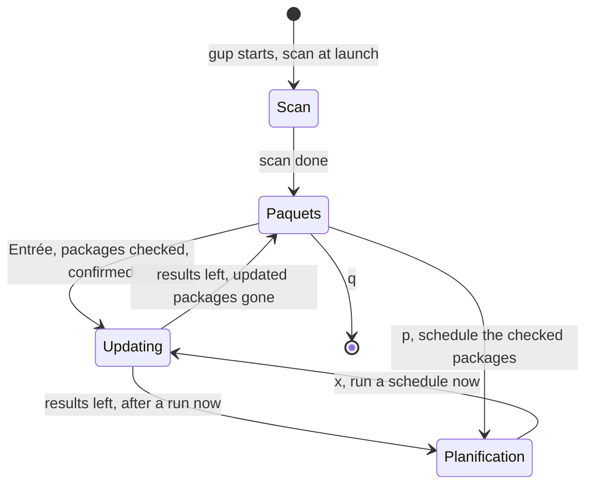
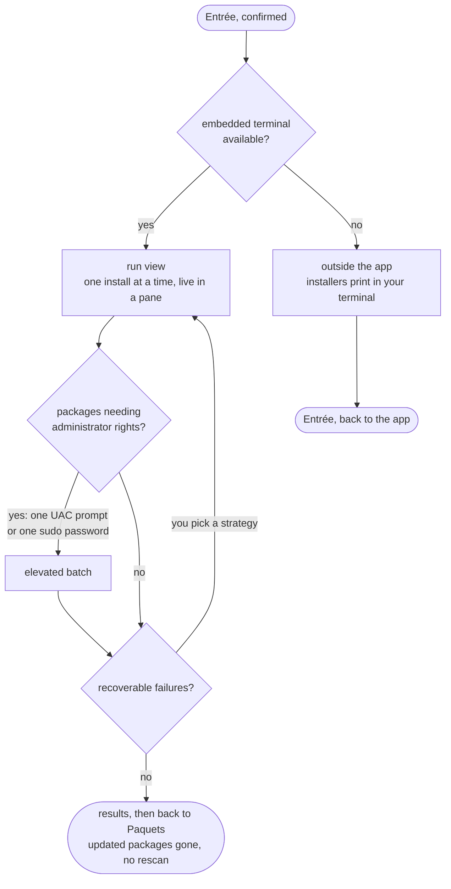
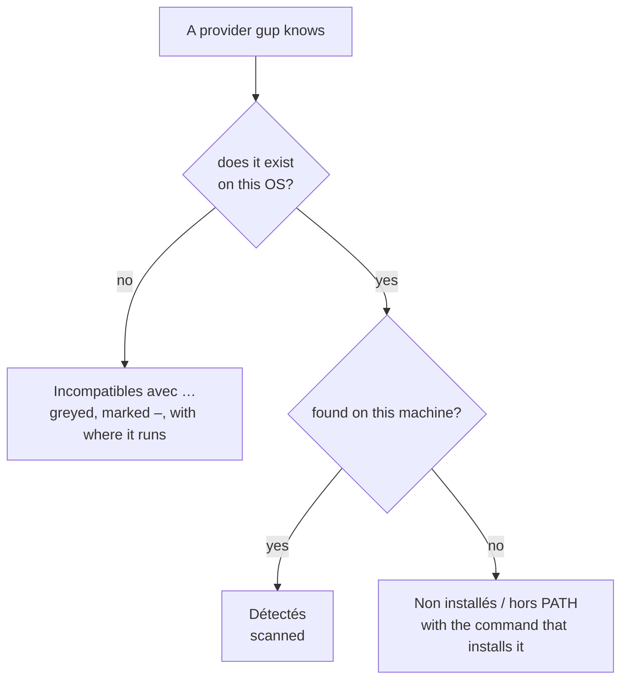

# Interactive app

`gup` with no subcommand opens a full-screen app: scan your machine, check the packages you want,
update them **inside** the app — each install in a live terminal pane — schedule them, read what
happened, change the look. Its text is French, the language of gup's interface; this page names
each label in **bold** with an English gloss.


- [Starting it](#starting-it)
- [The layout](#the-layout)
- [Scan](#scan)
- [Paquets: pick what to update](#paquets-pick-what-to-update)
- [Updating](#updating)
  - [The run view](#the-run-view)
  - [Answering an installer](#answering-an-installer)
  - [Administrator rights](#administrator-rights)
  - [Recoverable failures](#recoverable-failures)
  - [Results](#results)
  - [When another gup run is updating](#when-another-gup-run-is-updating)
  - [When updates run outside the app](#when-updates-run-outside-the-app)
  - [Colours in the terminal pane](#colours-in-the-terminal-pane)
- [Planification](#planification)
- [Providers](#providers)
- [Journal](#journal)
- [Options](#options)
- [Keyboard and mouse](#keyboard-and-mouse)
- [Without the app](#without-the-app)

## Starting it

```bash
gup
```

The app needs Node ≥ 26.9 and a real terminal: stdin and stdout attached to a TTY. In a pipe, a
script or CI, use the [subcommands](cli-reference.md) instead. Windows Terminal is recommended over
the classic console host (see [Troubleshooting](troubleshooting.md#the-windows-console-host)).

By default the app scans when it opens and shows **Scan** (scan) while it runs. Options ›
**Vue au lancement** (launch view) and **Scanner au lancement** (scan at launch) change both.

## The layout

| Part | What it shows |
|---|---|
| Title bar | `gup v<version>`, then facts: how many providers were detected, how many updates are available (`12 mises à jour`), the scan mode and provider filter, and what other views add (`aperçu du thème` while a theme is previewed, unseen scheduled runs) |
| Sidebar (**Menu**) | **Scan**, **Paquets** (packages), **Planification** (schedules) · **Providers**, **Journal**, **Options** · **Quitter** (quit). A badge after an entry counts what waits there: outdated packages, enabled schedules, `!` when a scheduled run failed since you last looked |
| View | The entry in front. The panel that has the keyboard has a **heavy** border, the other one a rounded border |
| Hint bar | The keys that apply right now. On a narrow terminal it drops the view's last hints (marked `…`) and keeps `tab menu · q quitter` whole. While a dialog is open it shows the dialog's keys |

How the views connect (Providers, Journal and Options are a click away at any time):



## Scan


The scan runs four providers at a time. Each row ends with its outcome — `à jour` (up to date), the
number of updates, or the error a provider returned — and how long it took. A provider that
fails or hangs only costs its own row. When the scan ends, **Paquets** comes to the front; `r`
rescans from either view.

What is scanned follows Options › **Mode rapide** (fast mode: skip the slow providers) and
**Filtre providers** (provider filter), shown in the title bar: `27 détectés · 2 filtrés` reads
27 providers detected on this machine by the last scan, 2 of them kept by the filter — and
`mode rapide` or `mode normal`.

## Paquets: pick what to update

**Paquets** lists every outdated package, grouped by provider: current version, target version,
and a **Note** column when a provider has something to say (`pinned`, `source: msstore`…). A
provider whose scan failed shows its error on its row.

| Key | Effect |
|---|---|
| `espace`, or a click | Check or uncheck the package; on a provider's row, all its packages (`[–]` when some are checked) |
| `a` | Check everything shown — or uncheck it, when it already is: the hint says which (`a tout cocher` / `a tout décocher`) |
| `/` | Filter by name or provider; checked packages stay checked while you filter, and are updated even when the filter hides them |
| `entrée`, or a click on the selection bar | Update the **checked** packages |
| `p` | [Schedule](scheduled-updates.md#scheduling-from-paquets) the checked packages |
| `r` | Rescan everything |

The **selection bar** at the bottom counts what is checked (`● 5 sur 12 coché(s)`) and becomes a
button, `▐ Entrée  Mettre à jour (5) ▌`, once something is. **Entrée never updates the row under
the cursor**: with nothing checked it updates nothing and says how to check
(`Cochez au moins un paquet (espace), ou tout cocher avec a.`); while a scan runs it waits for it
(`Scan en cours — la mise à jour sera possible à la fin du scan.`). To update everything: `a`,
then Entrée.

`◷` marks a package an enabled schedule already covers. The order inside each provider follows
Options › **Tri des paquets** (by name, or biggest version jump first).

## Updating

Press Entrée with packages checked. The confirmation lists them; it adds a line when some need
administrator rights (one UAC prompt, or one `sudo` password, for all of them), and another when
the update will run outside the app, with the reason (see
[below](#when-updates-run-outside-the-app)). Options › **Confirmer les MAJ** (confirm updates)
turns the confirmation off.


What happens once you confirm:



### The run view

The run view takes the whole body of the screen until you leave the results:


- **One row per package**, in the order they run: `·` waiting, a spinner while it installs, `✔`
  updated, `↷` skipped, `✖` failed, `⊘` cancelled. A row shows its provider, its versions, its
  duration, `admin` for a package of the elevated batch and `↻ retry --force` on a retry; a line
  under it gives the installer's message when there is one. The header counts them and shows the
  run's clock.
- **The terminal pane** below shows the package being installed: its real output, progress bars
  included. The mouse wheel scrolls back through it.
- **Balanced or enlarged:** the list takes what it needs, up to a bit less than half the screen;
  `v` shrinks it to the progress line and the package in flight, and gives the rest to the
  terminal.

| Key | While it runs |
|---|---|
| `s` | Skip the package being installed (the batch goes on) |
| `x` | Stop everything: after a confirmation, the package in flight is interrupted and the rest is cancelled |
| `Ctrl+C` | Skip the package being installed; twice within 1.5 s, stop everything (no confirmation) |
| `t` | Type into the installer ([below](#answering-an-installer)) |
| `v` | Enlarge the terminal, or give the list its room back |
| `↑↓`, `pgup`, `pgdn` | Scroll the package list |
| `q` | Refused while the update runs (`x` stops it) |

A skipped package ends `ignorée par l'utilisateur` and is never offered for a retry. The
per-install timeout (default 20 min, Options › **Timeout install**) applies exactly as with
`gup update`. An npm global package skipped mid-download keeps its installed version: gup puts
back the copy npm had moved aside (`— version précédente restaurée`, see
[Skipping stuck installs](cli-reference.md#skipping-stuck-installs)).

### Answering an installer

Some installers ask: a licence, a `[Y/n]`, a password. Press **`t`** (or click the pane) to give
them the keyboard — the pane's border turns heavy and reads
`saisie active · Ctrl+G pour rendre la main`. Every key then goes to the installer, `Ctrl+C`,
`Échap` and pastes included. **`Ctrl+G`** gives the keyboard back to gup; so does the end of the
package.

When an installer has been silent for a few seconds on a line that looks like a question, gup says
so under its row: `⌨ Le programme attend peut-être une réponse — t pour écrire dans le terminal.`
gup never types an answer itself, and never takes the keyboard from you. While any dialog is open,
the pane takes no key at all: a key meant for the dialog never reaches an installer.

### Administrator rights

Packages that need administrator rights run last, in one batch behind one prompt, as with
`gup update`:

- **Windows:** after you accept, a UAC prompt opens and the batch installs in its own administrator
  window, outside gup's reach. The run view waits for it (**Administrateur (UAC)**); `s` is refused,
  `t` says to answer in that window, and `x` stops the run once that window is done.
- **macOS and Linux:** the batch runs under `sudo` inside the terminal pane
  (**Administrateur (sudo)**): press `t` to type your password — once for the whole batch.

### Recoverable failures

When failures can be retried (an installer hash mismatch, a changed installer technology…), a
dialog offers the strategies once every package ran, least aggressive first — the same ones as
`gup update` ([what each one risks](cli-reference.md#retrying-failed-updates)). A chosen strategy
replays the failures in the run view, tagged `↻ <strategy>`. Nothing is retried after you stopped
the run.


### Results

When the batch is over the run view becomes its summary — what was updated, skipped, failed,
cancelled, and how long it took — with the cursor on the first failure.


- `↑↓` (or a click) selects a package and shows what its terminal kept: failed and skipped packages
  keep their output (the twelve latest), and so do the three latest successes.
- `Entrée`, `Échap` or `q` brings you back to **Paquets** — or to **Planification** after a
  schedule's run now — where the updated packages are gone, without a new scan (`r` rescans;
  Options › **Rescanner après MAJ** rescans every time).
- `o` writes the [HTML report](journal-and-reports.md#in-the-browser-the-html-report) of the
  Journal's period, this run included, and opens it in your browser (unless Options › **Ouvrir le
  rapport** is `OFF`); the line above the list says where it went.

With Options › **Notification de fin** on, a run of a minute or more ends with a notification from
your terminal, where it supports them.

### When another gup run is updating

Only one gup run updates packages at a time (a scheduled update, another terminal). If one is
already at work, the run view says who and since when, and waits for it to end; `x` gives up and
cancels everything.

### When updates run outside the app

Installs run in the app's terminal pane through
[node-pty](https://github.com/microsoft/node-pty), an optional dependency with a native part. When
it cannot be used, the confirmation says why and the update runs outside the app, as in gup 0.4:
the screen gives the terminal back, installers print there, and `Entrée` brings you back to the
menu.

| Reason shown | What it means | What to do |
|---|---|---|
| `désactivé par GUP_PTY` | `GUP_PTY` is `off`, `0`, `false` or `no` | Unset it |
| `node-pty absent` | The optional dependency is not installed (Linux without a build toolchain, `--omit=optional`, `--ignore-scripts` on Linux) | Reinstall gup with a C/C++ toolchain available (Linux), or with optional dependencies |
| `lanceur pty-exec introuvable` | `dist/pty-exec.js` is missing next to `dist/cli.js` | Reinstall gup |
| `spawn-helper non exécutable — chmod +x <chemin>` | macOS: node-pty's helper lost its exec bit and gup could not restore it (another user owns it) | Run the `chmod +x` shown |
| `échec du test du pseudo-terminal : …` | The test run in a pseudo-terminal failed (an antivirus blocking `conpty.node`, for instance) | Check the detail; `GUP_PTY=off` silences the attempt |

`gup doctor` reports the same thing on its **Terminal intégré** line, in the **Système** section.
Installing gup with npm 11 and node-pty's install script:
[installation.md](installation.md#npm-11-and-install-scripts).

### Colours in the terminal pane

Installers pick their own colours, for your terminal's palette. The pane therefore keeps your
terminal's own background, whatever gup's theme: only its border follows the theme. gup's contrast
guarantees cover gup's own text, not what installers print
([themes and accessibility](themes-and-accessibility.md#the-embedded-terminal)).

## Planification


**Planification** (schedules) lists your scheduled updates: the state of the OS trigger on the
first line, each schedule's recurrence, next and last run, and below the table what the last run
of the schedule under the cursor did, package by package. `entrée` edits a schedule, `espace`
switches it on or off, `x` runs it now, `suppr` deletes it, `i` repairs the trigger. Everything
about schedules: [scheduled-updates.md](scheduled-updates.md#in-the-menu).

## Providers


**Providers** opens on a summary (`27 détecté(s) · 112 non installé(s) · 14 incompatible(s) avec
Windows`) and lists every provider in three groups:



gup never probes, scans nor updates an incompatible provider; the greyed rows say so without
relying on colour (`–` mark, `macOS uniquement` badge). Options › **Providers incompat.** hides
that group. `gup doctor` prints the same three groups.

## Journal


**Journal** turns gup's activity history into pictures: **1 Activité** (a calendar of successful
updates, the headline numbers, outdated packages over time, the slowest scans), **2 Récurrence**
(how often each package is updated), **3 Événements** (every scan and attempt) and **4 Debug** (the
debug log). `1`–`4` switch tabs, `p` changes the period, `o` opens the HTML report, `e` exports.
Every tab and key: [journal-and-reports.md](journal-and-reports.md#in-the-menu-the-journal-view).

## Options


**Options** holds every setting, saved as you change it: SCAN & INSTALLATION, APPARENCE (theme,
custom colours, contrast level, symbols, density), CONFORT (launch view, confirmation, sort,
mouse…), JOURNAL and FICHIER (reset, the settings file). The theme picker paints the whole app
with the theme under the cursor before you choose it. Every row: [configuration.md](configuration.md);
themes and the contrast guarantee: [themes-and-accessibility.md](themes-and-accessibility.md).

## Keyboard and mouse

Everywhere:

| Key | Effect |
|---|---|
| `↑↓` (`j` `k`), `pgup` `pgdn`, `home` `end` | Move in the list in front |
| `tab`, `←` | Switch between the sidebar and the view (unless the view uses `←`) |
| `entrée` | Open the entry, confirm, activate |
| `échap` | Close a dialog, clear a filter, leave a detail |
| `q`, or **Quitter** | Quit — after a confirmation when the schedule editor holds a new schedule or unsaved changes |
| `Ctrl+C` | Quit at once (exit code 130); in the run view, skip the install in flight |

Per view:

| View | Keys |
|---|---|
| Scan | `r` rescan |
| Paquets | `espace` check · `a` check all / none · `/` filter · `entrée` update the checked · `r` rescan · `p` schedule the checked |
| Run view | `s` skip · `x` stop all · `t` type into the installer · `Ctrl+G` take the keyboard back · `v` enlarge · `Ctrl+C` skip (twice: stop all) · `q` refused while running; on the results `entrée` / `échap` / `q` back, `o` HTML report |
| Planification | `entrée` edit · `espace` on/off · `x` run now · `suppr` delete · `i` repair the trigger |
| Journal | `1`–`4` or `[` `]` tabs · `p` period · `o` HTML report · `e` export · `r` reload · `/` filter · `f` type · `s` sort · `l` level · `x` diagnostic archive |
| Options | `entrée` / `espace` change · `←` `→` previous / next value · `r` rescan after a scan setting changed · `c` copy the settings file's path |

The mouse works too: click a sidebar entry, a row, a checkbox, the selection bar, a dialog button;
scroll lists and the terminal pane with the wheel. Options › **Souris** turns it off (for
terminals where selecting text matters more).

Symbols that your font or console cannot draw switch to ASCII stand-ins (`GUP_ASCII=1`, or
Options › **Symboles**); every status has a symbol *and* a word, never a colour alone.

## Without the app

Everything the app does has a command-line equivalent for scripts and CI: `gup list`,
`gup update`, `gup schedule`, `gup report`, `gup log` — see the [CLI reference](cli-reference.md).
