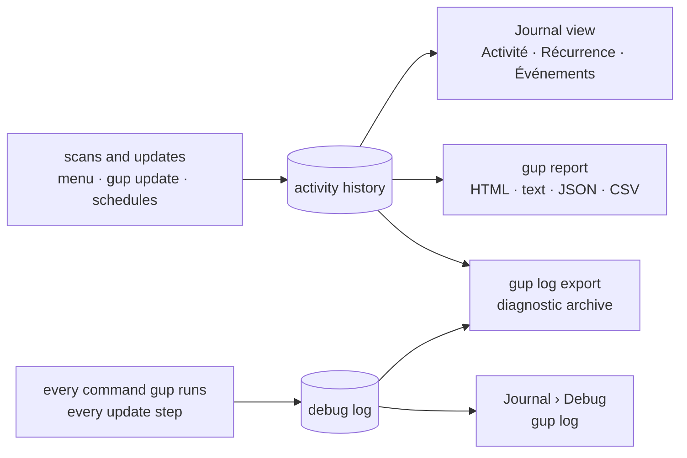

# Journal and reports

gup keeps two local records of what it does, both on your machine only — nothing is ever sent
anywhere:

- the **activity history**: every scan and every update attempt, one line each;
- the **debug log**: what gup did step by step — the commands it ran, their exit codes, the
  updates it attempted — to understand a failure or to attach to a bug report.

This page covers both: the history and what it shows (the **Journal** view of the app, the HTML
report and `gup report`), then the debug log, then the settings of both in the Options view.

Where the data comes from, and where it goes:



Both are only ever read to be shown or exported: nothing in them decides what gup updates.

- [Activity history](#activity-history)
- [Activity journal](#activity-journal)
  - [In the menu: the Journal view](#in-the-menu-the-journal-view)
  - [In the browser: the HTML report](#in-the-browser-the-html-report)
  - [On the command line: `gup report`](#on-the-command-line-gup-report)
  - [How the numbers are counted](#how-the-numbers-are-counted)
  - [Exports and privacy](#exports-and-privacy)
- [Debug log](#debug-log)
  - [What it records](#what-it-records)
  - [Levels](#levels)
  - [Reading it: `gup log`](#reading-it-gup-log)
  - [Sending it with a bug report: `gup log export`](#sending-it-with-a-bug-report-gup-log-export)
  - [Where it lives](#where-it-lives)
  - [Privacy](#privacy)
- [Settings](#settings)

## Activity history

Every scan and every update attempt is appended to a local history: what was scanned and how long
each provider took, what was updated, from which version to which, and how it ended — with what
started the run (the app, a command, a schedule).

| Platform | Location |
|---|---|
| Windows | `%LOCALAPPDATA%\gup\history\` |
| macOS | `~/Library/Application Support/gup/history/` |
| Linux / other | `$XDG_STATE_HOME/gup/history/`, else `~/.local/state/gup/history/` |

`GUP_HISTORY_DIR` puts it somewhere else. One file per UTC month (`2026-08.jsonl`), one
self-describing JSON object per line, never rewritten:

```json
{"v":1,"ts":"2026-08-08T15:10:22.417Z","runId":"…","gup":"0.5.0","platform":"win32","kind":"update","trigger":"menu","providerId":"winget","packageId":"Spotify.Spotify","status":"success","from":"1.2.93.667.g7b5cc0ce","to":"1.2.95.453.g0eeebbed","durationMs":18420}
```

- `kind` is `scan` or `update`; `status` is `success`, `failed` or `skipped` — the three are kept
  apart, which is the whole point of recording them. `trigger` says what started the run (`menu`,
  `cli`, `schedule`); a scheduled update carries its `scheduleId`.
- `from` and `to` come from the scan that listed the package. `gup update provider:package`
  updates without a scan, so its records have neither; the Journal and the reports then show the
  attempt without versions.
- The schema version (`v`) stays `1`: newer versions of gup only add fields, and a reader skips
  what it does not know.
- Records carry no credential (known secret shapes in messages are masked when written) and no
  path outside the history directory.
- Turn it off with `GUP_HISTORY=0` (or `false`, `off`, `no`). If it cannot be written (read-only
  profile, full disk), gup prints one dimmed warning on stderr and carries on: an update never
  fails because of its own bookkeeping.

The history is **read back only to be shown and exported** — the Journal, the reports — and a test
holds every part of gup that decides an update away from it: a damaged or edited history can
mislead a chart, never an upgrade.

## Activity journal

Every scan and every update attempt gup makes lands in the activity history. The journal turns
it into a picture: how much was updated, which packages come back again and again and at which
pace, what failed and why — for the last 30 days, 90 days, 12 months or since the beginning.

### In the menu: the Journal view

Open `gup`, then **Journal** in the sidebar (between Providers and Options). The view reads the
history each time it comes to the front, and has four tabs.


| Tab | Shows | Keys |
|---|---|---|
| **1 Activité** | the headline numbers; a calendar of successful updates (one mark per day, Monday at the top, the current week in the last column; the denser the mark, the busier the day); the number of outdated packages day after day; the providers whose scan is the slowest | — |
| **2 Récurrence** | one bar per package — how many times it was updated, its typical interval (`~14 j`) and pace (`hebdo.`, `mensuel`, `trim.`, `rare`, `une fois`) | `s` sort: most updated, most failed (the bars then count the failures), most recent · `entrée` details: counts, first and last attempt, the latest versions installed |
| **3 Événements** | every scan and update attempt, newest first, each with a mark *and* a word (`✔ réussie`, `✖ échec`, `↷ ignorée`, `⟳ scan`) | `f` type: all, updates, failures, skips, scans · `/` filter on provider (its name, as every view shows it, or its id), package, status or message · `entrée` the full record (versions, duration, message, retry, admin rights, what started the run, the [schedule](scheduled-updates.md) it ran for, by its name) |
| **4 Debug** | the newest lines of the [debug log](#debug-log), under the level this run writes and where that came from | `l` levels shown · `/` filter · `entrée` the record's context and data · `x` write a diagnostic archive |

Everywhere: `1`–`4` or `[` `]` switch tabs, `p` steps the period (30 days → 90 days → 12 months
→ everything), `r` reloads, `o` writes the [HTML report](#in-the-browser-the-html-report) of the
period and opens it in your browser, `e` exports (HTML report, JSON, CSV or a diagnostic archive —
the file is written to the reports directory and its path shown at the bottom), `échap` leaves a
detail or a filter. When no browser can be opened — or when you turned the opening off in
[Options](#settings) — the bottom line gives the report's path instead.

The view shows the period chosen in Options › **Période du journal** (12 months unless you changed
it) each time it comes to the front; once `p` picked another one, that one stays until gup
closes.

| | |
|---|---|
|  |  |
| **2 Récurrence** — how often each package comes back | **3 Événements** — every scan and attempt |


The view fits an 80 × 24 terminal; with `GUP_ASCII=1` (or a terminal without the block symbols)
the charts switch to ASCII marks (`. : + * #`).

### In the browser: the HTML report

`gup report` (or `o` in the Journal view) writes the period's activity to one HTML file and opens
it in your default browser — unless Options › **Ouvrir le rapport** is `OFF`, in which case gup
only tells you where the file is. The file stands alone: open it again later, keep it, send it —
it needs no network and no gup.

After an update run in the menu, `o` on the results writes the same report for the Journal's
period, which ends with that run: it is the newest entry of the **Sessions** page.


| Page | Shows |
|---|---|
| **Vue d'ensemble** | a sentence that sums up the period (*Sur les 12 derniers mois, gup a mis à jour 38 paquets avec 97 % de réussite.*), the key numbers — each a link to the page that details it —, the calendar of the latest weeks, the attempts per week (per month over long periods), the outdated packages day after day, the failures to watch, the most updated packages and every provider's figures |
| **Calendrier** | one calendar per year of the period; point at a day, or move with the arrow keys, to read what happened that day; `Entrée` or a click opens that day's sessions |
| **Paquets** | every package of the period in a table you can sort by any column, filter by provider and pace, and narrow with the search box; a package opens a panel with its figures, the versions its updates installed and every attempt with its message, and a button that copies its identifier |
| **Échecs** | the failures grouped by package and message, most frequent first |
| **Sessions** | every gup run, day by day: what started it (menu, command line, schedule), how many scans, what it updated; open one to see its attempts; filter by outcome and provider |

- The search box (`/` to reach it, `échap` to clear it) looks through package names, providers,
  versions and failure messages.
- Theme: *Auto* follows your system, *Clair* and *Sombre* force one; the browser remembers the
  choice. Colours meet WCAG AA in both themes, and outcomes are never told by colour alone: each
  has an icon and a word, failures are hatched and skips dotted in the charts.
- Everything works with the keyboard; every chart has a *Voir les données* button showing the same
  numbers as a table.
- *Imprimer* prints every page, light, without the controls; the packages table leaves out the
  last version and the median interval to fit the paper.
- The page addresses follow the browser's history: Back closes a package panel or returns to the
  previous page; a panel closed with its button or `échap` is not reopened by Back.
- On a phone, the calendar and the charts scroll sideways and open on the latest weeks.
- Very long histories: the report details the 50 000 most recent attempts and says so at the top;
  its figures always cover the whole period.

### On the command line: `gup report`

```bash
gup report                              # HTML report of the last 12 months, opened in the browser
gup report --since 30d                  # … of the last 30 days (also 12w, 6m, 1y, all, 2026-01-01)
gup report --since 2026-01-01 --until 2026-06-30
gup report --no-open -o rapport.html    # write it there, do not open it
gup report --open                       # open it even if Options says not to
gup report --format text                # the charts in the terminal
gup report --format json > activite.json
gup report --format csv --delimiter ";" -o maj.csv   # Excel in a French locale
```

| Option | |
|---|---|
| `-f, --format` | `html` (default: the [HTML report](#in-the-browser-the-html-report)), `text` (the charts above — drawn with the symbols chosen in Options › Symboles —, then the most updated packages and the recurring failures), `json` (every event of the period plus the computed figures) or `csv` (one row per update attempt) |
| `-s, --since` | the period: `7d`, `30d`, `12w`, `6m`, `1y`, `all` or a date `AAAA-MM-JJ`; default `12m` |
| `--until` | last day included (`AAAA-MM-JJ`); default: now. The charts then stop on that day, and the title names it |
| `-o, --out` | write to a file (`-`: the standard output). Without it, the HTML report goes to the reports directory and the other formats to the standard output; `--force` replaces an existing file |
| `--open` / `--no-open` | open the HTML report in the browser, or not, whatever Options › Ouvrir le rapport says |
| `--delimiter` | CSV separator: `,` (default), `;` or `tab` |

Without `--open` or `--no-open`, the HTML report opens in the browser when Options › **Ouvrir le
rapport** is `ON` (the default) and gup runs in a terminal outside CI. `--open` opens it anyway —
from a script or under CI too. Only a file named `.html` or `.htm` is ever opened: with
`--out rapport.hta` (a name Windows would hand to mshta, which runs it) the report is written but
not opened, and gup says why. Otherwise, or when no browser can be started, gup prints the
file's `file:///` address to open it yourself:

```
  rapport écrit : C:\Users\you\AppData\Local\gup\reports\gup-report-20261003-142205.html
  ouvert dans le navigateur par défaut
```

The data goes to the standard output and every notice (empty period, lines that could not be
read) to the error output, so `gup report -f csv > maj.csv` stays clean. Exit codes: `0` written
(even when the browser could not be opened), `2` an option is wrong, `1` the history could not
be read or the file written. An empty period still gives a valid report, JSON or CSV document.

JSON and CSV field names are English `snake_case` (`provider_id`, `duration_ms`…), the same
whatever the language of the interface; the JSON document says which schema it follows
(`"schema": "gup.history-export/1"`).

### How the numbers are counted

- **Success rate**: successes / (successes + failures). A skipped update (by you, or by a
  provider deferring on purpose) is not a failure.
- **Typical interval** of a package: the median time between its successful updates. A
  success less than an hour after the previous one belongs to the same update (a retry, a
  second run right after).
  The pace follows from it: weekly up to 10 days, monthly up to 45, quarterly up to 120, rare
  beyond; `une fois` for a single success.
- **Outdated packages**: the last *full* scan of each day — a `--fast` scan or a scan of a few
  providers would show a drop that never happened. A day without a full scan repeats the last
  known value.
- **Slowest scans**: the median of each provider's own scan time, recorded since gup 0.5.0.
- **Calendar marks**: the busiest days get the densest mark, ranked among the different daily
  counts of the period, so a day of 8 updates stands out from a day of 3 even when most days
  have just one.
- Days are your local days; a week starts on Monday.

The journal only reads the history: nothing it shows ever decides what gup updates.

### Exports and privacy

- Exports are written by you, for you: nothing is uploaded. Reports, JSON and CSV files land in
  the reports directory (the 20 newest of each kind are kept) or where `--out` says, private to
  your user on macOS and Linux.
- Free text — messages, scan errors, package ids, versions — is redacted again on the way out:
  known secret shapes are masked and your home directory becomes `~`.
- The HTML report cannot reach the network: its Content-Security-Policy lets nothing load and
  only its own script and styles run. The history it shows is data, never markup: a package
  name or a message that looks like HTML is displayed as text.
- To open the report, gup starts the platform's own opener — `explorer.exe` (by its full path)
  on Windows, `/usr/bin/open` on macOS, `xdg-open` on Linux (`wslview` first under WSL) — never a
  shell. A path holding a comma or a quote is not handed to `explorer.exe`, which would split it:
  gup prints the address instead.
- A CSV cell that starts like a spreadsheet formula (`=`, `+`, `-`, `@`) is prefixed with `'`,
  so opening the file never runs anything.
- Messages printed by tools are shown without their escape sequences: the journal never changes
  your terminal's colours, title or clipboard.
- A history line written by a newer gup, or damaged (a crash in the middle of a write, a date
  no gup could have written), is skipped and counted, never fatal: the Debug tab and
  `gup report` say how many.

## Debug log

### What it records

Every gup run — the menu, `gup update`, `gup list`, a scheduled run — appends to the log of the
day:

| Event | When |
|---|---|
| `session.start` / `session.end` | the run starts (command, what started it, versions, platform) / ends (exit code, duration) |
| `session.crash` | gup stopped on an unexpected error (message and stack) |
| `cmd.start` / `cmd.end` | a command gup ran: a probe (`npm outdated`, `winget --version`…) or an install, with its exit code, its duration and, when it failed, the end of its error output |
| `update.start` / `update.end` | an update attempt and its outcome |
| `update.planned`, `elevation.batch`, `update.cancelled`, `update.waiting` | the shape of an update run: what was planned, what needed administrator rights, what a stop cancelled, a wait on another gup run |
| `scan.start` / `scan.provider` / `scan.end` | a scan: how many providers it plans, each provider's time and outdated count (a warning when its scan failed), the totals |
| `report.export` | an export of the history (`gup report`, the Journal view): format, records, size, file |
| `report.open` | the HTML report handed to the browser: whether it opened, with which program, and why not |
| `history.write-failed` | the activity history could not be written, and why |

Each line names the provider and the package it belongs to, so the commands of a scan of eight
providers at once stay readable.

### Levels

| Level | Records |
|---|---|
| `off` | nothing — no file is even created |
| `error` | crashes |
| `warn` | + failed installs and updates |
| `info` (default) | + sessions, installs, update attempts |
| `debug` | + every probe a scan runs, with the error output of the failed ones |
| `trace` | + the start of every probe and the end of its output |

Choose it in Options › **Journal de debug** (kept for every run, scheduled ones included), for
one run with `--log-level`, or for every run started from a shell with `GUP_LOG_LEVEL`:

```bash
gup --log-level debug                 # the menu, with every probe logged
gup update --all --log-level debug    # the flag also works after the command
GUP_LOG_LEVEL=off gup list            # no log at all
```

`--log-level` wins over `GUP_LOG_LEVEL`, which wins over the Options setting, which wins over the
default (`info`). A level changed in Options applies at once to the menu you are in — unless the
flag or the variable set it, which the row then says (`imposé par GUP_LOG_LEVEL (debug)`). A
scheduled run logs at least `info` whatever the level says (unless it is `off`): nobody watches
it, the log is all that is left of it. `gup doctor` and the Journal's Debug tab show the level in
effect and where it came from (`--log-level`, `GUP_LOG_LEVEL`, `réglage`, `défaut`):

```
  Système
  ────────────────────────────────────────
  ● Journal de debug         debug (réglage) · ~\AppData\Local\gup\logs
```

### Reading it: `gup log`

```bash
gup log                       # the last 50 lines of the last 7 days
gup log -n 200 -l warn        # the last 200 warnings and errors
gup log --since 2026-10-01    # since a date (also 7d, 12w, 6m, 1y, all)
gup log --grep winget         # lines that mention winget
gup log --json                # raw JSON lines, for a script
gup log path                  # the log directory
```

```
03/10 14:22:05.130  INFO   cmd.start      [winget] winget upgrade --id Git.Git -e --silent
03/10 14:22:23.512  INFO   cmd.end        [winget] winget upgrade --id Git.Git -e --silent · exit 0 · 18,4 s
03/10 14:22:23.540  DEBUG  cmd.end        [az] az version · exit 1 · 0,4 s · ERROR: Please run 'az login'
```

Reading the log never writes to it.

### Sending it with a bug report: `gup log export`

```bash
gup log export                         # the last 7 days
gup log export --since 30d --out gup-diagnostic.zip
```

```
  archive de diagnostic : C:\Users\you\AppData\Local\gup\reports\gup-diagnostic-20261003-142205.zip
  relisez-la avant de la partager : les secrets connus sont masqués, les chemins abrégés en ~
```

The archive holds:

- `logs/` — the log files of the period (up to 50 MB, newest first), redacted again;
- `system.json` — gup, Node and OS versions, whether a terminal was attached, and gup's own
  environment variables (a fixed list: the rest of your environment is never copied);
- `history-summary.json` — the [activity](#activity-journal) of the period in figures (totals,
  paces, failures grouped by reason), never the events themselves; `--no-history` leaves it out;
- `README.txt` — what is inside, and what was removed.

The Journal view's `x` (Debug tab) and `e` → *Archive de diagnostic* write the same archive for
the period the view shows.

It is written to the reports directory (the 20 newest archives are kept) or to `--out`; an
existing `--out` is only replaced with `--force`. **Open it and read it before you share it.**

### Where it lives

| Platform | Directory | Override |
|---|---|---|
| Windows | `%LOCALAPPDATA%\gup\logs` | `GUP_LOG_DIR` |
| macOS | `~/Library/Logs/gup` (visible in Console.app) | `GUP_LOG_DIR` |
| Linux | `$XDG_STATE_HOME/gup/logs` (else `~/.local/state/gup/logs`) | `GUP_LOG_DIR` |

One file per day (`gup-2026-10-03.jsonl`, UTC date), split into parts past 10 MB
(`gup-2026-10-03.1.jsonl` …). Once a day has ten files, only errors are written until midnight
UTC. Files older than 14 days are deleted when gup starts writing; `GUP_LOG_RETENTION_DAYS`
(1 to 365) changes that. Diagnostic archives go to the reports directory
(`%LOCALAPPDATA%\gup\reports`, `~/Library/Application Support/gup/reports`,
`$XDG_STATE_HOME/gup/reports`; override `GUP_REPORT_DIR`).

### Privacy

- Known secret shapes are masked before anything is written: credentials in URLs; the value of
  any setting, variable or query parameter named like a secret (`password=`, `NPM_TOKEN=`,
  `.npmrc`'s `_authToken=`, `AWS_SECRET_ACCESS_KEY=`, Azure `AccountKey=`, `?sig=` of a SAS
  link, `"client_secret": "…"`); `Authorization` headers and `Bearer …` values;
  GitHub/npm/GitLab/Slack/PyPI/NuGet tokens, AWS and Google keys, JWTs, private keys; the values
  of `--token`/`--password` flags. Your home directory is shortened to `~`.
- `gup log` drops the escape sequences a tool may have printed: a log line never changes your
  terminal's colours, title or clipboard.
- The environment is never copied wholesale: only gup's own variables and the terminal's name.
- With administrator rights (the elevated batch), gup writes nothing to your log directory: the
  elevated part hands its lines back, and your own gup process checks and writes them.
- The log and the archives are private to your user (mode `0600` on macOS and Linux).
- A secret in a format gup does not know can still slip through: read an archive before sharing.

## Settings

The **JOURNAL** section of the Options view (`gup`, then Options) keeps three settings. Each
change is saved at once in the [settings file](configuration.md), and `Réinitialiser… › Tout`
puts them back to their defaults.


| Row | Values | Default | Effect | In `config.json` |
|---|---|---|---|---|
| **Journal de debug** | `OFF`, `erreurs`, `avert.`, `info`, `debug`, `trace` | `info` | what the [debug log](#levels) records; applies at once, unless `--log-level` or `GUP_LOG_LEVEL` decide | `log.level`: `off`, `error`, `warn`, `info`, `debug`, `trace` |
| **Période du journal** | 30 derniers jours, 90 derniers jours, 12 derniers mois, tout l'historique | 12 derniers mois | the period the [Journal view](#in-the-menu-the-journal-view) shows when it comes to the front | `journal.period`: `30d`, `90d`, `12m`, `all` |
| **Ouvrir le rapport** | `ON`, `OFF` | `ON` | whether an [HTML report](#in-the-browser-the-html-report) written for you opens in the browser: `o` and `e` in the Journal, `o` on the update results, `gup report` (where `--open` / `--no-open` win) | `journal.openReport`: `true`, `false` |

The symbols of `gup report --format text` follow Options › **Symboles** (`interface.glyphs`), as
the screens do.

The elevated part of an update (the one UAC or `sudo` prompt) never reads these settings: it
logs at the level its parent gup process hands it.
