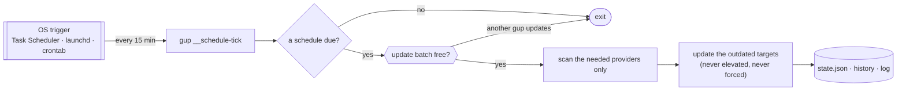

# Scheduled updates

Keep chosen packages up to date without thinking about it: a **schedule** names
packages — `provider:packageId`, the ids `gup list` shows — and when to update
them. A schedule never designates a whole provider: `winget:Git.Git` yes,
`winget` no.

```bash
gup schedule add winget:Git.Git npm-g:typescript --every weekly --on lun --name "Outils dev"
gup schedule list
```

```text
✔ Planification a1b2c3d4 « Outils dev » créée — chaque lundi à 09:00
  prochaines exécutions : lun. 5 oct. 09:00 · lun. 12 oct. 09:00 · lun. 19 oct. 09:00
  déclencheur système installé (Planificateur de tâches Windows · vérification toutes les 15 min)
```

- [How it runs](#how-it-runs)
- [Recurrences](#recurrences)
- [What a scheduled run never does](#what-a-scheduled-run-never-does)
- [Commands](#commands)
- [The OS trigger](#the-os-trigger)
- [Where things live](#where-things-live)
- [Troubleshooting](#troubleshooting)
- [Removing everything by hand](#removing-everything-by-hand)

## How it runs

Nothing stays in memory. While at least one schedule is enabled, the operating
system starts `gup __schedule-tick` every 15 minutes; that short-lived process
checks whether a schedule is due, does the work, records it and exits. With no
enabled schedule, the trigger is removed: nothing is registered anywhere.



- **Targeted.** A tick detects and scans only the providers its due targets
  name, and updates a target only when that scan lists it as outdated — with
  the provider's own package id.
- **One update batch at a time.** A scheduled run and an interactive update
  never drive package managers at once: a tick that finds the batch taken
  leaves its work for the next tick; `gup update` and the menu wait for a
  scheduled run with a message.
- **Missed runs.** An occurrence missed while the machine was off or asleep
  runs once at the next opportunity (a *catch-up*), however many were missed.
  `--no-catch-up` records it as missed instead.
- **Offline wake-ups.** Right after boot, a tick does nothing for 5 minutes.
  When every provider a run needs fails to scan (no network yet), the
  occurrence is retried at the next tick, up to four times, then reported
  failed.
- **Time budget.** No install starts after 2 hours; each install gets your
  install timeout (`GUP_INSTALL_TIMEOUT`), capped at 30 minutes and never
  disabled — nobody is there to skip a wedged installer; a stuck tick exits
  on its own before the OS would kill it.
- **Precision.** A run starts within 15 minutes after its time.

## Recurrences

| Option | Meaning |
|---|---|
| `--every daily [--at HH:MM]` | every day (default 09:00) |
| `--every weekly --on <jour> [--at HH:MM]` | `lun`…`dim`, `lundi`…, `mon`…`sun`, or `0`–`7` |
| `--every monthly --on <jour> [--at HH:MM]` | `1`–`28`, or `dernier` / `last` |
| `--cron "<m h jdm mois jds>"` | any 5-field cron expression, e.g. `"0 9 * * 1-5"` |

Times are the machine's local time when the run is evaluated: "09:00" means
09:00 wherever the laptop is. A local time skipped by a daylight-saving change
runs at the next valid minute. A schedule runs **at most once an hour** and
must fire within a year; day-of-month and day-of-week combine with OR, as in
cron.

Limits: 50 schedules, 50 packages per schedule, names up to 60 characters.

## What a scheduled run never does

- **Act on a whole provider.** Refused when a schedule is created (no bare
  provider, no `*` or `?`), and again at run time: a scan row that stands for
  the whole provider ("all plugins", a refresh marker) is skipped even if a
  hand-edited file names it.
- **Elevate.** Providers whose every update needs `sudo` or UAC (Chocolatey,
  MacPorts, Fink, pkgin, Cygwin, Npackd, Visual Studio) cannot be scheduled;
  a package that needs administrator rights is skipped with the reason. A
  winget package installed for all users may ask for UAC: it is then skipped.
- **Retry with force.** `--force` and uninstall-previous stay human decisions;
  failures are reported, not retried.
- **Prompt.** Installers get no keyboard, winget runs with
  `--disable-interactivity`, and a prompt fails fast instead of waiting.

Skipped and failed packages show in `gup schedule list`, in the activity
history (with the schedule id) and in the debug log.

## Commands

| Command | Does |
|---|---|
| `gup schedule add <provider:paquet…> (--every … \| --cron …) [--name] [--no-catch-up] [--disabled]` | create a schedule, then register the trigger if it is the first enabled one |
| `gup schedule list [--json]` | schedules, next and last run, trigger state |
| `gup schedule status [--json]` | the trigger: what is registered, where, from which gup |
| `gup schedule enable <id…>` / `disable <id…>` | toggle; enabling never replays past occurrences |
| `gup schedule remove <id…>` | delete |
| `gup schedule run-now <id>` | run a schedule now, in this terminal; its next occurrence is unchanged |
| `gup schedule install [--launcher headless\|direct]` | register or repair the trigger for this gup |
| `gup schedule uninstall [--purge]` | remove the trigger and disable every schedule (`--purge`: delete them and their state too) |

An `<id>` is the 8-character id `list` shows, or any unique prefix of at least
4 characters. Exit codes: `0` done, `1` the trigger could not be changed or a
run had failures (schedules are always saved first), `2` invalid arguments.

`gup schedule list --json` is stable for scripts:

```json
{
  "trigger": { "installed": true, "mechanism": "windows-task", "health": "active", "lastTickAt": "2026-10-05T07:45:02.114Z" },
  "schedules": [{
    "id": "a1b2c3d4", "name": "Outils dev", "enabled": true,
    "recurrence": { "kind": "weekly", "weekday": 1, "at": { "hour": 9, "minute": 0 } },
    "cron": "0 9 * * 1",
    "targets": ["winget:Git.Git", "npm-g:typescript"],
    "options": { "catchUp": true },
    "nextRuns": ["2026-10-05T07:00:00.000Z", "2026-10-12T07:00:00.000Z", "2026-10-19T07:00:00.000Z"],
    "lastRun": null
  }]
}
```

`gup doctor` reports the trigger in its "Système" section.

## The OS trigger

Registered for your user only, without administrator rights, by absolute path
to this gup and its node:

| OS | What is registered | Where |
|---|---|---|
| Windows | a Task Scheduler task `gup-scheduler-<your SID>`: your logon session only (no stored password), least privilege, every 15 minutes, one instance at a time, runs on battery, starts as soon as possible after a missed time, killed after 3 hours | Task Scheduler library, root folder |
| macOS | a launchd user agent `io.github.lindecker-charles.gup.scheduler` (macOS announces it as a *Background Item*) | `~/Library/LaunchAgents/` |
| Linux | a block between `# >>> gup-scheduler >>>` and `# <<< gup-scheduler <<<` in your crontab; every other line is left untouched | `crontab -l` |

On Windows the task starts node through `conhost.exe --headless`, so no
console window flashes every 15 minutes. Some corporate security tools flag
headless conhost: `gup schedule install --launcher direct` starts node itself
instead (a console window then appears briefly); the choice is remembered.

On macOS and Linux, launchd and cron start programs with a bare `PATH`. At
registration gup records an allowlist of your environment — `PATH`, the
`HOMEBREW_*`, `NVM_DIR`, `VOLTA_HOME`, `PNPM_HOME`, `CARGO_HOME`, `PYENV_ROOT`,
`JAVA_HOME`… variables and `GUP_*` settings — and the tick applies it. Never
tokens, keys or passwords.

When gup starts (the menu, `gup schedule list|status|run-now`) it repairs a
registration that points at a node or gup that no longer exists, or at
another path of the same installation (a Node upgrade). A registration made
by **another** gup installation that still exists is left alone and reported:
`gup schedule install` moves the trigger to the gup you run.

## Where things live

Machine-local, under the scheduler state directory (`GUP_SCHEDULER_DIR`
overrides it):

| OS | Directory |
|---|---|
| Windows | `%LOCALAPPDATA%\gup\scheduler` |
| macOS | `~/Library/Application Support/gup/scheduler` |
| Linux | `$XDG_STATE_HOME/gup/scheduler` (default `~/.local/state/gup/scheduler`) |

| File | Holds |
|---|---|
| `schedules.json` | the schedules |
| `state.json` | each schedule's last run and the trigger's heartbeat |
| `install.json` | what was registered with the OS, from which gup |
| `agent-stderr.log` | macOS only: launchd's stderr for the agent, emptied past 1 MiB |

Schedules name this machine's packages, so they do not roam with your profile.
The OS trigger runs with your login environment: a `GUP_SCHEDULER_DIR` set
only in a shell is not seen by it (gup warns when that happens).

## Troubleshooting

`gup schedule list` and `gup schedule status` start with the trigger's state:

| Line | Meaning, and what to do |
|---|---|
| `Déclencheur : actif · … · dernier passage il y a 4 min` | all good |
| `Déclencheur : non installé — gup schedule install pour l'installer` | a schedule is enabled but nothing is registered (removed by hand, registration failed): run `gup schedule install` |
| `⚠ Aucun passage depuis 2 h 05 — gup schedule install pour réparer` | registered, but no tick ran for 45 minutes: the OS no longer starts it (node removed, task disabled, security software). `gup schedule install`, then `gup schedule status` |
| `Déclencheur : chemin de gup obsolète — …` | registered for an older path of this gup; repaired automatically at the next start, or by `gup schedule install` |
| `planification enregistrée pour une autre installation de gup : <path> — …` | another gup installation owns the trigger; it runs these schedules. `gup schedule install` to switch to this one |
| `Déclencheur désactivé dans Réglages Système › Général › Ouverture — …` | macOS: re-enable gup's background item there, or run `gup schedule install` |

- **`gup doit être installé globalement`** — the trigger needs a stable gup:
  install it with `npm i -g @charles_lindecker/gup`, not through `npx`.
- **`crontab introuvable`** (Linux) — install `cron` or `cronie`.
- **In WSL** — schedule from gup on Windows; its `wsl-*` providers cover your
  distributions.
- **Under `sudo`** — refused: a schedule belongs to your user.
- **What happened during a run** — the debug log (`gup log`) has every step and
  each installer's output; the activity history has each attempt with its
  schedule id.

## Removing everything by hand

`gup schedule uninstall --purge` does all of this. If gup is already gone:

| OS | Command |
|---|---|
| Windows (PowerShell) | `Get-ScheduledTask -TaskName 'gup-scheduler-*' \| Unregister-ScheduledTask -Confirm:$false` |
| macOS | `launchctl bootout gui/$(id -u)/io.github.lindecker-charles.gup.scheduler; rm ~/Library/LaunchAgents/io.github.lindecker-charles.gup.scheduler.plist` |
| Linux | `crontab -e`, then delete the lines from `# >>> gup-scheduler >>>` to `# <<< gup-scheduler <<<` |

Then delete the scheduler directory listed in [Where things live](#where-things-live).
