# Themes and accessibility

`gup`'s screens are readable on any terminal theme, light or dark, with the
colours you choose: every piece of text reaches the WCAG 2.x **AA** contrast
ratio (4.5:1; 7:1 with the AAA option) against what it is drawn on, and every
border 3:1. This page lists the themes, explains how the default one follows
your terminal, and what `gup` guarantees.

- [Themes](#themes)
- [Choosing a theme](#choosing-a-theme)
- [Your own colours](#your-own-colours)
- [How the `terminal` theme follows your terminal](#how-the-terminal-theme-follows-your-terminal)
- [The contrast guarantee](#the-contrast-guarantee)
- [Not by colour alone](#not-by-colour-alone)
- [Terminals with fewer colours, and NO_COLOR](#terminals-with-fewer-colours-and-no_color)
- [The embedded terminal](#the-embedded-terminal)

Pick the theme in the interactive app, **Options › Theme**, with a live preview
(below), or in the settings file (`theme.id`, see
[configuration.md](configuration.md#theme)).

## Themes

| `id` | What it paints | Lowest text contrast (AA) |
|---|---|---|
| `terminal` (default) | your terminal's own colours, raised to AA when the terminal reports them | depends on the terminal |
| `auto` | `dark` or `light`, following your terminal's background | as `dark` / `light` |
| `dark` | gup's brand palette: navy, violet, amber, green, red | 6.1:1 |
| `light` | the same, for light backgrounds | 4.8:1 |
| `high-contrast` | white on black, bright accents; AAA everywhere | 7.8:1 |
| `colorblind` | Okabe-Ito colours: success sky blue, danger orange — never red against green | 5.9:1 |
| `ayu-dark` | Ayu Dark: a golden accent on near black; muted adjusted for AA | 4.5:1 |
| `catppuccin-mocha` | Catppuccin Mocha | 5.4:1 |
| `cobalt2` | Cobalt2: golden yellow on cobalt blue; muted and danger adjusted for AA | 4.5:1 |
| `dracula` | Dracula, a few colours adjusted for AA (muted, accent, danger, highlight) | 4.6:1 |
| `everforest` | Everforest dark: soft greens, its status-line green on the title bar; muted and danger adjusted for AA | 4.5:1 |
| `gruvbox-dark` | Gruvbox dark: warm retro tones, orange accent; danger adjusted for AA | 4.5:1 |
| `kanagawa` | Kanagawa wave: ink, parchment and wave blue; muted, accent, danger and the idle border adjusted for AA | 4.5:1 |
| `monokai` | Monokai, as Sublime Text ships it: vivid colours on olive black; muted and danger adjusted for AA | 4.5:1 |
| `nord` | Nord: an arctic, north-bluish palette; muted, danger and the idle border adjusted for AA | 4.5:1 |
| `one-dark` | One Dark (Atom), with One Dark Pro's selected row; muted, danger and the idle border adjusted for AA | 4.5:1 |
| `rose-pine` | Rosé Pine: muted rose, gold and iris, as published | 4.7:1 |
| `solarized-dark` | Solarized dark: body text is base1, as base0 falls short of AA on the cursor row; muted, the accents and the idle border adjusted for AA | 4.5:1 |
| `synthwave-84` | SynthWave '84, without the glow: neon pink and cyan on purple; muted, danger and the idle border adjusted for AA | 4.5:1 |
| `catppuccin-latte` | Catppuccin Latte; muted, the accents, the title bar and the idle border adjusted for AA | 4.5:1 |
| `flexoki-light` | Flexoki light: inky colours on warm paper; muted and warning adjusted for AA | 4.5:1 |
| `github-light` | GitHub light, adjusted for AA (success, warning, highlight) | 4.5:1 |
| `gruvbox-light` | Gruvbox light: warm retro tones on cream; accent, success and warning adjusted for AA | 4.5:1 |
| `papercolor-light` | PaperColor light: light paper tones, deep blue accent; success and warning adjusted for AA | 4.5:1 |
| `rose-pine-dawn` | Rosé Pine Dawn: rose title bar, iris accent; muted, the accents, the title bar and the idle border adjusted for AA | 4.5:1 |
| `solarized-light` | Solarized light: body text is base01, held apart from muted (base00); every colour but the grounds adjusted for AA | 4.5:1 |
| `monochrome` | no colour: your terminal's text colour only, selection in inverse video | your terminal's |

Every theme but `terminal` and `monochrome` paints its own background: a
transparent or image background of your terminal is covered while `gup`'s screen
is up. `terminal` and `monochrome` leave your terminal's background as it is.

The community themes (`ayu-dark` to `solarized-light`) start from each theme's
published colours. A colour that falls short of AA on the background or the cursor
row is moved along its lightness only, hue kept, just far enough: the table names
those. Each family comes in one flavour per ground at most, and a theme that would
look like another one in the few colour roles `gup` paints is left out — Tokyo Night
and Night Owl paint as `catppuccin-mocha`, Material as `nord`, Tomorrow Night as
`kanagawa`.

The cursor row is a soft tint on purpose: the `›` in the gutter carries the
cursor, the tint only reinforces it.

The same **Packages** view in every theme but `terminal`, the one every other
screenshot of these docs shows, and `auto`, which paints `dark` or `light`:

| | |
|---|---|
|  |  |
| `dark` — **Dark (gup)** | `light` — **Light (gup)** |
|  |  |
| `high-contrast` — **High contrast** | `colorblind` — **Colorblind (Okabe-Ito)** |
| 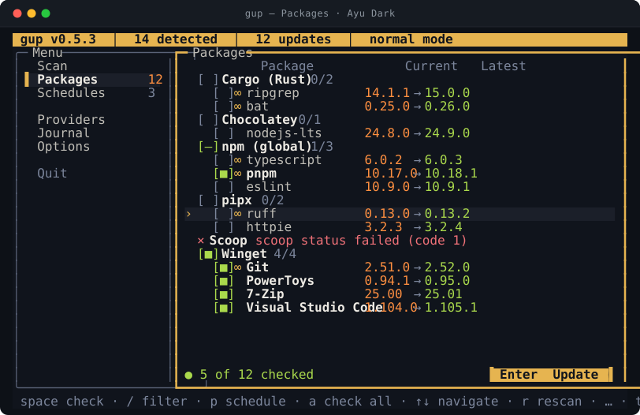 |  |
| `ayu-dark` — **Ayu Dark** | `catppuccin-mocha` — **Catppuccin Mocha** |
| 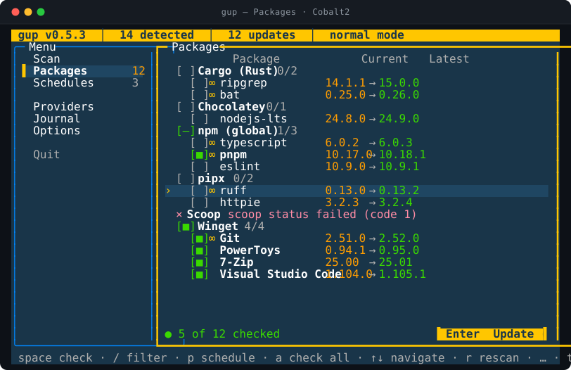 |  |
| `cobalt2` — **Cobalt2** | `dracula` — **Dracula** |
| 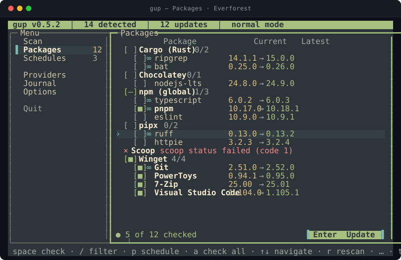 | 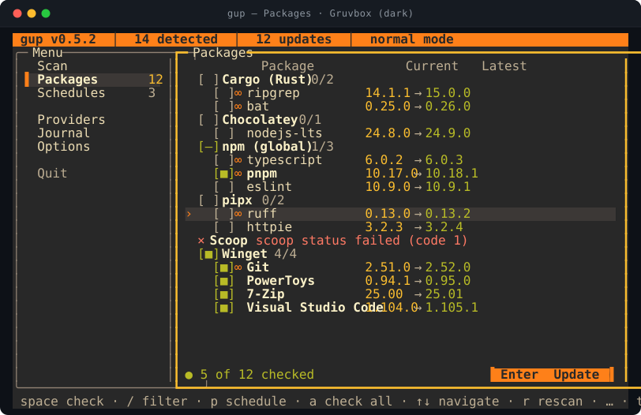 |
| `everforest` — **Everforest** | `gruvbox-dark` — **Gruvbox (dark)** |
| 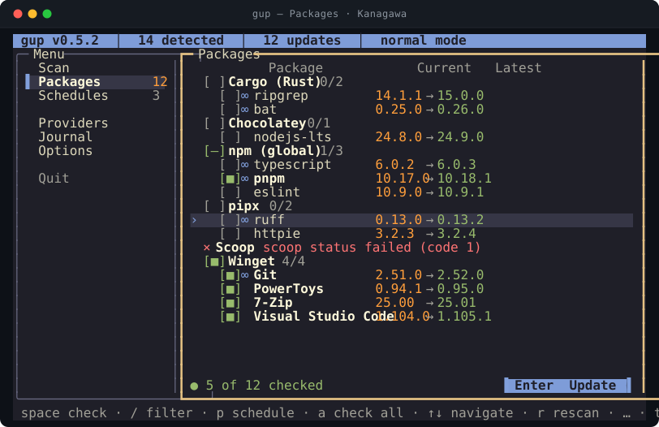 | 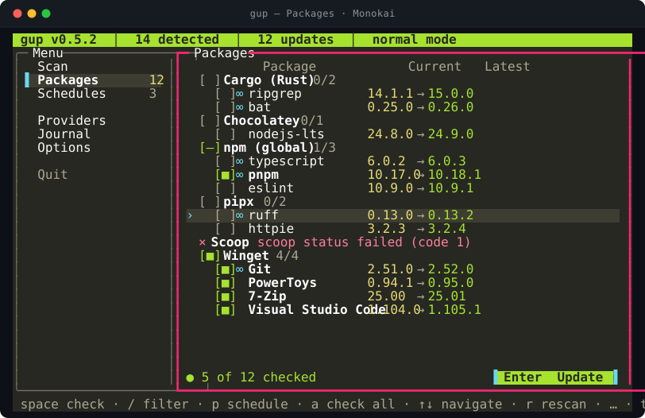 |
| `kanagawa` — **Kanagawa** | `monokai` — **Monokai** |
| 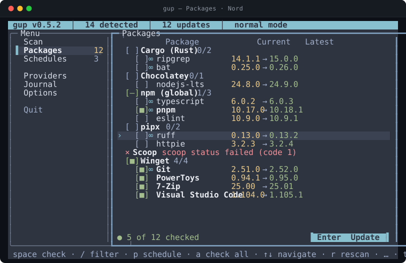 | 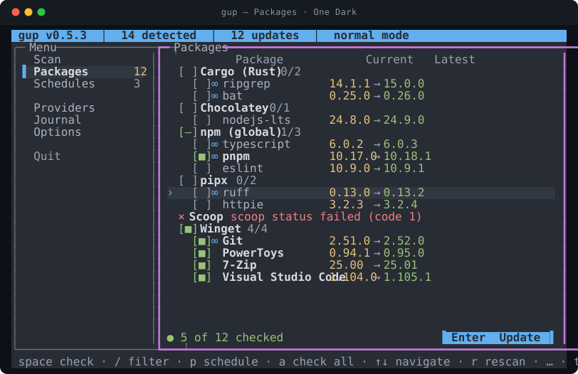 |
| `nord` — **Nord** | `one-dark` — **One Dark** |
| 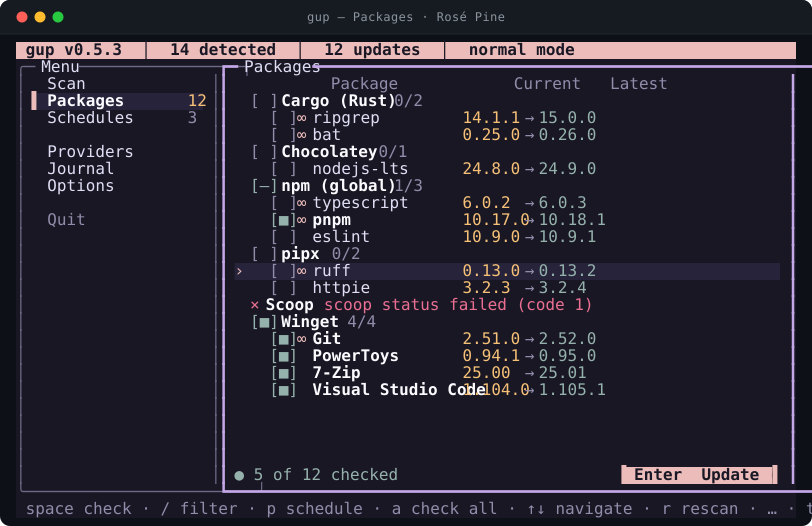 | 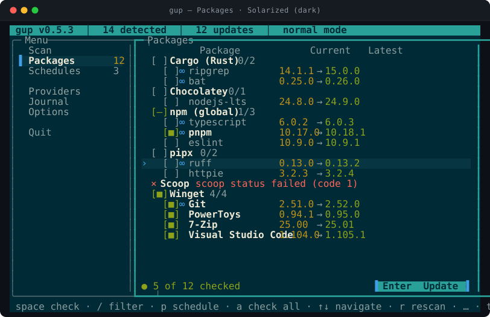 |
| `rose-pine` — **Rosé Pine** | `solarized-dark` — **Solarized (dark)** |
| 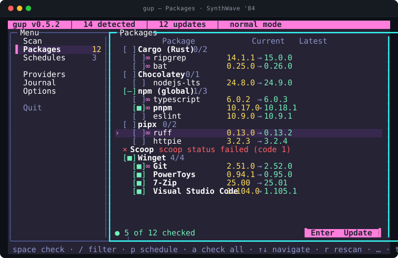 | 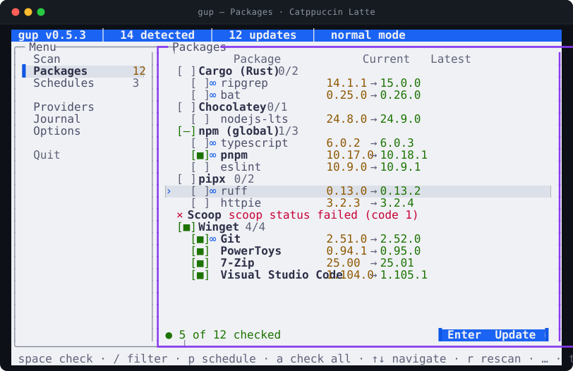 |
| `synthwave-84` — **SynthWave '84** | `catppuccin-latte` — **Catppuccin Latte** |
| 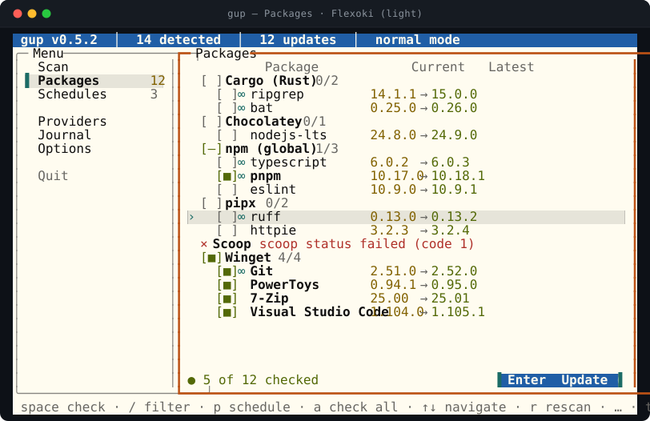 |  |
| `flexoki-light` — **Flexoki (light)** | `github-light` — **GitHub (light)** |
| 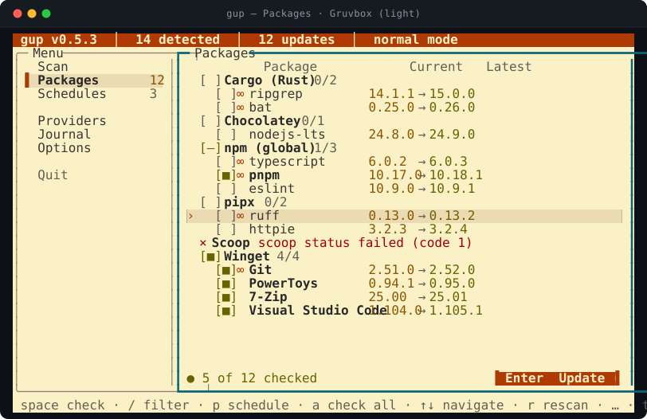 | 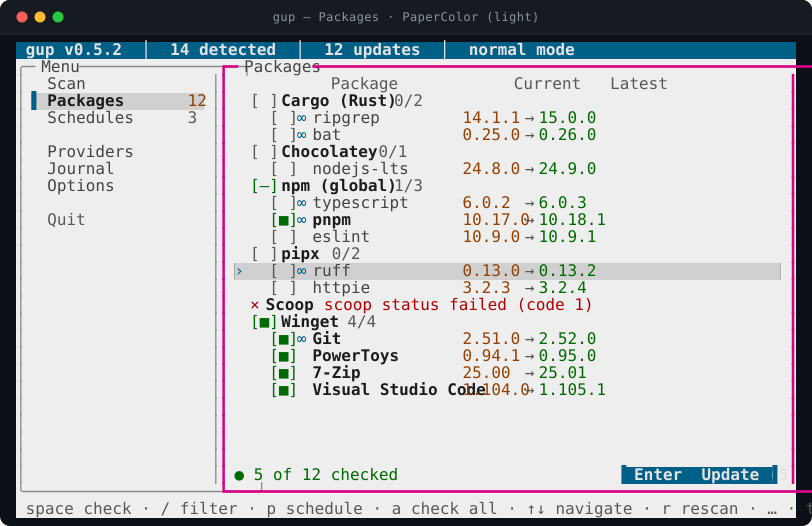 |
| `gruvbox-light` — **Gruvbox (light)** | `papercolor-light` — **PaperColor (light)** |
| 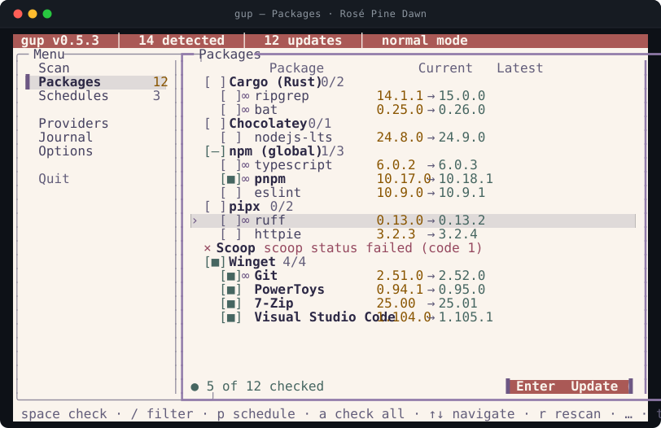 | 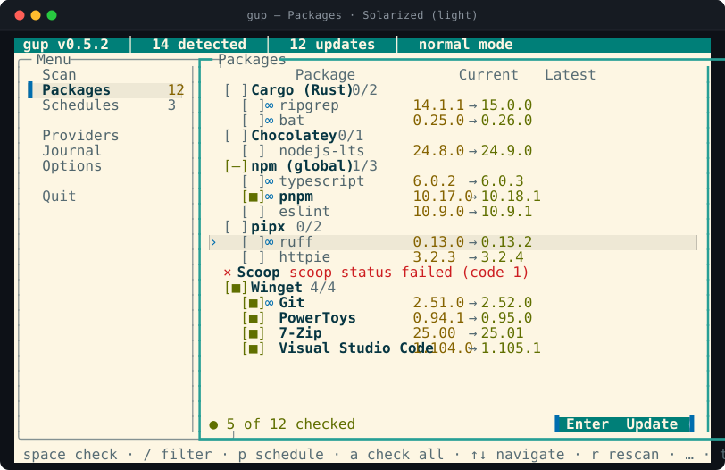 |
| `rose-pine-dawn` — **Rosé Pine Dawn** | `solarized-light` — **Solarized (light)** |
|  | |
| `monochrome` — **Monochrome** | |

## Choosing a theme

In **Options**, the *Theme* row shows the theme in use and, as its hint, how
readable it is on your terminal: `√ AA · min. contrast 6.1:1`, `‼ 2 colors
adjusted · min. 4.6:1`, or `? terminal palette unknown — contrast cannot be
checked`. The count is of the colours you can set in the colour editor —
the same number the picker and the editor give; the colours drawn from them
(the title bar's fill, the text on it, the focus border) follow without being
counted again. `enter` opens the theme picker:

| Mark | Meaning |
|---|---|
| `√ 6.1` | readable as is; its lowest text contrast is 6.1:1 |
| `‼ 4.6` | some colours had to be adjusted to reach the level; lowest contrast after adjustment |
| `? —` | your terminal did not report its palette: contrast cannot be checked |
| `√ —` | monochrome: your terminal's own text and background |
| `–` (greyed) | this terminal cannot paint it (16 colours) — it cannot be applied |

- Moving the cursor **paints the whole app** with the theme under it — the
  menu, the borders, the title bar and a sample of every colour on the right —
  without saving anything. The title bar says `theme preview` while a theme
  is only previewed, even if you go to another view meanwhile.
- `enter` saves the theme under the cursor; `esc` (or `←`) goes back to
  the saved one.
- The *Contrast level* row switches between AA (4.5:1) and AAA (7:1) for
  every theme.

## Your own colours

*Custom colors* opens the colour editor for the theme in use. Your colours
belong to that theme: an accent tuned for `dark` does not change `light`.

| Column | Shows |
|---|---|
| Chosen | your colour, or `(theme)` when the role follows the theme |
| Shown | the colour actually painted |
| Contrast | its lowest ratio on the background and the selected row — or `2.1 → 4.6:1 ‼` when your colour was too pale or too dark to read and was moved to the closest readable one |
| Sample | the role painted as it is |

| Key | Effect |
|---|---|
| `↑` `↓` | another role |
| `enter` | type a colour, `#RRGGBB` or `#RGB` |
| `←` `→` | hue −/+ 10° (previewed on the whole app) |
| `+` `-` | lighter / darker (previewed) |
| `a` | keep the adjusted colours as your own |
| `del` | give the role back to the theme |
| `esc` | back to the list |

A colour you type is saved at once; nudges with the arrows and `+` `-` are
saved when you move to another role or leave the editor. **However you set
them, what is painted stays readable**: the setting keeps your choice, the screen
shows the adjusted colour, and the editor tells you so (`‼ 1 color adjusted
automatically to stay readable (AA)`).

The editor is unavailable — and the row says why — when there is nothing to
tune: `monochrome`, `NO_COLOR`, a 16-colour terminal, or the `terminal` theme
on a terminal that does not report its palette.

## How the `terminal` theme follows your terminal

When a screen opens, `gup` asks the terminal for its colours (the standard OSC
4 / 10 / 11 queries, through OpenTUI, bounded by a one-second timeout and asked
once per run):

- **The terminal answers** — Windows Terminal, iTerm2, most modern terminals.
  `gup` builds its palette from your terminal's text and background colours and
  its ANSI colours (cyan for the accent, green, yellow, red), and checks every
  pair. What already passes is painted as your terminal's own colour; what does
  not is adjusted (lightness only, hue kept) and painted in RGB. For example,
  Windows Terminal's "Campbell" red (below 2.5:1 on its background) is
  lightened, and macOS Terminal.app's light "Basic" profile gets darker cyan,
  green and yellow.
- **The terminal does not answer.** `gup` cannot measure your colours, so it
  paints no RGB of its own: text is your terminal's own text colour, the
  selected row and the title bar are drawn in **inverse video** — their
  contrast is your terminal's own by construction — and each accent is one of
  your ANSI colours, picked to read on the default colours of the terminals
  that stay silent:

  | What `gup` knows | Defaults it relies on | What changes from the usual slots |
  |---|---|---|
  | Windows — its console (conhost) never answers | Campbell (the console's default since Windows 10 1709, and Windows Terminal's), the console colours of before | red, green and cyan take their **bright** slots — Campbell's red is 3.2:1 on its background, its bright red 5.1:1; yellow and the borders keep theirs |
  | the background is **dark**, and nothing more | iTerm2's default profile, GNOME Terminal's Tango dark | green and cyan take their bright slots; red and the borders of the panels without focus, readable in no slot on both, are drawn in your text colour |
  | the background is **light**, and nothing more | Terminal.app's *Basic* profile, xterm's black on white | green, yellow, cyan and the focused border, readable in no slot (about 3:1), are drawn in your text colour; red keeps its slot |
  | nothing at all, outside Windows | — | nothing: the usual slots, unverified |

  That is at AA; at AAA more of them may fall back to your text colour. A
  colour drawn in your text colour keeps its meaning through its symbol (`√`,
  `×`, `‼`). If you changed your console's colours, `gup` paints with yours,
  unverified: pick an RGB theme for ratios guaranteed whatever the terminal.

Which terminals answer is not recorded here yet: the manual verification passes
of 0.5.0 (conhost and Windows Terminal, then macOS) will list them. conhost
never does.

## The contrast guarantee

Checked on every pair `gup` paints:

| What | Against | Minimum |
|---|---|---|
| all text (normal, bold, secondary, disabled, accent, success, warning, danger) | the background and the selected row | 4.5:1 (AA) or 7:1 (AAA) |
| the title bar's and the active button's text | the title bar | same |
| panel and dialog borders, the title bar's edge | the background | 3:1 |

- **Your custom colours are checked too.** A colour that would be unreadable is
  moved along its lightness, keeping its hue, just far enough to reach the
  target; the setting keeps what you chose. Grounds come first: a custom
  background so mid-grey that no text could reach the target is moved away from
  the middle.
- Ratios are computed on the exact 8-bit colours painted, as WCAG defines them
  (relative luminance, `(L1 + 0.05) / (L2 + 0.05)`), and shown truncated: a "4.5"
  is never a rounded-up 4.46 ("4,5" in French).
- "Disabled" text (a provider foreign to your OS) is the dimmest grey that still
  reaches the target: visibly dimmed, never unreadable.
- The tests hold this: every built-in theme passes with no adjustment, a
  thousand random palettes pass after adjustment at both levels, random custom
  colours on every theme and random terminal palettes pass as painted — on
  true-colour and 256-colour terminals, at AA and AAA — and an audit walks the
  whole menu under every theme and measures every cell on screen, including on
  the Windows console and on Terminal.app's *Basic* profile when they keep their
  palette to themselves. The colours picked for a silent terminal are checked
  against the defaults of the table above, at AA and AAA.

## Not by colour alone

- The panel that has the keyboard has a **heavy** border, the others a rounded
  one (in ASCII, `*=|` against `+-|`): focus never depends on colour (WCAG
  1.4.1).
- Statuses carry a symbol as well as a colour: `√` success, `×` failure, `‼`
  warning, `–` not available on this OS.
- Symbols that a font or console cannot draw switch to one-column ASCII
  stand-ins (`interface.glyphs`, automatic on the Linux console, `TERM=dumb`,
  `GUP_ASCII=1`, or without a UTF-8 locale); layouts do not move.

## Terminals with fewer colours, and NO_COLOR

| Terminal | What `gup` does |
|---|---|
| true colour | paints the theme as is |
| 256 colours (older macOS Terminal.app) | moves every colour to the nearest of the 240 standard xterm colours — not your 16 themed ones — and re-checks the contrast on those exact colours; with the `terminal` theme, one of your terminal's own colours that the move leaves short is moved too |
| 16 colours (Linux console) | RGB themes are not available; `gup` uses your terminal's ANSI colours with inverse-video selection |
| `NO_COLOR` set | monochrome, whatever the theme; console output loses its colours too |

conhost (the classic Windows console) does not draw "dim" text: where `gup`
relies on your terminal's colours, secondary text then looks like normal text,
and the symbols and labels carry the difference.

## The embedded terminal

When updates run inside `gup`'s screen, the installers' own output is shown in
an embedded terminal pane drawn on your terminal's own background, never on the
theme's: **subprocess output uses the host palette** — your terminal's own
colours, which `gup` neither changes nor checks. Its readability is your
terminal theme's; the contrast guarantee covers everything `gup` paints around
it.

**Known issue — light terminals.** Text an installer prints in the default
colour, and gup's own notes in the pane (the lines starting with `›`), are
drawn white rather than in your terminal's text colour: the embedded terminal
of OpenTUI 0.5.14 offers no default-foreground option. On a light terminal
(macOS Terminal.app's default *Basic* profile, *One Half Light*…) they are hard
or impossible to read. Coloured output and everything outside the pane are not
affected. Until it is fixed, use a dark terminal profile while updating, or
set `GUP_PTY=off` to run installers in your own terminal instead. The contrast
audit pins this as a known failure, so it turns red the day the pane follows
your terminal's foreground.
